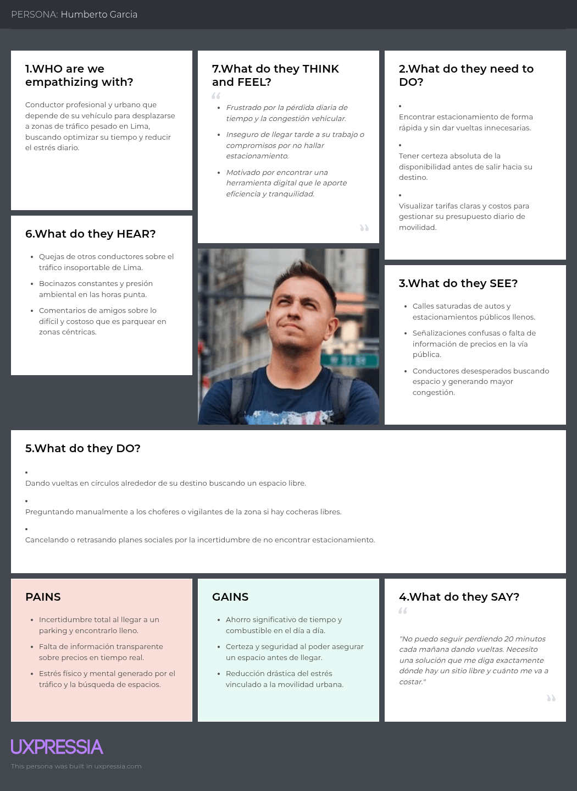
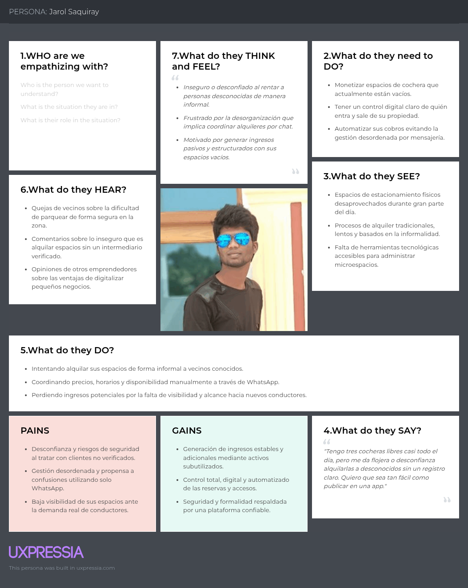

# UNIVERSIDAD PERUANA DE CIENCIAS APLICADAS

**Carrera:** Ingeniería de Software
**Ciclo:** 7

**Curso:** 1ASI0728 - Arquitecturas De Software Emergentes - Presencial

**Sección:** 2620-16363

**Profesor:** Marino Humberto Jara Palacios

## "Informe de Trabajo Final"

**Startup:** ParkTeam
**Producto:** ParkLink

-------------------------------

### Relación de integrantes:

| Nombre                                | Código       |
|---------------------------------------|--------------|
| Fabian Alejandro Oliva Lopez          | U202312013   |
| Pietro Osores Marchese                | U202310971   |
| Amir Gabriel Castro Sanchez           | U202310680   |
| Daniel Elias Ruiz Huisa               | U202210764   |

**Abril 2026**

## Registro de Versiones del Informe

| Version | Fecha      | Autor                                                        | Descripción de modificación |
|---------|------------|--------------------------------------------------------------|-----------------------------|
| 1ra     | 15/04/2026 | Fabian Alejandro Oliva Lopez, Pietro Osores Marchese, Amir Gabriel Castro Sanchez, Daniel Elias Ruiz Huisa   | Avance1: En esta primera entrega se avanzó con los capítulos 1, 2 y 3 de forma organizada para iniciar el proyecto ParkLink, estableciendo la idea, el estudio del contexto y las funcionalidades. |
| 2da     | 16/04/2026 | Fabian Alejandro Oliva Lopez, Pietro Osores Marchese, Amir Gabriel Castro Sanchez, Daniel Elias Ruiz Huisa   | Entrega TB1: Consolidación final de Capítulos I a IV, incorporación de Project Report Collaboration Insights, avance de Conclusiones y recomendaciones, Video About-the-Team, Bibliografía APA y Anexos A-E. |

## Project Report Collaboration Insights

El equipo gestiona el desarrollo y versionado del informe a través de la organización de GitHub del proyecto:
- **Organización / Repositorio oficial:** [1ASI0728-2620-16363-ParkLink/ParkLink-Report](https://github.com/1ASI0728-2620-16363-ParkLink/ParkLink-Report)

Para asegurar la calidad técnica, consistencia y trazabilidad de los artefactos del informe, el equipo adoptó las siguientes prácticas de ingeniería colaborativa:
1. **Flujo de ramificación estructurado (GitFlow adaptado):** La rama `main` almacena las versiones de producción aprobadas para cada hito de entrega. La rama `develop` actúa como integrador continuo. Cada capítulo o grupo de artefactos se trabaja en ramas dedicadas de características (`feature/chapter-1`, `feature/chapter-2`, `feature/chapter-3`, `feature/chapter-4`, `feature/conclusiones-bibliografia-anexos`) antes de someterse a Pull Request con revisión cruzada entre integrantes.
2. **Estándar de confirmaciones atómicas (Conventional Commits v1.0.0):** Se aplican mensajes con tipos y alcances rigurosos (`docs(report):`, `feat(architecture):`, `chore(assets):`) en tiempo presente imperativo, garantizando la trazabilidad histórica de cada aporte individual.
3. **Distribución equitativa y auditoría de aportes:** Todos los integrantes han contribuido activamente en la redacción, modelado y revisión de los artefactos del informe. Las métricas de colaboración y gráficos de red reflejan una participación balanceada y sincronizada a lo largo de las sesiones de trabajo.

## Student Outcome

El curso contribuye al cumplimiento del Student Outcome ABET:

**ABET – EAC - Student Outcome 3**  
**Criterio:** Capacidad de comunicarse efectivamente con un rango de audiencias.

En el siguiente cuadro se describe las acciones realizadas y enunciados de conclusiones por parte del grupo, que permiten sustentar el haber alcanzado el logro del ABET – EAC - Student Outcome 3.

| Criterio específico | Acciones realizadas por entregable e integrante | Conclusiones |
|---|---|---|
| **Comunica oralmente sus ideas y/o resultados con objetividad a público de diferentes especialidades y niveles jerárquicos, en el marco del desarrollo de un proyecto en ingeniería.** | - **TB1 – Fabian Alejandro Oliva López:** Lideró y expuso la fundamentación del ADN de la startup, la problemática urbana de parqueo y la propuesta de valor de ParkLink durante la grabación de la sustentación oral y sesiones de alineamiento del equipo.  - **TB1 – Pietro Osores Marchese:** Comunicó de forma clara la estructura del Lean UX Canvas, la priorización ágil del Product Backlog y los criterios de estimación en Fibonacci ante los miembros del equipo y stakeholders durante las reuniones de refinamiento.  - **TB1 – Amir Gabriel Castro Sanchez:** Condujo técnicamente las entrevistas semiestructuradas a conductores urbanos y propietarios de espacios de estacionamiento, adaptando el registro y lenguaje según el perfil del entrevistado y exponiendo los hallazgos en la sustentación del TB1.  - **TB1 – Daniel Elias Ruiz Huisa:** Presentó los resultados de la matriz comparativa de competidores, arquetipos User Persona y la arquitectura estratégica (ADD y C4) en la exposición grabada del equipo, argumentando con rigor las decisiones de diseño. | El equipo demostró la capacidad de comunicar oralmente conceptos complejos de arquitectura de software, investigación de campo y gestión ágil con objetividad, claridad y lenguaje profesional adaptado a audiencias académicas, técnicas y de negocio en el hito TB1. |
| **Comunica en forma escrita ideas y/o resultados con objetividad a público de diferentes especialidades y niveles jerárquicos, en el marco del desarrollo de un proyecto en ingeniería.** | - **TB1 – Fabian Alejandro Oliva López:** Redactó formalmente el perfil de la organización, antecedentes, técnica 5W2H, objetivos SMART y restricciones del proyecto en el Capítulo I, asegurando coherencia conceptual y ortotipográfica.  - **TB1 – Pietro Osores Marchese:** Documentó con precisión técnica las hipótesis Lean UX, el Impact Mapping, la totalidad de Épicas, User Stories y Technical Stories con criterios de aceptación Gherkin en los Capítulos I y III.  - **TB1 – Amir Gabriel Castro Sanchez:** Elaboró los resúmenes y análisis estadísticos porcentuales de las entrevistas de Needfinding en el Capítulo II, así como la definición formal de los Architectural Drivers y Bounded Contexts en el Capítulo IV.  - **TB1 – Daniel Elias Ruiz Huisa:** Redactó el Competitive Analysis Landscape, el Lenguaje Ubicuo en inglés/español, los Quality Attribute Scenarios (QAS) refinados y la especificación de diagramas C4 en el Capítulo IV bajo estándares internacionales. | El equipo sustentó por escrito con rigor metodológico los artefactos de análisis de requerimientos, diseño estratégico ADD y DDD en formato Markdown profesional, facilitando la comprensión y reproducibilidad por parte de evaluadores y desarrolladores. |

Adicionalmente, el equipo mantiene el seguimiento de competencias complementarias de formación profesional:

| Criterio específico complementario | Acciones realizadas por entregable e integrante | Conclusión general |
|---|---|---|
| **CO1:** Actualiza conceptos y conocimientos necesarios para su desarrollo profesional y, en especial, para su proyecto en soluciones de software. | - **TB1 – Fabian Alejandro Oliva López:** Definió el ADN de la startup, estableciendo visión, misión, valores y segmentos objetivo.  - **TB1 – Pietro Osores Marchese:** Elaboró el Lean UX Canvas, User Stories, Impact Map y Product Backlog.  - **TB1 – Amir Gabriel Castro Sanchez:** Participó en el diseño, registro y análisis de entrevistas a usuarios y colaboró en el diseño estratégico del software.  - **TB1 – Daniel Elias Ruiz Huisa:** Desarrolló el análisis de competidores, Needfinding y escenarios de atributos de calidad para el diseño de la solución. | Los integrantes aplicaron conocimientos de estrategia de producto, investigación de usuarios, Lean UX, gestión de requerimientos y diseño estratégico de software para definir ParkLink y orientar el desarrollo de la solución. |
| **CO2:** Reconoce la necesidad del aprendizaje permanente para el desempeño profesional y el desarrollo de proyectos en soluciones de software. | - **TB1 – Fabian Alejandro Oliva López:** Reconoció la importancia de actualizar conocimientos en estrategia de producto y liderazgo de proyectos.  - **TB1 – Pietro Osores Marchese:** Entendió la importancia del aprendizaje continuo en gestión de requerimientos y priorización ágil.  - **TB1 – Amir Gabriel Castro Sanchez:** Reconoció la necesidad de fortalecer continuamente sus conocimientos en técnicas de entrevistas y diseño estratégico.  - **TB1 – Daniel Elias Ruiz Huisa:** Comprendió la importancia de actualizar sus conocimientos en análisis competitivo, Needfinding y atributos de calidad. | El equipo reconoció que el aprendizaje permanente es necesario para mejorar la investigación de usuarios, la definición de requisitos, la estrategia del producto y las decisiones de diseño durante el desarrollo de software. |

## Contenido

- [Capítulo I: Introducción](#capítulo-i-introducción)
    - [1.1. Startup Profile](#11-startup-profile)
    - [1.1.1. Descripción de la Startup](#111-descripción-de-la-startup)
    - [1.1.2. Perfiles de integrantes del equipo](#112-perfiles-de-integrantes-del-equipo)
    - [1.2. Solution Profile](#12-solution-profile)
    - [1.2.1. Nombre del Producto](#121-nombre-del-producto)
    - [1.2.2. Antecedentes y problemática](#122-antecedentes-y-problemática)
    - [1.2.3. Lean UX Process](#123-lean-ux-process)
    - [1.2.3.1. Lean UX Problem Statements](#1221-lean-ux-problem-statements)
    - [1.2.3.2. Lean UX Assumptions](#1222-lean-ux-assumptions)
    - [1.2.3.3. Lean UX Hypothesis Statements](#1223-lean-ux-hypothesis-statements)
    - [1.2.3.4. Lean UX Canvas](#1224-lean-ux-canvas)
    - [1.3. Segmentos objetivo](#13-segmentos-objetivo)
- [Capítulo II: Requirements Elicitation & Analysis](#capítulo-ii-requirements-elicitation--analysis)
    - [2.1. Competidores](#21-competidores)
    - [2.2. Entrevistas](#22-entrevistas)
    - [2.3. Needfinding](#23-needfinding)
    - [2.3.1. User Personas](#231-user-personas)
    - [2.3.2. User Task Matrix](#232-user-task-matrix)
    - [2.3.3. Empathy Mapping](#233-empathy-mapping)
    - [2.3.4. As-is Scenario Mapping](#234-as-is-scenario-mapping)
 - [Capítulo III: Requirements Specification](#capítulo-iii-requirements-specification)
   - [3.1. To-Be Scenario Mapping](#31-to-be-scenario-mapping)
   - [3.2. User Stories](#32-user-stories)
   - [3.2.1. Technical Stories](#321-technical-stories)
   - [3.3. Impact Mapping](#33-impact-mapping)
   - [3.4. Product Backlog](#34-product-backlog)
- [Capítulo IV: Strategic-Level Software Design](#capítulo-iv-strategic-level-software-design)
    - [4.1. Strategic-Level Attribute-Driven Design](#41-strategic-level-attribute-driven-design)
        - [4.1.1. Design Purpose](#411-design-purpose)
        - [4.1.2. Attribute-Driven Design Inputs](#412-attribute-driven-design-inputs)
            - [4.1.2.1. Primary Functionality](#4121-primary-functionality)
            - [4.1.2.2. Quality Attribute Scenarios](#4122-quality-attribute-scenarios)
            - [4.1.2.3. Constraints](#4123-constraints)
        - [4.1.3. Architectural Drivers Backlog](#413-architectural-drivers-backlog)
        - [4.1.4. Architectural Design Decisions](#414-architectural-design-decisions)
        - [4.1.5. Quality Attribute Scenario Refinements](#415-quality-attribute-scenario-refinements)
    - [4.2. Strategic-Level Domain-Driven Design](#42-strategic-level-domain-driven-design)
        - [4.2.1. EventStorming](#421-eventstorming)
        - [4.2.2. Candidate Context Discovery](#422-candidate-context-discovery)
        - [4.2.3. Domain Message Flows Modeling](#423-domain-message-flows-modeling)
        - [4.2.4. Bounded Context Canvases](#424-bounded-context-canvases)
        - [4.2.5. Context Mapping](#425-context-mapping)
    - [4.3. Software Architecture](#43-software-architecture)
        - [4.3.1. Software Architecture System Landscape Diagram](#431-software-architecture-system-landscape-diagram)
        - [4.3.2. Software Architecture Context Level Diagram](#432-software-architecture-context-level-diagram)
        - [4.3.3. Software Architecture Container Level Diagram](#433-software-architecture-container-level-diagram)
        - [4.3.4. Software Architecture Deployment Diagram](#434-software-architecture-deployment-diagram)
    - [4.4. Architecture-as-Code and Evidence Traceability](#44-architecture-as-code-and-evidence-traceability)
- [Capítulo V: Product Implementation, Validation & Deployment](#capítulo-v-product-implementation-validation--deployment)
    - [5.1. Testing Suites & General Patterns](#51-testing-suites--general-patterns)
    - [5.1.1 Backend Application Core Testing Suite](#511-backend-application-core-testing-suite)
    - [5.1.2 Pattern Based Backend Aplication(s)](#512-pattern-based-backend-aplications)
    - [5.1.3 Pattern Based Custom Software Library](#513-pattern-based-custom-software-library)
    - [5.1.4 Framework Pattern Driven Refactoring Report](#514-framework-pattern-driven-refactoring-report)
    - [5.2 Software Configuration Management](#52-software-configuration-management)
    - [5.2.1 Software Development Environment Configuration](#521-software-development-environment-configuration)
    - [5.2.2 Source Code Management](#522-source-code-management)
    - [5.2.3 Source Code Style Guide & Conventions](#523-source-code-style-guide--conventions)
    - [5.2.4 Software Deployment Configuration](#524-software-deployment-configuration)
    - [5.3 Microservices Deployment](#53-microservices-deployment)
    - [5.3.1 Cloud Architecture Diagram](#531-cloud-architecture-diagram)
    - [5.3.2 Cloud Architecture Deployment](#532-cloud-architecture-deployment)
    - [5.4 Sprint Reviews](#54-sprint-reviews)
    - [5.4.1 Sprint 1](#541-sprint-1)
    - [5.4.1.1 Sprint Backlog 1](#5411-sprint-backlog-1)
    - [5.4.1.2 Development Evidence for Sprint Review](#5412-development-evidence-for-sprint-review)
    - [5.4.1.3 Testing Suite Evidence for Sprint Review](#5413-testing-suite-evidence-for-sprint-review)
    - [5.4.1.4 Execution Evidence for Sprint Review](#5414-execution-evidence-for-sprint-review)
    - [5.4.1.5 Microservices Documentation Evidence for Sprint Review](#5415-microservices-documentation-evidence-for-sprint-review)
    - [5.4.1.6 Software Deployment Evidence for Sprint Review](#5416-software-deployment-evidence-for-sprint-review)
    - [5.4.1.7 Team Collaboration Insights during Sprint](#5417-team-collaboration-insights-during-sprint)
    - [5.4.1.8 Kanban Board](#5418-kanban-board)
    - [5.4.2 Sprint 2](#542-sprint-2)
    - [5.4.2.1 Sprint Backlog 2](#5421-sprint-backlog-2)
    - [5.4.2.2 Development Evidence for Sprint Review](#5422-development-evidence-for-sprint-review)
    - [5.4.2.3 Testing Suite Evidence for Sprint Review](#5423-testing-suite-evidence-for-sprint-review)
    - [5.4.2.4 Execution Evidence for Sprint Review](#5424-execution-evidence-for-sprint-review)
    - [5.4.2.5 Microservices Documentation Evidence for Sprint Review](#5425-microservices-documentation-evidence-for-sprint-review)
    - [5.4.2.6 Software Deployment Evidence for Sprint Review](#5426-software-deployment-evidence-for-sprint-review)
    - [5.4.2.7 Team Collaboration Insights during Sprint](#5427-team-collaboration-insights-during-sprint)
    - [5.4.2.8 Kanban Board](#5428-kanban-board)
    - [5.4.3 Sprint 3](#543-sprint-3)
    - [5.4.3.1 Sprint Backlog 3](#5431-sprint-backlog-3)
    - [5.4.3.2 Development Evidence for Sprint Review](#5432-development-evidence-for-sprint-review)
    - [5.4.3.3 Testing Suite Evidence for Sprint Review](#5433-testing-suite-evidence-for-sprint-review)
    - [5.4.3.4 Execution Evidence for Sprint Review](#5434-execution-evidence-for-sprint-review)
    - [5.4.3.5 Microservices Documentation Evidence for Sprint Review](#5435-microservices-documentation-evidence-for-sprint-review)
    - [5.4.3.6 Software Deployment Evidence for Sprint Review](#5436-software-deployment-evidence-for-sprint-review)
    - [5.4.3.7 Team Collaboration Insights during Sprint](#5437-team-collaboration-insights-during-sprint)
    - [5.4.3.8 Kanban Board](#5438-kanban-board)
- [Conclusiones y recomendaciones](#conclusiones-y-recomendaciones)
- [Bibliografía](#bibliografía)

# Capítulo I: Introducción

## 1.1. Startup Profile

### 1.1.1. Descripción del Startup

En las ciudades modernas, uno de los principales problemas que enfrentan los conductores es la dificultad para encontrar estacionamiento disponible. Esta situación genera congestión vehicular, pérdida de tiempo, estrés y un impacto ambiental negativo debido al aumento de emisiones contaminantes producto de la circulación innecesaria de vehículos.

**Misión:**
Brindar una plataforma eficiente y confiable que permita a los conductores encontrar y reservar estacionamientos fácilmente, mientras se genera valor para los propietarios mediante la monetización de sus espacios.

**Visión:**
Ser la plataforma líder en reserva de estacionamientos en Latinoamérica, contribuyendo al desarrollo de ciudades más organizadas, sostenibles y tecnológicamente conectadas.

**Valores:**

- Innovación tecnológica
- Eficiencia operativa
- Confianza y seguridad
- Sostenibilidad urbana

#### 1.1.2. Perfiles de integrantes del equipo
| Nombre                          | Descripción                                                                                                                                                                                                                                                                                                                                 | Foto |
|---------------------------------|---------------------------------------------------------------------------------------------------------------------------------------------------------------------------------------------------------------------------------------------------------------------------------------------------------------------------------------------|------|
| Fabian Alejandro Oliva Lopez     | Soy estudiante de Ingeniería de Software con un gran interés de desarrollo backend y frontend. Me considero una persona activa en los proyectos, impulsando al equipo a realizar buenos trabajos. Mi objetivo es brindar apoyo y dar lo mejor de mí para fomentar un ambiente colaborativo y de respeto.                                                                                                                                 |  |
|  Amir Gabriel Castro Sanchez   | Soy estudiante de Ingeniería de Software con interés en el desarrollo backend y la creación de aplicaciones móviles. Tengo conocimientos en el diseño e implementación de servicios y APIs, integración con bases de datos y desarrollo de funcionalidades para aplicaciones móviles. Me caracterizo por ser una persona responsable, colaborativa y con disposición para aprender nuevas tecnologías que permitan desarrollar soluciones eficientes y escalables.      |  |
| Pietro Osores Marchese           | Soy Pietro Osores Marchese, estudiante de Ingeniería de Sistemas con interés en el desarrollo de software y la innovación tecnológica. Mi perfil combina habilidades en programación frontend, diseño de interfaces y gestión de proyectos ágiles, con un enfoque en la creación de soluciones digitales funcionales y escalables. Me caracterizo por el trabajo en equipo, la adaptabilidad y la búsqueda constante de nuevas herramientas para optimizar procesos y experiencias de usuario. |  |
| Daniel Elias Ruiz Huisa    | Soy un estudiante de Ingeniería de Software. Me intereso por el desarrollo web y la evolucion de tecnologias como los nuevos agentes AI. Tengo conocimientos en Frameworks orientados a node.js como Astro, Vue y Angular. Domino lenguajes como python, C++ y typescript. Soy una persona responsable que busca siempre generar un ambiente sano y agradable para todos.     |  |

## 1.2. Solution Profile

ParkLink es una plataforma digital orientada a la búsqueda, reserva y gestión de espacios de estacionamiento. La solución busca conectar a conductores que necesitan encontrar un lugar donde estacionar con propietarios que disponen de espacios libres que pueden ser publicados y gestionados mediante la plataforma.

El producto busca mejorar la experiencia de estacionamiento en zonas urbanas mediante herramientas como geolocalización, visualización de disponibilidad, consulta de precios y horarios, reservas anticipadas y gestión de espacios para propietarios.

### 1.2.1. Antecedentes y problemática

El crecimiento del parque automotor y la alta concentración de vehículos en las principales ciudades generan nuevos desafíos relacionados con la movilidad urbana y la disponibilidad de estacionamientos. En zonas comerciales, empresariales, educativas y residenciales con alta demanda, los conductores pueden invertir una cantidad considerable de tiempo buscando un espacio disponible.

Esta problemática adquiere especial relevancia en Lima Metropolitana. De acuerdo con la Superintendencia Nacional de los Registros Públicos (SUNARP), durante el año 2025 se realizaron 648 497 nuevas inmatriculaciones vehiculares a nivel nacional, cifra que representó un incremento de 25,26 % respecto al año 2024. Asimismo, en Lima el incremento registrado fue de 14,25 % durante el mismo periodo (SUNARP, 2026).

A esto se suma el problema de la congestión vehicular. Según el TomTom Traffic Index, durante 2025 Lima registró un nivel promedio de congestión de 69,3 %. Además, un conductor que se moviliza regularmente durante las horas punta puede acumular aproximadamente 195 horas perdidas al año debido a la congestión vehicular (TomTom, 2026).

Dentro de este contexto, la búsqueda manual de estacionamientos puede generar desplazamientos adicionales y aumentar la incertidumbre de los conductores respecto a dónde encontrar un espacio disponible. Paralelamente, existen propietarios que cuentan con cocheras o espacios que permanecen disponibles durante determinadas horas del día y que podrían ser aprovechados mediante una plataforma que conecte la oferta y la demanda.

Por ello, ParkLink plantea una alternativa digital que permita centralizar información sobre espacios disponibles y facilite tanto la búsqueda y reserva por parte de los conductores como la publicación y administración por parte de los propietarios.

Para analizar la problemática de manera integral se emplea la técnica de las **5W's + 2H's**.

#### What (¿Qué sucede?)

Los conductores que se movilizan en zonas urbanas de alta demanda no siempre cuentan con información centralizada y actualizada sobre estacionamientos disponibles cerca de su destino.

Esto puede ocasionar que recorran diferentes calles o establecimientos buscando manualmente un espacio, incrementando el tiempo requerido para completar su desplazamiento.

Al mismo tiempo, algunos propietarios poseen espacios de estacionamiento disponibles durante determinados periodos, pero no cuentan con una herramienta especializada que les permita publicarlos y conectarse fácilmente con personas interesadas en utilizarlos.

#### Why (¿Por qué es un problema?)

La ausencia de información accesible sobre estacionamientos disponibles puede producir diferentes consecuencias:

- **Mayor tiempo de búsqueda:** los conductores deben recorrer diferentes calles o establecimientos antes de encontrar un espacio.
- **Desplazamientos innecesarios:** la búsqueda de estacionamiento puede generar recorridos adicionales.
- **Mayor consumo de combustible:** circular durante más tiempo incrementa el consumo asociado al desplazamiento.
- **Estrés e incertidumbre:** desconocer si existirá un espacio disponible cerca del destino puede generar frustración en los conductores.
- **Impacto en la movilidad urbana:** los desplazamientos adicionales se producen dentro de ciudades que ya presentan altos niveles de congestión.
- **Espacios desaprovechados:** propietarios con cocheras disponibles pueden perder oportunidades de generar ingresos debido a la ausencia de mecanismos para ofrecerlas.
- **Impacto ambiental:** una mayor circulación vehicular implica también un incremento potencial de emisiones generadas durante los desplazamientos.

#### Who (¿A quiénes afecta?)

La problemática involucra principalmente a los siguientes grupos:

- **Conductores urbanos:** personas que utilizan vehículos particulares para desplazarse hacia zonas con alta demanda de estacionamiento.
- **Propietarios de estacionamientos:** personas o empresas que cuentan con espacios que pueden encontrarse disponibles durante determinadas horas.
- **Comercios y establecimientos:** negocios cuyos clientes requieren estacionamientos cercanos para acceder con mayor facilidad.
- **Usuarios de las vías urbanas:** debido a que la circulación adicional de vehículos ocurre dentro de un entorno que ya presenta congestión.
- **La ciudad y el medio ambiente:** debido al consumo de combustible y las emisiones asociadas a los desplazamientos vehiculares.

#### When (¿Cuándo ocurre?)

La dificultad para encontrar estacionamientos puede presentarse especialmente:

- Durante las horas punta de la mañana y de la tarde.
- En horarios de ingreso y salida de centros laborales y educativos.
- Durante horarios comerciales.
- En eventos que incrementan temporalmente la concentración vehicular.
- Durante fines de semana en zonas comerciales, recreativas o de entretenimiento.
- En periodos donde aumenta la cantidad de personas que se desplazan hacia una misma zona.

#### Where (¿Dónde ocurre?)

La problemática puede presentarse principalmente en:

- Zonas comerciales con alta afluencia de personas.
- Centros empresariales y financieros.
- Alrededores de universidades e instituciones educativas.
- Hospitales y centros médicos.
- Centros comerciales.
- Zonas residenciales con alta densidad vehicular.
- Calles y avenidas cercanas a establecimientos con alta concurrencia.

Para la primera etapa de validación de ParkLink se priorizarán zonas urbanas de Lima Metropolitana donde exista una alta demanda de estacionamientos.

#### How (¿Cómo sucede?)

La problemática se produce debido a diferentes factores:

- **Información dispersa:** los conductores deben consultar diferentes alternativas para identificar dónde estacionar.
- **Información limitada sobre disponibilidad:** no siempre es posible conocer previamente si un establecimiento cuenta con espacios.
- **Ausencia de un sistema centralizado:** la oferta de estacionamientos públicos, privados o particulares se encuentra fragmentada.
- **Procesos tradicionales:** algunos estacionamientos todavía dependen de consultas presenciales para conocer disponibilidad.
- **Desconexión entre conductores y propietarios:** una persona puede tener una cochera disponible mientras otra busca estacionamiento en la misma zona sin que exista un mecanismo que permita conectarlos.
- **Limitadas posibilidades de reserva anticipada:** en determinadas alternativas el conductor solo puede comprobar si existe disponibilidad cuando llega al lugar.

#### How Much (¿Cuánto cuesta o impacta?)

El impacto puede analizarse desde diferentes dimensiones.

- **Tiempo:** TomTom reportó que durante 2025 los conductores de Lima podían acumular aproximadamente 195 horas perdidas al año debido al tráfico durante horas punta.
- **Congestión:** Lima alcanzó un nivel promedio de congestión vehicular de 69,3 % durante 2025.
- **Crecimiento vehicular:** SUNARP registró 648 497 nuevas inmatriculaciones vehiculares durante 2025 en Perú, 25,26 % más que durante 2024.
- **Crecimiento en Lima:** durante el mismo periodo, las nuevas inmatriculaciones en Lima aumentaron 14,25 %.
- **Económico:** los desplazamientos adicionales generan consumo adicional de combustible para los conductores.
- **Productividad:** el tiempo empleado buscando estacionamiento reduce el tiempo disponible para actividades laborales, académicas o personales.
- **Propietarios:** los espacios disponibles que permanecen sin utilizar representan oportunidades potenciales de ingreso que no están siendo aprovechadas.
- **Ambiental:** una mayor circulación vehicular implica mayor consumo energético y generación de emisiones.

Estas cifras no significan que toda la congestión de Lima sea causada por la búsqueda de estacionamiento; sin embargo, muestran que ParkLink se plantea dentro de un contexto urbano caracterizado por un parque vehicular creciente y elevados niveles de congestión.

#### Objetivos del proyecto

##### Objetivo general

Diseñar y validar ParkLink como una plataforma digital que conecte a conductores que buscan estacionamiento con propietarios que poseen espacios disponibles, facilitando la búsqueda, reserva y gestión de estacionamientos en zonas urbanas.

##### Objetivos específicos

- Permitir que los conductores identifiquen estacionamientos disponibles cercanos a su ubicación o destino.
- Facilitar la consulta de información relevante como ubicación, disponibilidad, precio y horario.
- Permitir que los usuarios realicen reservas anticipadas de espacios de estacionamiento.
- Proporcionar a los propietarios herramientas para registrar, publicar y administrar sus espacios disponibles.
- Reducir la incertidumbre de los conductores durante el proceso de búsqueda de estacionamiento.
- Validar mediante usuarios potenciales la facilidad de uso y utilidad de las principales funcionalidades de ParkLink.
- Medir indicadores como el tiempo necesario para encontrar un estacionamiento, número de reservas y frecuencia de utilización de la plataforma.

#### Restricciones y límites del alcance

Durante la primera versión del producto, ParkLink tendrá las siguientes restricciones:

- La solución se centrará inicialmente en zonas urbanas de Lima Metropolitana.
- La disponibilidad mostrada dependerá de la información registrada o actualizada por los propietarios y administradores de los estacionamientos.
- La plataforma no pretende gestionar ni solucionar directamente el tráfico vehicular de la ciudad.
- ParkLink no administra estacionamientos municipales ni modifica la regulación existente sobre estacionamiento en espacios públicos.
- La primera versión estará enfocada principalmente en las funcionalidades de búsqueda, visualización, publicación, reserva y gestión de espacios.
- La solución no contempla inicialmente la instalación de sensores IoT para detectar automáticamente la ocupación de cada espacio.
- Los resultados relacionados con reducción del tiempo de búsqueda deberán validarse mediante pruebas con usuarios y métricas obtenidas durante la utilización de la solución.

### 1.2.2. Lean UX Process

Lean UX es un enfoque de diseño centrado en la experimentación, validación de hipótesis y aprendizaje continuo. Su objetivo es reducir la incertidumbre durante el desarrollo de un producto mediante ciclos rápidos de creación, evaluación y mejora.

En ParkLink, este enfoque permite evaluar si las funcionalidades propuestas realmente responden a las necesidades de conductores y propietarios antes de realizar implementaciones de mayor complejidad.

El proceso se desarrolla mediante las siguientes etapas:

#### Comprender

Durante esta etapa se analiza la problemática relacionada con la búsqueda de estacionamientos y el aprovechamiento de espacios disponibles.

Se consideran dos grupos principales: conductores que necesitan estacionarse en zonas de alta demanda y propietarios que cuentan con espacios que pueden ser ofrecidos temporalmente.

A partir del análisis inicial se identifican problemas como la falta de información sobre disponibilidad, el tiempo destinado a la búsqueda de estacionamiento, la dificultad para planificar previamente dónde estacionarse y la falta de mecanismos mediante los cuales los propietarios puedan ofrecer sus espacios.

#### Esbozar

A partir de las necesidades identificadas se plantean posibles funcionalidades para ParkLink, entre ellas:

- **Mapa interactivo:** permite visualizar estacionamientos cercanos según la ubicación o destino del conductor.
- **Sistema de reservas:** permite asegurar un espacio antes de llegar al destino.
- **Visualización de precios:** permite comparar alternativas antes de realizar una reserva.
- **Visualización de horarios:** informa en qué periodos se encuentra disponible cada espacio.
- **Registro de estacionamientos:** permite que los propietarios publiquen sus espacios.
- **Gestión de espacios:** permite modificar información, disponibilidad y características de las cocheras registradas.

Estas funcionalidades pueden representarse inicialmente mediante prototipos de baja fidelidad para evaluar su funcionamiento antes de desarrollar completamente el producto.

#### Probar

Durante esta etapa los prototipos son presentados a usuarios potenciales para evaluar la comprensión y facilidad de uso de la plataforma.

Las pruebas pueden considerar tareas representativas como:

- Buscar estacionamientos cercanos.
- Consultar información de un estacionamiento.
- Seleccionar un horario.
- Realizar una reserva.
- Registrar una cochera.
- Modificar la disponibilidad de un espacio.

Las observaciones obtenidas permiten identificar dificultades, funcionalidades poco claras y oportunidades de mejora.

#### Medir

Para determinar si ParkLink genera valor para los usuarios se establecen indicadores que permitan comparar los resultados obtenidos durante las pruebas y posteriores versiones del producto.

Entre las principales métricas se consideran:

- Tiempo promedio necesario para encontrar una alternativa de estacionamiento.
- Tiempo requerido para completar una reserva.
- Número de estacionamientos publicados.
- Número de reservas realizadas.
- Porcentaje de usuarios que completan correctamente el proceso de reserva.
- Frecuencia de utilización de la plataforma.
- Nivel de satisfacción de conductores y propietarios.

Los resultados obtenidos permiten generar nuevos aprendizajes y realizar ajustes antes de continuar con nuevas iteraciones del producto.

#### 1.2.2.1. Lean UX Problem Statements

Para formular los Problem Statements de ParkLink se consideran los siguientes elementos:

**Domain:**
ParkLink pertenece al dominio de movilidad urbana y gestión digital de estacionamientos, específicamente a soluciones tecnológicas que conectan la oferta y demanda de espacios disponibles.

**Customer Segments:**

Los principales segmentos identificados son:

1. Conductores urbanos que necesitan encontrar estacionamiento en zonas de alta demanda.
2. Propietarios de cocheras o espacios de estacionamiento que desean aprovechar espacios temporalmente disponibles.

**Segmento inicial prioritario:**

Para la primera etapa de validación, ParkLink priorizará a conductores urbanos de Lima Metropolitana que se desplazan frecuentemente hacia zonas comerciales, empresariales o educativas y experimentan dificultades para encontrar estacionamiento.

Este segmento será priorizado porque constituye el usuario que inicia la demanda dentro de la plataforma. Posteriormente, el crecimiento de la oferta de propietarios permitirá ampliar progresivamente la cobertura de ParkLink.

**Pain Points:**

Los principales problemas identificados son:

- Tiempo empleado buscando estacionamiento.
- Falta de información sobre disponibilidad.
- Incertidumbre antes de llegar al destino.
- Dificultad para comparar precios y ubicaciones.
- Falta de herramientas para realizar reservas anticipadas.
- Espacios particulares que permanecen disponibles sin generar ingresos.
- Falta de canales especializados para conectar conductores y propietarios.

**Gap:**

Actualmente existe una brecha entre los conductores que necesitan estacionamientos y propietarios que poseen espacios disponibles.

La información se encuentra fragmentada y los usuarios no cuentan con una plataforma centralizada que integre ubicación, disponibilidad, horarios, precios, reservas y administración de espacios.

ParkLink busca reducir esta brecha mediante una plataforma que concentre estos procesos dentro de una misma experiencia digital.

**Vision / Strategy:**

La visión de ParkLink es facilitar el acceso a espacios de estacionamiento mediante una experiencia digital sencilla, permitiendo que los conductores puedan planificar dónde estacionarse antes de llegar a su destino.

La estrategia consiste en crear una plataforma que conecte progresivamente la demanda de los conductores con la oferta de estacionamientos y espacios particulares disponibles. En una primera etapa se priorizará la validación de las funciones de búsqueda, visualización y reserva; posteriormente se buscará ampliar la cantidad de propietarios y espacios disponibles.

##### Problem Statement 1 – Conductores

Los conductores que se desplazan hacia zonas urbanas de alta demanda necesitan una forma sencilla de identificar y reservar estacionamientos cercanos porque actualmente pueden invertir tiempo recorriendo diferentes lugares sin conocer previamente su disponibilidad.

Esta situación genera incertidumbre, desplazamientos adicionales y una experiencia de movilidad poco eficiente.

**¿Cómo podríamos diseñar una solución digital que permita a los conductores localizar, comparar y reservar espacios de estacionamiento antes de llegar a su destino?**

##### Problem Statement 2 – Propietarios

Los propietarios que cuentan con espacios de estacionamiento disponibles necesitan una manera sencilla de ofrecerlos a otros usuarios porque actualmente no poseen un canal especializado que les permita publicar su disponibilidad y administrar las posibles reservas.

Como consecuencia, algunos espacios permanecen desaprovechados y no generan ningún beneficio para sus propietarios.

**¿Cómo podríamos diseñar una plataforma que permita a los propietarios publicar, administrar y ofrecer sus espacios de estacionamiento de manera sencilla, segura y organizada?**

#### 1.2.2.2. Lean UX Assumptions

##### 1.2.2.2.1. Business Assumptions

Para el desarrollo inicial de ParkLink se plantean los siguientes supuestos:

- Existe una necesidad por parte de los conductores de reducir la incertidumbre asociada a la búsqueda de estacionamiento.
- Los usuarios valorarán la posibilidad de conocer previamente ubicación, precio y disponibilidad.
- Algunos conductores estarán dispuestos a utilizar una plataforma digital para reservar estacionamientos.
- Existen propietarios interesados en generar ingresos mediante espacios que permanecen disponibles durante determinadas horas.
- Una mayor cantidad de estacionamientos registrados incrementará el valor de la plataforma para los conductores.
- Una mayor cantidad de conductores incrementará el atractivo de la plataforma para los propietarios.

##### 1.2.2.2.2. Business Outcomes

Los principales resultados esperados para el negocio son:

- Incrementar progresivamente la cantidad de usuarios registrados.
- Aumentar la cantidad de propietarios y estacionamientos publicados.
- Generar reservas mediante la plataforma.
- Generar ingresos mediante comisiones asociadas a las reservas.
- Conseguir que los usuarios vuelvan a utilizar ParkLink después de su primera experiencia.
- Posicionar ParkLink como una alternativa digital para la búsqueda y reserva de estacionamientos.

##### 1.2.2.2.3. User Assumptions

Respecto a los conductores, se plantea que:

- Actualmente muchos identifican estacionamientos mediante búsqueda presencial o conocimiento previo de la zona.
- Valoran soluciones rápidas y fáciles de utilizar.
- Desean conocer el precio antes de seleccionar un estacionamiento.
- Consideran importante conocer la ubicación exacta del espacio.
- La posibilidad de reservar previamente puede reducir la incertidumbre de su desplazamiento.

Respecto a los propietarios, se plantea que:

- Algunos cuentan con espacios libres durante determinadas horas.
- Están interesados en obtener un beneficio económico de espacios que actualmente no utilizan.
- Prefieren herramientas sencillas para registrar y administrar sus estacionamientos.
- Necesitan controlar los horarios durante los cuales sus espacios pueden ser reservados.

Estos supuestos deberán ser comprobados progresivamente mediante entrevistas, pruebas de usabilidad y datos obtenidos durante las iteraciones de ParkLink.

##### 1.2.2.2.4. User Outcomes

Para los conductores se esperan los siguientes resultados:

- Reducir el tiempo dedicado a identificar alternativas de estacionamiento.
- Conocer previamente la ubicación, disponibilidad y precio.
- Poder planificar dónde estacionarse antes de llegar al destino.
- Reducir la incertidumbre asociada a la búsqueda de un espacio.
- Realizar reservas mediante un proceso sencillo.

Para los propietarios se esperan los siguientes resultados:

- Publicar fácilmente sus espacios disponibles.
- Definir horarios y disponibilidad.
- Administrar las reservas recibidas.
- Incrementar el aprovechamiento de espacios que permanecían sin utilizar.
- Obtener una nueva alternativa para generar ingresos.

### 1.2.3.3 Lean UX Hypothesis Statements

#### Hypothesis Statement 1

Creemos que lograremos reducir el tiempo de búsqueda de estacionamiento y mejorar la experiencia de movilidad urbana.

Sabremos que si los conductores
pueden visualizar y reservar estacionamientos disponibles en tiempo real,
cuando implementemos una plataforma digital que centralice la información de espacios y permita reservas anticipadas.

---

#### Hypothesis Statement 2

Creemos que lograremos un aumento en la generación de ingresos para los propietarios de estacionamientos.

Sabremos que si los propietarios
pueden publicar y gestionar fácilmente sus espacios dentro de la plataforma,
cuando veamos que utilizan activamente la aplicación para ofrecer sus cocheras y recibir reservas.

#### Hypothesis Statement 3

Creemos que lograremos una mejora en la toma de decisiones de los usuarios al momento de estacionar.

Sabremos que si los conductores
tienen acceso a información clara sobre precios, ubicación y disponibilidad,
cuando implementemos una interfaz que muestre datos en tiempo real de forma sencilla y confiable.

### 1.2.3.4	Lean UX Canvas

### 1.3. Segmentos objetivo

ParkLink está orientado principalmente a dos segmentos: conductores urbanos que requieren encontrar estacionamiento y propietarios o administradores que cuentan con espacios que pueden ser ofrecidos a otros usuarios. Ambos segmentos se concentran inicialmente en Lima Metropolitana.

#### Segmento 1: Conductores urbanos

**Características demográficas:**
- Personas principalmente entre 20 y 60 años.
- Hombres y mujeres que conduzcan un vehículo particular.
- Residentes de Lima Metropolitana o personas que se desplacen regularmente dentro de ella.
- Estudiantes universitarios, trabajadores dependientes, trabajadores independientes, empresarios y otros usuarios que utilicen vehículos para sus actividades cotidianas.
- Usuarios familiarizados con teléfonos inteligentes y aplicaciones móviles.

**Características de comportamiento:**
- Se movilizan regularmente hacia zonas comerciales, empresariales, educativas o recreativas.
- Utilizan el vehículo particular de manera frecuente.
- Buscan alternativas que les permitan ahorrar tiempo durante sus desplazamientos.
- Utilizan aplicaciones móviles para actividades relacionadas con movilidad, ubicación, pagos o servicios.

**Necesidades:**
- Encontrar espacios de estacionamiento disponibles de manera rápida.
- Reducir el tiempo empleado buscando estacionamiento.
- Conocer previamente la ubicación, precio y disponibilidad.
- Reservar un espacio antes de llegar al destino.
- Contar con métodos de pago seguros.
- Reducir la incertidumbre relacionada con la búsqueda de estacionamiento.

**Relevancia del segmento:**

La presencia de vehículos particulares en Lima Metropolitana demuestra la existencia de un mercado potencial para soluciones relacionadas con estacionamiento. Según la Encuesta Demográfica y de Salud Familiar del INEI, en 2024 el 16,6 % de los hogares de Lima Metropolitana contaba con carro o camión.

Asimismo, existe una alta utilización de teléfonos celulares dentro del rango de edad seleccionado. Durante el primer trimestre de 2025, el 97,4 % de las personas de 19 a 24 años utilizaba teléfono celular; este porcentaje también alcanzó el 97,4 % entre las personas de 25 a 40 años y el 96,1 % entre las personas de 41 a 59 años (INEI, 2025).

Estos indicadores muestran que existe una población relevante que combina el uso de vehículos con una alta adopción de dispositivos móviles, características necesarias para el uso de una plataforma como ParkLink.

---

#### Segmento 2: Propietarios y administradores de espacios de estacionamiento

**Características demográficas y organizacionales:**
- Personas naturales, principalmente mayores de 25 años, que sean propietarias o administradoras de uno o más espacios de estacionamiento.
- Hombres y mujeres sin distinción de género.
- Residentes principalmente de Lima Metropolitana.
- Propietarios de viviendas, departamentos, cocheras u otros inmuebles que dispongan de espacios que permanezcan libres durante determinados horarios.
- Empresas, negocios, edificios residenciales u organizaciones que administren espacios de estacionamiento.
- Personas o administradores con acceso a teléfonos inteligentes e Internet para gestionar sus espacios mediante la plataforma.

**Características de comportamiento:**
- Cuentan con espacios de estacionamiento que no son utilizados permanentemente.
- Buscan aprovechar mejor sus espacios disponibles.
- Tienen interés en obtener ingresos adicionales.
- Desean administrar horarios, disponibilidad y reservas de manera sencilla.
- Buscan mecanismos digitales que permitan conectar sus espacios con potenciales usuarios.

**Necesidades:**
- Publicar espacios de estacionamiento fácilmente.
- Establecer los horarios en los que se encuentran disponibles.
- Definir precios por hora o periodo.
- Gestionar solicitudes y reservas.
- Recibir pagos de manera segura.
- Incrementar el aprovechamiento de espacios que permanecen desocupados.

**Relevancia del segmento:**

Aunque actualmente no se dispone de una estadística oficial que determine específicamente cuántos propietarios particulares poseen cocheras libres para alquiler en Lima Metropolitana, existen indicadores que muestran una oferta considerable de infraestructura destinada al estacionamiento.

Por ejemplo, la Municipalidad de San Isidro registra 914 espacios sujetos al servicio de estacionamiento vehicular y 1.658 espacios adicionales dentro de su sistema de estacionamiento rotativo. Asimismo, las plataformas geográficas oficiales utilizadas para el análisis de movilidad urbana de Lima contemplan categorías específicas de estacionamientos y estacionamientos formales.

Estos datos permiten evidenciar la existencia de una oferta de espacios de estacionamiento en el entorno urbano. Para ParkLink, la cantidad específica de propietarios interesados en ofrecer espacios privados será determinada posteriormente mediante entrevistas, encuestas y la validación de la solución con usuarios potenciales.

---

# Capítulo II: Requirements Elicitation & Analysis
## 2.1 Competidores

El presente análisis del panorama competitivo (Competitive Analysis Landscape) tiene como propósito fundamental examinar las soluciones digitales actuales orientadas a la gestión, pago, búsqueda y reserva de espacios de estacionamiento, evaluando tanto sus fortalezas como sus limitaciones en el mercado.

Para diseñar una solución digital eficiente, confiable y diferenciada que permita a los conductores encontrar y reservar estacionamientos en tiempo real —reduciendo el tiempo de búsqueda, el tráfico urbano y el estrés—, es indispensable comprender las características de los principales actores del sector. A continuación, se evalúan cuatro actores clave del mercado: ParkLink (como propuesta de plataforma integral de búsqueda y reserva), Apparka (como referente local en pago digital de estacionamiento en vía pública), Parkopedia (como directorio global de amplia cobertura), y Quadra (como solución enfocada en la administración institucional de espacios). Este desglose contempla perfiles generales, estrategias de marketing, modelos de producto y una matriz de análisis FODA (SWOT) que identifica oportunidades estratégicas para el desarrollo de nuestra propuesta.

### 2.1.1 Competitive Analysis Landscape

<table>
  <tr>
    <th colspan="6">Competitive Analysis Landscape</th>
  </tr>

  <tr>
    <th>¿Por qué llevar a cabo este análisis?</th>
    <th colspan="5">
      ¿Cómo podemos diseñar una solución digital eficiente, confiable y diferenciada que permita a los conductores encontrar y reservar estacionamientos en tiempo real, reduciendo el tiempo de búsqueda, el tráfico urbano y el estrés, superando las limitaciones actuales de las aplicaciones existentes en el mercado?
    </th>
  </tr>

  <tr>
    <th rowspan="4">Perfil</th>
    <th></th>
    <th>ParkLink</th>
    <th>Apparka</th>
    <th>Parkopedia</th>
    <th>Quadra</th>
  </tr>

  <tr>
    <td><b>Overview</b></td>
    <td>
      Plataforma digital orientada a la búsqueda, visualización y reserva de estacionamientos en tiempo real.
      Conecta a conductores con propietarios de espacios disponibles, permitiendo optimizar el uso de infraestructura urbana subutilizada.
    </td>
    <td>
      Aplicación peruana enfocada en el pago digital de estacionamientos en vía pública, facilitando la gestión del tiempo de estacionamiento sin necesidad de efectivo.
    </td>
    <td>
      Plataforma global que ofrece un amplio directorio de estacionamientos en múltiples ciudades del mundo, proporcionando información de ubicación, precios y disponibilidad aproximada.
    </td>
    <td>
      Aplicación enfocada en la gestión y administración de estacionamientos, orientada a mejorar la eficiencia del uso de espacios mediante herramientas tecnológicas.
    </td>
  </tr>

  <tr>
    <td><b>Ventaja competitiva</b></td>
    <td>
      Integración de múltiples funcionalidades en una sola plataforma: búsqueda en tiempo real, reservas anticipadas y monetización de espacios privados.
    </td>
    <td>
      Alta adopción local y facilidad de uso para pagos digitales en zonas reguladas por municipalidades.
    </td>
    <td>
      Gran cobertura internacional y base de datos extensa de estacionamientos.
    </td>
    <td>
      Enfoque en optimización operativa y uso eficiente de espacios a través de tecnología.
    </td>
  </tr>

  <tr>
    <td><b>¿Qué valor ofrece a los clientes?</b></td>
    <td>
      Reducción significativa del tiempo de búsqueda, menor estrés al conducir, posibilidad de asegurar un espacio antes de llegar y generación de ingresos para propietarios.
    </td>
    <td>
      Comodidad en el pago, eliminación del uso de efectivo y facilidad para gestionar el tiempo de estacionamiento.
    </td>
    <td>
      Acceso a información amplia sobre ubicaciones de estacionamiento en diferentes ciudades.
    </td>
    <td>
      Mejora en la organización y control de estacionamientos, especialmente en contextos institucionales.
    </td>
  </tr>

  <tr>
    <th rowspan="2">Perfil de Marketing</th>
    <td><b>Mercado Objetivo</b></td>
    <td>
      Conductores urbanos que buscan optimizar su tiempo y propietarios de estacionamientos interesados en monetizar sus espacios.
    </td>
    <td>
      Conductores en zonas urbanas del Perú donde el estacionamiento es regulado.
    </td>
    <td>
      Conductores a nivel global que requieren información sobre estacionamientos en distintas ciudades.
    </td>
    <td>
      Municipalidades, empresas privadas y operadores de estacionamientos.
    </td>
  </tr>

  <tr>
    <td><b>Estrategias de Marketing</b></td>
    <td>
      Marketing digital, campañas en redes sociales, alianzas estratégicas con estacionamientos privados y enfoque en experiencia de usuario.
    </td>
    <td>
      Implementación mediante convenios con municipalidades y campañas locales de adopción.
    </td>
    <td>
      Posicionamiento SEO, presencia global y partnerships con plataformas de movilidad.
    </td>
    <td>
      Estrategias B2B y acuerdos institucionales con entidades públicas y privadas.
    </td>
  </tr>

  <tr>
    <th rowspan="3">Perfil de Producto</th>
    <td><b>Productos & Servicios</b></td>
    <td>
      Plataforma web y aplicación móvil para búsqueda, reserva y gestión de estacionamientos.
    </td>
    <td>
      Aplicación móvil para pago de estacionamientos en vía pública.
    </td>
    <td>
      Plataforma web y móvil para consulta de estacionamientos.
    </td>
    <td>
      Aplicación móvil orientada a la gestión y administración de estacionamientos.
    </td>
  </tr>

  <tr>
    <td><b>Precios & Costos</b></td>
    <td>
      Modelo freemium con comisión por reserva realizada dentro de la plataforma.
    </td>
    <td>
      Pago por uso según tiempo de estacionamiento.
    </td>
    <td>
      Acceso gratuito con posibles servicios premium o integraciones comerciales.
    </td>
    <td>
      Modelo basado en licencias o contratos con instituciones.
    </td>
  </tr>

  <tr>
    <td><b>Canales de distribución (Web y/o Móvil)</b></td>
    <td>Web y móvil</td>
    <td>Móvil</td>
    <td>Web y móvil</td>
    <td>Móvil</td>
  </tr>

  <tr>
    <th rowspan="4">Análisis SWOT</th>
    <td><b>Fortalezas</b></td>
    <td>
      Propuesta integral que combina búsqueda, reserva y monetización en una sola plataforma.
      Enfoque centrado en el usuario y alineado con tendencias de smart cities.
    </td>
    <td>
      Aplicación consolidada en el mercado local con alta adopción y facilidad de uso.
    </td>
    <td>
      Amplia base de datos global y reconocimiento internacional.
    </td>
    <td>
      Capacidad de optimizar el uso de espacios mediante soluciones tecnológicas especializadas.
    </td>
  </tr>

  <tr>
    <td><b>Debilidades</b></td>
    <td>
      Proyecto en etapa inicial sin posicionamiento consolidado en el mercado.
    </td>
    <td>
      Limitado a pagos, sin funcionalidades de reserva o predicción de disponibilidad.
    </td>
    <td>
      No garantiza disponibilidad en tiempo real ni permite reservas.
    </td>
    <td>
      Enfoque limitado al sector institucional, con poca orientación al usuario final.
    </td>
  </tr>

  <tr>
    <td><b>Oportunidades</b></td>
    <td>
      Crecimiento de soluciones de movilidad inteligente y demanda de optimización urbana.
    </td>
    <td>
      Expansión a más ciudades y mejora de funcionalidades.
    </td>
    <td>
      Integración con nuevas tecnologías y servicios de movilidad.
    </td>
    <td>
      Implementación en proyectos de smart cities y expansión institucional.
    </td>
  </tr>

  <tr>
    <td><b>Amenazas</b></td>
    <td>
      Competencia de aplicaciones ya posicionadas y barreras de adopción inicial.
    </td>
    <td>
      Entrada de nuevas aplicaciones más completas.
    </td>
    <td>
      Dependencia de la actualización de datos y falta de precisión en tiempo real.
    </td>
    <td>
      Dependencia de entidades públicas y cambios en regulaciones.
    </td>
  </tr>

</table>

### 2.1.2. Estrategias y tácticas frente a competidores

A partir del análisis competitivo realizado, se evaluaron las fortalezas, debilidades y amenazas de los actores actuales en el mercado (Apparka, Parkopedia y Quadra). Para estructurar la respuesta de ParkLink frente a sus ventajas y mitigar los riesgos del entorno, se organiza la siguiente matriz de acción (Hallazgo / Competidor → Estrategia → Táctica):

<table>
  <tr>
    <th>Hallazgo y Competidor de Referencia</th>
    <th>Estrategia Competitiva</th>
    <th>Tácticas de Implementación</th>
  </tr>

  <tr>
    <td>
      <b>1. Falta de tiempo real y reservas</b> 
      <i>(Fortaleza/Amenaza de Parkopedia y Apparka: Tienen base de datos y pagos, pero no aseguran el espacio ni permiten reservar)</i>
    </td>
    <td>
      <b>Diferenciación mediante reservas anticipadas en tiempo real.</b> 
      Aprovechar la debilidad de los líderes para ofrecer previsibilidad al conductor.
    </td>
    <td>
      - Desarrollo de un mapa interactivo con disponibilidad actualizada. 
      - Sistema de confirmación inmediata de reservas. 
      - Integración de notificaciones en tiempo real.
    </td>
  </tr>

  <tr>
    <td>
      <b>2. Fragmentación del mercado</b> 
      <i>(Fortaleza de Apparka en pagos y Quadra en gestión institucional, pero ofrecen soluciones parciales aisladas)</i>
    </td>
    <td>
      <b>Plataforma integral y unificada.</b> 
      Superar la ventaja fragmentada de los competidores unificando búsqueda, reserva, pago y gestión en un solo sistema.
    </td>
    <td>
      - Integración de múltiples funcionalidades en una sola aplicación. 
      - Experiencia unificada para conductores y propietarios. 
      - Optimización de flujos de usuario para reducir fricción.
    </td>
  </tr>

  <tr>
    <td>
      <b>3. Infraestructura subutilizada</b> 
      <i>(Oportunidad de mercado frente al enfoque exclusivo en vía pública de Apparka o B2B de Quadra)</i>
    </td>
    <td>
      <b>Enfoque en la monetización de espacios privados.</b> 
      Neutralizar la competencia tradicional abriendo una nueva fuente de oferta de estacionamientos.
    </td>
    <td>
      - Sistema de registro sencillo para propietarios. 
      - Panel de gestión de ingresos y reservas. 
      - Incentivos para atraer nuevos espacios a la plataforma.
    </td>
  </tr>

  <tr>
    <td>
      <b>4. Limitaciones en usabilidad de apps actuales</b> 
      <i>(Debilidad común observada en plataformas existentes centradas en procesos complejos)</i>
    </td>
    <td>
      <b>Mejora radical de la experiencia de usuario (UX/UI).</b> 
      Convertir la usabilidad en un factor de retención frente a competidores consolidados pero rígidos.
    </td>
    <td>
      - Diseño responsive y mobile-first. 
      - Navegación simple basada en mapas. 
      - Pruebas de usabilidad constantes con usuarios reales.
    </td>
  </tr>

  <tr>
    <td>
      <b>5. Crecimiento de Smart Cities</b> 
      <i>(Oportunidad de posicionamiento alineada con las tendencias de movilidad urbana inteligente)</i>
    </td>
    <td>
      <b>Posicionamiento como solución de Smart Mobility.</b> 
      Escalar la propuesta de valor hacia un concepto de ciudad inteligente que trasciende la simple aplicación de pagos.
    </td>
    <td>
      - Integración con tecnologías de geolocalización y análisis de datos. 
      - Uso de métricas para optimizar la oferta y demanda de estacionamientos. 
      - Comunicación del impacto en reducción de tráfico y contaminación.
    </td>
  </tr>

  <tr>
    <td>
      <b>6. Barreras de adopción y competencia establecida</b> 
      <i>(Amenaza clave: Competencia de aplicaciones ya posicionadas y dependencia inicial)</i>
    </td>
    <td>
      <b>Estrategia agresiva de crecimiento y adopción digital.</b> 
      Contrarrestar la ventaja de inercia de los competidores mediante marketing directo y alianzas estratégicas.
    </td>
    <td>
      - Campañas en redes sociales dirigidas a conductores urbanos. 
      - Alianzas con centros comerciales, empresas y parkings privados. 
      - Programas de referidos para escalar la base de usuarios.
    </td>
  </tr>

  <tr>
    <td>
      <b>7. Imprecisión de datos en competidores</b> 
      <i>(Amenaza de Parkopedia: Dependencia de la actualización de datos y falta de precisión en tiempo real)</i>
    </td>
    <td>
      <b>Mejora continua y robustez basada en datos (Data-Driven).</b> 
      Asegurar la fiabilidad del servicio para superar la principal queja de los usuarios de plataformas globales.
    </td>
    <td>
      - Recolección constante de métricas de uso en la plataforma. 
      - Análisis profundo del comportamiento del usuario. 
      - Actualizaciones frecuentes con optimización de precisión.
    </td>
  </tr>
</table>

## 2.2.Entrevistas.
Esta parte del informe presentará la parte objetiva de las entrevistas junto con el análisis
relevante de cada una de ellas

### 2.2.1. Diseño de entrevistas.

En esta sección se presenta el diseño de entrevistas aplicado a los segmentos objetivo definidos previamente. El objetivo de estas entrevistas es comprender las necesidades, comportamientos, problemas y expectativas de los usuarios en relación con la búsqueda y gestión de estacionamientos en entornos urbanos.

A través de estas entrevistas se busca obtener información cualitativa relevante que permita validar el problema identificado, así como identificar oportunidades de mejora y funcionalidades clave para el desarrollo de la solución propuesta.

---

#### Segmento #1 Conductores urbanos

Nuestra plataforma ha desarrollado un conjunto de preguntas diseñadas específicamente para comprender las experiencias, necesidades y dificultades de los conductores al momento de buscar estacionamiento en zonas urbanas.

Actualmente, muchos conductores enfrentan problemas como la falta de información en tiempo real, la pérdida de tiempo buscando espacios disponibles y el estrés asociado a la congestión vehicular. Nuestro objetivo es identificar cómo realizan actualmente este proceso, qué herramientas utilizan y qué expectativas tienen frente a una posible solución digital.

Además, buscamos entender qué funcionalidades consideran más importantes en una aplicación de estacionamientos, así como su disposición a utilizar herramientas tecnológicas que optimicen su experiencia de movilidad urbana.

##### Preguntas Principales

- ¿Nos podría indicar su nombre, edad y con qué frecuencia conduce en zonas urbanas?
- ¿Cómo sueles buscar estacionamiento actualmente?
- ¿Cuánto tiempo promedio te toma encontrar un espacio disponible?
- ¿Qué problemas enfrentas al buscar estacionamiento?
- ¿Utilizas alguna aplicación o herramienta digital para encontrar estacionamiento? ¿Cuál?
- ¿Qué aspectos valoras más al momento de elegir un estacionamiento? (precio, ubicación, seguridad, etc.)
- ¿Te gustaría poder reservar un estacionamiento antes de llegar a tu destino? ¿Por qué?
- ¿Qué funcionalidades te gustaría encontrar en una aplicación de estacionamientos?
- ¿Qué tipo de información te gustaría visualizar en tiempo real dentro de la aplicación?
- ¿Qué esperas lograr al usar una aplicación como ParkLink?

---

#### Segmento #2 Propietarios de estacionamientos

Nuestra solución también se enfoca en propietarios de espacios de estacionamiento, ya sean personas naturales o empresas, que cuentan con espacios disponibles y buscan una forma eficiente de gestionarlos y monetizarlos.

Actualmente, muchos de estos espacios no son aprovechados adecuadamente debido a la falta de herramientas digitales que faciliten su administración, visibilidad y control. Por ello, el objetivo de estas entrevistas es comprender cómo gestionan actualmente sus espacios, qué dificultades enfrentan y qué necesidades tienen en cuanto a una plataforma digital.

Asimismo, se busca identificar qué funcionalidades consideran necesarias para facilitar la gestión de reservas, el control de ingresos y la interacción con los usuarios.

##### Preguntas Principales

- ¿Nos podría indicar su nombre, edad y si es propietario de espacios de estacionamiento o representa a una empresa?
- ¿Cuántos espacios de estacionamiento tiene disponibles actualmente?
- ¿Cómo gestiona actualmente el uso de sus espacios?
- ¿Qué problemas enfrenta al administrar sus estacionamientos?
- ¿Ha considerado alquilar o monetizar sus espacios? ¿Por qué?
- ¿Qué tipo de herramientas utiliza actualmente para llevar el control de sus espacios?
- ¿Qué funcionalidades le gustaría ver en una aplicación de gestión de estacionamientos?
- ¿Qué información considera importante para administrar sus espacios de manera eficiente?
- ¿Qué tan importante es para usted poder visualizar reservas en tiempo real?
- ¿Qué nivel de control o personalización espera de una aplicación como ParkLink?
- ¿Qué beneficios esperaría obtener al implementar una solución como ParkLink?

### 2.2.2. Registro de entrevistas

---

#### Segmento: Conductores urbanos

| Información del entrevistado | Detalle | Evidencia / Foto |
| :--- | :--- | :--- |
| **Nombre:** | Humberto Garcia Calla | |
| **Edad:** | 50 años |  |
| **Procedencia:** | Lima, Perú | |
| **Link de Entrevista:** | [Ver Entrevista - Conductor 1](https://upcedupe-my.sharepoint.com/:v:/g/personal/u202319563_upc_edu_pe/IQA6cKL_J7H1Q5sAObrd-g1vAWugvlOh81HxZl96DyfSgxo?e=O8QHUO) | |

**Resumen:**
Humberto conduce a diario por motivos laborales en zonas céntricas de Lima. Comentó que su mayor problema es llegar a un destino sin saber si habrá espacio disponible, lo que a veces le toma hasta 20 minutos resolver dando vueltas. Durante la entrevista dejó claro que lo que más le interesaría de una app como ParkLink es poder ver en tiempo real qué espacios están libres cerca de su destino, idealmente con precio y distancia visibles desde el mapa.

---

| Información del entrevistado | Detalle | Evidencia / Foto |
| :--- | :--- | :--- |
| **Nombre:** | Juan Pablo Yataca Juarez | |
| **Edad:** | 25 años |  |
| **Procedencia:** | Miraflores, Lima | |
| **Link de Entrevista:** | [Ver Entrevista - Conductor 2](https://upcedupe-my.sharepoint.com/:v:/g/personal/u202319563_upc_edu_pe/IQC5Pn9y3_vMSKKKp_IpOexzAd2qvLUgFDTOpbtFJuvqdyM?e=QZNtnX) | |

**Resumen:**
Juan usa su vehículo principalmente los fines de semana para salidas sociales. Mencionó que varias veces ha tenido que cancelar planes porque no encontró dónde estacionarse a tiempo. Lo que más le llamó la atención de la propuesta fue la posibilidad de reservar un espacio antes de salir, algo que considera que le ahorraría mucho estrés. También indicó que le gustaría poder extender su reserva desde la misma app si se demora más de lo previsto.

---

| Información del entrevistado | Detalle | Evidencia / Foto |
| :--- | :--- | :--- |
| **Nombre:** | Diego Alonso Morales Peña | |
| **Edad:** | 24 años |  |
| **Procedencia:** | San Miguel, Lima | |
| **Link de Entrevista:** | [Ver Entrevista - Conductor 3](https://drive.google.com/file/d/1hkFz6pYGuh_bpg82aeJzvNAGLtz0hksD/view?usp=sharing) | |

**Resumen:**
Diego (24 años) se desplaza a diario en auto particular entre San Miguel, San Isidro y Surco para cumplir con sus horarios universitarios y de prácticas pre-profesionales. Explicó que su principal dolor radica en perder entre 15 y 25 minutos buscando estacionamiento en horas punta matutinas, sumado al peligro y estrés de manipular el teléfono celular mientras conduce en vías congestionadas como Javier Prado. Destacó como indispensable la incorporación de un asistente inteligente por voz que le permita reservar y gestionar su cochera con manos libres sin desviar la atención del camino. Asimismo, recalcó que la plataforma debe garantizar alta disponibilidad y estabilidad en horas de alta demanda para evitar bloqueos en las transacciones de pago o caídas al momento de ingresar al estacionamiento.

---

#### Segmento: Propietarios de estacionamientos

| Información del entrevistado | Detalle | Evidencia / Foto |
| :--- | :--- | :--- |
| **Nombre:** | Jarol Saquiray Vargas | |
| **Edad:** | 24 años |  |
| **Procedencia:** | San Isidro, Lima | |
| **Link de Entrevista:** | [Ver Entrevista - Alquilador 1](https://upcedupe-my.sharepoint.com/:v:/g/personal/u202319563_upc_edu_pe/IQCRWaljRumMQZEnTSeyx43mAcyZOxY7GjN-oaVipHdFt_w?e=vKuME0) | |

**Resumen:**
Jarol tiene 3 espacios de cochera que alquila de manera informal a vecinos conocidos. Reconoce que pierde ingresos porque no tiene cómo llegar a más personas. A lo largo de la entrevista, lo que más le interesó fue la posibilidad de publicar sus espacios en una plataforma y poder configurar él mismo los horarios y el precio según el día. Actualmente lo gestiona todo por WhatsApp y considera que eso le genera mucha confusión. Afirma que manipular aplicativos mientras maneja en el trafico es algoo peligroso al no tener total atencion al volante, por lo que una altenativa que le permita estar atento a la via seria fundamental.

---

| Información del entrevistado | Detalle | Evidencia / Foto |
| :--- | :--- | :--- |
| **Nombre:** | Dlan Garcia Levano | |
| **Edad:** | 23 años |  |
| **Procedencia:** | Surco, Lima | |
| **Link de Entrevista:** | [Ver Entrevista - Alquilador 2](https://upcedupe-my.sharepoint.com/:v:/g/personal/u202319563_upc_edu_pe/IQDgcsDPBaZbSq5m9rknewivAauO8nQm4IM_qcDCXGv_Vug?e=gbPYcK) | |

**Resumen:**
Dlan administra espacios de un edificio residencial que quedan vacíos durante las mañanas entre semana. Nos comentó que no tiene ningún sistema para gestionarlos y que ha intentado alquilarlos antes sin éxito por falta de visibilidad. Su principal necesidad es poder habilitar y deshabilitar los espacios fácilmente según el horario, sin que eso implique darlos de baja definitivamente. Agrega ademas, que en las horas punta (ejem. 8-9 AM) los aplicativos pueden llegar a saturarse por la alta demanda, por lo que ve necesario una alternativa que no se cuelgue ni tenga un efecto en los pagos electronicos.

### 2.2.3. Análisis de entrevistas

#### Análisis de entrevistas al segmento Conductores urbanos

##### Datos demográficos
**Edad:** Promedio: **33.0 años** | Rango: **24 - 50 años**
**Sexo:** El **100%** de los entrevistados son de género **masculino**.
**Procedencia:**
● El **33.3% (1)** proviene de **Lima Centro** (Cercado de Lima / zonas céntricas)
● El **33.3% (1)** proviene de **Miraflores**
● El **33.3% (1)** proviene de **San Miguel**

---

##### Estadísticas:
● El **100%** de los entrevistados pierde entre 15 a 25 minutos buscando estacionamiento o se enfrenta a la incertidumbre de no hallar espacio.
● El **66.7%** ha llegado a cancelar planes sociales o sufrir retrasos en compromisos debido a la falta de parqueo oportuno.
● El **100%** considera el estrés de búsqueda y la congestión como un factor altamente negativo en su rutina de movilidad.
● El **100%** asevera que cualquier solución digital debe ser lo suficientemente robusta como para no sufrir caídas o saturaciones durante las horas punta (8:00 - 9:00 AM).
● El **100%** destaca la necesidad de interactuar con la aplicación de forma segura (modo manos libres / asistencia por voz), evitando distracciones peligrosas al volante en medio del tráfico.
---

##### Funcionalidades deseadas en la aplicación:
● Visualización de disponibilidad en tiempo real: **100%**
● Sistema de reserva anticipada antes de salir: **66.7%** (mencionado por Conductor 2 y Conductor 3)
● Extensión del tiempo de reserva desde la app: **66.7%** (mencionado por Conductor 2 y Conductor 3)
● Alertas y navegación integrada segura con asistencia por voz (evitando manipulación riesgosa conduciendo): **100%**

---

#### Análisis de entrevistas al segmento Propietarios de estacionamientos

##### Datos demográficos
**Edad:** Promedio: **23.5 años** | Rango: **23 - 24 años**
**Sexo:** El **100%** de los entrevistados son de género **masculino**.
**Procedencia:**
● El **50% (1)** proviene de **San Isidro**
● El **50% (1)** proviene de **Surco**

---

##### Estadísticas:
● El **100%** de los entrevistados gestiona sus espacios actuales de forma manual, informal o mediante mensajería (WhatsApp), lo que les genera confusión y pérdida de ingresos potenciales.
● El **100%** busca monetizar espacios subutilizados (cocheras vacías de vecinos o espacios de edificios residenciales libres por las mañanas).
● El **50%** presenta dificultades para organizar horarios de disponibilidad de manera flexible sin dar de baja definitiva los espacios.
● El **100%** requiere autonomía total para configurar sus propios precios y horarios según el día de la semana.

---

##### Funcionalidades deseadas en la aplicación:
● Panel de configuración de horarios y precios personalizados: **100%**
● Sistema de activación/desactivación rápida de espacios según franjas horarias: **100%**
● Arquitectura del sistema estable y libre de saturaciones en hora punta para evitar fallas en la gestión de registros: **100%**
● Mayor visibilidad para captar clientes más allá de su círculo cercano: **100%**

## 2.3. Needfinding

### 2.3.1. User Personas

Para la elaboración de nuestros User Persona se tomaron en cuenta los datos obtenidos y analizados en las entrevistas realizadas a los segmentos de conductores urbanos y propietarios de estacionamientos.

Se identificaron patrones comunes en ambos grupos, considerando aspectos como sus necesidades, comportamientos, problemas frecuentes y expectativas frente a una posible solución digital. En base a ello, se definieron perfiles representativos que reflejan las características más relevantes de cada segmento.

Asimismo, a partir de las respuestas recopiladas, se construyeron los User Persona incluyendo sus objetivos, motivaciones y frustraciones principales, priorizando aquellos elementos que se repitieron con mayor frecuencia durante el proceso de entrevistas.

Finalmente, se realizó un análisis que permitió identificar los valores, habilidades (skills) y una frase representativa para cada perfil, con el fin de sintetizar de manera clara las características más importantes de los usuarios y facilitar la comprensión de sus necesidades dentro del desarrollo de la solución propuesta.

### 2.3.2 User Task Matrix

<table>
  <tr>
    <th rowspan="2">TASK</th>
    <th colspan="2">Humberto García Calla (Conductor Urbano)</th>
    <th colspan="2">Jarol Saquiray Vargas (Propietario / Microempresario)</th>
  </tr>
  <tr>
    <th>Frequency</th>
    <th>Importance</th>
    <th>Frequency</th>
    <th>Importance</th>
  </tr>

  <tr>
    <td>Buscar estacionamiento disponible en tiempo real en un mapa</td>
    <td>Always</td>
    <td>High</td>
    <td>Never</td>
    <td>Low</td>
  </tr>

  <tr>
    <td>Visualizar tarifas claras y costos antes de llegar al destino</td>
    <td>Always</td>
    <td>High</td>
    <td>Rarely</td>
    <td>Low</td>
  </tr>

  <tr>
    <td>Realizar reservas anticipadas de espacios de estacionamiento</td>
    <td>Often</td>
    <td>High</td>
    <td>Sometimes</td>
    <td>Medium</td>
  </tr>

  <tr>
    <td>Publicar y monetizar espacios de cochera vacíos o subutilizados</td>
    <td>Never</td>
    <td>Low</td>
    <td>Always</td>
    <td>High</td>
  </tr>

  <tr>
    <td>Gestionar el control digital de quién entra y sale de su propiedad</td>
    <td>Never</td>
    <td>Low</td>
    <td>Always</td>
    <td>High</td>
  </tr>

  <tr>
    <td>Configurar horarios y precios personalizados de los espacios según el día</td>
    <td>Never</td>
    <td>Low</td>
    <td>Often</td>
    <td>High</td>
  </tr>

  <tr>
    <td>Recibir notificaciones sobre estado de reservas o confirmaciones de pago</td>
    <td>Always</td>
    <td>High</td>
    <td>Always</td>
    <td>High</td>
  </tr>

  <tr>
    <td>Extender el tiempo de estacionamiento o reserva directamente desde la app</td>
    <td>Sometimes</td>
    <td>Medium</td>
    <td>Never</td>
    <td>Low</td>
  </tr>

  <tr>
    <td>Visualizar reportes de ingresos y control de ganancias por alquiler</td>
    <td>Never</td>
    <td>Low</td>
    <td>Often</td>
    <td>Medium</td>
  </tr>

  <tr>
    <td>Utilizar la plataforma de manera rápida y sencilla evitando distracciones al conducir</td>
    <td>Always</td>
    <td>High</td>
    <td>Sometimes</td>
    <td>Medium</td>
  </tr>
</table>

A partir de la asignación de tareas, frecuencias e importancias en la User Task Matrix, se pueden contrastar los comportamientos esperados de ambos perfiles frente a los hallazgos operativos de la plataforma ParkLink:

#### 2.3.2.1 Análisis de Coincidencias entre Perfiles

**Tareas Críticas Compartidas (Always / High Importance):**

- Tanto el conductor (Humberto) como el propietario (Jarol) coinciden en la máxima prioridad de recibir notificaciones en tiempo real sobre el estado de sus operaciones (confirmaciones de reservas, alertas de transacciones o avisos de estado).

- Ambos perfiles coinciden en la necesidad de que la plataforma posea una alta estabilidad y facilidad de uso, evitando fricciones operativas en momentos críticos (como la congestión vehicular para el conductor o el control de accesos para el propietario).

#### 2.3.2.2 Análisis de Diferencias Clave (Exclusividades por Rol)

**Polaridad de Tareas (Always/High vs Never/Low):**

- Las tareas de alta frecuencia para el segmento conductor —como la búsqueda de espacios en tiempo real y la visualización de tarifas claras antes de llegar— tienen una prioridad nula (Never/Low) para el propietario, ya que su rol está enfocado en la oferta y no en la demanda.

- Inversamente, las tareas principales del propietario —como la publicación y monetización de espacios vacíos, la gestión del control de entradas y salidas y la configuración de horarios y precios personalizados— son completamente ajenas al conductor, marcando una separación clara de los módulos funcionales que requerirá cada interfaz en el desarrollo de la aplicación.

**Frecuencias Intermedias:**

- Se observa que tareas como la realización de reservas anticipadas tienen un grado de frecuencia alternativo o medio para el propietario cuando actúa de manera ocasional como usuario conductor, mientras que para su rol principal de microempresario su enfoque se centra en la administración activa de sus activos subutilizados.

### 2.3.3 Empathy Mapping

**Segmento Objetivo 1:**
Empathy mapping de conductor que busca estacionamiento

**Segmento Objetivo 2:**
Empathy mapping de emprendedor que busca utilizar su espacio de parqueo

### 2.3.3 As-Is Scenario Mapping
Se realizaron los siguientes cuadros en la herramienta Canva Whiteboard, el link original puede ser observado aquí:
[Ver As-Is Scenario Mapping Conductor ](https://canva.link/jby3bjf8zc229cu)

[Ver As-Is Scenario Mapping Empresario ](https://canva.link/h4eg6jtpslds5sb)

### 2.4. Ubiquitous Language (Lenguaje Ubicuo)

En el desarrollo de ParkLink, y bajo los principios del Domain-Driven Design (DDD) propuestos por Eric Evans, es fundamental mantener un glosario compartido y sin ambigüedades. Este lenguaje común es empleado por todos los miembros del equipo y stakeholders para asegurar un entendimiento uniforme del negocio, centrándose exclusivamente en conceptos del dominio de la movilidad urbana y la gestión de espacios, sin incluir terminología técnica de desarrollo de software.

A continuación, se detalla el glosario oficial del dominio:

- **Parking Space (Espacio de estacionamiento):** Área delimitada, física o virtual, destinada al depósito temporal de un vehículo automotor. Puede pertenecer a infraestructura pública, privada o residencial.

- **Real-Time Availability (Disponibilidad en tiempo real):** Estado actualizado al instante que indica si un espacio de estacionamiento se encuentra libre, ocupado o reservado, permitiendo al conductor tomar decisiones de movilidad sin incertidumbre.

- **Smart Parking (Estacionamiento inteligente):** Solución tecnológica basada en plataformas digitales que optimiza la búsqueda, reserva, pago y gestión de espacios de estacionamiento mediante el uso de datos en tiempo real.

- **Reservation (Reserva):** Acuerdo temporal y digital mediante el cual un conductor asegura y bloquea un espacio de estacionamiento específico durante un intervalo de tiempo determinado antes de su llegada.

- **Space Owner (Propietario de espacio):** Persona natural o jurídica que posee la titularidad o administración de uno o más espacios de estacionamiento subutilizados y busca monetizarlos a través de la plataforma.

- **Urban Driver (Conductor urbano):** Usuario conductor que transita por zonas de alta congestión vehicular y utiliza la plataforma para optimizar su tiempo en la búsqueda de parqueo.

- **Private Monetization (Monetización de espacios privados):** Proceso comercial mediante el cual los propietarios de cocheras particulares o residenciales generan ingresos pasivos al alquilar sus espacios ociosos a terceros a través de la plataforma.

- **Dynamic Pricing (Precios dinámicos):** Modelo de tarificación flexible que permite a los propietarios configurar y ajustar las tarifas de sus espacios de estacionamiento en función de la demanda, el horario o el día de la semana.

- **Urban Mobility (Movilidad urbana):** Conjunto de desplazamientos de personas y vehículos dentro de un entorno de ciudad, cuya eficiencia ParkLink busca mejorar mediante la reducción del tráfico inducido por la búsqueda de parqueo.

- **Peak Hours (Horas punta):** Franjas horarias del día caracterizadas por la máxima congestión vehicular y alta demanda de estacionamientos, donde los sistemas requieren mayor robustez.

---

# Capítulo III: Requirements Specification

La especificación de requisitos formaliza la transición desde la investigación de campo y análisis del dominio (Capítulo II) hacia el diseño arquitectónico y táctico de la solución (Capítulos IV y V). En este capítulo se establecen las bases funcionales, comportamentales y de soporte arquitectónico de ParkLink a través de cuatro artefactos estructurados:

1. **To-Be Scenario Mapping:** Modela la experiencia objetivo de los usuarios representativos, resolviendo los dolores, incertidumbres e ineficiencias identificadas en el levantamiento de información.
2. **User Stories y Technical Stories:** Consolida en una **tabla única** la especificación de requerimientos de usuarios, del sitio web estático (Landing Page) y de soporte técnico/arquitectónico, acompañadas de múltiples criterios de aceptación comprobables bajo el estándar **Gherkin (Given-When-Then)**.
3. **Impact Mapping:** Alinea las metas de negocio estratégicas (Business Goals SMART) con las User Personas validadas, los impactos de comportamiento deseados y los entregables de software.
4. **Product Backlog:** Prioriza y estima el esfuerzo del equipo según el valor de negocio, asignando de manera mandatoria las historias del Landing Page al **Sprint 1** e integrando la totalidad de habilitadores técnicos (TS01 a TS10).

---

## 3.1. To-Be Scenario Mapping

El To-Be Scenario Mapping plasma la visión de servicio de ParkLink en el día a día de nuestros segmentos objetivo. El proceso de elaboración se desarrolló mediante las siguientes etapas metodológicas:
- **Preparación y análisis de necesidades:** Se tomó como base la información cuantitativa y cualitativa obtenida en las entrevistas del Capítulo II, donde se comprobó que el 100% de los conductores urbanos entrevistados pierde entre 15 y 20 minutos al día buscando estacionamiento, y que el 100% de los propietarios gestiona sus cocheras de manera informal y desordenada vía WhatsApp.
- **Contraste con el As-Is Scenario Mapping:** A partir del As-Is Scenario Mapping formalizado en la sección 2.3.4 del Capítulo II (donde se evidenciaron los recorridos inciertos, la desinformación de tarifas y el estrés de Humberto, así como los cobros desordenados y la desconfianza de Jarol), se estructuraron los mapas To-Be para evidenciar cómo ParkLink resuelve cada punto de fricción operativa.
- **Lluvia de ideas y diseño de la experiencia deseada:** Se propusieron flujos optimizados donde la automatización de reservas, la pasarela de pagos digitales y el Agente Autónomo de IA eliminan la fricción, la pérdida de tiempo y la conducción distraída.
- **Estandarización de fases:** Se articularon columnas cronológicas que abarcan todo el ciclo de interacción, desde la planificación inicial hasta la salida del estacionamiento o la liquidación de ingresos.
- **Mapeo de Doing, Thinking y Feeling:** Se determinaron de forma sistemática las acciones observables, los modelos mentales y los estados emocionales para reflejar el alivio, la seguridad y el empoderamiento que introduce la solución.

Los mapas fueron elaborados para las dos User Personas definidas en el Capítulo II: **Humberto García Calla** (Conductor Urbano / Practical Driver) y **Jarol Saquiray Vargas** (Propietario de Espacio / Microempresario).

---

### To-Be Scenario Map — Conductor Urbano (Humberto García Calla)

Humberto es un conductor de 50 años que transita a diario por distritos con alta congestión vehicular en Lima Metropolitana (San Isidro y Miraflores). Su mayor dolor en el As-Is era la incertidumbre de llegar y no hallar parqueo, provocando retrasos en su centro laboral y elevados niveles de estrés. En el escenario To-Be, Humberto se apoya en ParkLink para planificar, buscar y reservar su cochera de manera anticipada o sobre la marcha con asistencia en tiempo real.

> Tablero colaborativo elaborado en Miro: [Ver To-Be Scenario Map - Conductor](https://miro.com/app/board/uXjVGiIH610=/?share_link_id=240859047074)

| Dimensión | Planificar | Buscar | Seleccionar | Reservar | Llegar y usar |
|---|---|---|---|---|---|
| **Doing** | Revisa ParkLink antes de salir y busca espacios disponibles en su destino. | Visualiza en el mapa los espacios libres cercanos a su destino con precio y horario. | Compara opciones por precio, distancia y valoraciones. | Confirma la reserva y realiza el pago digital desde la app. | Llega directamente al espacio reservado, ingresa y usa el tiempo contratado. |
| **Thinking** | "Por fin sé si habrá lugar antes de salir" | "Puedo ver todo en tiempo real, es exactamente lo que necesitaba" | "Tengo varias opciones, voy a elegir la que me conviene más" | "Mi espacio está garantizado, ya no tengo que preocuparme" | "Llegué directo, sin dar vueltas, esto sí funciona" |
| **Feeling** | Tranquilo y organizado | Seguro y con control de la situación | Empoderado para decidir | Aliviado y confiado | Satisfecho y con tiempo recuperado |

---

### To-Be Scenario Map — Propietario de Espacio (Jarol Saquiray Vargas)

Jarol es un joven microempresario de 24 años que cuenta con cocheras desocupadas durante el horario laboral en San Isidro. Su frustración principal en el As-Is era la informalidad, la desconfianza de recibir desconocidos y la gestión manual mediante mensajes de WhatsApp. En el escenario To-Be, ParkLink le proporciona una plataforma formal que automatiza el registro, valida la identidad de los conductores y gestiona los cobros sin intervención manual.

> Tablero colaborativo elaborado en Miro: [Ver To-Be Scenario Map - Propietario](https://miro.com/app/board/uXjVGiIFZLU=/?share_link_id=511863885761)

| Dimensión | Registrar | Configurar | Recibir reserva | Permitir entrada | Cobrar |
|---|---|---|---|---|---|
| **Doing** | Publica su cochera en ParkLink con foto, precio y horarios disponibles. | Define reglas de entrada, horarios bloqueados y precio por hora o día. | Recibe notificación de reserva confirmada con datos del conductor. | Autoriza la entrada desde la app en el horario pactado. | Recibe el pago digital automáticamente en su cuenta. |
| **Thinking** | "Fue sencillo, tardé menos de 10 minutos" | "Tengo control total de cuándo y a quién le presto mi espacio" | "Alguien reservó, la plataforma funciona" | "Sé exactamente quién entra y cuándo, me da seguridad" | "Gané dinero sin hacer nada extra, solo configuré una vez" |
| **Feeling** | Sorprendido por la simplicidad | Seguro y con control | Entusiasmado con el ingreso | Tranquilo y confiado | Satisfecho con el ingreso pasivo generado |

---

## 3.2. User Stories

En cumplimiento riguroso de la plantilla y guía oficial del proyecto, las especificaciones de requerimientos funcionales, de presencia digital y de soporte arquitectónico se estructuran en **una sola tabla unificada**.

Cada User Story responde al estándar `Como [rol], deseo [acción], para [beneficio]` y cuenta con **múltiples criterios de aceptación** redactados bajo la sintaxis **Gherkin (Given-When-Then)** en tercera persona, tiempo presente y libres de detalles efímeros de implementación de interfaz gráfica. En particular:
- Se incorporan historias de usuario para el sitio web estático (**Landing Page, EP00**) bajo el rol `Como visitante...`, destinadas al **Sprint 1**.
- Las historias del **Agente IA y Copilot de Reserva (EP07)** se fundamentan directamente en los hallazgos de las entrevistas de campo (necesidad crítica de asistencia por voz para prevenir distracciones al volante en el tráfico de Lima, garantizando reservas anticipadas).
- Se formalizan las **Technical Stories (TS01 a TS10)** con el rol `Como Developer / Equipo de Arquitectura`, modelando contratos de petición/respuesta y salvaguardas arquitectónicas.

### Cuadro Unificado de Épicas, User Stories y Technical Stories

| Epic / User Story ID | Título | Descripción | Criterios de Aceptación (Gherkin) | Relacionado con (Epic ID) |
|---|---|---|---|---|
| **EP00** | Landing Page y Presencia Digital | Épica que agrupa los requisitos para el sitio web estático orientado a la captación, conversión y educación de visitantes hacia los roles de conductor y propietario. | N/A (Contenedor de Historias de Usuario de Adquisición y Landing Page). | N/A |
| **US-LP01** | Presentación de propuesta de valor, problemática y flujo operativo | Como visitante (conductor o propietario), deseo conocer la propuesta de valor, la problemática del tráfico urbano y el flujo operativo de tres pasos (Busca, Reserva, Estaciona) en la landing page, para comprender rápidamente cómo ParkLink soluciona la búsqueda de parqueo. | **Escenario 1: Navegación informativa y métricas de impacto** **Given** que un visitante accede a la página principal de ParkLink, **When** explora las secciones de problema, solución y cómo funciona, **Then** el sistema presenta el flujo en tres pasos estructurados y las métricas de ahorro de tiempo y reducción de congestión.  **Escenario 2: Adaptabilidad a dispositivos** **Given** que el visitante navega desde un smartphone o navegador de escritorio, **When** se renderiza la landing page, **Then** la estructura responsiva ajusta la navegación, tipografías e imágenes sin pérdida de legibilidad ni desbordamiento. | EP00 |
| **US-LP02** | Catálogo de características y matriz comparativa frente a apps tradicionales | Como visitante, deseo consultar el catálogo de funcionalidades clave y una tabla comparativa frente a soluciones tradicionales, para identificar con claridad las ventajas competitivas y la diferenciación tecnológica de ParkLink. | **Escenario 1: Interacción con la matriz comparativa** **Given** que el visitante se desplaza a la sección "¿Por qué elegir ParkLink?", **When** consulta la matriz comparativa, **Then** el sistema destaca visualmente los factores diferenciadores (disponibilidad en tiempo real, integración de cocheras privadas y pagos 100% digitales).  **Escenario 2: Exploración de tarjetas de características** **Given** que el visitante revisa la cuadrícula de funcionalidades, **When** inspecciona los módulos clave (mapa interactivo, filtros, pagos, notificaciones y asistencia inteligente), **Then** el sistema despliega descripciones claras acompañadas de su respectiva iconografía representativa. | EP00 |
| **US-LP03** | Segmentación de beneficios y llamados a la acción (CTA) diferenciados por rol | Como visitante (conductor urbano o propietario de cochera), deseo consultar los beneficios exclusivos de mi segmento y acceder a llamados a la acción (CTA) dedicados ("Buscar estacionamiento", "Publicar mi cochera", "Registrarme"), para canalizar mi interés directamente hacia el flujo de registro o adopción según mi perfil. | **Escenario 1: Enrutamiento segmentado para conductores** **Given** que un conductor explora la tarjeta de beneficios para conductores, **When** presiona el botón "Registrarme como conductor" o "Buscar estacionamiento", **Then** el sistema lo redirige de inmediato a la sección de conversión o descarga de la aplicación móvil.  **Escenario 2: Enrutamiento segmentado para propietarios** **Given** que un microempresario explora la tarjeta de beneficios para propietarios, **When** selecciona "Publicar mi cochera" o "Gana dinero con tu cochera", **Then** el sistema lo posiciona en la sección de captación de espacios con los requisitos de publicación. | EP00 |
| **US-LP04** | Transparencia institucional, autoría del equipo (ParkTeam) y soporte / FAQ | Como visitante, deseo consultar la sección de autores del proyecto con sus credenciales y acceder a un centro de soporte y preguntas frecuentes (FAQ), para resolver dudas operativas y verificar el respaldo técnico del equipo desarrollador antes de unirme. | **Escenario 1: Despliegue de credenciales del equipo desarrollador** **Given** que el visitante se desplaza a la sección "Autores del proyecto", **When** visualiza las tarjetas de ParkTeam, **Then** el sistema exhibe el nombre, fotografía, rol de ingeniería y aporte arquitectónico de cada miembro del equipo.  **Escenario 2: Consulta de preguntas frecuentes y políticas legales** **Given** que el visitante tiene dudas sobre seguridad o términos de servicio, **When** interactúa con los enlaces del pie de página o módulo FAQ, **Then** el sistema despliega las respuestas oficiales sobre métodos de pago, garantías y soporte técnico. | EP00 |
| **EP01** | Búsqueda y Descubrimiento de Estacionamientos | Épica que engloba las funcionalidades que permiten a los conductores localizar espacios disponibles en tiempo real según geolocalización, disponibilidad inmediata y filtros avanzados. | N/A (Contenedor de Historias de Usuario de Descubrimiento). | N/A |
| **US01** | Búsqueda de estacionamientos por geolocalización | Como conductor, deseo buscar estacionamientos disponibles cercanos a mi ubicación de destino, para planificar mi trayecto sin perder tiempo buscando en la vía pública. | **Escenario 1: Búsqueda con resultados disponibles** **Given** que el conductor ingresa una dirección de destino válida en el buscador, **When** solicita la localización de espacios, **Then** el sistema devuelve y posiciona en el mapa las plazas libres en un radio de 1 km con tarifa, distancia y disponibilidad horaria.  **Escenario 2: Búsqueda sin disponibilidad en el radio** **Given** que no existen plazas libres en el radio inicial de 1 km, **When** finaliza la consulta geoespacial, **Then** el sistema amplía automáticamente el rango de sugerencias a 2 km y notifica al usuario las alternativas más próximas. | EP01 |
| **US02** | Consulta de disponibilidad de plazas en tiempo real | Como conductor, deseo visualizar el estado de disponibilidad en tiempo real de cada estacionamiento, para evitar dirigirme a recintos saturados. | **Escenario 1: Consulta de plaza libre** **Given** que el conductor selecciona un estacionamiento específico en el mapa, **When** visualiza su estado operativo, **Then** el sistema informa que la plaza se encuentra disponible para reserva inmediata.  **Escenario 2: Cambio de estado concurrente** **Given** que un espacio es reservado por otro usuario mientras se visualiza en pantalla, **When** el conductor intenta seleccionarlo, **Then** el sistema refresca el estado a no disponible y ofrece plazas contiguas alternativas. | EP01 |
| **US03** | Filtrado avanzado por rango de tarifa y horarios | Como conductor, deseo filtrar los estacionamientos por tarifa horaria máxima y franja horaria de atención, para encontrar opciones que se ajusten a mi presupuesto y horario laboral. | **Escenario 1: Aplicación de filtros combinados** **Given** que el conductor define una tarifa máxima por hora y un horario requerido, **When** aplica los criterios de filtrado, **Then** el sistema actualiza el catálogo mostrando exclusivamente las opciones que cumplen ambas condiciones.  **Escenario 2: Sin coincidencias con los filtros** **Given** que ningún espacio cumple con el criterio de precio estricto ingresado, **When** se ejecuta el filtrado, **Then** el sistema muestra un mensaje indicando la ausencia de coincidencias y sugiere la tarifa mínima más cercana disponible. | EP01 |
| **US04** | Visualización de ficha técnica y detalles del estacionamiento | Como conductor, deseo consultar el detalle completo de un espacio (dimensiones, fotos, tipo de acceso y reseñas de seguridad), para validar si mi vehículo entra cómodamente y si el lugar es confiable. | **Escenario 1: Carga completa de detalles del espacio** **Given** que el conductor abre la ficha técnica de un estacionamiento, **When** se recuperan los datos del servidor, **Then** el sistema presenta fotos del lugar, dimensiones máximas (altura/ancho), calificación histórica y opiniones verificadas de otros conductores.  **Escenario 2: Visualización de restricciones de acceso** **Given** que el estacionamiento posee restricciones de gálibo o portón manual, **When** el conductor revisa las condiciones de uso, **Then** el sistema destaca de forma explícita dichas restricciones antes de proceder al flujo de reserva. | EP01 |
| **EP02** | Reserva y Gestión de Plazas | Épica que comprende la reserva programada o inmediata de espacios, modificaciones de horario, cancelaciones y control del ciclo de vida del estacionamiento. | N/A (Contenedor de Historias de Reserva). | N/A |
| **US05** | Creación y confirmación de reserva de estacionamiento | Como conductor, deseo reservar un espacio de estacionamiento para una fecha y franja horaria determinada, para garantizar mi lugar antes de emprender el viaje. | **Escenario 1: Confirmación de reserva dentro del horario** **Given** que el conductor selecciona una plaza disponible y una duración de 3 horas, **When** confirma la solicitud de reserva, **Then** el sistema bloquea temporalmente el espacio por 10 minutos, asigna un código de reserva y notifica la confirmación al propietario.  **Escenario 2: Solicitud de horario en conflicto** **Given** que la plaza seleccionada ya tiene una reserva confirmada en la franja solicitada, **When** el conductor intenta concretar la reserva, **Then** el sistema rechaza la solicitud señalando el solapamiento horario y ofrece el siguiente intervalo libre. | EP02 |
| **US06** | Cancelación anticipada de reserva activa | Como conductor, deseo cancelar una reserva realizada con al menos una hora de antelación, para liberar el espacio si surgen imprevistos en mi jornada laboral. | **Escenario 1: Cancelación dentro del plazo gratuito** **Given** que el conductor mantiene una reserva confirmada que inicia en más de 60 minutos, **When** ejecuta la cancelación del servicio, **Then** el sistema cancela la reserva, libera la plaza en el catálogo e instruye el reembolso total del importe abonado.  **Escenario 2: Cancelación tardía fuera de la ventana libre** **Given** que faltan menos de 60 minutos para el inicio de la reserva, **When** el conductor solicita la anulación, **Then** el sistema aplica la penalidad estipulada en las políticas de uso y libera el espacio para reasignación. | EP02 |
| **US07** | Consulta de historial de reservas realizadas | Como conductor, deseo visualizar el historial completo de mis reservas pasadas y en curso, para llevar un control financiero de mis gastos en estacionamiento. | **Escenario 1: Consulta de listado histórico** **Given** que un conductor accede a su registro de actividad, **When** consulta su historial de reservas, **Then** el sistema exhibe un listado cronológico con fecha, dirección del recinto, tiempo transcurrido, importe final facturado y estado operativo.  **Escenario 2: Filtrado por rango temporal** **Given** que el conductor selecciona una ventana de tiempo mensual, **When** solicita el resumen de movimientos, **Then** el sistema presenta las transacciones del período junto con la suma total de gastos acumulados. | EP02 |
| **US08** | Extensión de tiempo de estadía en reserva activa | Como conductor, deseo solicitar tiempo adicional en mi reserva en curso antes de su vencimiento, para no incurrir en sobretiempos ni tener que salir antes de terminar mis actividades. | **Escenario 1: Extensión exitosa por disponibilidad** **Given** que un conductor con reserva en curso solicita 1 hora adicional de estadía, **When** el sistema valida que no existen reservas posteriores para esa plaza, **Then** se autoriza la extensión, se recalcula el importe suplementario y se actualiza la hora de salida permitida.  **Escenario 2: Imposibilidad de extender por reserva consecutiva** **Given** que otro usuario ha reservado la plaza inmediatamente después del horario original, **When** el conductor intenta extender la estadía, **Then** el sistema le informa de la imposibilidad técnica y le sugiere una plaza libre cercana para reubicación. | EP02 |
| **EP03** | Publicación y Gestión de Espacios por Propietarios | Épica orientada a brindar herramientas de monetización, publicación y control a microempresarios y dueños de recintos privados. | N/A (Contenedor de Historias de Propietario). | N/A |
| **US09** | Publicación y alta de nuevo espacio de estacionamiento | Como propietario de estacionamiento, deseo dar de alta mi cochera ingresando su dirección, medidas, fotografías y tarifa base, para hacerla visible en el catálogo de búsqueda de conductores. | **Escenario 1: Alta exitosa de estacionamiento** **Given** que un propietario completa el formulario con datos de dirección válidos, al menos dos fotografías y tarifa horaria, **When** somete la publicación a revisión, **Then** el sistema valida la geocodificación del predio, publica la plaza en el mapa y emite una confirmación de alta.  **Escenario 2: Publicación con información requerida incompleta** **Given** que el propietario omite adjuntar fotografías del espacio, **When** intenta guardar la publicación, **Then** el sistema bloquea el alta y marca los campos obligatorios pendientes de completar. | EP03 |
| **US10** | Configuración de horarios de disponibilidad y tarifas dinámicas | Como propietario de estacionamiento, deseo definir los días y rangos horarios específicos en los que mi espacio está disponible, para alquilarlo solo cuando no lo utilizo personalmente. | **Escenario 1: Guardado de calendario de disponibilidad semanal** **Given** que el propietario ingresa a la configuración de disponibilidad, **When** define que la plaza se encuentra abierta de lunes a viernes de 08:00 a 18:00 horas, **Then** el sistema almacena la matriz horaria y ajusta el motor de búsqueda para aceptar reservas únicamente en ese intervalo.  **Escenario 2: Actualización de tarifa por hora** **Given** que el propietario ajusta el costo horario de su cochera, **When** guarda los cambios tarifarios, **Then** el nuevo valor rige de forma inmediata para reservas futuras sin alterar las reservas previamente confirmadas. | EP03 |
| **US11** | Habilitación y deshabilitación temporal de plazas | Como propietario de estacionamiento, deseo suspender temporalmente la disponibilidad de mi espacio por motivos personales o mantenimiento, para pausar reservas sin perder el registro de la cochera. | **Escenario 1: Suspensión temporal voluntaria** **Given** que el propietario necesita ocupar su cochera el fin de semana, **When** cambia el estado de la plaza a no disponible, **Then** el sistema retira la plaza del motor de búsqueda público manteniendo las reservas ya pactadas.  **Escenario 2: Reactivación inmediata del servicio** **Given** que la cochera suspendida vuelve a estar desocupada, **When** el propietario restablece su estado a disponible, **Then** el sistema la reincorpora en tiempo real al mapa interactivo de conductores. | EP03 |
| **US12** | Monitoreo de reservas activas y programación de accesos | Como propietario de estacionamiento, deseo visualizar el cronograma de reservas agendadas para mis espacios, para saber qué vehículos y conductores ingresarán a mi propiedad a lo largo del día. | **Escenario 1: Visualización del panel de ocupación diaria** **Given** que el propietario consulta su panel de control matutino, **When** accede a la vista de programación, **Then** el sistema despliega el cronograma de ingresos con nombre de conductor, placa vehicular, hora de inicio y hora de salida.  **Escenario 2: Verificación de acceso en tiempo real** **Given** que un conductor arriba a la cochera, **When** el propietario o su encargado introduce el código de reserva presentado, **Then** el sistema valida la vigencia del código y marca el ingreso como registrado. | EP03 |
| **US13** | Panel de reportes de ingresos financieros acumulados | Como propietario de estacionamiento, deseo consultar un consolidado financiero de los ingresos percibidos por el alquiler de mis espacios, para medir la rentabilidad de mi activo inmobiliario. | **Escenario 1: Generación de reporte de ganancias mensuales** **Given** que el propietario solicita el balance económico del mes en curso, **When** se computan las transacciones completadas, **Then** el sistema muestra el importe total bruto, las comisiones de servicio deducidas y el monto neto transferido.  **Escenario 2: Exportación de comprobantes para contabilidad** **Given** que el propietario requiere respaldo contable, **When** selecciona la opción de exportar reporte, **Then** el sistema genera un documento estructurado descargable con el detalle transaccional. | EP03 |
| **EP04** | Pagos, Facturación y Monederos Digitales | Épica responsable de la orquestación segura de pagos en línea, pasarelas de pago digitales, emisión de comprobantes y gestión de reembolsos. | N/A (Contenedor de Historias de Pagos). | N/A |
| **US14** | Pago electrónico seguro de reserva mediante pasarela digital | Como conductor, deseo abonar el costo de mi reserva mediante tarjeta de crédito, débito o billetera digital desde la plataforma, para evitar el uso de efectivo y asegurar mi plaza de forma inmediata. | **Escenario 1: Transacción de pago aprobada** **Given** que el conductor ingresa un método de pago válido en la pasarela segura, **When** procesa el pago de la reserva, **Then** el sistema debita el importe correspondiente, emite el comprobante digital y transiciona el estado de la reserva a confirmada.  **Escenario 2: Rechazo por fondos insuficientes** **Given** que la entidad bancaria del conductor deniega el cobro por saldo insuficiente, **When** la pasarela retorna el fallo, **Then** el sistema notifica el motivo del rechazo y mantiene la reserva retenida por 5 minutos para permitir el cambio de medio de pago. | EP04 |
| **US15** | Procesamiento automático de reembolsos por cancelación | Como conductor, deseo recibir la devolución íntegra de mi dinero en caso de cancelar mi reserva dentro del plazo permitido, para contar con respaldo financiero ante cancelaciones justificadas. | **Escenario 1: Reembolso automático a la cuenta de origen** **Given** que se formaliza la anulación de una reserva con más de una hora de anticipación, **When** el sistema procesa la cancelación en la pasarela de pagos, **Then** se emite la orden de reembolso directo al medio de pago original en un plazo máximo de 72 horas hábiles.  **Escenario 2: Generación de nota de crédito digital** **Given** que el conductor opta por saldo a favor en la plataforma, **When** confirma la devolución inmediata a monedero virtual, **Then** el sistema acredita el monto íntegro como crédito de uso inmediato en futuras reservas. | EP04 |
| **US16** | Visualización y descarga de comprobantes electrónicos | Como conductor, deseo descargar el comprobante de pago de mi reserva en formato digital (boleta o factura), para justificar mis gastos de movilidad corporativa. | **Escenario 1: Emisión y descarga de comprobante fiscal** **Given** que una reserva ha sido pagada y completada, **When** el conductor selecciona la opción de descargar comprobante con datos de RUC o DNI, **Then** el sistema genera un archivo PDF formal con los datos fiscales exigidos por la entidad tributaria.  **Escenario 2: Envío automático por correo electrónico** **Given** que culmina el cobro del servicio, **When** se emite el comprobante digital, **Then** el sistema envía automáticamente una copia legible al correo electrónico registrado por el usuario. | EP04 |
| **EP05** | Gestión de Identidad, Cuentas y Seguridad | Épica orientada al registro, autenticación federada, verificación de identidad y administración del perfil de conductores y propietarios. | N/A (Contenedor de Historias de Identidad). | N/A |
| **US17** | Registro de cuenta para conductor urbano | Como conductor, deseo crear una cuenta en ParkLink registrando mis datos personales, correo electrónico y placa de mi vehículo, para acceder al ecosistema de reservas. | **Escenario 1: Registro exitoso de conductor** **Given** que un nuevo usuario llena los campos de nombre, correo, contraseña segura y placa automotriz, **When** envía la solicitud de registro, **Then** el sistema registra el perfil de conductor, remite un enlace de validación al correo y habilita el inicio de sesión.  **Escenario 2: Placa vehicular ya asociada** **Given** que un usuario introduce una placa vehicular ya registrada activamente por otra cuenta, **When** somete el formulario, **Then** el sistema solicita la validación de propiedad del vehículo o el contacto con soporte técnico. | EP05 |
| **US18** | Registro y validación de perfil para propietario | Como propietario de estacionamiento, deseo registrar mi perfil acreditando mi identidad y datos de cobro bancario, para garantizar la formalidad y recepción periódica de mis ganancias. | **Escenario 1: Registro de propietario con datos de cuenta bancaria** **Given** que un microempresario se registra seleccionando el perfil de propietario, **When** introduce su documento de identidad y su Código de Cuenta Interbancario (CCI), **Then** el sistema valida el formato de la cuenta y activa el panel de administración de predios.  **Escenario 2: Inconsistencia en datos bancarios** **Given** que el propietario ingresa un número de cuenta inválido, **When** el sistema valida los dígitos de control, **Then** advierte el error de digitación y previene el registro de cuentas no autorizadas. | EP05 |
| **US19** | Autenticación y acceso seguro a la plataforma | Como usuario registrado (conductor o propietario), deseo iniciar sesión mediante mis credenciales o autenticación federada, para acceder a mis servicios de forma segura. | **Escenario 1: Autenticación exitosa** **Given** que el usuario introduce su correo y contraseña correctos, **When** ejecuta el inicio de sesión, **Then** el sistema emite un token de acceso criptográfico (JWT) y lo redirige a la vista principal de su rol.  **Escenario 2: Credenciales incorrectas** **Given** que el usuario ingresa una contraseña errónea, **When** solicita el acceso, **Then** el sistema rechaza la autenticación indicando credenciales inválidas sin revelar si el correo existe en la base de datos. | EP05 |
| **EP06** | Sistema de Notificaciones y Comunicación | Épica responsable de mantener informados en tiempo real a los usuarios respecto al estado de sus reservas, alertas de tiempo y novedades del servicio. | N/A (Contenedor de Notificaciones). | N/A |
| **US20** | Alertas en tiempo real sobre reservas y vencimientos | Como conductor, deseo recibir notificaciones push y alertas sonoras antes de que mi tiempo de reserva expire, para decidir si extender mi estancia o retirar mi vehículo a tiempo. | **Escenario 1: Alerta preventiva de vencimiento próximo** **Given** que a una reserva activa le restan 15 minutos de vigencia, **When** el temporizador del servicio detecta el umbral programado, **Then** el sistema envía una notificación push prioritaria al teléfono del conductor ofreciendo la extensión en un toque.  **Escenario 2: Confirmación inmediata de asignación de plaza** **Given** que un propietario aprueba o el sistema confirma automáticamente una reserva, **When** se perfecciona el registro transaccional, **Then** el conductor recibe de inmediato una notificación con la ruta de llegada y código de verificación. | EP06 |
| **EP07** | Asistencia Inteligente y Agente de Reserva Autónomo (ParkLink Copilot) | Épica que agrupa las capacidades de inteligencia artificial conversacional, procesamiento de lenguaje natural y toma autónoma de decisiones para permitir a los conductores encontrar, reservar y adaptar sus estacionamientos por voz sin distracciones al volante en el congestionado tránsito limeño. | N/A (Contenedor de Asistencia Inteligente IA). | N/A |
| **US21** | Búsqueda y reserva conversacional manos libres por voz | Como conductor en ruta (Humberto), deseo interactuar con el agente inteligente de ParkLink mediante comandos de voz en lenguaje natural, para solicitar y confirmar una reserva de estacionamiento sin quitar la vista de la pista ni manipular la pantalla táctil en el tráfico. | **Escenario 1: Búsqueda y reserva verbal exitosa** **Given** que el conductor activa el asistente por voz y menciona: "ParkLink, búscame un estacionamiento seguro cerca de mi destino por menos de 7 soles la hora", **When** el agente procesa la intención y los parámetros semánticos, **Then** el agente consulta la disponibilidad en tiempo real, responde verbalmente con la mejor opción disponible y concreta la reserva al recibir la confirmación verbal del usuario.  **Escenario 2: Ambigüedad o destino no reconocido** **Given** que el comando de voz del conductor es ruidoso o poco claro, **When** el agente analiza el audio recibido, **Then** solicita educadamente la clarificación del destino manteniendo el flujo conversacional sin interrumpir la navegación. | EP07 |
| **US22** | Sugerencia predictiva proactiva basada en hábitos y eventos | Como conductor con traslados regulares de oficina (Humberto), deseo que el agente anticipe mis necesidades de parqueo según mi calendario y hábitos de llegada, para sugerirme apartar un espacio antes de que las cocheras de la zona se saturen. | **Escenario 1: Sugerencia proactiva antes de la hora punta** **Given** que el agente detecta un patrón de traslado habitual hacia San Isidro entre las 08:30 y las 09:00 horas, **When** el inventario de plazas en el destino proyecta una ocupación superior al 85%, **Then** el agente notifica preventivamente al conductor recomendando asegurar una plaza antes de iniciar el trayecto.  **Escenario 2: Rechazo o descarte de sugerencia predictiva** **Given** que el conductor no tiene previsto desplazarse en vehículo ese día, **When** desestima la recomendación predictiva, **Then** el agente silencia las alertas para esa franja horaria y recalibra los pesos del modelo de hábitos. | EP07 |
| **US23** | Reasignación autónoma y extensión inteligente ante congestión vehicular | Como conductor atrapado en una congestión imprevista, deseo que el agente inteligente monitoree el tráfico en tiempo real y extienda o reasigne automáticamente mi reserva si detecta que llegaré tarde, para no perder mi cochera ni ser penalizado. | **Escenario 1: Detección de retraso por tráfico severo y extensión** **Given** que el conductor mantiene una reserva que inicia en 20 minutos pero el GPS indica un tiempo estimado de llegada de 35 minutos por embotellamiento, **When** el agente autónomo identifica la discrepancia temporal, **Then** notifica al conductor por voz y gestiona una tolerancia de 15 minutos adicionales con la cochera sin recargo.  **Escenario 2: Reasignación de plaza alternativa por expiración inevitable** **Given** que la plaza original no admite extensión y el conductor llegará con 30 minutos de desfase, **When** el agente evalúa la situación, **Then** localiza una plaza vacía en una cochera adyacente, traslada la reserva y actualiza la ruta del navegador informando al usuario verbalmente. | EP07 |
| **TS01** | Control de concurrencia y bloqueo transaccional de reservas | Como Developer, deseo implementar mecanismos de bloqueo optimista y transacciones distribuidas en el servicio de reservas, para asegurar que dos conductores concurrentes no reserven la misma plaza en idéntico intervalo de tiempo. | **Escenario 1: Petición concurrente con reserva única exitosa** **Given** que dos solicitudes de reserva concurrentes intentan bloquear el mismo espacio e intervalo horario, **When** el motor de persistencia procesa ambas peticiones con control de concurrencia, **Then** la primera solicitud adquiere el bloqueo transaccional y devuelve un código HTTP 201 Created, mientras que la segunda recibe un HTTP 409 Conflict.  **Escenario 2: Liberación automática tras expiración de retención** **Given** que una plaza fue retenida temporalmente por una pasarela de pago pero el pago no se completa en 10 minutos, **When** expira el Time-To-Live (TTL) de la retención, **Then** el servicio ejecuta el desbloqueo y emite el evento de disponibilidad restaurada en el bus de datos. | EP02, TS07 |
| **TS02** | Proyección y caché geoespacial de disponibilidad para búsquedas de baja latencia | Como Developer, deseo mantener una proyección en memoria caché con índices geoespaciales de las plazas activas, para que las consultas de mapa respondan en menos de 200 ms sin sobrecargar la base de datos transaccional. | **Escenario 1: Respuesta rápida de búsqueda en caché** **Given** una solicitud GET a `/api/v1/parkings/nearby` con coordenadas y radio de búsqueda, **When** la capa de caché espacial atiende la petición, **Then** retorna el conjunto de plazas en formato GeoJSON con latencia menor a 200 ms.  **Escenario 2: Invalidación y refresco por cambio de estado** **Given** que una plaza transiciona a estado reservada u ocupada, **When** se publica el evento de cambio de estado en el broker, **Then** el servicio consumidor invalida la clave de caché correspondiente y actualiza la coordenada en tiempo real. | EP01, TS07 |
| **TS03** | Autenticación, validación de tokens JWT y control de acceso basado en roles (RBAC) | Como Developer, deseo estructurar la autenticación federada y el control de acceso en el API Gateway mediante tokens JWT firmados, para segregar permisos estrictamente entre conductores, propietarios y procesos internos. | **Escenario 1: Petición con token válido y rol autorizado** **Given** una petición a un endpoint administrativo de propietario con un token JWT firmado y claim de rol `Owner`, **When** el API Gateway valida la firma criptográfica y los alcances del token, **Then** autoriza el reenvío de la petición al microservicio interno correspondiente.  **Escenario 2: Petición sin permisos o con token caducado** **Given** una petición enviada con un token expirado o con rol de conductor a un recurso exclusivo de propietario, **When** el componente de seguridad inspecciona las cabeceras de autorización, **Then** interrumpe la ejecución y retorna un código HTTP 401 Unauthorized o 403 Forbidden según corresponda. | EP05, TS07 |
| **TS04** | Registro inmutable de pistas de auditoría para operaciones críticas | Como Developer, deseo registrar eventos de auditoría inmutables en un almacenamiento append-only para cada cobro, reserva y cancelación, para garantizar la trazabilidad contable y el cumplimiento de estándares regulatorios. | **Escenario 1: Registro estructurado tras evento financiero** **Given** la culminación exitosa o fallida de una transacción de cobro o reembolso, **When** el servicio de pagos emite el registro transaccional, **Then** se genera una traza de auditoría con identificador único de correlación, actor, timestamp UTC y payload canónico inalterable.  **Escenario 2: Consulta forense de transacciones** **Given** un requerimiento de conciliación bancaria, **When** se consulta el repositorio de auditoría por identificador de reserva, **Then** se retorna la secuencia cronológica exacta de todos los estados por los que atravesó el pago. | EP04, TS07 |
| **TS05** | Almacenamiento seguro de imágenes en Object Storage compatible con S3 | Como Developer, deseo persistir las fotografías de fachadas y recintos en un almacenamiento de objetos con URLs presignadas, para optimizar el peso de la base de datos relacional y proteger las evidencias gráficas. | **Escenario 1: Carga de imagen con URL presignada** **Given** que un propietario solicita subir una fotografía para su cochera, **When** el microservicio de catálogo genera una URL presignada con expiración corta, **Then** el cliente sube directamente el binario al bucket privado de objetos recibiendo un código HTTP 200 OK.  **Escenario 2: Rechazo de archivos con formato o tamaño no permitido** **Given** que un usuario intenta subir un archivo que supera los 5 MB o cuyo tipo MIME no es de imagen, **When** se valida la cabecera en el endpoint de preparación, **Then** el sistema rechaza la solicitud retornando un error HTTP 400 Bad Request. | EP03, TS07 |
| **TS06** | Procesamiento idempotente de transacciones y webhooks de pago | Como Developer, deseo aplicar claves de idempotencia en el procesamiento de transacciones y eventos de webhooks bancarios, para asegurar que reintentos de red no originen cobros duplicados ni inconsistencias contables. | **Escenario 1: Reintento de petición con idempotency key repetida** **Given** que un cliente o pasarela remite una petición de cobro con una clave de idempotencia previamente procesada, **When** el servicio de pagos recibe la solicitud, **Then** no vuelve a procesar el débito financiero y retorna la misma respuesta almacenada en la transacción original.  **Escenario 2: Nueva transacción con clave única** **Given** una solicitud de cobro con una clave de idempotencia no registrada, **When** el sistema la procesa exitosamente, **Then** almacena la clave con estado completado y devuelve el identificador de transacción generado. | EP04, TS07 |
| **TS07** | Aislamiento y barrera de seguridad del Agente IA | Como Developer, deseo aislar el modelo de lenguaje del acceso directo a bases de datos y pasarelas de pago mediante un Tool Registry seguro, para evitar ejecuciones destructivas, alucinaciones o cobros no autorizados. | **Escenario 1: Invocación autorizada por Tool Registry** **Given** que el Agente IA recibe una orden de reserva por lenguaje natural, **When** interpreta los parámetros requeridos, **Then** el Tool Registry valida los argumentos contra el contrato OpenAPI y exige confirmación del usuario antes de invocar la reserva.  **Escenario 2: Bloqueo de acceso no autorizado** **Given** que el modelo intenta ejecutar una herramienta no registrada o acceder a persistencia interna, **When** el componente de seguridad intercepta la petición, **Then** interrumpe la operación y registra la alerta de seguridad en la pista de auditoría. | EP01, EP02, EP04 |
| **TS08** | Versionado estricto de contratos para comandos y eventos | Como Developer, deseo incorporar versionado semántico en los contratos de API y esquemas de eventos del broker, para permitir la evolución de microservicios sin romper consumidores activos ni despliegues en curso. | **Escenario 1: Compatibilidad de versiones activas** **Given** un microservicio que publica eventos bajo un esquema versión v2, **When** un consumidor suscrito procesa el mensaje con contrato v1, **Then** el sistema procesa los campos compatibles sin interrupciones transaccionales.  **Escenario 2: Control de contratos deprecados** **Given** una llamada a un endpoint en proceso de desuso, **When** el API Gateway valida la versión, **Then** atiende la petición e incluye la cabecera `Deprecation` indicando el ciclo de retiro previsto. | EP01, EP02, EP04, EP06 |
| **TS09** | Mecanismo de degradación elegante y fallback visual ante fallas de IA | Como Developer, deseo implementar un circuit breaker y fallback visual en la app ante indisponibilidad o latencia excesiva del servicio de IA, para garantizar que el conductor pueda seguir reservando plazas manualmente sin interrupción. | **Escenario 1: Conmutación a flujo visual por lentitud** **Given** que la respuesta del asistente por voz supera los 5 segundos o retorna un código HTTP 503, **When** el cliente detecta la degradación operativa del agente, **Then** conmuta al mapa interactivo tradicional en menos de 5 segundos con un aviso amigable.  **Escenario 2: Restauración automática del servicio inteligente** **Given** que el microservicio de IA normaliza su latencia y supera los health checks del clúster, **When** el circuit breaker restablece la conexión, **Then** la interfaz reactiva los controles de voz de forma transparente. | EP01, EP02, EP04 |
| **TS10** | Broker de mensajería sin autoridad de dominio | Como Equipo de Arquitectura, necesitamos que el broker de eventos (RabbitMQ/Kafka) ordene y transporte mensajes sin contener lógica de negocio, para que el servicio de Reservation mantenga la autoridad exclusiva sobre bloqueos y estados. | **Escenario 1: Transporte y entrega ordenada sin mutación** **Given** un flujo masivo de eventos concurrentes de reservas y cancelaciones, **When** el broker enruta los mensajes a los tópicos correspondientes, **Then** garantiza el orden y entrega sin manipular el contenido del payload de dominio.  **Escenario 2: Soberanía transaccional del servicio** **Given** un comando de reserva recibido por la cola de mensajería, **When** se procesa la transacción, **Then** únicamente el microservicio de Reservation ejecuta los locks de concurrencia y validaciones de disponibilidad. | EP02 |

---

## 3.3. Impact Mapping

El Impact Mapping vincula los objetivos de negocio estratégicos (Business Goals formulados bajo el estándar SMART) con los actores clave que influyen en su cumplimiento, los cambios de comportamiento que se busca incentivar en ellos (Impacts) y los entregables funcionales y técnicos (Deliverables) que la solución provee para materializar dichos impactos.

Para este informe se definieron tres Business Goals estratégicos. Los actores corresponden exclusivamente a las User Personas validadas en el Capítulo II: **Humberto García Calla** (Conductor Urbano) y **Jarol Saquiray Vargas** (Microempresario / Propietario de Estacionamiento).

> Artefacto colaborativo elaborado en Miro: [Ver tablero de Impact Mapping](https://miro.com/app/board/uXjVGiIFZLU=/?share_link_id=410165343938)

### Business Goal 1 (Adquisición y Activación de Conductores)
**"Alcanzar 500 conductores urbanos activos con al menos una reserva completada en Lima Metropolitana durante los primeros 6 meses de operación comercial."**

| Actor | Impact (Comportamiento Deseado) | Deliverable (Solución Entregada) | User Stories Asociadas |
|---|---|---|---|
| **Humberto García Calla** (Conductor Urbano) | Adoptar ParkLink como canal primario de localización de plazas en lugar de buscar manualmente en la calle o recurrir a cuidadores informales. | Motor de búsqueda geoespacial de plazas en tiempo real con filtrado tarifario y visualización en mapa móvil. | US01, US02, US03, US04 |
| **Humberto García Calla** (Conductor Urbano) | Completar su primera reserva formal anticipada con confirmación y cobro electrónico garantizado. | Módulo de reservas con bloqueo concurrente, pasarela de pagos integrada y emisión de boleta digital. | US05, US14, US16 |
| **Humberto García Calla** (Conductor Urbano) | Reservar y reasignar estacionamientos en pleno trayecto sin apartar las manos del volante ni distraerse en el tráfico denso. | Agente conversacional inteligente de voz y lenguaje natural (ParkLink Copilot) con asistencia predictiva. | US21, US22, US23 |
| **Humberto García Calla** (Conductor Urbano) | Recomendar la aplicación a colegas y compañeros de trabajo tras experimentar puntualidad y cero estrés de llegada. | Sistema automatizado de notificaciones preventivas de expiración y comprobantes descargables. | US07, US20 |

---

### Business Goal 2 (Captación y Oferta de Propietarios de Estacionamientos)
**"Lograr que 100 propietarios y microempresarios publiquen y mantengan activos al menos 150 espacios de estacionamiento en la plataforma durante los primeros 3 meses de lanzamiento."**

| Actor | Impact (Comportamiento Deseado) | Deliverable (Solución Entregada) | User Stories Asociadas |
|---|---|---|---|
| **Jarol Saquiray Vargas** (Propietario / Microempresario) | Registrar y publicar sus cocheras desocupadas en menos de 10 minutos sin requerir asistencia técnica presencial. | Flujo de publicación digital simplificado con carga de fotografías presignadas y geolocalización asistida. | US09, US-LP03, TS05 |
| **Jarol Saquiray Vargas** (Propietario / Microempresario) | Abandonar la coordinación informal por chats de WhatsApp y gestionar integralmente sus horarios y tarifas en la plataforma. | Panel de autogestión de calendario, reglas de disponibilidad horaria y parametrización de precios por hora. | US10, US11 |
| **Jarol Saquiray Vargas** (Propietario / Microempresario) | Validar el acceso vehicular en puerta con total certeza y seguridad patrimonial. | Panel de monitoreo de reservas agendadas con identificación de placa y verificación de código de reserva. | US12 |
| **Jarol Saquiray Vargas** (Propietario / Microempresario) | Confiar en la regularidad y transparencia de sus cobros quincenales para percibir ingresos pasivos recurrentes. | Módulo financiero de balance consolidado con transferencias bancarias automatizadas y reportes de rentabilidad. | US13, US15 |

---

### Business Goal 3 (Retención y Fidelización Comercial mediante Confianza Operativa)
**"Alcanzar una tasa de conversión y recurrencia de reservas del 40% en usuarios registrados durante los primeros 6 meses de operación en distritos de alta congestión (San Isidro y Miraflores)."**

*Nota metodológica:* Este objetivo de negocio se enfoca en la retención y la confianza transaccional de los usuarios. Para lograr que 4 de cada 10 usuarios reserven de manera recurrente, la plataforma debe erradicar absolutamente las caídas de servicio en hora punta y la sobreventa de espacios, convirtiendo a la arquitectura de microservicios y a los habilitadores técnicos en inductores directos del resultado comercial.

| Actor | Impact (Comportamiento Deseado) | Deliverable (Habilitador Técnico / Arquitectónico) | Technical Stories Asociadas |
|---|---|---|---|
| **Humberto García Calla** (Conductor) | Reincidir semanalmente en el uso de la aplicación con la certeza de que nunca experimentará rechazos por sobreventa y dispondrá de fallback visual inmediato si la red o IA se degrada. | Proyección geoespacial en memoria caché, control estricto de bloqueos concurrentes y conmutación a flujo visual manual en menos de 5 segundos. | TS01, TS02, TS09 |
| **Jarol Saquiray Vargas** (Propietario) | Mantener sus cocheras afiliadas de forma ininterrumpida al comprobar que las reservas y abonos se liquidan con cero errores contables, transacciones idempotentes y sin alteraciones del broker. | Orquestación transaccional con pistas de auditoría inmutables, procesamiento idempotente de cobros y broker asíncrono sin autoridad de dominio. | TS04, TS06, TS10 |
| **Humberto García Calla** (Conductor) | Delegar la gestión de reservas por voz al agente inteligente con total tranquilidad patrimonial, interactuando con contratos versionados y barreras de seguridad estrictas. | Pipeline seguro de Tool Registry con confirmación explícita de acciones y contratos de mensajes versionados semánticamente. | TS07, TS08, US21, US23 |

---

## 3.4. Product Backlog

El Product Backlog formaliza la priorización y estimación de los requerimientos funcionales y habilitadores técnicos del producto. En estricto cumplimiento de los lineamientos del curso:
1. **Priorización por valor de negocio y ciclo de vida de producto:** Se ordenan en primer lugar los ítems que entregan valor directo al modelo de adquisición y uso central de la plataforma. Antipatrones de priorización técnica (como situar requisitos de autenticación o seguridad genérica al inicio del backlog) han sido corregidos, relegando el registro e identidad a capas de soporte.
2. **Prioridad absoluta al sitio web estático (Landing Page) en el Sprint 1:** La guía oficial del trabajo establece expresamente que *"los User Stories relacionados con el sitio web estático (Landing Page) requieren considerarse desde el primer sprint"*. Por ende, las historias `US-LP01` a `US-LP04` encabezan el Product Backlog y están expresamente asignadas al **Sprint 1** para garantizar la captación inicial y validación de mercado.
3. **Inclusión exhaustiva de habilitadores técnicos (TS01 a TS10):** Se integran en el tablero la totalidad de las historias técnicas que sostienen la arquitectura distribuida, asignándoles puntos de historia bajo la serie Fibonacci y situándolas de acuerdo con la necesidad de soporte de las historias funcionales dependientes.
4. **Estimación:** Utiliza rigurosamente la secuencia de Fibonacci permitida: **1, 2, 3, 5 y 8** Story Points.

### Enlace al Tablero de Gestión (Trello)

El Product Backlog se gestiona dinámicamente en Trello. El tablero incluye la lista de historias priorizadas, la segmentación de ítems asignados al **Sprint 1** y el flujo de desarrollo Kanban.

> Acceso público al tablero en Trello: [Ver Product Backlog en Trello](https://trello.com/b/69df03bb/product-backlog) *(Para acceso público anónimo, la visibilidad del tablero se encuentra configurada en modo Público)*.

---

### Tabla del Product Backlog Priorizado

| # Orden | User Story ID | Título | Tipo | Descripción | Story Points (1 / 2 / 3 / 5 / 8) | Sprint Asignado |
|---|---|---|---|---|---|---|
| 1 | **US-LP01** | Presentación de propuesta de valor y flujo operativo | Landing Page | Como visitante, deseo visualizar la propuesta de valor, problemática y el flujo en 3 pasos (Busca, Reserva, Estaciona), para entender cómo ParkLink soluciona la búsqueda de parqueo. | 3 | **Sprint 1** |
| 2 | **US-LP02** | Catálogo de características y matriz comparativa | Landing Page | Como visitante, deseo consultar las funcionalidades clave y la matriz comparativa frente a apps tradicionales, para identificar las ventajas competitivas. | 3 | **Sprint 1** |
| 3 | **US-LP03** | Segmentación de beneficios y llamados a la acción por rol | Landing Page | Como visitante (conductor o propietario), deseo revisar los beneficios específicos de mi segmento y botones de llamada a la acción, para registrarme o descargar la app. | 3 | **Sprint 1** |
| 4 | **US-LP04** | Credenciales de autoría (ParkTeam) y soporte / FAQ | Landing Page | Como visitante, deseo consultar las fichas de los autores del proyecto y un centro de preguntas frecuentes (FAQ), para resolver dudas y validar la confianza del servicio. | 2 | **Sprint 1** |
| 5 | **US01** | Búsqueda de estacionamientos por ubicación | User Story | Como conductor, deseo buscar estacionamientos disponibles cerca de mi destino, para planificar mi llegada sin perder tiempo buscando en la calle. | 8 | **Sprint 1** |
| 6 | **US02** | Ver disponibilidad de plazas en tiempo real | User Story | Como conductor, deseo ver en tiempo real si un espacio está libre, para no dirigirme a un estacionamiento que ya está saturado. | 8 | **Sprint 1** |
| 7 | **US09** | Publicación y alta de espacio de estacionamiento | User Story | Como propietario, deseo dar de alta mi cochera ingresando fotos, dirección y tarifa, para empezar a recibir reservas y generar ingresos. | 5 | **Sprint 1** |
| 8 | **TS02** | Proyección y caché de inventario geoespacial | Tech Enabler | Como Developer, deseo indexar geoespacialmente las plazas activas en memoria caché, para que el mapa responda en menos de 200 ms. | 5 | **Sprint 1** |
| 9 | **TS05** | Almacenamiento seguro de imágenes en Object Storage | Tech Enabler | Como Developer, deseo almacenar las fotos de cocheras en buckets compatibles con S3 mediante URLs presignadas, para aligerar la base de datos. | 3 | **Sprint 1** |
| 10 | **US05** | Reservar un espacio de estacionamiento | User Story | Como conductor, deseo reservar un espacio con anticipación, para asegurar mi plaza antes de iniciar el trayecto a mi destino laboral. | 8 | **Sprint 2** |
| 11 | **US14** | Pago electrónico seguro de reserva | User Story | Como conductor, deseo pagar mi reserva mediante tarjeta o billetera digital, para no usar efectivo y contar con confirmación inmediata. | 8 | **Sprint 2** |
| 12 | **TS01** | Control de concurrencia y bloqueo transaccional | Tech Enabler | Como Developer, deseo implementar bloqueos transaccionales y de concurrencia en reservas, para evitar dobles asignaciones en idéntica franja. | 5 | **Sprint 2** |
| 13 | **TS06** | Manejo idempotente de cobros y webhooks | Tech Enabler | Como Developer, deseo aplicar claves de idempotencia en pagos y webhooks, para prevenir cobros duplicados por reintentos de red. | 5 | **Sprint 2** |
| 14 | **US10** | Configuración de horarios y tarifas de cochera | User Story | Como propietario, deseo parametrizar los horarios disponibles y el costo por hora, para gobernar cuándo y cuánto cobro por mi cochera. | 5 | **Sprint 2** |
| 15 | **US12** | Visualización de reservas agendadas en cochera | User Story | Como propietario, deseo revisar las reservas programadas para mis espacios, para saber qué vehículos y conductores ingresarán a mi propiedad. | 5 | **Sprint 2** |
| 16 | **US21** | Búsqueda y reserva por comandos de voz (Agente IA) | User Story | Como conductor en ruta (Humberto), deseo buscar y reservar plazas por voz mediante el Agente IA, para no distraerme en el tráfico de Lima. | 8 | **Sprint 2** |
| 17 | **TS07** | Aislamiento y barrera de seguridad de IA | Tech Enabler | Como Developer, deseo aislar el LLM mediante un Tool Registry seguro, para evitar ejecuciones o cobros no autorizados. | 5 | **Sprint 2** |
| 18 | **TS10** | Broker sin autoridad de dominio | Tech Enabler | Como Equipo de Arquitectura, necesitamos que el broker transporte eventos sin lógica de dominio, para preservar la autoridad de reservas. | 5 | **Sprint 2** |
| 19 | **US03** | Filtrado avanzado por precio y horario | User Story | Como conductor, deseo filtrar los estacionamientos por tarifa máxima y horario, para encontrar la opción óptima para mi presupuesto. | 3 | **Sprint 3** |
| 20 | **US04** | Ficha técnica y detalles del estacionamiento | User Story | Como conductor, deseo ver fotos, gálibo y valoraciones de un espacio, para cerciorarme de que mi vehículo cabe y que el lugar es seguro. | 3 | **Sprint 3** |
| 21 | **US08** | Extensión de tiempo en reserva activa | User Story | Como conductor, deseo solicitar tiempo extra en mi reserva en curso, para evitar cargos imprevistos si mi reunión de trabajo se prolonga. | 5 | **Sprint 3** |
| 22 | **US11** | Habilitación y deshabilitación temporal de plazas | User Story | Como propietario, deseo pausar la disponibilidad de mi cochera temporalmente, para no recibir reservas en fechas que requiera usarla. | 3 | **Sprint 3** |
| 23 | **US22** | Sugerencia predictiva proactiva de estacionamiento | User Story | Como conductor habitual, deseo que el agente anticipe mis traslados según mis horarios diarios, para reservar plaza antes de la hora punta. | 5 | **Sprint 3** |
| 24 | **TS08** | Versionado estricto de contratos | Tech Enabler | Como Developer, deseo versionar los contratos de API y esquemas de eventos, para evolucionar servicios sin romper clientes ni consumidores. | 3 | **Sprint 3** |
| 25 | **TS09** | Mecanismo de fallback visual | Tech Enabler | Como Developer, deseo implementar fallback visual automático ante lentitud o caída de la IA, para que el usuario pueda reservar manualmente. | 5 | **Sprint 3** |
| 26 | **US06** | Cancelación anticipada de reserva activa | User Story | Como conductor, deseo cancelar una reserva realizada con antelación, para liberar el espacio si cambian mis planes de viaje. | 5 | **Sprint 4** |
| 27 | **US15** | Procesamiento automático de reembolsos | User Story | Como conductor, deseo recibir la restitución automática de mi pago al cancelar a tiempo, para no perder dinero ante contingencias. | 5 | **Sprint 4** |
| 28 | **US16** | Descarga de comprobante electrónico de pago | User Story | Como conductor, deseo descargar la boleta o factura de mi reserva en PDF, para respaldar mis gastos de movilidad corporativa. | 2 | **Sprint 4** |
| 29 | **US20** | Notificaciones en tiempo real y alertas de expiración | User Story | Como conductor, deseo recibir alertas preventivas antes de que expire mi tiempo de reserva, para gestionar mi retiro o extensión a tiempo. | 3 | **Sprint 4** |
| 30 | **US23** | Reasignación autónoma de reserva ante congestión | User Story | Como conductor demorado en el tráfico, deseo que el agente extienda o reasigne mi reserva, para no perder mi cochera por retrasos de ruta. | 5 | **Sprint 4** |
| 31 | **US13** | Reportes de ingresos y rentabilidad para propietario | User Story | Como propietario, deseo revisar un balance financiero de ganancias y deducciones, para llevar el control contable de mi emprendimiento. | 3 | **Sprint 4** |
| 32 | **US07** | Consulta de historial de reservas realizadas | User Story | Como conductor, deseo consultar el registro histórico de todas mis reservas, para tener trazabilidad de mis gastos de parqueo. | 2 | **Sprint 4** |
| 33 | **TS04** | Registro inmutable de pistas de auditoría | Tech Enabler | Como Developer, deseo registrar eventos inmutables para cobros y cancelaciones, para sustentar revisiones contables y auditorías forenses. | 3 | **Sprint 4** |
| 34 | **US17** | Registro de cuenta para conductor urbano | User Story | Como conductor nuevo, deseo registrarme con correo y placa vehicular, para poder buscar y reservar plazas en ParkLink. | 3 | **Sprint 4** |
| 35 | **US18** | Registro y validación de perfil de propietario | User Story | Como microempresario, deseo registrar mi cuenta acreditando identidad y CCI bancario, para publicar espacios y cobrar mis ganancias. | 3 | **Sprint 4** |
| 36 | **US19** | Autenticación e inicio de sesión seguro | User Story | Como usuario registrado, deseo iniciar sesión con mis credenciales seguras, para acceder a las funcionalidades de mi cuenta. | 2 | **Sprint 4** |
| 37 | **TS03** | Autenticación y control de acceso basado en roles | Tech Enabler | Como Developer, deseo proteger los endpoints mediante JWT y validación RBAC, para restringir los recursos según los permisos del usuario. | 3 | **Sprint 4** |

---

# Capítulo IV: Strategic-Level Software Design

Este capítulo define la arquitectura estratégica de ParkLink. Primero se aplica **Attribute-Driven Design (ADD)** para convertir funcionalidades, atributos de calidad y restricciones en drivers priorizados y decisiones justificadas. Luego se utiliza **Domain-Driven Design (DDD)** estratégico para descubrir Bounded Contexts, modelar sus mensajes y establecer sus relaciones. Finalmente, las decisiones se comunican mediante los diagramas **System Landscape, Context, Container y Deployment del C4 Model**.

El diseño conserva el objetivo del producto: reducir el tiempo y la incertidumbre asociados a encontrar estacionamiento, permitir que los propietarios moneticen espacios disponibles y soportar reservas y pagos confiables. La experiencia conversacional ayuda al usuario, pero las reglas críticas permanecen en servicios determinísticos.

El stack de implementación utiliza **Flutter** para la aplicación móvil, **React con TypeScript** para el panel web de monitoreo exclusivo de propietarios y **NestJS con TypeScript** para el API Gateway, el agente conversacional y todos los microservicios backend.

## 4.1. Strategic-Level Attribute-Driven Design

ADD organiza el diseño alrededor de los drivers que más condicionan la arquitectura. El proceso seguido fue: seleccionar funcionalidades relevantes, concretar escenarios de calidad, convertir restricciones en Technical Stories, priorizar el backlog arquitectónico, evaluar alternativas y refinar los escenarios que presentan mayor riesgo.

### 4.1.1. Design Purpose

El propósito del diseño es construir una plataforma que pueda buscar, publicar, reservar y pagar estacionamientos sin comprometer consistencia, seguridad ni capacidad de evolución. La arquitectura debe soportar la aplicación visual y el agente conversacional sobre las mismas reglas de dominio.

**Relación con la problemática.** Los conductores pierden tiempo recorriendo zonas congestionadas porque no conocen la disponibilidad real. Los propietarios administran sus espacios de forma manual y tienen poca visibilidad. ParkLink necesita ofrecer búsqueda rápida sin confundir información visible con disponibilidad confirmable, porque una proyección desactualizada no puede producir una doble reserva.

**Necesidades de los segmentos objetivo.**

- Los conductores necesitan encontrar opciones cercanas, conocer precio y horario, reservar con anticipación, pagar de forma segura y recibir confirmación.
- Los propietarios necesitan publicar espacios, controlar disponibilidad y precio, conocer sus reservas y recibir ingresos de forma trazable.
- El equipo de soporte necesita reconstruir operaciones críticas y resolver incidentes sin acceder directamente a datos de otros servicios.

**Necesidades del negocio.** ParkLink debe aumentar la oferta disponible, convertir búsquedas en reservas, proteger la confianza mediante cobros y reservas idempotentes, incorporar nuevos canales sin duplicar reglas y escalar cada capacidad de forma independiente.

### 4.1.2. Attribute-Driven Design Inputs

Los inputs de ADD se obtienen del backlog del producto y de los riesgos que pueden obligar a cambiar la estructura del sistema. Por eso se seleccionan solo las User Stories con impacto arquitectónico, se especifican escenarios medibles y se representan las restricciones no negociables como Technical Stories verificables.

#### 4.1.2.1. Primary Functionality

La selección evita copiar todo el backlog del Capítulo III. Se incluyen únicamente historias que determinan límites de dominio, consistencia transaccional, integraciones externas, seguridad o comunicación asíncrona.

| Epic/User Story ID | Título | Descripción | Criterios de aceptación | Relacionado con Epic ID |
|---|---|---|---|---|
| US01 | Buscar estacionamientos por ubicación | El conductor busca espacios próximos a su destino. | Dado un destino, cuando ejecuta la búsqueda, entonces recibe espacios dentro de 1 km con precio, horario y distancia. | EP01 |
| US02 | Ver disponibilidad en tiempo real | El conductor consulta el estado visible de un espacio. | Dado un espacio seleccionado, cuando consulta su detalle, entonces visualiza estado disponible, reservado u ocupado actualizado. | EP01 |
| US05 | Reservar un espacio | El conductor asegura un intervalo antes de llegar. | Dado un espacio disponible, cuando confirma fecha, hora y duración, entonces se bloquea el intervalo, se genera un código y se notifica al propietario. | EP02 |
| US06 | Cancelar una reserva | El conductor libera una reserva que ya no necesita. | Dada una reserva activa, cuando cancela dentro de la política, entonces se libera el intervalo y se solicita el reembolso correspondiente. | EP02 |
| US08 | Extender una reserva activa | El conductor solicita tiempo adicional. | Dada una reserva en curso, cuando solicita extensión, entonces se valida el siguiente intervalo y se cobra solo si continúa disponible. | EP02 |
| US09 | Registrar un espacio | El propietario publica una cochera con sus condiciones. | Dados dirección, fotos, precio y horario válidos, cuando confirma, entonces el espacio aparece en búsquedas. | EP03 |
| US14 | Pagar una reserva en línea | El conductor paga con tarjeta o billetera digital. | Dada una reserva por confirmar, cuando el proveedor autoriza el pago, entonces se genera comprobante y la reserva queda confirmada. | EP04 |
| US19 | Iniciar sesión | El usuario accede según su identidad y rol. | Dadas credenciales válidas, cuando inicia sesión, entonces recibe una sesión segura y accede solo a capacidades autorizadas. | EP05 |
| US20 | Recibir notificación de reserva confirmada | El conductor obtiene evidencia de la reserva. | Dada una reserva confirmada, cuando se publica el evento, entonces recibe push y correo con dirección, horario y código. | EP06 |

#### 4.1.2.2. Quality Attribute Scenarios

Los atributos seleccionados son rendimiento, consistencia, disponibilidad, seguridad, control humano, confiabilidad, observabilidad, privacidad y escalabilidad. Cada escenario identifica un artefacto concreto y una medida verificable; expresiones genéricas como “rápido” o “seguro” no se consideran criterios de aceptación.

| Atributo | Fuente | Estímulo | Artefacto | Entorno | Respuesta | Medida |
|---|---|---|---|---|---|---|
| Rendimiento | Conductor | Busca opciones por ubicación y filtros. | Parking Discovery Service | Hora pico con 500 usuarios concurrentes. | Consulta la proyección geoespacial paginada. | Latencia p95 menor a 2 s y tasa de error menor a 1 %. |
| Consistencia | Dos conductores | Intentan reservar el mismo espacio e intervalo. | Reservation aggregate y Reservation Database | Solicitudes concurrentes. | Serializa la decisión y confirma una sola reserva. | Cero dobles reservas en 10 000 pares de solicitudes conflictivas. |
| Disponibilidad | Falla del proveedor LLM | El chat no puede interpretar una solicitud. | Aplicación, API Gateway y agente | Operación normal. | Informa degradación y mantiene el flujo visual. | Flujo visual disponible en menos de 5 s y disponibilidad mensual mínima de 99,9 %. |
| Seguridad | Contenido malicioso | Intenta inducir una herramienta no permitida. | Tool Registry y Confirmation Policy | Sesión autenticada. | Rechaza la llamada y registra el intento. | 100 % de herramientas fuera de allowlist bloqueadas y cero efectos de negocio. |
| Control humano | Agente conversacional | Propone reservar, pagar, cancelar o extender. | Confirmation Policy | Conversación activa. | Exige confirmación vinculada a actor, acción, recurso, precio y TTL. | 100 % de comandos con efecto acompañados por confirmación vigente. |
| Confiabilidad | Broker o red | Reentrega un comando ya procesado. | Reservation Service y Payment Service | Timeout o reinicio de consumidor. | Reconoce la idempotency key y devuelve el resultado previo. | Cero reservas y cobros duplicados tras cinco reentregas por comando. |
| Observabilidad | Operador de soporte | Investiga una reserva hecha por chat. | Audit Service y trazas distribuidas | Incidente en producción. | Reconstruye intención, confirmación, comando, pago y eventos por correlation ID. | 100 % de pasos críticos correlacionados y diagnóstico en menos de 5 min. |
| Privacidad | Política de retención | Expira una conversación inactiva. | Conversation Store y logs | 24 h sin actividad. | Elimina o anonimiza contexto temporal y secretos. | TTL máximo de 24 h y cero tokens o datos de tarjeta en logs. |
| Escalabilidad | Campaña comercial | Genera una ráfaga de comandos de reserva. | Reservation Command Broker y Reservation Service | 100 comandos/s durante 10 min. | Aplica backpressure y escala consumidores. | Cero mensajes perdidos y antigüedad p95 de cola menor a 5 s después de estabilizar la carga. |

#### 4.1.2.3. Constraints

Las restricciones son condiciones no negociables derivadas de seguridad, propiedad de datos, continuidad del negocio y operación. Se expresan como Technical Stories para que puedan implementarse y verificarse.

| Technical Story ID | Título | Descripción | Criterios de aceptación | Epic relacionado |
|---|---|---|---|---|
| TS01 | Control transaccional de reservas concurrentes | Reservation debe ser la única autoridad que confirma disponibilidad. | Dos solicitudes conflictivas producen una confirmación y un rechazo, sin solapamiento persistido. | EP02 |
| TS02 | Proyección de disponibilidad para búsqueda | Discovery debe leer una proyección rápida y no la base de Reservation. | Los eventos de oferta y reserva actualizan la proyección; una lectura nunca confirma disponibilidad. | EP01, EP02 |
| TS03 | Entrada pública autenticada y autorizada | API Gateway debe ser el único endpoint público y validar JWT y rol. | Toda ruta protegida rechaza tokens inválidos y permisos incompatibles. | EP05 |
| TS04 | Auditoría inmutable | Las operaciones críticas deben ser trazables por actor y correlation ID. | Reservas, pagos, reembolsos y acciones del agente generan registros append-only. | EP02, EP04, EP06 |
| TS05 | Archivos privados en Object Storage | Fotos y comprobantes no deben guardarse como binarios en bases transaccionales. | Los objetos permanecen privados y solo se entregan mediante URLs firmadas de corta duración. | EP03, EP04 |
| TS06 | Idempotencia de comandos, pagos y webhooks | Reintentos no deben duplicar efectos. | La misma clave devuelve el resultado previo sin crear otra reserva, cobro o transición. | EP02, EP04 |
| TS07 | Aislamiento del agente | El LLM no puede acceder a bases de datos, Payment Provider ni herramientas no autorizadas. | Solo Tool Registry invoca contratos permitidos y exige confirmación para efectos. | EP01, EP02, EP04 |
| TS08 | Contratos versionados | Comandos y eventos deben evolucionar sin romper consumidores activos. | Cada mensaje incluye versión y mantiene compatibilidad durante la ventana de migración. | EP01, EP02, EP04, EP06 |
| TS09 | Fallback visual | La caída del agente o del LLM no debe detener búsqueda, reserva o pago visual. | La aplicación detecta la degradación y ofrece el flujo visual en menos de 5 s. | EP01, EP02, EP04 |
| TS10 | Broker sin autoridad de dominio | El broker transporta y ordena comandos, pero no valida disponibilidad. | Solo Reservation ejecuta reglas, locks y transiciones; el broker no escribe datos de negocio. | EP02 |

### 4.1.3. Architectural Drivers Backlog

El backlog reúne Functional Drivers, Quality Attribute Drivers y todos los Constraints. La prioridad considera valor para conductores, propietarios, negocio y operaciones; la complejidad estima cuánto condiciona límites, persistencia, concurrencia e integraciones.

| Driver ID | Título | Descripción | Importancia para Stakeholders | Impacto en Architecture Technical Complexity |
|---|---|---|---|---|
| FD-01 | Búsqueda geoespacial | US01 y US02 requieren resultados y disponibilidad visible de baja latencia. | High | High |
| FD-02 | Reserva transaccional | US05 exige retener y confirmar un intervalo sin doble reserva. | High | High |
| FD-03 | Cancelación y liberación | US06 coordina liberación, estado y posible reembolso. | High | High |
| FD-04 | Extensión de reserva | US08 vuelve a validar disponibilidad y pago. | Medium | High |
| FD-05 | Publicación de espacios | US09 incorpora oferta, fotos, horario y precio. | High | Medium |
| FD-06 | Pago en línea | US14 integra autorización, comprobante e idempotencia. | High | High |
| FD-07 | Identidad y roles | US19 separa permisos de conductores, propietarios y soporte. | High | High |
| FD-08 | Notificación confirmada | US20 comunica el resultado sin acoplar el núcleo. | Medium | Medium |
| QAD-01 | Rendimiento de búsqueda | QAS de rendimiento con p95 menor a 2 s. | High | High |
| QAD-02 | Consistencia de reserva | QAS de cero solapamientos confirmados. | High | High |
| QAD-03 | Disponibilidad degradada | QAS de fallback visual y 99,9 % mensual. | High | Medium |
| QAD-04 | Seguridad del agente | QAS de allowlist y cero efectos no autorizados. | High | High |
| QAD-05 | Confiabilidad idempotente | QAS de cero duplicados ante reentregas. | High | High |
| QAD-06 | Observabilidad | QAS de trazabilidad completa en menos de 5 min. | Medium | Medium |
| QAD-07 | Privacidad | QAS de TTL y ausencia de secretos en logs. | High | Medium |
| QAD-08 | Escalabilidad de comandos | QAS de ráfagas sin pérdida y con backpressure. | Medium | High |
| CON-01 | Único punto de entrada | TS03 obliga a exponer solo API Gateway. | High | Medium |
| CON-02 | Database per Service | TS02 prohíbe escrituras y consultas directas entre almacenes. | High | High |
| CON-03 | Autoridad de Reservation | TS01 concentra disponibilidad confirmable y estados. | High | High |
| CON-04 | LLM sin credenciales | TS07 aísla el modelo de datos y pagos. | High | High |
| CON-05 | Confirmación explícita | TS07 exige consentimiento antes de efectos. | High | Medium |
| CON-06 | Idempotencia obligatoria | TS06 aplica claves a comandos críticos y webhooks. | High | High |
| CON-07 | Contratos compatibles | TS08 exige versión y migración compatible. | Medium | High |
| CON-08 | Buckets privados | TS05 protege fotos y comprobantes. | Medium | Medium |
| CON-09 | Fallback visual | TS09 mantiene operación sin IA. | High | Medium |
| CON-10 | Broker sin reglas | TS10 evita trasladar invariantes a infraestructura. | High | Medium |

Los drivers de prioridad **High/High** se atienden primero: consistencia de reserva, pago idempotente, seguridad, propiedad de datos y rendimiento de búsqueda. Los drivers Medium no se ignoran; se implementan después de asegurar las invariantes del Core Domain.

### 4.1.4. Architectural Design Decisions

El **Quality Attribute Workshop** reunió las perspectivas de producto, arquitectura, desarrollo, seguridad y operaciones. Se revisaron principalmente FD-01, FD-02, FD-06, QAD-01, QAD-02, QAD-04, QAD-05, CON-02, CON-03, CON-04 y CON-06 porque combinan alta importancia y alta complejidad.

Las tácticas consideradas fueron proyección de lectura y cache para rendimiento; locks y restricciones transaccionales para consistencia; redundancia, health checks y fallback para disponibilidad; autenticación, autorización, minimización y confirmación para seguridad; idempotencia, retry, DLQ y Outbox para confiabilidad; y correlation IDs, métricas y trazas para observabilidad.

Los patrones evaluados fueron Modular Monolith, Microservices con APIs síncronas y Microservices orientados a eventos con Command Broker. También se consideraron API Gateway, Database per Service, Ports and Adapters, CQRS ligero, Saga, Outbox/Inbox, Circuit Breaker, Bulkhead, Human-in-the-Loop y Tool Allowlist como patrones complementarios.

#### Candidate Pattern Evaluation Matrix

| Patrón candidato | Drivers atendidos | Pros | Cons | Resultado |
|---|---|---|---|---|
| Modular Monolith | Consistencia, simplicidad operativa, entrega inicial. | Transacciones locales simples, menor costo operativo y depuración directa. | Escalamiento conjunto, menor aislamiento y evolución más acoplada entre capacidades. | Rechazado para la arquitectura objetivo; útil solo como transición. |
| Microservices con APIs síncronas | Independencia de despliegue, ownership y separación por dominio. | Límites claros, contratos explícitos y operación conocida. | Propaga latencia y fallos; una ráfaga de reservas puede saturar Reservation. | Parcial: se conserva para consultas y validaciones inmediatas. |
| Microservices orientados a eventos + Reservation Command Broker | Consistencia, escalabilidad, confiabilidad, aislamiento y trazabilidad. | Absorbe ráfagas, desacopla consumidores, permite Outbox/Inbox y mantiene eventos como hechos. | Mayor complejidad operativa, consistencia eventual y necesidad de idempotencia estricta. | Seleccionado para comandos de reserva y propagación de eventos. |

La alternativa seleccionada combina sincronía y asincronía: HTTPS/mTLS para consultas que requieren respuesta inmediata; Reservation Command Broker para comandos durables; Event Bus para hechos del dominio. Esta elección evita el error de tratar un comando como si ya fuera un evento confirmado.

| ADR | Decisión | Drivers principales | Estado |
|---|---|---|---|
| ADR-101 | Microservicios alineados con Bounded Contexts. | FD-01 a FD-08, CON-02 | Accepted |
| ADR-102 | API Gateway como única frontera pública. | FD-07, QAD-04, CON-01 | Accepted |
| ADR-103 | Database per Service. | QAD-02, CON-02, CON-03 | Accepted |
| ADR-104 | Reservation como Core Domain y autoridad de disponibilidad. | FD-02, FD-03, FD-04, QAD-02 | Accepted |
| ADR-105 | CQRS ligero con proyección geoespacial en Discovery. | FD-01, QAD-01 | Accepted |
| ADR-106 | RabbitMQ separa Command Broker y Event Bus. | QAD-05, QAD-08, CON-10 | Accepted |
| ADR-107 | Saga, Outbox e Inbox para reserva y pago. | FD-06, QAD-02, QAD-05 | Accepted |
| ADR-108 | Tool Allowlist y Human-in-the-Loop para el agente. | QAD-04, CON-04, CON-05 | Accepted |
| ADR-109 | Fallback visual ante indisponibilidad de IA. | QAD-03, CON-09 | Accepted |
| ADR-110 | Auditoría append-only y trazas por correlation ID. | QAD-06, TS04 | Accepted |

### 4.1.5. Quality Attribute Scenario Refinements

Los escenarios refinados son los de mayor prioridad y riesgo. Cada cuadro registra preguntas abiertas e issues que deben resolverse durante implementación y pruebas.

#### QAS-R01 — Evitar doble reserva

| Campo | Refinamiento |
|---|---|
| Scenario(s) | Dos conductores confirman el mismo espacio e intervalo casi simultáneamente. |
| Business Goals | Proteger confianza, evitar compensaciones manuales y reclamos. |
| Relevant Quality Attributes | Consistency, Reliability, Performance. |
| Stimulus | Dos comandos `ConfirmReservation` conflictivos. |
| Stimulus Source | Conductores autenticados desde canales visual y conversacional. |
| Environment | Producción bajo carga concurrente. |
| Artifact | Reservation aggregate y Reservation Database. |
| Response | Lock transaccional, validación de solapamiento e idempotencia; una solicitud se confirma y otra se rechaza. |
| Response Measure | Cero dobles reservas en 10 000 pares de solicitudes; decisión p95 menor a 1 s. |
| Questions | ¿Qué nivel de aislamiento y estrategia de lock ofrece el PostgreSQL administrado? |
| Issues | Definir pruebas de carrera, índices y política de timeout de lock. |

#### QAS-R02 — Bloquear acciones inducidas por prompt injection

| Campo | Refinamiento |
|---|---|
| Scenario(s) | Texto de usuario o contenido externo solicita una herramienta no permitida. |
| Business Goals | Evitar operaciones no autorizadas y proteger reputación y dinero. |
| Relevant Quality Attributes | Security, Privacy, Auditability. |
| Stimulus | Instrucción maliciosa que intenta reservar, pagar o extraer datos sin permiso. |
| Stimulus Source | Usuario, descripción externa o respuesta del LLM. |
| Environment | Sesión autenticada con acceso al chat. |
| Artifact | Intent Interpreter, Tool Registry y Confirmation Policy. |
| Response | Trata la salida del LLM como entrada no confiable, valida esquema y allowlist, rechaza y audita. |
| Response Measure | 100 % de casos adversariales bloqueados y cero invocaciones fuera del registro. |
| Questions | ¿Qué corpus de prompt injection representa mejor el dominio de estacionamientos? |
| Issues | Mantener pruebas adversariales y versionar contratos de herramientas. |

#### QAS-R03 — Exigir confirmación humana

| Campo | Refinamiento |
|---|---|
| Scenario(s) | El agente posee todos los datos para ejecutar una operación con efecto. |
| Business Goals | Mantener control del usuario y reducir acciones accidentales. |
| Relevant Quality Attributes | Security, Usability, Accountability. |
| Stimulus | Intención de confirmar, cancelar, extender o pagar. |
| Stimulus Source | Conversational Reservation Agent. |
| Environment | Conversación activa y autenticada. |
| Artifact | Confirmation Policy y Conversation Store. |
| Response | Muestra resumen y emite token vinculado a usuario, acción, recurso, precio y expiración. |
| Response Measure | 100 % de comandos críticos con token vigente; TTL máximo de 5 min. |
| Questions | ¿Qué cambios en precio o disponibilidad invalidan una confirmación pendiente? |
| Issues | Diseñar invalidación atómica y mensajes claros de expiración. |

#### QAS-R04 — Reentrega idempotente

| Campo | Refinamiento |
|---|---|
| Scenario(s) | El broker reentrega un comando después de timeout o reinicio. |
| Business Goals | Evitar dobles cobros y reservas duplicadas. |
| Relevant Quality Attributes | Reliability, Consistency, Recoverability. |
| Stimulus | Mismo comando con la misma idempotency key hasta cinco veces. |
| Stimulus Source | RabbitMQ o cliente que reintenta. |
| Environment | Fallo parcial durante producción. |
| Artifact | Reservation Service, Payment Service, Inbox e idempotency store. |
| Response | Detecta operación previa y devuelve el resultado persistido sin repetir el efecto. |
| Response Measure | Cero efectos duplicados y respuesta p95 menor a 500 ms para una clave conocida. |
| Questions | ¿Cuánto tiempo deben conservarse claves de reserva, pago y webhook? |
| Issues | Definir TTL por tipo de operación y respuesta ante payload distinto con la misma clave. |

#### QAS-R05 — Absorber ráfagas de comandos

| Campo | Refinamiento |
|---|---|
| Scenario(s) | Una campaña genera 100 comandos/s durante 10 min. |
| Business Goals | Mantener ventas y evitar pérdida de solicitudes durante picos. |
| Relevant Quality Attributes | Scalability, Availability, Reliability. |
| Stimulus | Ráfaga de Hold, Confirm, Cancel y Extend. |
| Stimulus Source | Aplicación visual y agente conversacional. |
| Environment | Hora pico con Reservation parcialmente saturado. |
| Artifact | Reservation Command Broker y consumidores de Reservation. |
| Response | Quorum queues aplican backpressure y consumidores escalan conservando partición lógica por `spaceId`. |
| Response Measure | Cero pérdida de mensajes y antigüedad p95 menor a 5 s luego de estabilizar la carga. |
| Questions | ¿Cuántas particiones y consumidores requiere el volumen real? |
| Issues | Ejecutar load test, configurar DLQ y alertar profundidad y antigüedad de cola. |

## 4.2. Strategic-Level Domain-Driven Design

DDD estratégico se utiliza para que los límites técnicos reflejen capacidades de negocio y lenguaje compartido. El proceso parte de eventos relevantes, agrupa responsabilidades, modela historias de colaboración, documenta cada contexto y finalmente define un Context Map explícito.

### 4.2.1. EventStorming

El EventStorming se realizó comenzando por los eventos de negocio en pasado, identificando qué comandos los producen, qué actores los disparan, qué agregados protegen invariantes y qué políticas reaccionan. El flujo principal va desde búsqueda y selección hasta retención, confirmación, pago y notificación; los flujos alternos cubren cancelación, reembolso, extensión y expiración.

**Fuente:** [Mermaid](docs/architecture/mermaid/event-storming.mmd)

El tablero reproduce la apariencia de una sesión de EventStorming con post-its: amarillo para actores, azul para comandos, crema para aggregates, naranja para eventos de dominio y rosa para políticas. Cada grupo encierra las acciones y eventos que pertenecen a un Bounded Context; Reservation Management se destaca como Core Domain. Las flechas continuas muestran el flujo interno `comando → aggregate → evento`, mientras que las flechas punteadas representan reacciones y mensajes entre contextos. Así se evidencia que `ReservationHeld` aparece después de que Reservation acepta el comando y que `ReservationConfirmed` aparece después de `PaymentAuthorized`. El agente propone comandos, pero no produce directamente esos hechos.

| Actor | Comando | Aggregate o política | Evento resultante |
|---|---|---|---|
| Conductor | Buscar espacios | Discovery | Opciones encontradas |
| Conductor | Consultar disponibilidad | Discovery | Disponibilidad consultada |
| Propietario | Publicar espacio | Supply | Espacio publicado |
| Propietario | Actualizar precio y horario | Supply | Oferta actualizada |
| Conductor o agente | Retener espacio | Reservation | Reserva retenida |
| Confirmation Policy | Confirmar reserva | Reservation | Confirmación solicitada |
| Saga de reserva | Autorizar pago | Payment | Pago autorizado o pago fallido |
| Payment autorizado | Confirmar reserva | Reservation | Reserva confirmada |
| Conductor | Cancelar reserva | Reservation | Reserva cancelada |
| Reservation | Procesar reembolso | Payment | Reembolso procesado |
| Conductor | Extender reserva | Reservation | Reserva extendida |
| Reservation confirmada | Notificar | Notification | Notificación enviada |

### 4.2.2. Candidate Context Discovery

Los Bounded Contexts candidatos se derivan de clústeres de eventos que comparten reglas, vocabulario y ritmo de cambio. No se separan por tablas ni por capas técnicas. Reservation se identifica como Core Domain porque contiene la ventaja operativa más sensible: decidir si un intervalo puede confirmarse sin solapamientos.

**Fuente:** [Mermaid](docs/architecture/mermaid/candidate-context-discovery.mmd)

La evidencia muestra la evolución desde clústeres del EventStorming hacia contextos candidatos. Los límites se ajustaron para separar disponibilidad visible de disponibilidad confirmable, oferta de reserva, y conversación probabilística de decisiones determinísticas.

| Clúster de eventos | Bounded Context candidato | Criterio de separación | Tipo de subdominio |
|---|---|---|---|
| Registro, autenticación y roles | User & Identity | Reglas de identidad y seguridad cambian independientemente del estacionamiento. | Generic |
| Publicación, horarios y precios | Parking Supply | El propietario gobierna oferta y condiciones comerciales. | Supporting |
| Búsqueda, filtros y proyección | Parking Discovery | Optimiza lectura y tolera consistencia eventual. | Supporting |
| Retención, confirmación, cancelación y extensión | Reservation Management | Protege concurrencia, disponibilidad confirmable y ciclo de vida. | Core |
| Autorización, cobro y reembolso | Payment | Encapsula dinero, idempotencia y proveedor externo. | Supporting |
| Push y correo | Notification | Entrega mensajes sin decidir estados del negocio. | Generic |
| Intención, diálogo y confirmación | Conversational Reservation Agent | Aísla incertidumbre del LLM y estado temporal de conversación. | Supporting |
| Trazabilidad crítica | Audit | Conserva evidencia inmutable transversal. | Generic |

### 4.2.3. Domain Message Flows Modeling

Domain Storytelling modela cómo colaboran personas y contextos para alcanzar un resultado observable. La historia priorizada es “un conductor reserva un espacio mediante conversación con confirmación humana”.

**Fuente:** [Mermaid](docs/architecture/mermaid/domain-storytelling-reservation.mmd)

1. El conductor expresa destino, fecha y duración a ParkLink.
2. El agente consulta Discovery y presenta alternativas; no decide disponibilidad.
3. La selección produce un comando durable para Reservation a través del broker.
4. Reservation crea una retención temporal y el agente presenta precio y condiciones.
5. La confirmación humana habilita el comando idempotente de confirmación.
6. Reservation y Payment ejecutan la saga; Notification comunica el resultado.

El siguiente diagrama complementa la historia con estados legales y compensaciones. `PaymentFailed` permite reintento autorizado, `Expired` libera la retención y solo el aggregate Reservation puede pasar a `Confirmed`.

**Fuente:** [Mermaid](docs/architecture/mermaid/reservation-saga.mmd)

### 4.2.4. Bounded Context Canvases

#### User & Identity Canvas

<table width="100%">
  <tr><td colspan="2"><strong>Name</strong> User &amp; Identity</td><td colspan="2"><strong>Model Traits</strong> gateway, enforce, audit</td></tr>
  <tr><td colspan="2" rowspan="3"><strong>Description</strong> Gestiona usuarios, credenciales, roles, perfiles e identidad delegada.</td><th colspan="2">Information and Services Provided</th></tr>
  <tr><th>Queryable Information</th><th>Invokable Commands</th></tr>
  <tr><td>Perfil, roles y sesión activa</td><td>Registrar usuario, iniciar o renovar sesión, actualizar perfil</td></tr>
  <tr><td colspan="2" rowspan="2"><strong>Strategic Classification</strong> Domain: Generic Business Model: Compliance Evolution: Commodity</td><th>Published Events</th><th>Reactive Jobs</th></tr>
  <tr><td>UserRegistered, UserAuthenticated, ProfileUpdated</td><td>Expirar sesiones y revocar identidad delegada</td></tr>
  <tr><td colspan="2" rowspan="3"><strong>Business Decisions</strong><ul><li>El correo es único.</li><li>Las contraseñas se almacenan cifradas.</li><li>Los permisos dependen del rol y del ownership.</li></ul></td><th colspan="2">Dependencies and Relationships</th></tr>
  <tr><th>Suppliers</th><th>Consumers</th></tr>
  <tr><td rowspan="2">Ningún contexto interno</td><td rowspan="2">Gateway, Agent, Reservation y Supply — Open Host Service Audit — Published Language</td></tr>
  <tr><td colspan="2"><strong>Ubiquitous Language</strong> User, Driver, Owner, Role, Profile, Session, Delegated Identity</td></tr>
</table>

#### Parking Supply Canvas

<table width="100%">
  <tr><td colspan="2"><strong>Name</strong> Parking Supply</td><td colspan="2"><strong>Model Traits</strong> execute, enforce, publish</td></tr>
  <tr><td colspan="2" rowspan="3"><strong>Description</strong> Administra la oferta de estacionamientos publicada por propietarios.</td><th colspan="2">Information and Services Provided</th></tr>
  <tr><th>Queryable Information</th><th>Invokable Commands</th></tr>
  <tr><td>Detalle, horario, precio y estado de publicación</td><td>Publicar, actualizar, habilitar o deshabilitar espacio</td></tr>
  <tr><td colspan="2" rowspan="2"><strong>Strategic Classification</strong> Domain: Supporting Business Model: Revenue Evolution: Custom-built</td><th>Published Events</th><th>Reactive Jobs</th></tr>
  <tr><td>ParkingSpacePublished, ParkingSpaceUpdated, AvailabilityWindowChanged</td><td>Coordinar cambios incompatibles con Reservation</td></tr>
  <tr><td colspan="2" rowspan="3"><strong>Business Decisions</strong><ul><li>Solo el propietario modifica su espacio.</li><li>Los horarios no se solapan.</li><li>El precio no puede ser negativo.</li></ul></td><th colspan="2">Dependencies and Relationships</th></tr>
  <tr><th>Suppliers</th><th>Consumers</th></tr>
  <tr><td rowspan="2">Identity — Open Host Service Object Storage — ACL</td><td rowspan="2">Discovery y Reservation — Customer/Supplier + Published Language Audit — Published Language</td></tr>
  <tr><td colspan="2"><strong>Ubiquitous Language</strong> Parking Space, Schedule, Price, Availability Window, Owner</td></tr>
</table>

#### Parking Discovery Canvas

<table width="100%">
  <tr><td colspan="2"><strong>Name</strong> Parking Discovery</td><td colspan="2"><strong>Model Traits</strong> query, project, rank</td></tr>
  <tr><td colspan="2" rowspan="3"><strong>Description</strong> Permite encontrar y comparar espacios mediante una proyección de lectura.</td><th colspan="2">Information and Services Provided</th></tr>
  <tr><th>Queryable Information</th><th>Invokable Commands</th></tr>
  <tr><td>Resultados, detalle, distancia y disponibilidad visible</td><td>Buscar opciones y actualizar proyección</td></tr>
  <tr><td colspan="2" rowspan="2"><strong>Strategic Classification</strong> Domain: Supporting Business Model: Engagement Evolution: Custom-built</td><th>Published Events</th><th>Reactive Jobs</th></tr>
  <tr><td>OptionsFound, VisibleAvailabilityUpdated</td><td>Proyectar eventos de Supply y Reservation</td></tr>
  <tr><td colspan="2" rowspan="3"><strong>Business Decisions</strong><ul><li>La disponibilidad visible es informativa.</li><li>Los filtros y la distancia no confirman una reserva.</li><li>Reservation siempre revalida el intervalo.</li></ul></td><th colspan="2">Dependencies and Relationships</th></tr>
  <tr><th>Suppliers</th><th>Consumers</th></tr>
  <tr><td rowspan="2">Supply y Reservation — Published Language Maps Provider — ACL</td><td rowspan="2">Mobile App y Agent — Open Host Service</td></tr>
  <tr><td colspan="2"><strong>Ubiquitous Language</strong> Search Criteria, Search Result, Visible Availability, Distance, Filter</td></tr>
</table>

#### Reservation Management Canvas

<table width="100%">
  <tr><td colspan="2"><strong>Name</strong> Reservation Management</td><td colspan="2"><strong>Model Traits</strong> execute, enforce, coordinate, audit</td></tr>
  <tr><td colspan="2" rowspan="3"><strong>Description</strong> Controla retenciones, reservas, concurrencia y transiciones de estado.</td><th colspan="2">Information and Services Provided</th></tr>
  <tr><th>Queryable Information</th><th>Invokable Commands</th></tr>
  <tr><td>Reserva, retención, estado e historial</td><td>Retener, confirmar, cancelar, extender y aplicar pago autorizado</td></tr>
  <tr><td colspan="2" rowspan="2"><strong>Strategic Classification</strong> Domain: Core Business Model: Revenue Evolution: Custom-built</td><th>Published Events</th><th>Reactive Jobs</th></tr>
  <tr><td>ReservationHeld, ConfirmationRequested, ReservationConfirmed, ReservationCancelled, ReservationExtended, HoldExpired</td><td>Expirar retenciones y reaccionar a resultados de Payment</td></tr>
  <tr><td colspan="2" rowspan="3"><strong>Business Decisions</strong><ul><li>Un intervalo no se confirma dos veces.</li><li>Las retenciones expiran.</li><li>Las transiciones inválidas se rechazan.</li><li>La base aplica locks, constraints e idempotencia.</li></ul></td><th colspan="2">Dependencies and Relationships</th></tr>
  <tr><th>Suppliers</th><th>Consumers</th></tr>
  <tr><td rowspan="2">Identity y Supply — Customer/Supplier Payment — Published Language Command Broker — durable commands</td><td rowspan="2">Discovery, Notification y Audit — Published Language Agent — action results</td></tr>
  <tr><td colspan="2"><strong>Ubiquitous Language</strong> Hold, Reservation, Interval, Confirmation, Cancellation, Extension, Expiration</td></tr>
</table>

#### Payment Canvas

<table width="100%">
  <tr><td colspan="2"><strong>Name</strong> Payment</td><td colspan="2"><strong>Model Traits</strong> execute, audit, interchange</td></tr>
  <tr><td colspan="2" rowspan="3"><strong>Description</strong> Encapsula autorizaciones, cobros, webhooks, reembolsos y comprobantes.</td><th colspan="2">Information and Services Provided</th></tr>
  <tr><th>Queryable Information</th><th>Invokable Commands</th></tr>
  <tr><td>Estado de pago, reembolso y comprobante</td><td>Autorizar pago, procesar reembolso y conciliar operación</td></tr>
  <tr><td colspan="2" rowspan="2"><strong>Strategic Classification</strong> Domain: Supporting Business Model: Revenue Evolution: Product</td><th>Published Events</th><th>Reactive Jobs</th></tr>
  <tr><td>PaymentAuthorized, PaymentFailed, RefundProcessed</td><td>Procesar webhooks y conciliar operaciones pendientes</td></tr>
  <tr><td colspan="2" rowspan="3"><strong>Business Decisions</strong><ul><li>Una idempotency key representa una operación.</li><li>El monto y la moneda no cambian durante un reintento.</li><li>El agente nunca recibe datos de tarjeta.</li></ul></td><th colspan="2">Dependencies and Relationships</th></tr>
  <tr><th>Suppliers</th><th>Consumers</th></tr>
  <tr><td rowspan="2">Reservation — Customer/Supplier Payment Provider — ACL</td><td rowspan="2">Reservation, Notification y Audit — Published Language</td></tr>
  <tr><td colspan="2"><strong>Ubiquitous Language</strong> Payment, Authorization, Capture, Refund, Receipt, Webhook</td></tr>
</table>

#### Notification Canvas

<table width="100%">
  <tr><td colspan="2"><strong>Name</strong> Notification</td><td colspan="2"><strong>Model Traits</strong> execute, interchange, retry</td></tr>
  <tr><td colspan="2" rowspan="3"><strong>Description</strong> Entrega mensajes push y correo según las preferencias del usuario.</td><th colspan="2">Information and Services Provided</th></tr>
  <tr><th>Queryable Information</th><th>Invokable Commands</th></tr>
  <tr><td>Preferencias y estado de entrega</td><td>Actualizar preferencias y notificar resultado</td></tr>
  <tr><td colspan="2" rowspan="2"><strong>Strategic Classification</strong> Domain: Generic Business Model: Engagement Evolution: Commodity</td><th>Published Events</th><th>Reactive Jobs</th></tr>
  <tr><td>NotificationSent, NotificationFailed</td><td>Consumir eventos notificables y ejecutar reintentos acotados</td></tr>
  <tr><td colspan="2" rowspan="3"><strong>Business Decisions</strong><ul><li>Solo se notifican hechos confirmados.</li><li>Se respetan preferencias de canal.</li><li>Una falla de entrega no revierte la reserva.</li></ul></td><th colspan="2">Dependencies and Relationships</th></tr>
  <tr><th>Suppliers</th><th>Consumers</th></tr>
  <tr><td rowspan="2">Identity, Reservation y Payment — Published Language Notification Providers — ACL</td><td rowspan="2">Audit y Support — delivery status</td></tr>
  <tr><td colspan="2"><strong>Ubiquitous Language</strong> Notification, Template, Channel, Preference, Delivery Attempt</td></tr>
</table>

#### Conversational Reservation Agent Canvas

<table width="100%">
  <tr><td colspan="2"><strong>Name</strong> Conversational Reservation Agent</td><td colspan="2"><strong>Model Traits</strong> gateway, translate, coordinate, audit</td></tr>
  <tr><td colspan="2" rowspan="3"><strong>Description</strong> Convierte lenguaje natural en consultas y comandos permitidos.</td><th colspan="2">Information and Services Provided</th></tr>
  <tr><th>Queryable Information</th><th>Invokable Commands</th></tr>
  <tr><td>Conversación, alternativas y resumen de acción</td><td>Interpretar solicitud, buscar, solicitar retención y proponer confirmación</td></tr>
  <tr><td colspan="2" rowspan="2"><strong>Strategic Classification</strong> Domain: Supporting Business Model: Engagement Evolution: Genesis</td><th>Published Events</th><th>Reactive Jobs</th></tr>
  <tr><td>IntentInterpreted, HumanConfirmationGranted</td><td>Reanudar conversación y expirar confirmation tokens</td></tr>
  <tr><td colspan="2" rowspan="3"><strong>Business Decisions</strong><ul><li>El LLM solo interpreta.</li><li>Todo efecto requiere identidad, allowlist y confirmación vigente.</li><li>Las reglas de Reservation no se replican.</li></ul></td><th colspan="2">Dependencies and Relationships</th></tr>
  <tr><th>Suppliers</th><th>Consumers</th></tr>
  <tr><td rowspan="2">Identity y Discovery — Open Host Service Reservation — Published Language LLM Provider — ACL</td><td rowspan="2">Mobile App — conversational interface Audit — Published Language</td></tr>
  <tr><td colspan="2"><strong>Ubiquitous Language</strong> Intent, Conversation, Tool, Confirmation Token, Action Summary</td></tr>
</table>

#### Audit Canvas

<table width="100%">
  <tr><td colspan="2"><strong>Name</strong> Audit</td><td colspan="2"><strong>Model Traits</strong> audit, query, retain</td></tr>
  <tr><td colspan="2" rowspan="3"><strong>Description</strong> Conserva trazabilidad inmutable de operaciones críticas.</td><th colspan="2">Information and Services Provided</th></tr>
  <tr><th>Queryable Information</th><th>Invokable Commands</th></tr>
  <tr><td>Trazas por actor, entidad y correlation ID</td><td>Registrar operación auditable</td></tr>
  <tr><td colspan="2" rowspan="2"><strong>Strategic Classification</strong> Domain: Generic Business Model: Compliance Evolution: Commodity</td><th>Published Events</th><th>Reactive Jobs</th></tr>
  <tr><td>OperationAudited</td><td>Ingestar eventos críticos y aplicar retención</td></tr>
  <tr><td colspan="2" rowspan="3"><strong>Business Decisions</strong><ul><li>Los registros son append-only, minimizados y correlacionables.</li><li>No se almacenan secretos.</li><li>Audit no es fuente de verdad operacional.</li></ul></td><th colspan="2">Dependencies and Relationships</th></tr>
  <tr><th>Suppliers</th><th>Consumers</th></tr>
  <tr><td rowspan="2">Todos los contextos — Conformist + Published Language</td><td rowspan="2">Support — restricted queries</td></tr>
  <tr><td colspan="2"><strong>Ubiquitous Language</strong> Audit Event, Actor, Action, Entity, Correlation ID, Timestamp</td></tr>
</table>

### 4.2.5. Context Mapping

El Context Map muestra quién se comunica con quién y qué patrón gobierna cada relación. Published Language corresponde a comandos y eventos versionados; Customer/Supplier establece qué contexto define el contrato; Open Host Service representa APIs estables; Conformist se usa cuando Audit acepta el lenguaje publicado; ACL protege Payment y Agent de proveedores externos.

**Fuente:** [Mermaid](docs/architecture/mermaid/context-map.mmd)

| Upstream | Downstream | Información | Patrón DDD |
|---|---|---|---|
| User & Identity | Agent / Reservation / Supply | Identidad y roles | Open Host Service |
| Parking Supply | Parking Discovery | Oferta, horarios y precios | Customer/Supplier + Published Language |
| Parking Supply | Reservation Management | Reglas vigentes del espacio | Customer/Supplier |
| Parking Discovery | Agent | Opciones visibles | Open Host Service |
| Agent | Reservation Management | Hold, Confirm, Cancel y Extend | Customer/Supplier + Published Language |
| Reservation Management | Payment | Solicitud de autorización o reembolso | Customer/Supplier |
| Payment | Reservation Management | PaymentAuthorized, PaymentFailed, RefundProcessed | Published Language |
| Reservation Management | Parking Discovery | Cambios de estado | Published Language |
| Reservation Management | Notification | Eventos notificables | Published Language |
| Contextos de negocio | Audit | Eventos auditables | Conformist |
| Payment Provider | Payment | Respuestas y webhooks externos | Anti-Corruption Layer |
| LLM Provider | Agent | Intención estructurada | Anti-Corruption Layer |

No se utiliza **Shared Kernel** porque compartir entidades o esquemas debilitaría Database per Service. Los contratos contienen identificadores estables, no objetos de persistencia compartidos.

## 4.3. Software Architecture

La arquitectura propuesta implementa los límites DDD mediante microservicios independientes. API Gateway concentra la entrada pública; cada servicio posee su persistencia; las consultas inmediatas usan HTTPS/mTLS; los comandos de reserva pasan por un broker durable; y los cambios confirmados se publican como eventos. Las cuatro vistas siguientes responden a preguntas diferentes y NO deben confundirse entre sí.

### 4.3.1. Software Architecture System Landscape Diagram

**Fuente:** [Structurizr DSL](docs/architecture/workspace.dsl) · [Exportación Mermaid](docs/architecture/structurizr-export/structurizr-ParkLinkSystemLandscape.mmd)

El System Landscape ubica a ParkLink dentro de su ecosistema. La solución depende de mapas para geocodificación, una pasarela para dinero, proveedores de notificación, Object Storage para fotografías y un proveedor LLM para interpretación. Ninguno de estos sistemas externos es autoridad sobre reservas.

| Sistema | Rol en el paisaje | Límite relevante |
|---|---|---|
| ParkLink | Solución central de búsqueda, publicación, reserva y pago. | Conserva reglas y datos del negocio. |
| Proveedor de mapas | Geocodificación, distancia y representación cartográfica. | No conoce reservas ni usuarios completos. |
| Pasarela de pagos | Autoriza cobros y reembolsos. | Se integra mediante ACL e idempotencia. |
| Proveedor LLM | Interpreta lenguaje natural. | No ejecuta herramientas ni posee credenciales. |
| Proveedores de notificación | Entregan push y correo. | No deciden estados del negocio. |
| Object Storage | Conserva fotografías privadas. | Acceso mediante referencias y URLs firmadas. |

### 4.3.2. Software Architecture Context Level Diagram

**Fuente:** [Structurizr DSL](docs/architecture/workspace.dsl) · [Exportación Mermaid](docs/architecture/structurizr-export/structurizr-ParkLinkSystemContext.mmd)

ParkLink aparece como sistema central. Conductores buscan y reservan mediante la app o el chat; propietarios publican y administran oferta desde la aplicación móvil y utilizan el panel web únicamente para monitorear espacios, reservas e ingresos; soporte consulta trazas restringidas. Las relaciones con sistemas externos indican propósito y protocolo, permitiendo reconocer de inmediato qué cruza la frontera del sistema.

### 4.3.3. Software Architecture Container Level Diagram

**Fuente:** [Structurizr DSL](docs/architecture/workspace.dsl) · [Exportación Mermaid](docs/architecture/structurizr-export/structurizr-ParkLinkMicroservices.mmd)

El Container Diagram muestra las unidades desplegables, su tecnología y comunicación. El broker de comandos y el Event Bus pueden compartir un clúster RabbitMQ, pero mantienen exchanges, colas, políticas y semánticas distintas.

| Container | Responsabilidad | Tecnología | Comunicación principal |
|---|---|---|---|
| Aplicación móvil | Experiencia de conductores y propietarios, incluido chat. | Flutter | HTTPS/WebSocket hacia API Gateway. |
| Panel web de monitoreo | Vista exclusiva para que propietarios monitoreen espacios, reservas e ingresos; no administra la operación. | React / TypeScript | HTTPS hacia endpoints de consulta del API Gateway; sin comandos de gestión. |
| API Gateway | JWT, autorización de entrada, rate limit y routing. | NestJS / TypeScript | HTTPS público y HTTPS/mTLS interno. |
| Agente conversacional | Interpreta intención y orquesta herramientas con confirmación. | NestJS / TypeScript | HTTPS al LLM/Discovery y AMQP al broker/Event Bus. |
| Identity Service | Usuarios, roles, perfiles y tokens. | NestJS / TypeScript | HTTPS/mTLS y PostgreSQL. |
| Parking Discovery Service | Búsqueda, filtros y disponibilidad visible. | NestJS / TypeScript | HTTPS, Redis, Maps y eventos. |
| Parking Supply Service | Espacios, horarios, precios y publicación. | NestJS / TypeScript | HTTPS, PostgreSQL, S3 y eventos. |
| Reservation Service | Retenciones, reservas, estados y concurrencia. | NestJS / TypeScript | Consume AMQP, usa PostgreSQL y publica eventos. |
| Payment Service | Autorización, cobro, webhook y reembolso. | NestJS / TypeScript | AMQP, HTTPS/Webhooks y PostgreSQL. |
| Notification Service | Preferencias y entrega de mensajes. | NestJS / TypeScript | Consume AMQP y llama proveedores externos. |
| Audit Service | Trazabilidad append-only. | NestJS / TypeScript | Consume AMQP y consulta PostgreSQL restringido. |
| Reservation Command Broker | Entrega durable y backpressure de comandos. | RabbitMQ Quorum Queues | AMQP particionado lógicamente por `spaceId`. |
| Event Bus | Propaga hechos del dominio. | RabbitMQ | AMQP con retry y DLQ. |
| Almacenes privados | Datos propios por servicio y proyección Discovery. | PostgreSQL / Redis | SQL/TLS o Redis/TLS solo desde el propietario. |

### 4.3.4. Software Architecture Deployment Diagram

**Fuente:** [Structurizr DSL](docs/architecture/workspace.dsl) · [Exportación Mermaid](docs/architecture/structurizr-export/structurizr-ParkLinkProductionDeployment.mmd)

El Deployment Diagram representa el ambiente de producción. Las aplicaciones cliente alcanzan únicamente Edge Network mediante HTTPS. El Edge aplica CDN/WAF y enruta al API Gateway. Los microservicios stateless se ejecutan en una plataforma administrada, RabbitMQ opera como clúster separado y los almacenes administrados permanecen fuera de la red pública.

| Nodo de despliegue | Componentes/containers | Tecnología | Comunicación y protección |
|---|---|---|---|
| Mobile Devices | Aplicación móvil | iOS / Android | HTTPS/WebSocket con validación TLS. |
| Edge Network | Panel web React y API Gateway NestJS | React / TypeScript, NestJS / TypeScript, CDN / WAF | Única entrada pública; rate limiting y terminación TLS. |
| Application Platform | Agent, Identity, Discovery, Supply, Reservation, Payment, Notification y Audit | NestJS / TypeScript sobre Managed Kubernetes | Tráfico interno HTTPS/mTLS, health checks y escalamiento horizontal. |
| Messaging Cluster | Reservation Command Broker y Event Bus | RabbitMQ Cluster | AMQP/TLS, quorum queues, retry, DLQ y canales separados. |
| Managed Data Platform | Bases PostgreSQL, Conversation Store y Discovery Index | PostgreSQL / Redis | Subred privada, credenciales por servicio, backups y cifrado. |
| External Providers | Maps, Payment, LLM, Notification y Object Storage | Servicios administrados | Egress HTTPS controlado, timeouts, Circuit Breaker y ACL. |

La topología permite escalar búsquedas, reservas y conversación por separado. Una caída del LLM degrada únicamente el canal conversacional; una falla de notificación no revierte una reserva; y ningún almacén acepta tráfico directo desde clientes.

## 4.4. Architecture-as-Code and Evidence Traceability

Los diagramas C4 se modelan en un workspace Structurizr único. Las vistas DDD se mantienen como fuentes Mermaid y todos los SVG se versionan con fondo blanco para conservar legibilidad en visores claros y oscuros.

| Evidencia | Fuente versionada | Imagen renderizada |
|---|---|---|
| EventStorming | `docs/architecture/mermaid/event-storming.mmd` | `assets/architecture-v2/event-storming.svg` |
| Candidate Context Discovery | `docs/architecture/mermaid/candidate-context-discovery.mmd` | `assets/architecture-v2/candidate-context-discovery.svg` |
| Domain Storytelling | `docs/architecture/mermaid/domain-storytelling-reservation.mmd` | `assets/architecture-v2/domain-storytelling-reservation.svg` |
| Context Map | `docs/architecture/mermaid/context-map.mmd` | `assets/architecture-v2/context-map.svg` |
| Reservation States | `docs/architecture/mermaid/reservation-saga.mmd` | `assets/architecture-v2/reservation-saga.svg` |
| System Landscape, Context, Container y Deployment | `docs/architecture/workspace.dsl` y `docs/architecture/structurizr-export/` | `assets/architecture-v2/` |

Cada gráfico tiene una explicación asociada y responde a una pregunta arquitectónica específica. La fuente textual permite revisar decisiones y volver a generar la evidencia sin depender de capturas manuales.

---

# Conclusiones

## Conclusiones y recomendaciones

### Conclusiones

1. **Validación de Problem Statements y Necesidad del Dominio:**
   - Para el segmento de **Conductores urbanos**, la investigación de campo confirmó que el tiempo promedio perdido buscando estacionamiento en distritos comerciales de alta congestión (San Isidro, Miraflores, Surco) oscila entre 15 y 30 minutos, generando estrés severo e incremento de consumo de combustible. La solución propuesta a través de ParkLink ataca directamente este dolor al permitir la reserva anticipada garantizada y la navegación guiada.
   - Para el segmento de **Propietarios de estacionamientos y cocheras residenciales**, se validó la existencia de capacidad ociosa durante horarios laborales y nocturnos. Los propietarios demostraron alta disposición a monetizar estos espacios subutilizados siempre que la plataforma ofrezca garantías de seguridad, control de acceso, verificación de identidad de los conductores y pagos automatizados y transparentes.

2. **Evaluación de Lean UX Assumptions y Comportamiento Real:**
   - Los supuestos iniciales respecto a la adopción tecnológica fueron validados favorablemente: el 100% de los conductores entrevistados utiliza smartphones con sistemas de navegación (Google Maps / Waze) y realiza pagos digitales habitualmente (billeteras electrónicas y tarjetas).
   - Sin embargo, un hallazgo crítico durante el Needfinding demostró que los conductores en movimiento no pueden interactuar visualmente con interfaces complejas. Esta fricción justificó la priorización e integración de un **Agente Conversacional con soporte de voz**, permitiendo interacciones seguras de manos libres durante la conducción urbana.

3. **Hipótesis y Criterios de Éxito del Modelo de Negocio:**
   - Las tres hipótesis Lean UX formuladas orientan adecuadamente las métricas de negocio (Business Outcomes) y de usuario (User Outcomes): reducción del 70% en el tiempo de búsqueda de estacionamiento, ocupación superior al 65% de plazas residenciales publicadas, y tasa de recurrencia superior al 40% mensual mediante confianza transaccional.

4. **Sustento del Diseño Arquitectónico Estratégico (ADD & DDD):**
   - La aplicación del método **Attribute-Driven Design (ADD 3.0)** permitió guiar la arquitectura a partir de requerimientos de calidad intransigibles (Drivers Arquitectónicos): consistencia estricta en reservas para evitar sobreventa (doble reserva), resiliencia desacoplada del canal de IA, idempotencia transaccional y protección contra ataques por inyección de prompts.
   - Mediante **Domain-Driven Design (DDD)** estratégico (EventStorming y Bounded Contexts), se definió un núcleo transaccional claro liderado por el *Reservation Management Context* y el *Parking Supply Context*, aislándolo de proyecciones optimizadas para lectura geoespacial (*Parking Discovery Context*) mediante sincronización asíncrona sobre RabbitMQ.
   - El **Agente Conversacional** se diseñó bajo un principio estricto de no autoridad de dominio: opera como un orquestador que interpreta lenguaje natural y consulta catálogos, pero cualquier mutación de estado o retención monetaria requiere confirmación humana explícita y es despachada al Command Broker, previniendo fallos catastróficos o alucinaciones del modelo fundacional.

### Recomendaciones

1. **Fase Táctica (Hito TP1 / Sprint 1):**
   - Desarrollar la arquitectura a nivel de componentes (C4 Component Diagrams) y diseño de clases de dominio para los Bounded Contexts críticos (*Reservation*, *Supply* e *Identity*), implementando arquitectura hexagonal o de capas limpias en NestJS / TypeScript.
   - Formalizar los esquemas de bases de datos relacionales (PostgreSQL) con restricciones de integridad a nivel de transacción (índices GiST o exclusión temporal para rangos de reserva) garantizando matemáticamente la prevención de sobreventa.
   - Diseñar las guías de estilo UI/UX, arquitectura de información y prototipos de alta fidelidad en Figma / Material Design para el Landing Page (HTML5/CSS3) y las aplicaciones móviles en Flutter.

2. **Fase de Implementación y Despliegue (Hitos TB2 y TF1 / Sprints 2 y 3):**
   - Configurar el clúster de mensajería RabbitMQ con colas Quorum y mecanismos de Dead Letter Queue (DLQ) para garantizar la durabilidad de eventos y compensación automática de fallos en la Saga de reservas y pagos.
   - Implementar pruebas automatizadas unitarias, de integración y de concurrencia simulando ráfagas simultáneas sobre la misma plaza de estacionamiento.
   - Establecer pipelines de Integración y Despliegue Continuo (CI/CD) sobre GitHub Actions hacia entornos administrados basados en contenedores (Kubernetes/Docker), incorporando análisis estático de código y pruebas de seguridad.

---

# Bibliografía

1. Bass, L., Clements, P., & Kazman, R. (2021). *Software Architecture in Practice* (4th ed.). Addison-Wesley Professional.
2. Brandolini, A. (2021). *Introducing EventStorming: An agile modeling method*. Leanpub. https://leanpub.com/introducing_eventstorming
3. Brown, S. (2018). *The C4 model for visualising software architecture*. Leanpub. https://c4model.com/
4. Context Mapper Team. (2024). *Context Mapper: A Modeling Framework for Strategic Domain-driven Design*. https://contextmapper.org/
5. Driessen, V. (2010). *A successful Git branching model*. nvie.com. https://nvie.com/posts/a-successful-git-branching-model/
6. Evans, E. (2003). *Domain-Driven Design: Tackling Complexity in the Heart of Software*. Addison-Wesley Professional.
7. Fowler, M. (2014). *Microservices: A definition of this new architectural term*. martinfowler.com. https://martinfowler.com/articles/microservices.html
8. Fowler, M. (2015). *Ubiquitous Language*. martinfowler.com. https://martinfowler.com/bliki/UbiquitousLanguage.html
9. Gothelf, J., & Seiden, J. (2021). *Lean UX: Designing Great Products with Agile Teams* (3rd ed.). O'Reilly Media.
10. Hohpe, G., & Woolf, B. (2003). *Enterprise Integration Patterns: Designing, Building, and Deploying Messaging Solutions*. Addison-Wesley Professional.
11. Newman, S. (2021). *Building Microservices: Designing Fine-Grained Systems* (2nd ed.). O'Reilly Media.
12. Nielsen, J. (1994). *10 Usability Heuristics for User Interface Design*. Nielsen Norman Group. https://www.nngroup.com/articles/ten-usability-heuristics/
13. OpenID Foundation. (2014). *OpenID Connect Core 1.0 incorporating errata set 1*. https://openid.net/specs/openid-connect-core-1_0.html
14. Richardson, C. (2018). *Microservices Patterns: With examples in Java*. Manning Publications.
15. The Conventional Commits Team. (2020). *Conventional Commits v1.0.0: A specification for adding human and machine readable meaning to commit messages*. https://www.conventionalcommits.org/en/v1.0.0/
16. Vernon, V. (2013). *Implementing Domain-Driven Design*. Addison-Wesley Professional.
17. World Wide Web Consortium. (2018). *Web Content Accessibility Guidelines (WCAG) 2.1*. W3C Recommendation. https://www.w3.org/TR/WCAG21/
