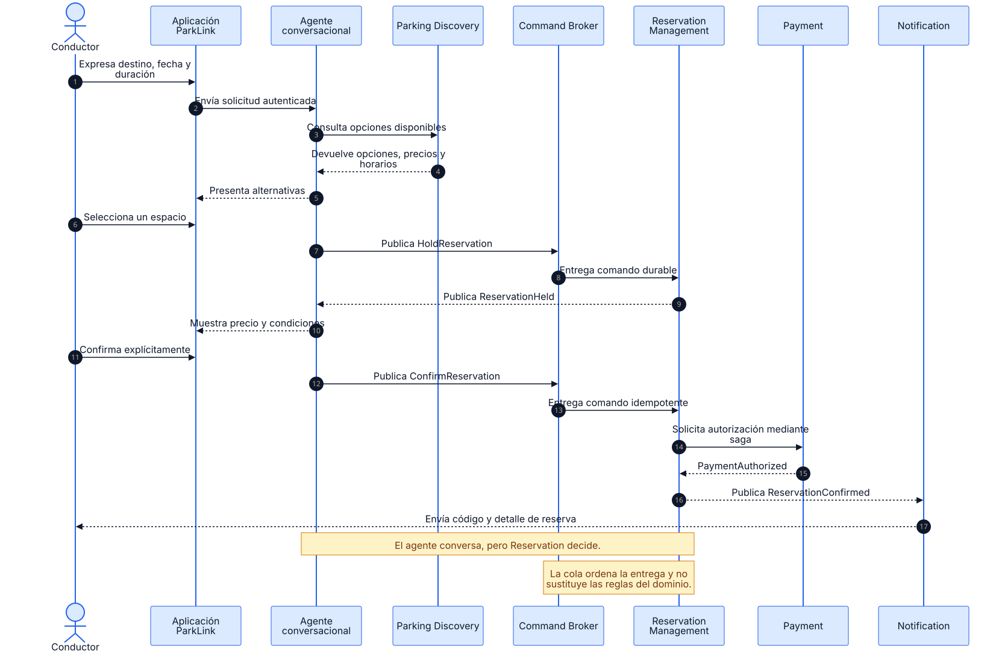

# Capítulo IV: Strategic-Level Software Design

Este capítulo define la arquitectura estratégica de ParkLink. Primero se aplica **Attribute-Driven Design (ADD)** para convertir funcionalidades, atributos de calidad y restricciones en drivers priorizados y decisiones justificadas. Luego se utiliza **Domain-Driven Design (DDD)** estratégico para descubrir Bounded Contexts, modelar sus mensajes y establecer sus relaciones. Finalmente, las decisiones se comunican mediante los diagramas **System Landscape, Context, Container y Deployment del C4 Model**.

El diseño conserva el objetivo del producto: reducir el tiempo y la incertidumbre asociados a encontrar estacionamiento, permitir que los propietarios moneticen espacios disponibles y soportar reservas y pagos confiables. La experiencia conversacional ayuda al usuario, pero las reglas críticas permanecen en servicios determinísticos.

El stack de implementación utiliza **Flutter** para la aplicación móvil, **React con TypeScript** para el panel web de monitoreo exclusivo de propietarios y **NestJS con TypeScript** para el API Gateway, el agente conversacional y todos los microservicios backend.

## 4.1. Strategic-Level Attribute-Driven Design

ADD organiza el diseño alrededor de los drivers que más condicionan la arquitectura. El proceso seguido fue: seleccionar funcionalidades relevantes, concretar escenarios de calidad, convertir restricciones en Technical Stories, priorizar el backlog arquitectónico, evaluar alternativas y refinar los escenarios que presentan mayor riesgo.

### 4.1.1. Design Purpose

El propósito del diseño es construir una plataforma que pueda buscar, publicar, reservar y pagar estacionamientos sin comprometer consistencia, seguridad ni capacidad de evolución. La arquitectura debe soportar la aplicación visual y el agente conversacional sobre las mismas reglas de dominio.

**Relación con la problemática.** Los conductores pierden tiempo recorriendo zonas congestionadas porque no conocen la disponibilidad real. Los propietarios administran sus espacios de forma manual y tienen poca visibilidad. ParkLink necesita ofrecer búsqueda rápida sin confundir información visible con disponibilidad confirmable, porque una proyección desactualizada no puede producir una doble reserva.

**Necesidades de los segmentos objetivo.**

- Los conductores necesitan encontrar opciones cercanas, conocer precio y horario, reservar con anticipación, pagar de forma segura y recibir confirmación.
- Los propietarios necesitan publicar espacios, controlar disponibilidad y precio, conocer sus reservas y recibir ingresos de forma trazable.
- El equipo de soporte necesita reconstruir operaciones críticas y resolver incidentes sin acceder directamente a datos de otros servicios.

**Necesidades del negocio.** ParkLink debe aumentar la oferta disponible, convertir búsquedas en reservas, proteger la confianza mediante cobros y reservas idempotentes, incorporar nuevos canales sin duplicar reglas y escalar cada capacidad de forma independiente.

### 4.1.2. Attribute-Driven Design Inputs

Los inputs de ADD se obtienen del backlog del producto y de los riesgos que pueden obligar a cambiar la estructura del sistema. Por eso se seleccionan solo las User Stories con impacto arquitectónico, se especifican escenarios medibles y se representan las restricciones no negociables como Technical Stories verificables.

#### 4.1.2.1. Primary Functionality

La selección evita copiar todo el backlog del Capítulo III. Se incluyen únicamente historias que determinan límites de dominio, consistencia transaccional, integraciones externas, seguridad o comunicación asíncrona.

| Epic/User Story ID | Título | Descripción | Criterios de aceptación | Relacionado con Epic ID |
|---|---|---|---|---|
| US01 | Buscar estacionamientos por ubicación | El conductor busca espacios próximos a su destino. | Dado un destino, cuando ejecuta la búsqueda, entonces recibe espacios dentro de 1 km con precio, horario y distancia. | EP01 |
| US02 | Ver disponibilidad en tiempo real | El conductor consulta el estado visible de un espacio. | Dado un espacio seleccionado, cuando consulta su detalle, entonces visualiza estado disponible, reservado u ocupado actualizado. | EP01 |
| US05 | Reservar un espacio | El conductor asegura un intervalo antes de llegar. | Dado un espacio disponible, cuando confirma fecha, hora y duración, entonces se bloquea el intervalo, se genera un código y se notifica al propietario. | EP02 |
| US06 | Cancelar una reserva | El conductor libera una reserva que ya no necesita. | Dada una reserva activa, cuando cancela dentro de la política, entonces se libera el intervalo y se solicita el reembolso correspondiente. | EP02 |
| US08 | Extender una reserva activa | El conductor solicita tiempo adicional. | Dada una reserva en curso, cuando solicita extensión, entonces se valida el siguiente intervalo y se cobra solo si continúa disponible. | EP02 |
| US09 | Registrar un espacio | El propietario publica una cochera con sus condiciones. | Dados dirección, fotos, precio y horario válidos, cuando confirma, entonces el espacio aparece en búsquedas. | EP03 |
| US14 | Pagar una reserva en línea | El conductor paga con tarjeta o billetera digital. | Dada una reserva por confirmar, cuando el proveedor autoriza el pago, entonces se genera comprobante y la reserva queda confirmada. | EP04 |
| US19 | Iniciar sesión | El usuario accede según su identidad y rol. | Dadas credenciales válidas, cuando inicia sesión, entonces recibe una sesión segura y accede solo a capacidades autorizadas. | EP05 |
| US20 | Recibir notificación de reserva confirmada | El conductor obtiene evidencia de la reserva. | Dada una reserva confirmada, cuando se publica el evento, entonces recibe push y correo con dirección, horario y código. | EP06 |

#### 4.1.2.2. Quality Attribute Scenarios

Los atributos seleccionados son rendimiento, consistencia, disponibilidad, seguridad, control humano, confiabilidad, observabilidad, privacidad y escalabilidad. Cada escenario identifica un artefacto concreto y una medida verificable; expresiones genéricas como “rápido” o “seguro” no se consideran criterios de aceptación.

| Atributo | Fuente | Estímulo | Artefacto | Entorno | Respuesta | Medida |
|---|---|---|---|---|---|---|
| Rendimiento | Conductor | Busca opciones por ubicación y filtros. | Parking Discovery Service | Hora pico con 500 usuarios concurrentes. | Consulta la proyección geoespacial paginada. | Latencia p95 menor a 2 s y tasa de error menor a 1 %. |
| Consistencia | Dos conductores | Intentan reservar el mismo espacio e intervalo. | Reservation aggregate y Reservation Database | Solicitudes concurrentes. | Serializa la decisión y confirma una sola reserva. | Cero dobles reservas en 10 000 pares de solicitudes conflictivas. |
| Disponibilidad | Falla del proveedor LLM | El chat no puede interpretar una solicitud. | Aplicación, API Gateway y agente | Operación normal. | Informa degradación y mantiene el flujo visual. | Flujo visual disponible en menos de 5 s y disponibilidad mensual mínima de 99,9 %. |
| Seguridad | Contenido malicioso | Intenta inducir una herramienta no permitida. | Tool Registry y Confirmation Policy | Sesión autenticada. | Rechaza la llamada y registra el intento. | 100 % de herramientas fuera de allowlist bloqueadas y cero efectos de negocio. |
| Control humano | Agente conversacional | Propone reservar, pagar, cancelar o extender. | Confirmation Policy | Conversación activa. | Exige confirmación vinculada a actor, acción, recurso, precio y TTL. | 100 % de comandos con efecto acompañados por confirmación vigente. |
| Confiabilidad | Broker o red | Reentrega un comando ya procesado. | Reservation Service y Payment Service | Timeout o reinicio de consumidor. | Reconoce la idempotency key y devuelve el resultado previo. | Cero reservas y cobros duplicados tras cinco reentregas por comando. |
| Observabilidad | Operador de soporte | Investiga una reserva hecha por chat. | Audit Service y trazas distribuidas | Incidente en producción. | Reconstruye intención, confirmación, comando, pago y eventos por correlation ID. | 100 % de pasos críticos correlacionados y diagnóstico en menos de 5 min. |
| Privacidad | Política de retención | Expira una conversación inactiva. | Conversation Store y logs | 24 h sin actividad. | Elimina o anonimiza contexto temporal y secretos. | TTL máximo de 24 h y cero tokens o datos de tarjeta en logs. |
| Escalabilidad | Campaña comercial | Genera una ráfaga de comandos de reserva. | Reservation Command Broker y Reservation Service | 100 comandos/s durante 10 min. | Aplica backpressure y escala consumidores. | Cero mensajes perdidos y antigüedad p95 de cola menor a 5 s después de estabilizar la carga. |

#### 4.1.2.3. Constraints

Las restricciones son condiciones no negociables derivadas de seguridad, propiedad de datos, continuidad del negocio y operación. Se expresan como Technical Stories para que puedan implementarse y verificarse.

| Technical Story ID | Título | Descripción | Criterios de aceptación | Epic relacionado |
|---|---|---|---|---|
| TS01 | Control transaccional de reservas concurrentes | Reservation debe ser la única autoridad que confirma disponibilidad. | Dos solicitudes conflictivas producen una confirmación y un rechazo, sin solapamiento persistido. | EP02 |
| TS02 | Proyección de disponibilidad para búsqueda | Discovery debe leer una proyección rápida y no la base de Reservation. | Los eventos de oferta y reserva actualizan la proyección; una lectura nunca confirma disponibilidad. | EP01, EP02 |
| TS03 | Entrada pública autenticada y autorizada | API Gateway debe ser el único endpoint público y validar JWT y rol. | Toda ruta protegida rechaza tokens inválidos y permisos incompatibles. | EP05 |
| TS04 | Auditoría inmutable | Las operaciones críticas deben ser trazables por actor y correlation ID. | Reservas, pagos, reembolsos y acciones del agente generan registros append-only. | EP02, EP04, EP06 |
| TS05 | Archivos privados en Object Storage | Fotos y comprobantes no deben guardarse como binarios en bases transaccionales. | Los objetos permanecen privados y solo se entregan mediante URLs firmadas de corta duración. | EP03, EP04 |
| TS06 | Idempotencia de comandos, pagos y webhooks | Reintentos no deben duplicar efectos. | La misma clave devuelve el resultado previo sin crear otra reserva, cobro o transición. | EP02, EP04 |
| TS07 | Aislamiento del agente | El LLM no puede acceder a bases de datos, Payment Provider ni herramientas no autorizadas. | Solo Tool Registry invoca contratos permitidos y exige confirmación para efectos. | EP01, EP02, EP04 |
| TS08 | Contratos versionados | Comandos y eventos deben evolucionar sin romper consumidores activos. | Cada mensaje incluye versión y mantiene compatibilidad durante la ventana de migración. | EP01, EP02, EP04, EP06 |
| TS09 | Fallback visual | La caída del agente o del LLM no debe detener búsqueda, reserva o pago visual. | La aplicación detecta la degradación y ofrece el flujo visual en menos de 5 s. | EP01, EP02, EP04 |
| TS10 | Broker sin autoridad de dominio | El broker transporta y ordena comandos, pero no valida disponibilidad. | Solo Reservation ejecuta reglas, locks y transiciones; el broker no escribe datos de negocio. | EP02 |

### 4.1.3. Architectural Drivers Backlog

El backlog reúne Functional Drivers, Quality Attribute Drivers y todos los Constraints. La prioridad considera valor para conductores, propietarios, negocio y operaciones; la complejidad estima cuánto condiciona límites, persistencia, concurrencia e integraciones.

| Driver ID | Título | Descripción | Importancia para Stakeholders | Impacto en Architecture Technical Complexity |
|---|---|---|---|---|
| FD-01 | Búsqueda geoespacial | US01 y US02 requieren resultados y disponibilidad visible de baja latencia. | High | High |
| FD-02 | Reserva transaccional | US05 exige retener y confirmar un intervalo sin doble reserva. | High | High |
| FD-03 | Cancelación y liberación | US06 coordina liberación, estado y posible reembolso. | High | High |
| FD-04 | Extensión de reserva | US08 vuelve a validar disponibilidad y pago. | Medium | High |
| FD-05 | Publicación de espacios | US09 incorpora oferta, fotos, horario y precio. | High | Medium |
| FD-06 | Pago en línea | US14 integra autorización, comprobante e idempotencia. | High | High |
| FD-07 | Identidad y roles | US19 separa permisos de conductores, propietarios y soporte. | High | High |
| FD-08 | Notificación confirmada | US20 comunica el resultado sin acoplar el núcleo. | Medium | Medium |
| QAD-01 | Rendimiento de búsqueda | QAS de rendimiento con p95 menor a 2 s. | High | High |
| QAD-02 | Consistencia de reserva | QAS de cero solapamientos confirmados. | High | High |
| QAD-03 | Disponibilidad degradada | QAS de fallback visual y 99,9 % mensual. | High | Medium |
| QAD-04 | Seguridad del agente | QAS de allowlist y cero efectos no autorizados. | High | High |
| QAD-05 | Confiabilidad idempotente | QAS de cero duplicados ante reentregas. | High | High |
| QAD-06 | Observabilidad | QAS de trazabilidad completa en menos de 5 min. | Medium | Medium |
| QAD-07 | Privacidad | QAS de TTL y ausencia de secretos en logs. | High | Medium |
| QAD-08 | Escalabilidad de comandos | QAS de ráfagas sin pérdida y con backpressure. | Medium | High |
| CON-01 | Único punto de entrada | TS03 obliga a exponer solo API Gateway. | High | Medium |
| CON-02 | Database per Service | TS02 prohíbe escrituras y consultas directas entre almacenes. | High | High |
| CON-03 | Autoridad de Reservation | TS01 concentra disponibilidad confirmable y estados. | High | High |
| CON-04 | LLM sin credenciales | TS07 aísla el modelo de datos y pagos. | High | High |
| CON-05 | Confirmación explícita | TS07 exige consentimiento antes de efectos. | High | Medium |
| CON-06 | Idempotencia obligatoria | TS06 aplica claves a comandos críticos y webhooks. | High | High |
| CON-07 | Contratos compatibles | TS08 exige versión y migración compatible. | Medium | High |
| CON-08 | Buckets privados | TS05 protege fotos y comprobantes. | Medium | Medium |
| CON-09 | Fallback visual | TS09 mantiene operación sin IA. | High | Medium |
| CON-10 | Broker sin reglas | TS10 evita trasladar invariantes a infraestructura. | High | Medium |

Los drivers de prioridad **High/High** se atienden primero: consistencia de reserva, pago idempotente, seguridad, propiedad de datos y rendimiento de búsqueda. Los drivers Medium no se ignoran; se implementan después de asegurar las invariantes del Core Domain.

### 4.1.4. Architectural Design Decisions

El **Quality Attribute Workshop** reunió las perspectivas de producto, arquitectura, desarrollo, seguridad y operaciones. Se revisaron principalmente FD-01, FD-02, FD-06, QAD-01, QAD-02, QAD-04, QAD-05, CON-02, CON-03, CON-04 y CON-06 porque combinan alta importancia y alta complejidad.

Las tácticas consideradas fueron proyección de lectura y cache para rendimiento; locks y restricciones transaccionales para consistencia; redundancia, health checks y fallback para disponibilidad; autenticación, autorización, minimización y confirmación para seguridad; idempotencia, retry, DLQ y Outbox para confiabilidad; y correlation IDs, métricas y trazas para observabilidad.

Los patrones evaluados fueron Modular Monolith, Microservices con APIs síncronas y Microservices orientados a eventos con Command Broker. También se consideraron API Gateway, Database per Service, Ports and Adapters, CQRS ligero, Saga, Outbox/Inbox, Circuit Breaker, Bulkhead, Human-in-the-Loop y Tool Allowlist como patrones complementarios.

#### Candidate Pattern Evaluation Matrix

| Patrón candidato | Drivers atendidos | Pros | Cons | Resultado |
|---|---|---|---|---|
| Modular Monolith | Consistencia, simplicidad operativa, entrega inicial. | Transacciones locales simples, menor costo operativo y depuración directa. | Escalamiento conjunto, menor aislamiento y evolución más acoplada entre capacidades. | Rechazado para la arquitectura objetivo; útil solo como transición. |
| Microservices con APIs síncronas | Independencia de despliegue, ownership y separación por dominio. | Límites claros, contratos explícitos y operación conocida. | Propaga latencia y fallos; una ráfaga de reservas puede saturar Reservation. | Parcial: se conserva para consultas y validaciones inmediatas. |
| Microservices orientados a eventos + Reservation Command Broker | Consistencia, escalabilidad, confiabilidad, aislamiento y trazabilidad. | Absorbe ráfagas, desacopla consumidores, permite Outbox/Inbox y mantiene eventos como hechos. | Mayor complejidad operativa, consistencia eventual y necesidad de idempotencia estricta. | Seleccionado para comandos de reserva y propagación de eventos. |

La alternativa seleccionada combina sincronía y asincronía: HTTPS/mTLS para consultas que requieren respuesta inmediata; Reservation Command Broker para comandos durables; Event Bus para hechos del dominio. Esta elección evita el error de tratar un comando como si ya fuera un evento confirmado.

| ADR | Decisión | Drivers principales | Estado |
|---|---|---|---|
| ADR-101 | Microservicios alineados con Bounded Contexts. | FD-01 a FD-08, CON-02 | Accepted |
| ADR-102 | API Gateway como única frontera pública. | FD-07, QAD-04, CON-01 | Accepted |
| ADR-103 | Database per Service. | QAD-02, CON-02, CON-03 | Accepted |
| ADR-104 | Reservation como Core Domain y autoridad de disponibilidad. | FD-02, FD-03, FD-04, QAD-02 | Accepted |
| ADR-105 | CQRS ligero con proyección geoespacial en Discovery. | FD-01, QAD-01 | Accepted |
| ADR-106 | RabbitMQ separa Command Broker y Event Bus. | QAD-05, QAD-08, CON-10 | Accepted |
| ADR-107 | Saga, Outbox e Inbox para reserva y pago. | FD-06, QAD-02, QAD-05 | Accepted |
| ADR-108 | Tool Allowlist y Human-in-the-Loop para el agente. | QAD-04, CON-04, CON-05 | Accepted |
| ADR-109 | Fallback visual ante indisponibilidad de IA. | QAD-03, CON-09 | Accepted |
| ADR-110 | Auditoría append-only y trazas por correlation ID. | QAD-06, TS04 | Accepted |

### 4.1.5. Quality Attribute Scenario Refinements

Los escenarios refinados son los de mayor prioridad y riesgo. Cada cuadro registra preguntas abiertas e issues que deben resolverse durante implementación y pruebas.

#### QAS-R01 — Evitar doble reserva

| Campo | Refinamiento |
|---|---|
| Scenario(s) | Dos conductores confirman el mismo espacio e intervalo casi simultáneamente. |
| Business Goals | Proteger confianza, evitar compensaciones manuales y reclamos. |
| Relevant Quality Attributes | Consistency, Reliability, Performance. |
| Stimulus | Dos comandos `ConfirmReservation` conflictivos. |
| Stimulus Source | Conductores autenticados desde canales visual y conversacional. |
| Environment | Producción bajo carga concurrente. |
| Artifact | Reservation aggregate y Reservation Database. |
| Response | Lock transaccional, validación de solapamiento e idempotencia; una solicitud se confirma y otra se rechaza. |
| Response Measure | Cero dobles reservas en 10 000 pares de solicitudes; decisión p95 menor a 1 s. |
| Questions | ¿Qué nivel de aislamiento y estrategia de lock ofrece el PostgreSQL administrado? |
| Issues | Definir pruebas de carrera, índices y política de timeout de lock. |

#### QAS-R02 — Bloquear acciones inducidas por prompt injection

| Campo | Refinamiento |
|---|---|
| Scenario(s) | Texto de usuario o contenido externo solicita una herramienta no permitida. |
| Business Goals | Evitar operaciones no autorizadas y proteger reputación y dinero. |
| Relevant Quality Attributes | Security, Privacy, Auditability. |
| Stimulus | Instrucción maliciosa que intenta reservar, pagar o extraer datos sin permiso. |
| Stimulus Source | Usuario, descripción externa o respuesta del LLM. |
| Environment | Sesión autenticada con acceso al chat. |
| Artifact | Intent Interpreter, Tool Registry y Confirmation Policy. |
| Response | Trata la salida del LLM como entrada no confiable, valida esquema y allowlist, rechaza y audita. |
| Response Measure | 100 % de casos adversariales bloqueados y cero invocaciones fuera del registro. |
| Questions | ¿Qué corpus de prompt injection representa mejor el dominio de estacionamientos? |
| Issues | Mantener pruebas adversariales y versionar contratos de herramientas. |

#### QAS-R03 — Exigir confirmación humana

| Campo | Refinamiento |
|---|---|
| Scenario(s) | El agente posee todos los datos para ejecutar una operación con efecto. |
| Business Goals | Mantener control del usuario y reducir acciones accidentales. |
| Relevant Quality Attributes | Security, Usability, Accountability. |
| Stimulus | Intención de confirmar, cancelar, extender o pagar. |
| Stimulus Source | Conversational Reservation Agent. |
| Environment | Conversación activa y autenticada. |
| Artifact | Confirmation Policy y Conversation Store. |
| Response | Muestra resumen y emite token vinculado a usuario, acción, recurso, precio y expiración. |
| Response Measure | 100 % de comandos críticos con token vigente; TTL máximo de 5 min. |
| Questions | ¿Qué cambios en precio o disponibilidad invalidan una confirmación pendiente? |
| Issues | Diseñar invalidación atómica y mensajes claros de expiración. |

#### QAS-R04 — Reentrega idempotente

| Campo | Refinamiento |
|---|---|
| Scenario(s) | El broker reentrega un comando después de timeout o reinicio. |
| Business Goals | Evitar dobles cobros y reservas duplicadas. |
| Relevant Quality Attributes | Reliability, Consistency, Recoverability. |
| Stimulus | Mismo comando con la misma idempotency key hasta cinco veces. |
| Stimulus Source | RabbitMQ o cliente que reintenta. |
| Environment | Fallo parcial durante producción. |
| Artifact | Reservation Service, Payment Service, Inbox e idempotency store. |
| Response | Detecta operación previa y devuelve el resultado persistido sin repetir el efecto. |
| Response Measure | Cero efectos duplicados y respuesta p95 menor a 500 ms para una clave conocida. |
| Questions | ¿Cuánto tiempo deben conservarse claves de reserva, pago y webhook? |
| Issues | Definir TTL por tipo de operación y respuesta ante payload distinto con la misma clave. |

#### QAS-R05 — Absorber ráfagas de comandos

| Campo | Refinamiento |
|---|---|
| Scenario(s) | Una campaña genera 100 comandos/s durante 10 min. |
| Business Goals | Mantener ventas y evitar pérdida de solicitudes durante picos. |
| Relevant Quality Attributes | Scalability, Availability, Reliability. |
| Stimulus | Ráfaga de Hold, Confirm, Cancel y Extend. |
| Stimulus Source | Aplicación visual y agente conversacional. |
| Environment | Hora pico con Reservation parcialmente saturado. |
| Artifact | Reservation Command Broker y consumidores de Reservation. |
| Response | Quorum queues aplican backpressure y consumidores escalan conservando partición lógica por `spaceId`. |
| Response Measure | Cero pérdida de mensajes y antigüedad p95 menor a 5 s luego de estabilizar la carga. |
| Questions | ¿Cuántas particiones y consumidores requiere el volumen real? |
| Issues | Ejecutar load test, configurar DLQ y alertar profundidad y antigüedad de cola. |

## 4.2. Strategic-Level Domain-Driven Design

DDD estratégico se utiliza para que los límites técnicos reflejen capacidades de negocio y lenguaje compartido. El proceso parte de eventos relevantes, agrupa responsabilidades, modela historias de colaboración, documenta cada contexto y finalmente define un Context Map explícito.

### 4.2.1. EventStorming

El EventStorming se realizó comenzando por los eventos de negocio en pasado, identificando qué comandos los producen, qué actores los disparan, qué agregados protegen invariantes y qué políticas reaccionan. El flujo principal va desde búsqueda y selección hasta retención, confirmación, pago y notificación; los flujos alternos cubren cancelación, reembolso, extensión y expiración.

**Fuente:** [Mermaid](docs/architecture/mermaid/event-storming.mmd)

El tablero reproduce la apariencia de una sesión de EventStorming con post-its: amarillo para actores, azul para comandos, crema para aggregates, naranja para eventos de dominio y rosa para políticas. Cada grupo encierra las acciones y eventos que pertenecen a un Bounded Context; Reservation Management se destaca como Core Domain. Las flechas continuas muestran el flujo interno `comando → aggregate → evento`, mientras que las flechas punteadas representan reacciones y mensajes entre contextos. Así se evidencia que `ReservationHeld` aparece después de que Reservation acepta el comando y que `ReservationConfirmed` aparece después de `PaymentAuthorized`. El agente propone comandos, pero no produce directamente esos hechos.

| Actor | Comando | Aggregate o política | Evento resultante |
|---|---|---|---|
| Conductor | Buscar espacios | Discovery | Opciones encontradas |
| Conductor | Consultar disponibilidad | Discovery | Disponibilidad consultada |
| Propietario | Publicar espacio | Supply | Espacio publicado |
| Propietario | Actualizar precio y horario | Supply | Oferta actualizada |
| Conductor o agente | Retener espacio | Reservation | Reserva retenida |
| Confirmation Policy | Confirmar reserva | Reservation | Confirmación solicitada |
| Saga de reserva | Autorizar pago | Payment | Pago autorizado o pago fallido |
| Payment autorizado | Confirmar reserva | Reservation | Reserva confirmada |
| Conductor | Cancelar reserva | Reservation | Reserva cancelada |
| Reservation | Procesar reembolso | Payment | Reembolso procesado |
| Conductor | Extender reserva | Reservation | Reserva extendida |
| Reservation confirmada | Notificar | Notification | Notificación enviada |

### 4.2.2. Candidate Context Discovery

Los Bounded Contexts candidatos se derivan de clústeres de eventos que comparten reglas, vocabulario y ritmo de cambio. No se separan por tablas ni por capas técnicas. Reservation se identifica como Core Domain porque contiene la ventaja operativa más sensible: decidir si un intervalo puede confirmarse sin solapamientos.

**Fuente:** [Mermaid](docs/architecture/mermaid/candidate-context-discovery.mmd)

La evidencia muestra la evolución desde clústeres del EventStorming hacia contextos candidatos. Los límites se ajustaron para separar disponibilidad visible de disponibilidad confirmable, oferta de reserva, y conversación probabilística de decisiones determinísticas.

| Clúster de eventos | Bounded Context candidato | Criterio de separación | Tipo de subdominio |
|---|---|---|---|
| Registro, autenticación y roles | User & Identity | Reglas de identidad y seguridad cambian independientemente del estacionamiento. | Generic |
| Publicación, horarios y precios | Parking Supply | El propietario gobierna oferta y condiciones comerciales. | Supporting |
| Búsqueda, filtros y proyección | Parking Discovery | Optimiza lectura y tolera consistencia eventual. | Supporting |
| Retención, confirmación, cancelación y extensión | Reservation Management | Protege concurrencia, disponibilidad confirmable y ciclo de vida. | Core |
| Autorización, cobro y reembolso | Payment | Encapsula dinero, idempotencia y proveedor externo. | Supporting |
| Push y correo | Notification | Entrega mensajes sin decidir estados del negocio. | Generic |
| Intención, diálogo y confirmación | Conversational Reservation Agent | Aísla incertidumbre del LLM y estado temporal de conversación. | Supporting |
| Trazabilidad crítica | Audit | Conserva evidencia inmutable transversal. | Generic |

### 4.2.3. Domain Message Flows Modeling

Domain Storytelling modela cómo colaboran personas y contextos para alcanzar un resultado observable. La historia priorizada es “un conductor reserva un espacio mediante conversación con confirmación humana”.

**Fuente:** [Mermaid](docs/architecture/mermaid/domain-storytelling-reservation.mmd)

1. El conductor expresa destino, fecha y duración a ParkLink.
2. El agente consulta Discovery y presenta alternativas; no decide disponibilidad.
3. La selección produce un comando durable para Reservation a través del broker.
4. Reservation crea una retención temporal y el agente presenta precio y condiciones.
5. La confirmación humana habilita el comando idempotente de confirmación.
6. Reservation y Payment ejecutan la saga; Notification comunica el resultado.

El siguiente diagrama complementa la historia con estados legales y compensaciones. `PaymentFailed` permite reintento autorizado, `Expired` libera la retención y solo el aggregate Reservation puede pasar a `Confirmed`.

**Fuente:** [Mermaid](docs/architecture/mermaid/reservation-saga.mmd)

### 4.2.4. Bounded Context Canvases

#### User & Identity Canvas

<table width="100%">
  <tr><td width="42%"><strong>Name</strong> User &amp; Identity</td><td><strong>Model Traits</strong> gateway, enforce, audit</td></tr>
  <tr>
    <td><strong>Description</strong> Gestiona usuarios, credenciales, roles, perfiles e identidad delegada.</td>
    <td rowspan="2"><strong>Information and Services Provided</strong><table><tr><th>Queryable Information</th><th>Invokable Commands</th></tr><tr><td>Perfil, roles y sesión activa</td><td>Registrar usuario, iniciar o renovar sesión, actualizar perfil</td></tr><tr><th>Published Events</th><th>Reactive Jobs</th></tr><tr><td>UserRegistered, UserAuthenticated, ProfileUpdated</td><td>Expirar sesiones y revocar identidad delegada</td></tr></table></td>
  </tr>
  <tr><td><strong>Strategic Classification</strong><table><tr><th>Domain</th><th>Business Model</th><th>Evolution</th></tr><tr><td>Generic</td><td>Compliance</td><td>Commodity</td></tr></table></td></tr>
  <tr>
    <td><strong>Business Decisions</strong><ul><li>El correo es único.</li><li>Las contraseñas se almacenan cifradas.</li><li>Los permisos dependen del rol y del ownership.</li></ul></td>
    <td rowspan="2"><strong>Dependencies and Relationships</strong><table><tr><th>Suppliers</th><th>Consumers</th></tr><tr><td>Ningún contexto interno</td><td>Gateway, Agent, Reservation y Supply — Open Host Service Audit — Published Language</td></tr></table></td>
  </tr>
  <tr><td><strong>Ubiquitous Language</strong> User, Driver, Owner, Role, Profile, Session, Delegated Identity</td></tr>
</table>

#### Parking Supply Canvas

<table width="100%">
  <tr><td width="42%"><strong>Name</strong> Parking Supply</td><td><strong>Model Traits</strong> execute, enforce, publish</td></tr>
  <tr>
    <td><strong>Description</strong> Administra la oferta de estacionamientos publicada por propietarios.</td>
    <td rowspan="2"><strong>Information and Services Provided</strong><table><tr><th>Queryable Information</th><th>Invokable Commands</th></tr><tr><td>Detalle, horario, precio y estado de publicación</td><td>Publicar, actualizar, habilitar o deshabilitar espacio</td></tr><tr><th>Published Events</th><th>Reactive Jobs</th></tr><tr><td>ParkingSpacePublished, ParkingSpaceUpdated, AvailabilityWindowChanged</td><td>Coordinar cambios incompatibles con Reservation</td></tr></table></td>
  </tr>
  <tr><td><strong>Strategic Classification</strong><table><tr><th>Domain</th><th>Business Model</th><th>Evolution</th></tr><tr><td>Supporting</td><td>Revenue</td><td>Custom-built</td></tr></table></td></tr>
  <tr>
    <td><strong>Business Decisions</strong><ul><li>Solo el propietario modifica su espacio.</li><li>Los horarios no se solapan.</li><li>El precio no puede ser negativo.</li></ul></td>
    <td rowspan="2"><strong>Dependencies and Relationships</strong><table><tr><th>Suppliers</th><th>Consumers</th></tr><tr><td>Identity — Open Host Service Object Storage — ACL</td><td>Discovery y Reservation — Customer/Supplier + Published Language Audit — Published Language</td></tr></table></td>
  </tr>
  <tr><td><strong>Ubiquitous Language</strong> Parking Space, Schedule, Price, Availability Window, Owner</td></tr>
</table>

#### Parking Discovery Canvas

<table width="100%">
  <tr><td width="42%"><strong>Name</strong> Parking Discovery</td><td><strong>Model Traits</strong> query, project, rank</td></tr>
  <tr>
    <td><strong>Description</strong> Permite encontrar y comparar espacios mediante una proyección de lectura.</td>
    <td rowspan="2"><strong>Information and Services Provided</strong><table><tr><th>Queryable Information</th><th>Invokable Commands</th></tr><tr><td>Resultados, detalle, distancia y disponibilidad visible</td><td>Buscar opciones y actualizar proyección</td></tr><tr><th>Published Events</th><th>Reactive Jobs</th></tr><tr><td>OptionsFound, VisibleAvailabilityUpdated</td><td>Proyectar eventos de Supply y Reservation</td></tr></table></td>
  </tr>
  <tr><td><strong>Strategic Classification</strong><table><tr><th>Domain</th><th>Business Model</th><th>Evolution</th></tr><tr><td>Supporting</td><td>Engagement</td><td>Custom-built</td></tr></table></td></tr>
  <tr>
    <td><strong>Business Decisions</strong><ul><li>La disponibilidad visible es informativa.</li><li>Los filtros y la distancia no confirman una reserva.</li><li>Reservation siempre revalida el intervalo.</li></ul></td>
    <td rowspan="2"><strong>Dependencies and Relationships</strong><table><tr><th>Suppliers</th><th>Consumers</th></tr><tr><td>Supply y Reservation — Published Language Maps Provider — ACL</td><td>Mobile App y Agent — Open Host Service</td></tr></table></td>
  </tr>
  <tr><td><strong>Ubiquitous Language</strong> Search Criteria, Search Result, Visible Availability, Distance, Filter</td></tr>
</table>

#### Reservation Management Canvas

<table width="100%">
  <tr><td width="42%"><strong>Name</strong> Reservation Management</td><td><strong>Model Traits</strong> execute, enforce, coordinate, audit</td></tr>
  <tr>
    <td><strong>Description</strong> Controla retenciones, reservas, concurrencia y transiciones de estado.</td>
    <td rowspan="2"><strong>Information and Services Provided</strong><table><tr><th>Queryable Information</th><th>Invokable Commands</th></tr><tr><td>Reserva, retención, estado e historial</td><td>Retener, confirmar, cancelar, extender y aplicar pago autorizado</td></tr><tr><th>Published Events</th><th>Reactive Jobs</th></tr><tr><td>ReservationHeld, ConfirmationRequested, ReservationConfirmed, ReservationCancelled, ReservationExtended, HoldExpired</td><td>Expirar retenciones y reaccionar a resultados de Payment</td></tr></table></td>
  </tr>
  <tr><td><strong>Strategic Classification</strong><table><tr><th>Domain</th><th>Business Model</th><th>Evolution</th></tr><tr><td>Core</td><td>Revenue</td><td>Custom-built</td></tr></table></td></tr>
  <tr>
    <td><strong>Business Decisions</strong><ul><li>Un intervalo no se confirma dos veces.</li><li>Las retenciones expiran.</li><li>Las transiciones inválidas se rechazan.</li><li>La base aplica locks, constraints e idempotencia.</li></ul></td>
    <td rowspan="2"><strong>Dependencies and Relationships</strong><table><tr><th>Suppliers</th><th>Consumers</th></tr><tr><td>Identity y Supply — Customer/Supplier Payment — Published Language Command Broker — durable commands</td><td>Discovery, Notification y Audit — Published Language Agent — action results</td></tr></table></td>
  </tr>
  <tr><td><strong>Ubiquitous Language</strong> Hold, Reservation, Interval, Confirmation, Cancellation, Extension, Expiration</td></tr>
</table>

#### Payment Canvas

<table width="100%">
  <tr><td width="42%"><strong>Name</strong> Payment</td><td><strong>Model Traits</strong> execute, audit, interchange</td></tr>
  <tr>
    <td><strong>Description</strong> Encapsula autorizaciones, cobros, webhooks, reembolsos y comprobantes.</td>
    <td rowspan="2"><strong>Information and Services Provided</strong><table><tr><th>Queryable Information</th><th>Invokable Commands</th></tr><tr><td>Estado de pago, reembolso y comprobante</td><td>Autorizar pago, procesar reembolso y conciliar operación</td></tr><tr><th>Published Events</th><th>Reactive Jobs</th></tr><tr><td>PaymentAuthorized, PaymentFailed, RefundProcessed</td><td>Procesar webhooks y conciliar operaciones pendientes</td></tr></table></td>
  </tr>
  <tr><td><strong>Strategic Classification</strong><table><tr><th>Domain</th><th>Business Model</th><th>Evolution</th></tr><tr><td>Supporting</td><td>Revenue</td><td>Product</td></tr></table></td></tr>
  <tr>
    <td><strong>Business Decisions</strong><ul><li>Una idempotency key representa una operación.</li><li>El monto y la moneda no cambian durante un reintento.</li><li>El agente nunca recibe datos de tarjeta.</li></ul></td>
    <td rowspan="2"><strong>Dependencies and Relationships</strong><table><tr><th>Suppliers</th><th>Consumers</th></tr><tr><td>Reservation — Customer/Supplier Payment Provider — ACL</td><td>Reservation, Notification y Audit — Published Language</td></tr></table></td>
  </tr>
  <tr><td><strong>Ubiquitous Language</strong> Payment, Authorization, Capture, Refund, Receipt, Webhook</td></tr>
</table>

#### Notification Canvas

<table width="100%">
  <tr><td width="42%"><strong>Name</strong> Notification</td><td><strong>Model Traits</strong> execute, interchange, retry</td></tr>
  <tr>
    <td><strong>Description</strong> Entrega mensajes push y correo según las preferencias del usuario.</td>
    <td rowspan="2"><strong>Information and Services Provided</strong><table><tr><th>Queryable Information</th><th>Invokable Commands</th></tr><tr><td>Preferencias y estado de entrega</td><td>Actualizar preferencias y notificar resultado</td></tr><tr><th>Published Events</th><th>Reactive Jobs</th></tr><tr><td>NotificationSent, NotificationFailed</td><td>Consumir eventos notificables y ejecutar reintentos acotados</td></tr></table></td>
  </tr>
  <tr><td><strong>Strategic Classification</strong><table><tr><th>Domain</th><th>Business Model</th><th>Evolution</th></tr><tr><td>Generic</td><td>Engagement</td><td>Commodity</td></tr></table></td></tr>
  <tr>
    <td><strong>Business Decisions</strong><ul><li>Solo se notifican hechos confirmados.</li><li>Se respetan preferencias de canal.</li><li>Una falla de entrega no revierte la reserva.</li></ul></td>
    <td rowspan="2"><strong>Dependencies and Relationships</strong><table><tr><th>Suppliers</th><th>Consumers</th></tr><tr><td>Identity, Reservation y Payment — Published Language Notification Providers — ACL</td><td>Audit y Support — delivery status</td></tr></table></td>
  </tr>
  <tr><td><strong>Ubiquitous Language</strong> Notification, Template, Channel, Preference, Delivery Attempt</td></tr>
</table>

#### Conversational Reservation Agent Canvas

<table width="100%">
  <tr><td width="42%"><strong>Name</strong> Conversational Reservation Agent</td><td><strong>Model Traits</strong> gateway, translate, coordinate, audit</td></tr>
  <tr>
    <td><strong>Description</strong> Convierte lenguaje natural en consultas y comandos permitidos.</td>
    <td rowspan="2"><strong>Information and Services Provided</strong><table><tr><th>Queryable Information</th><th>Invokable Commands</th></tr><tr><td>Conversación, alternativas y resumen de acción</td><td>Interpretar solicitud, buscar, solicitar retención y proponer confirmación</td></tr><tr><th>Published Events</th><th>Reactive Jobs</th></tr><tr><td>IntentInterpreted, HumanConfirmationGranted</td><td>Reanudar conversación y expirar confirmation tokens</td></tr></table></td>
  </tr>
  <tr><td><strong>Strategic Classification</strong><table><tr><th>Domain</th><th>Business Model</th><th>Evolution</th></tr><tr><td>Supporting</td><td>Engagement</td><td>Genesis</td></tr></table></td></tr>
  <tr>
    <td><strong>Business Decisions</strong><ul><li>El LLM solo interpreta.</li><li>Todo efecto requiere identidad, allowlist y confirmación vigente.</li><li>Las reglas de Reservation no se replican.</li></ul></td>
    <td rowspan="2"><strong>Dependencies and Relationships</strong><table><tr><th>Suppliers</th><th>Consumers</th></tr><tr><td>Identity y Discovery — Open Host Service Reservation — Published Language LLM Provider — ACL</td><td>Mobile App — conversational interface Audit — Published Language</td></tr></table></td>
  </tr>
  <tr><td><strong>Ubiquitous Language</strong> Intent, Conversation, Tool, Confirmation Token, Action Summary</td></tr>
</table>

#### Audit Canvas

<table width="100%">
  <tr><td width="42%"><strong>Name</strong> Audit</td><td><strong>Model Traits</strong> audit, query, retain</td></tr>
  <tr>
    <td><strong>Description</strong> Conserva trazabilidad inmutable de operaciones críticas.</td>
    <td rowspan="2"><strong>Information and Services Provided</strong><table><tr><th>Queryable Information</th><th>Invokable Commands</th></tr><tr><td>Trazas por actor, entidad y correlation ID</td><td>Registrar operación auditable</td></tr><tr><th>Published Events</th><th>Reactive Jobs</th></tr><tr><td>OperationAudited</td><td>Ingestar eventos críticos y aplicar retención</td></tr></table></td>
  </tr>
  <tr><td><strong>Strategic Classification</strong><table><tr><th>Domain</th><th>Business Model</th><th>Evolution</th></tr><tr><td>Generic</td><td>Compliance</td><td>Commodity</td></tr></table></td></tr>
  <tr>
    <td><strong>Business Decisions</strong><ul><li>Los registros son append-only, minimizados y correlacionables.</li><li>No se almacenan secretos.</li><li>Audit no es fuente de verdad operacional.</li></ul></td>
    <td rowspan="2"><strong>Dependencies and Relationships</strong><table><tr><th>Suppliers</th><th>Consumers</th></tr><tr><td>Todos los contextos — Conformist + Published Language</td><td>Support — restricted queries</td></tr></table></td>
  </tr>
  <tr><td><strong>Ubiquitous Language</strong> Audit Event, Actor, Action, Entity, Correlation ID, Timestamp</td></tr>
</table>

### 4.2.5. Context Mapping

El Context Map muestra quién se comunica con quién y qué patrón gobierna cada relación. Published Language corresponde a comandos y eventos versionados; Customer/Supplier establece qué contexto define el contrato; Open Host Service representa APIs estables; Conformist se usa cuando Audit acepta el lenguaje publicado; ACL protege Payment y Agent de proveedores externos.

**Fuente:** [Mermaid](docs/architecture/mermaid/context-map.mmd)

| Upstream | Downstream | Información | Patrón DDD |
|---|---|---|---|
| User & Identity | Agent / Reservation / Supply | Identidad y roles | Open Host Service |
| Parking Supply | Parking Discovery | Oferta, horarios y precios | Customer/Supplier + Published Language |
| Parking Supply | Reservation Management | Reglas vigentes del espacio | Customer/Supplier |
| Parking Discovery | Agent | Opciones visibles | Open Host Service |
| Agent | Reservation Management | Hold, Confirm, Cancel y Extend | Customer/Supplier + Published Language |
| Reservation Management | Payment | Solicitud de autorización o reembolso | Customer/Supplier |
| Payment | Reservation Management | PaymentAuthorized, PaymentFailed, RefundProcessed | Published Language |
| Reservation Management | Parking Discovery | Cambios de estado | Published Language |
| Reservation Management | Notification | Eventos notificables | Published Language |
| Contextos de negocio | Audit | Eventos auditables | Conformist |
| Payment Provider | Payment | Respuestas y webhooks externos | Anti-Corruption Layer |
| LLM Provider | Agent | Intención estructurada | Anti-Corruption Layer |

No se utiliza **Shared Kernel** porque compartir entidades o esquemas debilitaría Database per Service. Los contratos contienen identificadores estables, no objetos de persistencia compartidos.

## 4.3. Software Architecture

La arquitectura propuesta implementa los límites DDD mediante microservicios independientes. API Gateway concentra la entrada pública; cada servicio posee su persistencia; las consultas inmediatas usan HTTPS/mTLS; los comandos de reserva pasan por un broker durable; y los cambios confirmados se publican como eventos. Las cuatro vistas siguientes responden a preguntas diferentes y NO deben confundirse entre sí.

### 4.3.1. Software Architecture System Landscape Diagram

**Fuente:** [Structurizr DSL](docs/architecture/workspace.dsl) · [Exportación Mermaid](docs/architecture/structurizr-export/structurizr-ParkLinkSystemLandscape.mmd)

El System Landscape ubica a ParkLink dentro de su ecosistema. La solución depende de mapas para geocodificación, una pasarela para dinero, proveedores de notificación, Object Storage para fotografías y un proveedor LLM para interpretación. Ninguno de estos sistemas externos es autoridad sobre reservas.

| Sistema | Rol en el paisaje | Límite relevante |
|---|---|---|
| ParkLink | Solución central de búsqueda, publicación, reserva y pago. | Conserva reglas y datos del negocio. |
| Proveedor de mapas | Geocodificación, distancia y representación cartográfica. | No conoce reservas ni usuarios completos. |
| Pasarela de pagos | Autoriza cobros y reembolsos. | Se integra mediante ACL e idempotencia. |
| Proveedor LLM | Interpreta lenguaje natural. | No ejecuta herramientas ni posee credenciales. |
| Proveedores de notificación | Entregan push y correo. | No deciden estados del negocio. |
| Object Storage | Conserva fotografías privadas. | Acceso mediante referencias y URLs firmadas. |

### 4.3.2. Software Architecture Context Level Diagram

**Fuente:** [Structurizr DSL](docs/architecture/workspace.dsl) · [Exportación Mermaid](docs/architecture/structurizr-export/structurizr-ParkLinkSystemContext.mmd)

ParkLink aparece como sistema central. Conductores buscan y reservan mediante la app o el chat; propietarios publican y administran oferta desde la aplicación móvil y utilizan el panel web únicamente para monitorear espacios, reservas e ingresos; soporte consulta trazas restringidas. Las relaciones con sistemas externos indican propósito y protocolo, permitiendo reconocer de inmediato qué cruza la frontera del sistema.

### 4.3.3. Software Architecture Container Level Diagram

**Fuente:** [Structurizr DSL](docs/architecture/workspace.dsl) · [Exportación Mermaid](docs/architecture/structurizr-export/structurizr-ParkLinkMicroservices.mmd)

El Container Diagram muestra las unidades desplegables, su tecnología y comunicación. El broker de comandos y el Event Bus pueden compartir un clúster RabbitMQ, pero mantienen exchanges, colas, políticas y semánticas distintas.

| Container | Responsabilidad | Tecnología | Comunicación principal |
|---|---|---|---|
| Aplicación móvil | Experiencia de conductores y propietarios, incluido chat. | Flutter | HTTPS/WebSocket hacia API Gateway. |
| Panel web de monitoreo | Vista exclusiva para que propietarios monitoreen espacios, reservas e ingresos; no administra la operación. | React / TypeScript | HTTPS hacia endpoints de consulta del API Gateway; sin comandos de gestión. |
| API Gateway | JWT, autorización de entrada, rate limit y routing. | NestJS / TypeScript | HTTPS público y HTTPS/mTLS interno. |
| Agente conversacional | Interpreta intención y orquesta herramientas con confirmación. | NestJS / TypeScript | HTTPS al LLM/Discovery y AMQP al broker/Event Bus. |
| Identity Service | Usuarios, roles, perfiles y tokens. | NestJS / TypeScript | HTTPS/mTLS y PostgreSQL. |
| Parking Discovery Service | Búsqueda, filtros y disponibilidad visible. | NestJS / TypeScript | HTTPS, Redis, Maps y eventos. |
| Parking Supply Service | Espacios, horarios, precios y publicación. | NestJS / TypeScript | HTTPS, PostgreSQL, S3 y eventos. |
| Reservation Service | Retenciones, reservas, estados y concurrencia. | NestJS / TypeScript | Consume AMQP, usa PostgreSQL y publica eventos. |
| Payment Service | Autorización, cobro, webhook y reembolso. | NestJS / TypeScript | AMQP, HTTPS/Webhooks y PostgreSQL. |
| Notification Service | Preferencias y entrega de mensajes. | NestJS / TypeScript | Consume AMQP y llama proveedores externos. |
| Audit Service | Trazabilidad append-only. | NestJS / TypeScript | Consume AMQP y consulta PostgreSQL restringido. |
| Reservation Command Broker | Entrega durable y backpressure de comandos. | RabbitMQ Quorum Queues | AMQP particionado lógicamente por `spaceId`. |
| Event Bus | Propaga hechos del dominio. | RabbitMQ | AMQP con retry y DLQ. |
| Almacenes privados | Datos propios por servicio y proyección Discovery. | PostgreSQL / Redis | SQL/TLS o Redis/TLS solo desde el propietario. |

### 4.3.4. Software Architecture Deployment Diagram

**Fuente:** [Structurizr DSL](docs/architecture/workspace.dsl) · [Exportación Mermaid](docs/architecture/structurizr-export/structurizr-ParkLinkProductionDeployment.mmd)

El Deployment Diagram representa el ambiente de producción. Las aplicaciones cliente alcanzan únicamente Edge Network mediante HTTPS. El Edge aplica CDN/WAF y enruta al API Gateway. Los microservicios stateless se ejecutan en una plataforma administrada, RabbitMQ opera como clúster separado y los almacenes administrados permanecen fuera de la red pública.

| Nodo de despliegue | Componentes/containers | Tecnología | Comunicación y protección |
|---|---|---|---|
| Mobile Devices | Aplicación móvil | iOS / Android | HTTPS/WebSocket con validación TLS. |
| Edge Network | Panel web React y API Gateway NestJS | React / TypeScript, NestJS / TypeScript, CDN / WAF | Única entrada pública; rate limiting y terminación TLS. |
| Application Platform | Agent, Identity, Discovery, Supply, Reservation, Payment, Notification y Audit | NestJS / TypeScript sobre Managed Kubernetes | Tráfico interno HTTPS/mTLS, health checks y escalamiento horizontal. |
| Messaging Cluster | Reservation Command Broker y Event Bus | RabbitMQ Cluster | AMQP/TLS, quorum queues, retry, DLQ y canales separados. |
| Managed Data Platform | Bases PostgreSQL, Conversation Store y Discovery Index | PostgreSQL / Redis | Subred privada, credenciales por servicio, backups y cifrado. |
| External Providers | Maps, Payment, LLM, Notification y Object Storage | Servicios administrados | Egress HTTPS controlado, timeouts, Circuit Breaker y ACL. |

La topología permite escalar búsquedas, reservas y conversación por separado. Una caída del LLM degrada únicamente el canal conversacional; una falla de notificación no revierte una reserva; y ningún almacén acepta tráfico directo desde clientes.

## 4.4. Architecture-as-Code and Evidence Traceability

Los diagramas C4 se modelan en un workspace Structurizr único. Las vistas DDD se mantienen como fuentes Mermaid y todos los SVG se versionan con fondo blanco para conservar legibilidad en visores claros y oscuros.

| Evidencia | Fuente versionada | Imagen renderizada |
|---|---|---|
| EventStorming | `docs/architecture/mermaid/event-storming.mmd` | `assets/architecture-v2/event-storming.svg` |
| Candidate Context Discovery | `docs/architecture/mermaid/candidate-context-discovery.mmd` | `assets/architecture-v2/candidate-context-discovery.svg` |
| Domain Storytelling | `docs/architecture/mermaid/domain-storytelling-reservation.mmd` | `assets/architecture-v2/domain-storytelling-reservation.svg` |
| Context Map | `docs/architecture/mermaid/context-map.mmd` | `assets/architecture-v2/context-map.svg` |
| Reservation States | `docs/architecture/mermaid/reservation-saga.mmd` | `assets/architecture-v2/reservation-saga.svg` |
| System Landscape, Context, Container y Deployment | `docs/architecture/workspace.dsl` y `docs/architecture/structurizr-export/` | `assets/architecture-v2/` |

Cada gráfico tiene una explicación asociada y responde a una pregunta arquitectónica específica. La fuente textual permite revisar decisiones y volver a generar la evidencia sin depender de capturas manuales.
