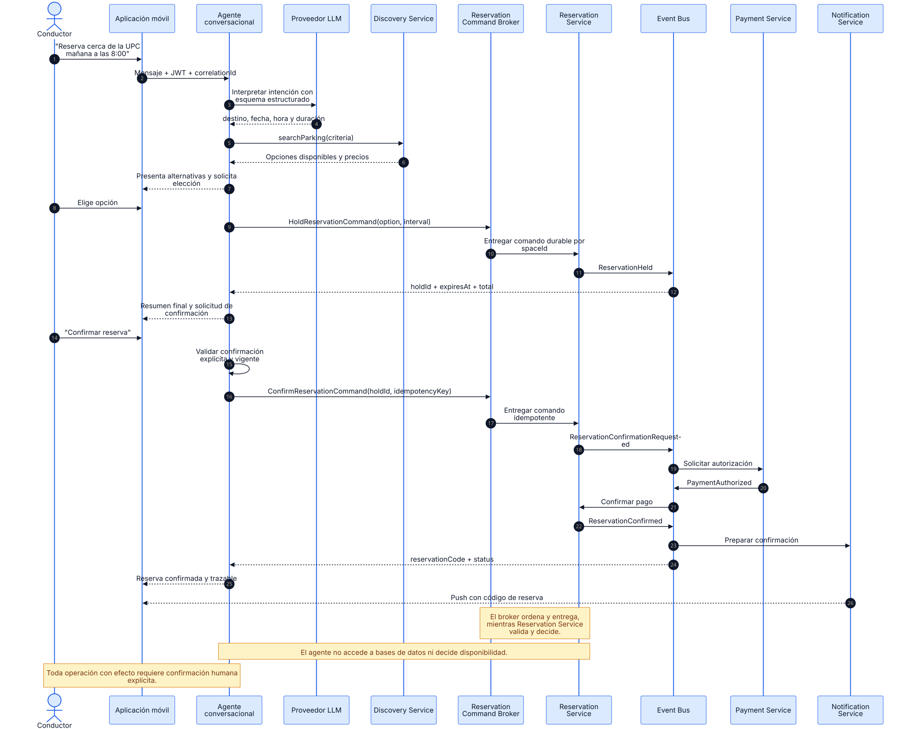

# Capítulo IV: Product Architecture Design

## 4.1. Strategic-Level Domain-Driven Design

ParkLink adopta una arquitectura de microservicios alineada con Domain-Driven Design (DDD). La plataforma conserva las capacidades de búsqueda, publicación, reserva, pago y notificación, e incorpora un agente conversacional que permite al conductor buscar y reservar un estacionamiento mediante chat.

El agente mejora la interacción, pero no reemplaza las reglas del dominio. Interpreta la intención del usuario, consulta opciones y orquesta herramientas autorizadas. La disponibilidad, el precio, la reserva y el pago continúan siendo decididos por los microservicios propietarios de esas reglas. Antes de ejecutar una operación con efecto económico u operacional, el agente debe presentar un resumen y obtener una confirmación humana explícita.

### 4.1.1. Principles Statements

| ID | Principio | Aplicación en ParkLink | Justificación |
|---|---|---|---|
| P-01 | Un bounded context por capacidad de negocio | Identity, Discovery, Supply, Reservation, Payment, Notification, Audit y Conversational Agent se implementan como servicios independientes. | Cada capacidad cambia por razones distintas y necesita evolucionar sin desplegar toda la plataforma. |
| P-02 | Cada servicio es propietario de sus datos | Ningún microservicio consulta o modifica directamente la base de datos de otro servicio. | Evita acoplamiento por esquema y permite que cada servicio mantenga sus invariantes. |
| P-03 | Reservation Service es la autoridad de las reservas | Toda creación, retención, confirmación, cancelación o extensión pasa por Reservation Service. | Ni el chat, ni Redis, ni el Payment Service pueden confirmar disponibilidad por sí solos. |
| P-04 | La disponibilidad visible no es una reserva confirmada | Discovery usa una proyección rápida; Reservation valida y bloquea el intervalo en su propia base transaccional. | Una proyección puede estar temporalmente desactualizada y no debe producir doble reserva. |
| P-05 | Confirmación humana antes de efectos | El agente exige confirmación explícita y vigente antes de reservar, pagar, cancelar o extender. | Evita acciones accidentales, ambiguas o provocadas por contenido malicioso. |
| P-06 | El modelo de lenguaje no ejecuta negocio | El LLM produce intención estructurada; solo un Tool Registry con allowlist puede invocar APIs internas. | Un resultado probabilístico no debe saltarse validaciones determinísticas. |
| P-07 | Comandos y eventos separados | Las consultas usan HTTPS/mTLS; los comandos de reserva pasan por Reservation Command Broker y los cambios de estado se publican en el Event Bus. | Se desacopla la presión de escritura sin confundir una solicitud con un hecho del dominio. |
| P-08 | Idempotencia y trazabilidad de extremo a extremo | Los comandos críticos incluyen `Idempotency-Key` y `X-Correlation-Id`. | Los reintentos no duplican reservas o cobros y cada operación puede reconstruirse. |
| P-09 | Fallo aislado y degradación controlada | Circuit Breaker, timeout, retry con backoff, bulkhead y dead-letter queue protegen integraciones. | La caída de un proveedor no debe derribar el núcleo de reservas. |
| P-10 | Privacidad por minimización | El agente conserva solo el contexto necesario y aplica TTL a las conversaciones. | Reduce exposición de ubicación, preferencias, identidad y datos de pago. |

### 4.1.2. Approaches Statements — Architectural Styles & Patterns

#### Domain-Driven Design y bounded contexts

| Bounded Context | Tipo de subdominio | Responsabilidad | Datos propios |
|---|---|---|---|
| Reservation Management | Core Domain | Retenciones, reservas, concurrencia, estados, cancelaciones y extensiones. | Reservas, retenciones, historial de estados. |
| Parking Discovery | Supporting | Búsqueda geoespacial, filtros, detalle y disponibilidad visible. | Índice de búsqueda y proyección de disponibilidad. |
| Parking Supply | Supporting | Publicación de espacios, horarios, precios y estado de la oferta. | Espacios, horarios y tarifas. |
| Payment | Supporting | Autorizaciones, cobros, webhooks, reembolsos y comprobantes. | Transacciones, idempotencia y webhooks procesados. |
| Conversational Reservation Agent | Supporting | Interpretación de intención y orquestación conversacional de herramientas. | Conversación mínima, tokens de confirmación y referencias de acciones. |
| User & Identity | Generic | Registro, autenticación, roles, perfiles y delegación de identidad. | Usuarios, credenciales, roles y perfiles. |
| Notification | Generic | Preferencias y entrega asíncrona de mensajes. | Preferencias y estado de entrega. |
| Audit | Generic | Registro append-only de operaciones críticas. | Eventos auditables y correlation IDs. |

#### Estilos arquitectónicos

**Microservices Architecture.** Cada bounded context se despliega de forma independiente, tiene una API explícita y es dueño de su persistencia. El API Gateway es el único punto de entrada público; los servicios internos se comunican mediante HTTPS con mTLS y eventos de dominio.

**Hexagonal Architecture.** Cada microservicio separa dominio, aplicación e infraestructura. El dominio depende de puertos; adaptadores concretos encapsulan PostgreSQL, Redis, RabbitMQ, Google Maps, la pasarela de pagos, Object Storage y el proveedor LLM.

**Event-Driven Architecture.** El Event Bus distribuye eventos como `SpacePublished`, `ReservationHeld`, `PaymentAuthorized`, `ReservationConfirmed` y `ReservationCancelled`. Los consumidores son idempotentes y registran el identificador de cada evento procesado.

**Reservation Command Broker.** Los comandos `HoldReservation`, `ConfirmReservation`, `CancelReservation` y `ExtendReservation` se publican en colas durables de RabbitMQ. El broker aplica backpressure, reintentos acotados, dead-letter queues y partición lógica por `spaceId`. Su función es transportar y ordenar comandos; Reservation Service continúa siendo la única autoridad que valida disponibilidad y modifica el estado.

**CQRS ligero.** Discovery mantiene una proyección optimizada para lectura. Reservation conserva la fuente de verdad transaccional y publica cambios para actualizar esa proyección después del commit.

**Saga para reserva y pago.** La confirmación de una reserva cruza Reservation y Payment sin una transacción distribuida. Una saga basada en eventos coordina retención, autorización del pago, confirmación o compensación por fallo y expiración.

**Agentic Tool Use con Human-in-the-Loop.** El agente usa herramientas con contratos tipados y una lista permitida. La interpretación puede ser probabilística, pero autorización, precio, disponibilidad, confirmación e idempotencia son determinísticos.

### 4.1.3. Software Architecture

La implementación de referencia utiliza aplicaciones cliente Flutter y Web SPA, API Gateway, microservicios Spring Boot 3 sobre Java 21, PostgreSQL por servicio, Redis para la proyección de búsqueda y RabbitMQ con exchanges separados para Reservation Command Broker y Event Bus. Esta selección unifica la tecnología descrita en el capítulo y elimina la contradicción anterior entre backend modular, base de datos compartida y microservicios.

La arquitectura aplica tres límites obligatorios:

1. El agente nunca accede directamente a una base de datos.
2. Un servicio nunca escribe en el almacén de otro servicio.
3. Una respuesta del LLM nunca se convierte directamente en una operación crítica.

#### 4.1.3.1. Software Architecture System Context Diagram

El contexto muestra a ParkLink como sistema central. Los conductores utilizan la aplicación visual o el chat; los propietarios administran la oferta; y soporte consulta operaciones auditadas. ParkLink mantiene las integraciones existentes con mapas, pagos, notificaciones y almacenamiento, y agrega un proveedor de modelo de lenguaje exclusivamente para interpretar lenguaje natural.

**Fuente:** [Structurizr DSL](docs/architecture/workspace.dsl) · [Exportación Mermaid](docs/architecture/structurizr-export/structurizr-ParkLinkSystemContext.mmd)

El proveedor LLM es un sistema externo no confiable para efectos de negocio. Recibe el contexto mínimo necesario y devuelve una salida estructurada. No conoce credenciales de bases de datos, no confirma reservas y no ejecuta cobros.

#### 4.1.3.2. Software Architecture Container Level Diagram

El Container Diagram representa los microservicios desplegables, sus almacenes privados, el Reservation Command Broker, el Event Bus y los sistemas externos. Ambos canales pueden ejecutarse sobre el mismo clúster RabbitMQ, pero mantienen exchanges, colas, políticas y semánticas independientes.

**Fuente:** [Structurizr DSL](docs/architecture/workspace.dsl) · [Exportación Mermaid](docs/architecture/structurizr-export/structurizr-ParkLinkMicroservices.mmd)

| Contenedor | Responsabilidad principal | Interfaz relevante |
|---|---|---|
| Mobile Application | Búsqueda, reserva, pago, historial y chat para conductores; operaciones principales para propietarios. | HTTPS/WebSocket hacia API Gateway. |
| Web Application | Administración de espacios, horarios, precios, reservas recibidas e ingresos. | HTTPS hacia API Gateway. |
| API Gateway | Autenticación, routing, rate limiting, correlation ID y política de entrada. | API pública REST/WebSocket. |
| Conversational Reservation Agent | Comprende solicitudes, completa datos faltantes, consulta opciones y ejecuta comandos confirmados. | `/chat`, herramientas internas tipadas. |
| Reservation Command Broker | Recibe comandos durables, regula la carga y los entrega a Reservation Service con partición lógica por `spaceId`. | AMQP, quorum queues, retry y DLQ. |
| Identity Service | Registro, login, roles, perfiles y tokens delegados. | `/auth`, `/users`, `/me`. |
| Parking Discovery Service | Búsqueda geoespacial, filtros, detalle y disponibilidad visible. | `/parking-spaces/search`, `/parking-spaces/{id}`. |
| Parking Supply Service | Alta y edición de espacios, horarios, precios y habilitación. | `/spaces`, `/spaces/{id}/availability`. |
| Reservation Service | Consume comandos del broker y controla retención, confirmación, cancelación, extensión e historial. | Consumidor AMQP y API de consulta `/reservations`. |
| Payment Service | Autorización, cobro, webhook, reembolso y comprobante. | `/payments`, `/payment-webhooks`, `/refunds`. |
| Notification Service | Push y correo asíncronos según preferencias. | Consumidor de eventos. |
| Audit Service | Trazabilidad inmutable de comandos, eventos y acciones del agente. | Consumidor de eventos y consulta restringida. |
| Event Bus | Propagación asíncrona y desacoplada de eventos de dominio. | AMQP con colas, reintentos y DLQ. |

#### 4.1.3.3. Data Ownership and Integration Diagram

La arquitectura adopta **Database per Service**. PostgreSQL puede operar inicialmente sobre un clúster administrado común, pero cada servicio mantiene credenciales, esquema y propiedad lógica independientes. Compartir infraestructura física no habilita consultas cruzadas ni tablas compartidas.

**Fuente:** [Mermaid](docs/architecture/mermaid/service-data-ownership.mmd)

| Servicio | Escrituras permitidas | Información recibida desde otros contextos |
|---|---|---|
| Identity | Usuarios, credenciales, roles y perfiles. | Ningún servicio puede escribir identidad. |
| Supply | Espacios, horarios y precios. | Publica cambios de oferta al Event Bus. |
| Discovery | Proyección geoespacial y disponibilidad visible. | Consume cambios de Supply y Reservation. |
| Reservation | Retenciones, reservas y transiciones de estado. | Consume resultado de pagos; consulta oferta mediante API. |
| Payment | Transacciones, idempotency keys y webhooks. | Consume solicitudes de autorización de la saga. |
| Conversational Agent | Contexto de diálogo y confirmaciones con TTL. | Consume respuestas de APIs; no replica reglas de negocio. |
| Notification | Preferencias y estado de entrega. | Consume eventos de Identity, Reservation y Payment. |
| Audit | Eventos append-only. | Consume eventos auditables de todos los servicios. |

La consistencia dentro de cada servicio es fuerte. La consistencia entre servicios es eventual y se controla mediante eventos idempotentes, Outbox Pattern y compensaciones de saga.

#### 4.1.3.4. Software Architecture Component Level Diagram

El agente conversacional es el nuevo contenedor de mayor riesgo porque transforma lenguaje natural en llamadas a herramientas. Por ello, se documentan sus componentes y fronteras internas.

**Fuente:** [Structurizr DSL](docs/architecture/workspace.dsl) · [Exportación Mermaid](docs/architecture/structurizr-export/structurizr-ConversationalAgentComponents.mmd)

| Componente | Responsabilidad | Regla de seguridad |
|---|---|---|
| Chat Controller | Recibir mensajes autenticados y transmitir respuestas. | Rechaza sesiones sin identidad válida y aplica límites de tamaño/frecuencia. |
| Conversation Orchestrator | Mantener el estado del turno y decidir el siguiente paso. | No ejecuta herramientas fuera del Tool Registry. |
| Intent Interpreter | Convertir lenguaje natural en intención y parámetros estructurados. | Usa JSON Schema; trata el resultado del LLM como entrada no confiable. |
| Tool Registry | Exponer operaciones permitidas de Discovery y Reservation. | Allowlist, DTOs tipados, timeout y mTLS. |
| Confirmation Policy | Validar confirmación explícita, resumen y expiración. | Bloquea comandos con efecto si no existe token de confirmación vigente. |
| Agent Audit Publisher | Registrar intención, herramienta, confirmación y resultado. | No persiste chain-of-thought ni secretos. |

El Tool Registry separa claramente consultas y comandos:

| Tipo | Herramientas | Confirmación requerida |
|---|---|---|
| Consulta | `searchParking`, `getParkingDetails`, `getReservationStatus` | No. |
| Preparación reversible | `holdReservation` con TTL corto | Se informa al usuario; no realiza cobro. |
| Comando con efecto | `confirmReservation`, `cancelReservation`, `extendReservation` | Sí, siempre. |

#### 4.1.3.5. Dynamic and State Diagrams

##### Flujo conversacional de reserva

El conductor expresa su necesidad en lenguaje natural. El agente completa parámetros faltantes, consulta opciones y crea una retención temporal. Antes de confirmar muestra estacionamiento, fecha, horario, duración, precio total y política de cancelación. Solo después de la confirmación explícita invoca el comando idempotente.

**Fuente:** [Mermaid](docs/architecture/mermaid/agent-reservation-sequence.mmd)

##### Saga y ciclo de vida de la reserva

La saga evita una transacción distribuida entre Reservation y Payment. Reservation crea la retención y controla su TTL. Payment autoriza el cobro de forma idempotente. Si el pago falla o vence la retención, Reservation ejecuta la compensación y libera el intervalo.

**Fuente:** [Mermaid](docs/architecture/mermaid/reservation-saga.mmd)

Las transiciones legales son controladas exclusivamente por el aggregate `Reservation`. El agente no puede inventar estados ni saltar de `Held` a `Confirmed` sin el resultado autorizado del Payment Service.

### 4.1.4. Approach-Driven Viewpoints

| Viewpoint | Stakeholder | Pregunta | Evidencia principal |
|---|---|---|---|
| Functional | Conductor | ¿Cómo encuentro y reservo mediante chat sin perder control? | Secuencia del agente y política de confirmación. |
| Information | Arquitecto y DBA | ¿Quién es dueño de cada dato? | Data Ownership Diagram. |
| Concurrency | Desarrollo backend | ¿Cómo se evita una doble reserva? | Reservation Service, lock transaccional y saga. |
| Security | Seguridad y soporte | ¿Cómo se limita una acción propuesta por IA? | Tool allowlist, identidad delegada, confirmación y auditoría. |
| Availability | Operaciones | ¿Qué ocurre cuando falla un proveedor o servicio? | Circuit Breaker, timeout, DLQ y degradación controlada. |
| Evolution | Product Owner | ¿Cómo evoluciona una capacidad sin afectar todo ParkLink? | Servicios independientes, contratos versionados y eventos. |

### 4.1.5. Relational / Non-Relational Database Design

ParkLink mantiene persistencia relacional para entidades transaccionales y almacenes especializados para lectura rápida y archivos:

| Almacén | Modelo | Información | Garantía principal |
|---|---|---|---|
| Identity Database | PostgreSQL relacional | `users`, `roles`, `profiles`, `refresh_tokens`. | Integridad y seguridad de identidad. |
| Supply Database | PostgreSQL relacional | `parking_spaces`, `schedules`, `prices`, `space_photos`. | Propiedad de oferta y reglas de publicación. |
| Reservation Database | PostgreSQL relacional | `reservation_holds`, `reservations`, `reservation_status_history`, `outbox_events`. | ACID, locks e invariantes de reserva. |
| Payment Database | PostgreSQL relacional | `payments`, `refunds`, `processed_webhooks`, `idempotency_keys`, `outbox_events`. | Cobro exactamente una vez desde la perspectiva del negocio. |
| Conversation Store | PostgreSQL con TTL lógico | `conversations`, `confirmation_tokens`, `tool_executions`. | Estado mínimo, expiración y trazabilidad. |
| Discovery Index | Redis / índice geoespacial | Espacios buscables y disponibilidad visible. | Lectura rápida; nunca confirma una reserva. |
| Notification Database | PostgreSQL relacional | `notification_preferences`, `delivery_attempts`. | Control de preferencias y reintentos. |
| Audit Log Store | PostgreSQL append-only | `audit_events`. | Inmutabilidad lógica y consulta por correlation ID. |
| Object Storage | S3-compatible | Fotografías de estacionamientos y comprobantes. | Bucket privado y URLs firmadas de corta duración. |

No se permiten claves foráneas entre bases de datos de servicios. Las referencias cruzadas se representan con identificadores estables (`userId`, `spaceId`, `reservationId`, `paymentId`) y se validan mediante contratos o eventos.

### 4.1.6. Design Patterns

| Patrón | Uso en ParkLink |
|---|---|
| API Gateway | Entrada pública, autenticación, rate limiting y routing. |
| Database per Service | Aislamiento de datos y evolución independiente. |
| Repository | Persistencia desacoplada del dominio en cada servicio. |
| Ports & Adapters | Integraciones externas detrás de contratos del dominio. |
| Outbox Pattern | Publicación confiable de eventos después del commit local. |
| Saga | Coordinación de retención, pago, confirmación y compensación. |
| Command Broker | Entrega durable, backpressure y orden lógico de comandos de reserva. |
| Idempotency Key | Prevención de reservas, cobros y webhooks duplicados. |
| Cache-Aside / Projection | Disponibilidad visible rápida en Discovery. |
| Circuit Breaker | Aislamiento de mapas, pagos, notificaciones y LLM. |
| Bulkhead | Límites separados de recursos por integración. |
| Retry with Exponential Backoff | Reintentos acotados de operaciones transitorias. |
| Dead-Letter Queue | Aislamiento de eventos que no pueden procesarse. |
| Human-in-the-Loop | Confirmación explícita antes de operaciones con efecto. |
| Tool Allowlist | El agente solo invoca capacidades aprobadas y tipadas. |
| State Pattern | Transiciones válidas del aggregate `Reservation`. |

### 4.1.7. Architectural Tactics

#### Rendimiento

- Índice geoespacial y proyección de disponibilidad en Discovery.
- Cache de resultados breves con invalidación por eventos.
- Paginación y filtros aplicados en el servicio propietario.
- Timeouts estrictos para LLM, mapas y pasarela de pagos.

#### Disponibilidad y resiliencia

- Instancias stateless escalables horizontalmente.
- Health checks, readiness probes y balanceo de carga.
- Circuit Breaker y bulkhead por proveedor.
- DLQ y reintentos idempotentes para consumidores.
- Quorum queues para comandos de reserva y backpressure cuando Reservation Service se satura.
- Degradación a búsqueda visual cuando el LLM no está disponible.

#### Seguridad

- JWT de usuario y mTLS entre servicios.
- Autorización por rol y ownership dentro del servicio propietario.
- Confirmación vinculada a usuario, acción, precio, recurso y expiración.
- Secretos administrados fuera del código y rotación periódica.
- Validación de firma en webhooks y URLs firmadas para archivos.
- Sanitización de contenido y separación entre instrucciones del sistema y datos externos.

#### Observabilidad

- `X-Correlation-Id` propagado por llamadas y eventos.
- Logs estructurados sin credenciales ni datos de pago.
- Métricas de latencia, error, saturación, expiración de retenciones y fallos del agente.
- Trazas distribuidas desde chat hasta reserva y pago.

#### Consistencia

- Transacciones ACID dentro de cada servicio.
- Outbox Pattern para evitar pérdida entre commit y publicación.
- Consumidores idempotentes e inbox de eventos procesados.
- Partición lógica de comandos por `spaceId`; el orden del broker complementa, pero no reemplaza, los locks de base de datos.
- Compensación de saga para liberar retenciones y revertir operaciones incompletas.

## 4.2. Architectural Drivers

### 4.2.1. Design Purpose

El propósito del diseño es permitir que ParkLink escale por capacidad de negocio y agregue una experiencia conversacional segura sin debilitar las garantías existentes de disponibilidad, reserva y pago. La arquitectura debe soportar tanto los flujos visuales tradicionales como el chat sobre los mismos contratos de dominio.

### 4.2.2. Primary Functionality

| Capacidad | Flujo visual | Flujo conversacional | Servicio responsable |
|---|---|---|---|
| Buscar estacionamiento | Mapa y filtros. | Solicitud en lenguaje natural. | Discovery. |
| Consultar detalle | Ficha del espacio. | Respuesta con precio, distancia, horario y condiciones. | Discovery + Supply. |
| Reservar | Formulario de reserva. | Selección y confirmación explícita en chat. | Reservation. |
| Pagar | Pantalla de pago. | Confirmación del total y uso del método autorizado. | Payment. |
| Cancelar o extender | Gestión de reserva. | Comando conversacional con resumen y confirmación. | Reservation. |
| Publicar espacio | Formulario de propietario. | Se mantiene igual; no depende del agente de reservas. | Supply. |
| Notificar | Push y correo. | Mensaje en chat más notificación persistente. | Notification. |

### 4.2.3. Quality Attribute Scenarios

| ID | Atributo | Estímulo y entorno | Respuesta esperada | Medida |
|---|---|---|---|---|
| QAS-01 | Performance | Un conductor busca opciones en hora pico. | Discovery responde desde su índice sin consultar Reservation de forma síncrona por cada resultado. | p95 menor a 2 s. |
| QAS-02 | Consistency | Dos usuarios intentan reservar el mismo intervalo. | Reservation serializa la decisión y confirma una sola reserva. | Cero dobles reservas. |
| QAS-03 | Availability | El proveedor LLM no responde. | La app informa la degradación y mantiene búsqueda/reserva visual. | Núcleo operativo disponible. |
| QAS-04 | Security | Un texto intenta inducir al agente a ejecutar una herramienta no autorizada. | Tool Registry rechaza la acción; no se emite comando. | Cero invocaciones fuera de allowlist. |
| QAS-05 | Human control | El agente dispone de todos los datos para reservar. | Presenta resumen y espera confirmación vinculante. | 100 % de comandos con efecto tienen confirmación válida. |
| QAS-06 | Reliability | El broker reentrega un comando después de un timeout o reinicio del consumidor. | Reservation reconoce la idempotency key y devuelve el resultado anterior sin duplicar. | Cero reservas o cobros duplicados. |
| QAS-07 | Observability | Soporte investiga una reserva realizada por chat. | Reconstruye intención, confirmación, herramientas y eventos por correlation ID. | Traza completa en menos de 5 min. |
| QAS-08 | Privacy | Expira una conversación inactiva. | Se elimina o anonimiza el contexto temporal según política. | TTL máximo de 24 h para contexto operativo. |
| QAS-09 | Scalability | Una campaña genera una ráfaga de comandos de reserva. | El broker aplica backpressure y Reservation escala consumidores sin perder comandos. | Cola drenada sin pérdida y con latencia p95 menor a 5 s. |

### 4.2.4. Constraints

| ID | Restricción |
|---|---|
| C-01 | El API Gateway es el único endpoint público para las aplicaciones cliente. |
| C-02 | Cada microservicio es propietario exclusivo de su persistencia. |
| C-03 | Reservation Service es la única autoridad para confirmar disponibilidad. |
| C-04 | El agente no tiene credenciales de bases de datos ni acceso directo a Payment Provider. |
| C-05 | Toda acción crítica propuesta por el agente requiere autenticación, autorización y confirmación explícita. |
| C-06 | Los comandos críticos deben ser idempotentes. |
| C-07 | Los eventos deben versionarse y ser compatibles con consumidores anteriores durante la migración. |
| C-08 | Fotografías y comprobantes se almacenan en buckets privados. |
| C-09 | El sistema debe continuar operando mediante la interfaz visual si el agente o el LLM falla. |
| C-10 | El broker transporta comandos, pero no valida disponibilidad ni sustituye las transacciones de Reservation Service. |

### 4.2.5. Architectural Concerns

| Concern | Riesgo | Tratamiento |
|---|---|---|
| Doble reserva | Dos comandos concurrentes confirman el mismo espacio. | Lock transaccional, restricción de solapamiento e idempotencia. |
| Alucinación del agente | El agente presenta una opción o precio inexistente. | Respuestas construidas únicamente con resultados tipados de herramientas. |
| Prompt injection | Contenido externo intenta modificar las reglas del agente. | Separación de instrucciones/datos, allowlist y confirmación determinística. |
| Acción sin consentimiento | El agente ejecuta una reserva no aprobada. | Confirmation token vinculado al resumen y con TTL. |
| Consistencia distribuida | Pago autorizado pero reserva no confirmada. | Saga, Outbox, consumidores idempotentes y compensación. |
| Acumulación de comandos | Una ráfaga satura Reservation Service o aparece un mensaje venenoso. | Backpressure, quorum queues, retry acotado, DLQ y alertas por antigüedad. |
| Acoplamiento por datos | Un servicio depende del esquema de otro. | Database per Service y contratos API/evento. |
| Caída de proveedor | Mapas, pagos, notificaciones o LLM degradados. | Circuit Breaker, timeout, fallback y aislamiento. |
| Datos sensibles en observabilidad | Logs exponen ubicación, tokens o pagos. | Redacción, clasificación y minimización de datos. |

## 4.3. ADD Iterations

### 4.3.1. Iteration 1: Establish Microservices Boundaries

**Objetivo:** reemplazar el backend modular y la base compartida por servicios desplegables alineados con bounded contexts.

**Drivers seleccionados:** independencia de despliegue, mantenibilidad, escalabilidad por capacidad, ownership de datos y continuidad de las funcionalidades existentes.

**Decisiones:**

- Separar Identity, Discovery, Supply, Reservation, Payment, Notification y Audit.
- Mantener Reservation como Core Domain.
- Adoptar API Gateway como frontera pública.
- Asignar un almacén privado a cada servicio.
- Introducir Reservation Command Broker, Event Bus y Outbox Pattern con canales separados.

**Resultado:** el System Context y el Container Diagram definen fronteras, dependencias y ownership. La plataforma conserva búsqueda, publicación, reserva, pago y notificación sin compartir tablas entre servicios.

| ADR | Decisión | Estado |
|---|---|---|
| ADR-101 | Microservicios alineados a bounded contexts. | Accepted |
| ADR-102 | API Gateway como único punto de entrada público. | Accepted |
| ADR-103 | Database per Service, incluso sobre infraestructura física compartida. | Accepted |
| ADR-104 | RabbitMQ como Event Bus inicial. | Accepted |
| ADR-105 | PostgreSQL como persistencia transaccional de referencia. | Accepted |
| ADR-106 | RabbitMQ Reservation Command Broker con quorum queues y DLQ separadas del Event Bus. | Accepted |

### 4.3.2. Iteration 2: Protect Reservation Consistency

**Objetivo:** garantizar que la separación en microservicios no introduzca dobles reservas ni inconsistencias entre reserva y pago.

**Drivers seleccionados:** QAS-01, QAS-02, QAS-06, disponibilidad visible, concurrencia, pago e idempotencia.

**Decisiones:**

- Reservation controla retenciones con TTL y transiciones de estado.
- Reservation consume `Hold`, `Confirm`, `Cancel` y `Extend` desde el Reservation Command Broker.
- Discovery mantiene una proyección de lectura actualizada por eventos.
- La confirmación usa lock transaccional y validación de solapamientos.
- Reservation y Payment se coordinan mediante saga, no mediante transacción distribuida.
- Todo productor usa Outbox; todo consumidor procesa eventos de forma idempotente.

**Resultado:** el broker absorbe ráfagas y entrega comandos durables; el diagrama de saga documenta estados felices y compensaciones. Si Payment falla, la retención se libera; si el broker reentrega un mensaje, la idempotencia evita duplicados.

| ADR | Decisión | Estado |
|---|---|---|
| ADR-201 | Reservation Database es la fuente de verdad para disponibilidad confirmable. | Accepted |
| ADR-202 | Discovery Index es una proyección, no una autoridad. | Accepted |
| ADR-203 | Saga basada en eventos para retención, pago y confirmación. | Accepted |
| ADR-204 | Idempotency key obligatoria en comandos críticos y webhooks. | Accepted |
| ADR-205 | Outbox e inbox para entrega confiable y deduplicación. | Accepted |
| ADR-206 | Comandos de reserva particionados lógicamente por `spaceId`; los locks transaccionales siguen siendo obligatorios. | Accepted |

### 4.3.3. Iteration 3: Introduce the Conversational Reservation Agent

**Objetivo:** permitir reservas mediante chat sin conceder al modelo de lenguaje autoridad sobre reglas de negocio o efectos irreversibles.

**Drivers seleccionados:** QAS-03, QAS-04, QAS-05, QAS-07, QAS-08, accesibilidad conversacional, seguridad y trazabilidad.

**Decisiones:**

- Crear Conversational Reservation Agent como microservicio independiente.
- Separar Intent Interpreter, Conversation Orchestrator, Tool Registry y Confirmation Policy.
- Limitar herramientas a consultas de Discovery y publicación de comandos en Reservation Command Broker.
- Exigir confirmación humana para reservar, pagar, cancelar o extender.
- Mantener fallback a la interfaz visual si el agente o LLM no está disponible.
- Auditar intención, resumen, confirmación, herramienta y resultado mediante correlation ID.

**Resultado:** el agente puede completar el flujo de reserva por el usuario, pero no puede saltarse Identity, Reservation o Payment. Toda decisión crítica permanece en servicios determinísticos y auditables.

| ADR | Decisión | Estado |
|---|---|---|
| ADR-301 | El LLM solo interpreta; Tool Registry ejecuta herramientas permitidas. | Accepted |
| ADR-302 | Confirmación humana vinculada a acción, recurso, precio y TTL. | Accepted |
| ADR-303 | El agente usa identidad delegada y mTLS; no posee credenciales de datos. | Accepted |
| ADR-304 | Conversation Store minimizado y con TTL. | Accepted |
| ADR-305 | Fallback visual cuando el agente o proveedor LLM falla. | Accepted |
| ADR-306 | Auditoría del agente sin persistir razonamiento interno. | Accepted |

### 4.3.4. Iteration Review Kanban

| To Do | In Progress | Done |
|---|---|---|
| Pruebas de carga con tráfico real. | Definición de SLO y alertas por servicio. | Fronteras de microservicios y ownership de datos. |
| Evaluación de un segundo proveedor LLM. | Política final de retención de conversaciones. | Saga de reserva y pago. |
| Chaos testing de RabbitMQ y proveedores. | Contratos versionados de comandos y eventos. | Agente con allowlist y confirmación humana. |
| Disaster recovery multi-región. | Pruebas adversariales de prompt injection. | Reservation Command Broker con quorum queues, retry y DLQ. |

## 4.4. Architecture-as-Code and Diagram Reproduction

Los diagramas C4 se modelan en un único workspace de Structurizr DSL. El CLI valida el modelo y exporta sus vistas a Mermaid; Mermaid CLI produce los SVG versionados que consume este informe. Los diagramas de secuencia, estados y ownership se mantienen directamente como fuentes Mermaid.

| Artefacto | Ubicación |
|---|---|
| Modelo C4 | `docs/architecture/workspace.dsl` |
| Exportaciones de Structurizr | `docs/architecture/structurizr-export/` |
| Fuentes Mermaid | `docs/architecture/mermaid/` |
| Configuración visual Mermaid | `docs/architecture/mermaid-config.json` |
| Imágenes SVG renderizadas | `assets/architecture-v2/` |
