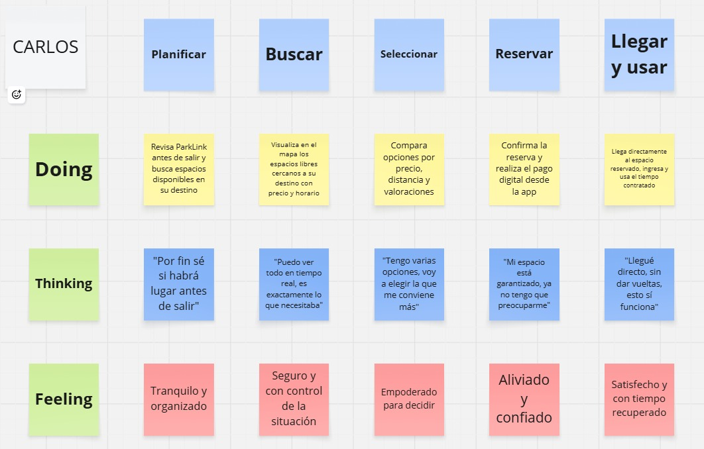
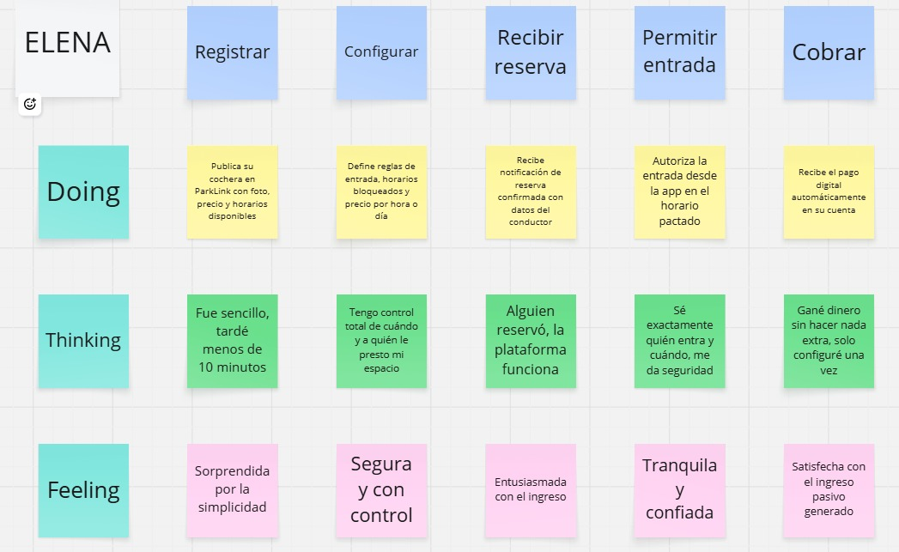

# Capítulo III: Requirements Specification

## 3.1. To-Be Scenario Mapping

El To-Be Scenario Mapping describe cómo cambiaría la experiencia de cada User Persona al contar con ParkLink como solución. El proceso de elaboración siguió las etapas de preparación, lluvia de ideas individual, revisión, identificación de fases y comparación con el As-Is Scenario Mapping para evidenciar las mejoras que la solución introduce. Los mapas fueron elaborados en la herramienta Miro.

### To-Be Scenario Map — Conductor Urbano (Carlos Mendoza)

> Elaborado en Miro. Acceso al artefacto: [Ver en Miro](https://miro.com/app/board/uXjVGiIH610=/?share_link_id=240859047074)

| | **Planificar** | **Buscar** | **Seleccionar** | **Reservar** | **Llegar y usar** |
|---|---|---|---|---|---|
| **Doing** | Revisa ParkLink antes de salir o activa el Agente IA por voz solicitando un espacio en su destino | Visualiza en el mapa los espacios libres o escucha las recomendaciones prioritarias del Agente IA en tiempo real | Compara opciones por precio, distancia y valoraciones con asistencia de sugerencias inteligentes | Confirma la reserva y autoriza el pago desde la app o mediante confirmación por comando de voz | Llega directamente al espacio reservado, ingresa y usa el tiempo contratado con opción de extensión autónoma |
| **Thinking** | "Por fin sé si habrá lugar antes de salir, o le pido a ParkLink Copilot que lo busque mientras conduzco" | "Puedo ver todo en tiempo real y sin quitar las manos del volante, es exactamente lo que necesitaba" | "Tengo varias opciones filtradas automáticamente según mi presupuesto y hora de llegada" | "Mi espacio está garantizado sin distraerme en la pantalla, ya no tengo que preocuparme" | "Llegué directo, sin dar vueltas; el sistema incluso se adapta si encuentro tráfico" |
| **Feeling** | Tranquilo y organizado | Seguro y con control total de la situación | Empoderado para decidir | Aliviado y confiado | Satisfecho y con tiempo recuperado |

---

### To-Be Scenario Map — Propietario de Espacio (Elena Torres)

> Elaborado en Miro. Acceso al artefacto: [Ver en Miro](https://miro.com/app/board/uXjVGiIFZLU=/?share_link_id=511863885761)

| | **Registrar** | **Configurar** | **Recibir reserva** | **Gestionar acceso** | **Cobrar** |
|---|---|---|---|---|---|
| **Doing** | Publica su cochera en ParkLink con foto, precio y horarios disponibles | Define reglas de acceso, horarios bloqueados y precio por hora o día | Recibe notificación de reserva confirmada con datos del conductor | Autoriza el acceso desde la app en el horario pactado | Recibe el pago automáticamente en su cuenta sin manipular efectivo |
| **Thinking** | "Fue sencillo, tardé menos de 10 minutos" | "Tengo control total de cuándo y a quién le presto mi espacio" | "Alguien reservó, la plataforma funciona" | "Sé exactamente quién entra y cuándo, me da seguridad" | "Gané dinero sin hacer nada extra, solo configuré una vez" |
| **Feeling** | Sorprendida por la simplicidad | Segura y con control | Entusiasmada con el ingreso | Tranquila y confiada | Satisfecha con el ingreso pasivo generado |

---

## 3.2. User Stories

A continuación se presentan las Épicas, User Stories y Technical Stories identificadas para ParkLink. Cada User Story incluye su descripción siguiendo el patrón "Como [rol], deseo [característica], para [beneficio]" y sus criterios de aceptación en formato Given-When-Then. Las Technical Stories recuperan los requisitos técnicos que sostienen la arquitectura distribuida de microservicios, la resiliencia transaccional, el pipeline de inteligencia artificial y las decisiones arquitectónicas estratégicas del Capítulo IV.

### Épicas

| Epic ID | Título | Descripción |
|---|---|---|
| EP01 | Búsqueda y descubrimiento de estacionamientos | Funcionalidades que permiten al conductor encontrar espacios disponibles en tiempo real según su ubicación y filtros. |
| EP02 | Reserva y gestión de reservas | Funcionalidades que permiten al conductor reservar un espacio, gestionarlo y cancelarlo si es necesario. |
| EP03 | Publicación y gestión de espacios | Funcionalidades que permiten al propietario registrar, configurar y administrar sus espacios de estacionamiento. |
| EP04 | Pagos y facturación | Funcionalidades relacionadas con el procesamiento de pagos, reembolsos y comprobantes. |
| EP05 | Gestión de cuenta y autenticación | Funcionalidades de registro, inicio de sesión y administración del perfil de usuario. |
| EP06 | Notificaciones y comunicación | Funcionalidades de alertas y mensajes para conductores y propietarios sobre el estado de sus reservas y espacios. |
| EP07 | Asistencia Inteligente y Agente de Reserva Autónomo | Funcionalidades basadas en agentes autónomos e inteligencia artificial conversacional que permiten a los conductores delegar la búsqueda, recomendación y reserva de espacios por voz o lenguaje natural sin distracciones al volante. |

---

### User Stories

| Epic ID | User Story ID | Título | Descripción | Criterios de Aceptación | Relacionado con (Epic ID) |
|---|---|---|---|---|---|
| EP01 | US01 | Buscar estacionamientos por ubicación | Como conductor, deseo buscar estacionamientos disponibles cerca de mi destino, para planificar mi llegada sin perder tiempo buscando en la calle. | **Given** que el conductor ha ingresado un destino en la app, **When** ejecuta la búsqueda, **Then** el sistema muestra en el mapa todos los espacios disponibles en un radio de 1 km con precio, horario y distancia. | EP01 |
| EP01 | US02 | Ver disponibilidad en tiempo real | Como conductor, deseo ver en tiempo real si un espacio está disponible, para no llegar a un lugar ya ocupado. | **Given** que el conductor visualiza un espacio en el mapa, **When** selecciona el espacio, **Then** el sistema muestra su disponibilidad actualizada al momento con estados: disponible, reservado u ocupado. | EP01 |
| EP01 | US03 | Filtrar estacionamientos por precio y horario | Como conductor, deseo filtrar los estacionamientos disponibles por rango de precio y horario, para encontrar la opción que mejor se ajusta a mis necesidades. | **Given** que el conductor ha realizado una búsqueda, **When** aplica filtros de precio (mínimo/máximo) y horario, **Then** el mapa actualiza los resultados mostrando solo los espacios que cumplen los criterios seleccionados. | EP01 |
| EP01 | US04 | Ver detalle de un espacio de estacionamiento | Como conductor, deseo ver el detalle completo de un espacio antes de reservarlo, para tomar una decisión informada. | **Given** que el conductor selecciona un espacio en el mapa, **When** accede al detalle, **Then** el sistema muestra foto, dirección exacta, precio por hora, horario disponible, valoración promedio y reseñas de otros usuarios. | EP01 |
| EP02 | US05 | Reservar un espacio de estacionamiento | Como conductor, deseo reservar un espacio de estacionamiento con anticipación, para asegurar mi lugar antes de llegar al destino. | **Given** que el conductor ha seleccionado un espacio disponible, **When** elige la fecha, hora de inicio y duración y confirma la reserva, **Then** el sistema bloquea el espacio, genera un código de confirmación y notifica al propietario. | EP02 |
| EP02 | US06 | Cancelar una reserva | Como conductor, deseo poder cancelar una reserva realizada, para liberar el espacio si ya no lo necesito. | **Given** que el conductor tiene una reserva activa, **When** selecciona cancelar con al menos 1 hora de anticipación, **Then** el sistema cancela la reserva, libera el espacio y procesa el reembolso correspondiente según la política de cancelación. | EP02 |
| EP02 | US07 | Ver historial de reservas | Como conductor, deseo ver el historial de mis reservas anteriores, para llevar control de mis gastos de estacionamiento. | **Given** que el conductor accede a su perfil, **When** navega a "Mis reservas", **Then** el sistema muestra un listado con todas las reservas pasadas incluyendo fecha, espacio, duración, costo y estado (completada, cancelada). | EP02 |
| EP02 | US08 | Extender tiempo de reserva activa | Como conductor, deseo poder extender el tiempo de mi reserva activa, para evitar cargos por sobrepasar el tiempo sin haberlo planificado. | **Given** que el conductor tiene una reserva en curso, **When** solicita extender el tiempo antes de que expire, **Then** el sistema valida disponibilidad del espacio, agrega el tiempo adicional y cobra la diferencia automáticamente si el espacio sigue libre. | EP02 |
| EP03 | US09 | Registrar un espacio de estacionamiento | Como propietario, deseo registrar mi espacio de estacionamiento en la plataforma, para empezar a recibir reservas y generar ingresos. | **Given** que el propietario accede a "Publicar espacio", **When** completa los datos (dirección, foto, precio por hora, horario disponible) y confirma, **Then** el sistema publica el espacio en el mapa y lo hace visible para búsquedas de conductores. | EP03 |
| EP03 | US10 | Configurar horarios y precio del espacio | Como propietario, deseo configurar los horarios disponibles y el precio de mi cochera, para tener control total sobre cuándo y a qué precio se alquila. | **Given** que el propietario accede a la configuración de su espacio, **When** modifica los horarios y precio, **Then** el sistema actualiza la información en tiempo real y aplica los nuevos parámetros a partir de la siguiente reserva disponible. | EP03 |
| EP03 | US11 | Habilitar y deshabilitar un espacio | Como propietario, deseo poder habilitar o deshabilitar mi espacio temporalmente, para no recibir reservas cuando no esté disponible sin eliminarlo de la plataforma. | **Given** que el propietario accede a la gestión de su espacio, **When** cambia el estado a "No disponible", **Then** el sistema oculta el espacio del mapa de búsqueda y cancela automáticamente las reservas futuras notificando a los conductores afectados. | EP03 |
| EP03 | US12 | Ver reservas activas de mi espacio | Como propietario, deseo ver las reservas activas de mis espacios, para saber quién usará mi cochera y en qué momento. | **Given** que el propietario accede a su panel de gestión, **When** navega a "Mis reservas", **Then** el sistema muestra un calendario con todas las reservas confirmadas, incluyendo datos del conductor, horario y monto a cobrar. | EP03 |
| EP03 | US13 | Ver historial de ingresos | Como propietario, deseo ver el historial de ingresos generados por mis espacios, para hacer seguimiento de mis ganancias. | **Given** que el propietario accede a su panel financiero, **When** selecciona un rango de fechas, **Then** el sistema muestra el total de ingresos, número de reservas completadas y detalle por espacio en el período seleccionado. | EP03 |
| EP04 | US14 | Pagar una reserva en línea | Como conductor, deseo pagar mi reserva directamente en la app con tarjeta o billetera digital, para no manejar efectivo y tener comprobante inmediato. | **Given** que el conductor confirma una reserva, **When** selecciona su método de pago y confirma el cobro, **Then** el sistema procesa el pago de forma segura, genera un comprobante digital y activa la reserva. | EP04 |
| EP04 | US15 | Recibir reembolso por cancelación | Como conductor, deseo recibir un reembolso automático si cancelo con anticipación suficiente, para no perder dinero por cambios de planes. | **Given** que el conductor cancela una reserva dentro del plazo de política de cancelación, **When** confirma la cancelación, **Then** el sistema procesa el reembolso al método de pago original en un plazo máximo de 3 días hábiles. | EP04 |
| EP04 | US16 | Ver comprobante de pago | Como conductor, deseo poder ver y descargar el comprobante de cada pago realizado, para tener respaldo de mis transacciones. | **Given** que el conductor accede a una reserva completada o confirmada, **When** selecciona "Ver comprobante", **Then** el sistema muestra el detalle del pago (monto, fecha, espacio, duración) con opción de descarga en PDF. | EP04 |
| EP05 | US17 | Registrarse como conductor | Como usuario nuevo, deseo registrarme como conductor en ParkLink, para acceder a la búsqueda y reserva de estacionamientos. | **Given** que un usuario accede a la pantalla de registro, **When** completa sus datos (nombre, correo, contraseña, número de placa) y confirma, **Then** el sistema crea su cuenta, envía un correo de verificación y le permite iniciar sesión. | EP05 |
| EP05 | US18 | Registrarse como propietario | Como usuario nuevo, deseo registrarme como propietario en ParkLink, para publicar mis espacios y recibir reservas. | **Given** que un usuario accede al registro y selecciona el rol "Propietario", **When** completa sus datos personales y bancarios para recibir pagos y confirma, **Then** el sistema crea su cuenta con perfil de propietario y le habilita el panel de gestión de espacios. | EP05 |
| EP05 | US19 | Iniciar sesión | Como usuario registrado, deseo iniciar sesión con mi correo y contraseña, para acceder a mi cuenta y funcionalidades de la app. | **Given** que el usuario ingresa su correo y contraseña correctos, **When** presiona "Iniciar sesión", **Then** el sistema autentica al usuario y lo redirige a su pantalla principal según su rol (conductor o propietario). | EP05 |
| EP06 | US20 | Recibir notificación de reserva confirmada | Como conductor, deseo recibir una notificación cuando mi reserva sea confirmada, para tener certeza de que el espacio está asegurado. | **Given** que el sistema procesa una reserva exitosa, **When** el pago es aprobado, **Then** el conductor recibe una notificación push y correo electrónico con los datos de la reserva (dirección, hora, código de acceso). | EP06 |
| EP07 | US21 | Búsqueda y reserva conversacional asistida por Agente IA | Como conductor en ruta, deseo interactuar con un agente inteligente por comandos de voz o lenguaje natural, para encontrar y asegurar un estacionamiento sin manipular la pantalla mientras conduzco. | **Given** que el conductor activa el asistente por voz o chat, **When** indica su destino y restricciones de costo u horario, **Then** el agente consulta disponibilidad en tiempo real, presenta verbalmente la mejor opción y ejecuta la reserva con confirmación del usuario. | EP01, EP02, EP04, EP07 |
| EP07 | US22 | Sugerencia predictiva y reserva proactiva por calendario y hábitos | Como conductor frecuente, deseo que el agente anticipe mis necesidades de parqueo según mis eventos agendados o rutas habituales, para reservar un espacio antes de que se agoten en horas punta. | **Given** que el conductor tiene un evento sincronizado o un patrón diario de llegada, **When** se aproxima la hora punta de ocupación en la zona, **Then** el agente notifica proactivamente la escasez de lugares y solicita autorización para asegurar un espacio recomendado. | EP01, EP02, EP06, EP07 |
| EP07 | US23 | Reasignación autónoma ante contingencias o retrasos de tráfico | Como conductor con reserva activa, deseo que el agente monitoree el tráfico y el estado de mi espacio reservado, para que reasigne o extienda automáticamente la reserva si sufro un retraso imprevisto. | **Given** que el conductor tiene una reserva activa y enfrenta congestión severa en ruta, **When** el tiempo estimado de llegada supera el inicio de la reserva, **Then** el agente detecta el desfase y solicita confirmación verbal para extender el lapso o reasignar una cochera alternativa sin penalización. | EP02, EP04, EP06, EP07 |

---

### 3.2.1. Technical Stories

Las Technical Stories documentan necesidades técnicas del producto que no representan una interacción visible del usuario, pero que son necesarias para cumplir las User Stories, los atributos de calidad, la evolución hacia una arquitectura de microservicios distribuidos y las decisiones arquitectónicas estratégicas del Capítulo IV.

| Technical Story ID | Título | Descripción | Criterios de Aceptación | Relacionado con |
|---|---|---|---|---|
| TS01 | Control transaccional de reservas concurrentes | Como equipo técnico, necesitamos asegurar que dos conductores no puedan reservar el mismo espacio en el mismo intervalo, para proteger la confianza operativa del sistema. | **Given** que dos conductores intentan reservar el mismo espacio y horario, **When** el sistema procesa ambas solicitudes, **Then** sólo una reserva queda confirmada y la otra recibe una respuesta de no disponibilidad sin generar doble reserva. | EP02, US05, US08, C-03 |
| TS02 | Proyección de disponibilidad para búsqueda rápida | Como equipo técnico, necesitamos mantener una proyección de disponibilidad consultable rápidamente, para que la búsqueda y el mapa respondan sin depender de cálculos pesados en cada consulta. | **Given** que cambia el estado de un espacio por reserva, cancelación o configuración del propietario, **When** se actualiza la disponibilidad, **Then** la proyección de búsqueda refleja el nuevo estado y la base de datos relacional se mantiene como fuente de verdad. | EP01, US01, US02, US03, US04, RNF02 |
| TS03 | Autenticación y autorización por roles | Como equipo técnico, necesitamos proteger las operaciones mediante autenticación segura y autorización por rol, para separar permisos entre conductores, propietarios y operaciones administrativas. | **Given** que un usuario autenticado intenta acceder a una operación protegida, **When** el sistema valida su token y rol, **Then** permite la acción sólo si el rol tiene permiso y rechaza accesos no autorizados. | EP05, US17, US18, US19, QAS-04 |
| TS04 | Auditoría de reservas, pagos, reembolsos y cambios de disponibilidad | Como equipo técnico, necesitamos registrar eventos auditables de operaciones críticas, para mantener trazabilidad de cambios relevantes y sustentar reclamos o revisiones posteriores. | **Given** que ocurre una reserva, cancelación, pago, reembolso o cambio de disponibilidad, **When** la operación se confirma, **Then** el sistema guarda un evento de auditoría inmutable con actor, acción, entidad afectada y fecha. | EP02, EP04, US05, US06, US14, US15, US16 |
| TS05 | Almacenamiento de fotos en Object Storage compatible con S3 | Como equipo técnico, necesitamos almacenar fotos de estacionamientos en un servicio de objetos privado, para evitar cargar binarios en la base de datos y controlar el acceso a evidencias visuales. | **Given** que un propietario sube fotos de su espacio, **When** el sistema genera la carga, **Then** las imágenes se almacenan en un bucket privado y se accede a ellas mediante URLs firmadas o endpoints autorizados. | EP03, US04, US09, RNF03 |
| TS06 | Manejo idempotente de pagos y webhooks | Como equipo técnico, necesitamos procesar pagos y webhooks de forma idempotente, para evitar cobros duplicados o cambios de estado repetidos ante reintentos de red o eventos duplicados del proveedor. | **Given** que una solicitud de pago o webhook llega más de una vez con la misma clave o identificador de evento, **When** el sistema procesa la repetición, **Then** reconoce que ya fue atendida y no duplica el cobro ni el cambio de estado. | EP04, US14, US15, US16, C-INT |
| TS07 | Desacoplamiento de Bounded Contexts a Microservicios Distribuidos | Como equipo de arquitectura, necesitamos separar los dominios de negocio (Identity, Catalog/Search, Reservation/Booking, Payments, AI Copilot) en microservicios independientes, para habilitar despliegues autónomos y aislamiento de dependencias tecnológicas. | **Given** que se implementan los Bounded Contexts del sistema, **When** se ejecutan en contenedores independientes tras un API Gateway, **Then** cada microservicio posee su propia persistencia (Database-per-service) y se comunica mediante contratos REST/gRPC bien definidos. | EP01–EP07, C-01, C-02 |
| TS08 | Escalado elástico independiente para búsqueda geoespacial de alta concurrencia | Como equipo de arquitectura, necesitamos que el microservicio de búsqueda geoespacial e inventario escale horizontalmente de forma autónoma durante horas punta, para atender ráfagas de lectura sin sobrecargar ni afectar el servicio de pagos. | **Given** un incremento abrupto de consultas de conductores en hora punta (+500 req/s en búsqueda), **When** se supera el umbral de CPU/memoria del servicio de catálogo, **Then** el cluster orquesta réplicas adicionales manteniendo la latencia < 300 ms sin reiniciar servicios transaccionales. | EP01, US01, US02, RNF01, RNF02 |
| TS09 | Coreografía de reservas y pagos asíncronos mediante Event Broker | Como equipo de arquitectura, necesitamos desacoplar la confirmación de reservas del procesamiento de cobros mediante mensajería asíncrona (RabbitMQ/Kafka) y el patrón Outbox/Saga, para garantizar consistencia eventual y tolerancia a fallos. | **Given** que un conductor solicita una reserva, **When** el servicio de Booking emite el evento `ReservationInitiated`, **Then** el servicio de Payments consume el evento, procesa el cobro y emite `PaymentCompleted`, completando la reserva sin bloqueos síncronos entre servicios. | EP02, EP04, US05, US14, TS01, TS06 |
| TS10 | Pipeline de integración de LLM con Function Calling para el Agente IA | Como equipo de arquitectura, necesitamos que el microservicio del Agente IA interactúe con un modelo de lenguaje con capacidades de Tool Use / Function Calling, para ejecutar búsquedas y reservas de manera confiable con validación estricta de esquemas JSON. | **Given** que el usuario emite una orden en lenguaje natural o voz, **When** el Agente IA interpreta la intención, **Then** genera llamadas a funciones estructuradas hacia los endpoints de búsqueda y reserva, valida parámetros y responde al usuario en menos de 1.5 segundos. | EP07, US21, US23, TS07 |

---

## 3.3. Impact Mapping

El Impact Map se elaboró identificando los Business Goals SMART del producto, los actores clave (User Personas), los impactos esperados en su comportamiento y los entregables que ParkLink debe proveer para generarlos. Los User Stories y Technical Stories se vinculan a los entregables correspondientes para asegurar trazabilidad bidireccional.

> Elaborado en Miro. Acceso al artefacto: [Ver en Miro](https://miro.com/app/board/uXjVGiIFZLU=/?share_link_id=410165343938)

### Business Goal 1
**"Alcanzar 500 conductores activos con al menos una reserva completada en Lima Metropolitana en los primeros 6 meses de operación."**

| Actor | Impact | Deliverable | User Stories |
|---|---|---|---|
| Carlos Mendoza (Conductor) | Usar ParkLink para todas sus búsquedas de estacionamiento en lugar de buscar manualmente | Sistema de búsqueda de espacios por ubicación en tiempo real | US01, US02, US03, US04 |
| Carlos Mendoza (Conductor) | Completar su primera reserva en la plataforma con pago exitoso | Sistema de reservas con confirmación y pago integrado | US05, US14 |
| Carlos Mendoza (Conductor) | Recomendar la app a compañeros de trabajo con el mismo problema | Sistema de notificaciones y comprobantes que generan confianza | US16, US20 |
| Carlos Mendoza (Conductor) | Encontrar y asegurar estacionamiento mientras conduce sin desviar la vista del camino | Agente de IA Conversacional (ParkLink Copilot) para búsqueda y reserva autónoma por voz | US21, US22, US23 |

### Business Goal 2
**"Lograr que 100 propietarios publiquen al menos un espacio activo en la plataforma durante los primeros 3 meses de lanzamiento."**

| Actor | Impact | Deliverable | User Stories |
|---|---|---|---|
| Elena Torres (Propietaria) | Publicar su cochera en menos de 10 minutos sin necesidad de soporte técnico | Flujo de registro de espacio simple con foto, precio y horario | US09, US10 |
| Elena Torres (Propietaria) | Gestionar sus reservas y acceso desde el panel de propietario | Panel de gestión con reservas activas y control de disponibilidad | US11, US12 |
| Elena Torres (Propietaria) | Recibir pagos automáticos y ver su historial de ingresos | Sistema de cobro automático e historial financiero | US13, US15 |

### Business Goal 3 / Atributo de Calidad Arquitectónico
**"Garantizar un 99.9% de disponibilidad del servicio y tiempos de respuesta < 300 ms en búsquedas durante horas punta en Lima Metropolitana."**

| Actor | Impact | Deliverable | Technical Stories |
|---|---|---|---|
| Conductor y Operador del Sistema | Realizar búsquedas masivas simultáneas en horas punta sin experimentar caídas ni degradar la pasarela de pagos | Arquitectura de microservicios distribuidos con escalado elástico independiente y mensajería orientada a eventos | TS01, TS07, TS08, TS09, TS10 |

---

## 3.4. Product Backlog

El Product Backlog se prioriza según el valor que cada User Story y Technical Enabler aporta al negocio y a los usuarios, situando primero las funcionalidades que entregan la propuesta de valor central de ParkLink y los habilitadores arquitectónicos que soportan la escala y la diferenciación con inteligencia artificial. La estimación utiliza la escala Fibonacci (1, 2, 3, 5, 8).

> Elaborado en Trello. Acceso al Product Backlog: [Ver en Trello](https://trello.com/invite/b/69df03bb02e6ebfeb10cb05b/ATTI20390e86970646ac1ef1ccb1898c24b573D43151/product-backlog)

| # Orden | ID | Título | Tipo | Descripción | Story Points |
|---|---|---|---|---|---|
| 1 | US01 | Buscar estacionamientos por ubicación | User Story | Como conductor, deseo buscar estacionamientos disponibles cerca de mi destino, para planificar mi llegada sin perder tiempo buscando en la calle. | 8 |
| 2 | US02 | Ver disponibilidad en tiempo real | User Story | Como conductor, deseo ver en tiempo real si un espacio está disponible, para no llegar a un lugar ya ocupado. | 8 |
| 3 | US09 | Registrar un espacio de estacionamiento | User Story | Como propietario, deseo registrar mi espacio de estacionamiento en la plataforma, para empezar a recibir reservas y generar ingresos. | 5 |
| 4 | US05 | Reservar un espacio de estacionamiento | User Story | Como conductor, deseo reservar un espacio de estacionamiento con anticipación, para asegurar mi lugar antes de llegar al destino. | 8 |
| 5 | US14 | Pagar una reserva en línea | User Story | Como conductor, deseo pagar mi reserva directamente en la app, para no manejar efectivo y tener comprobante inmediato. | 8 |
| 6 | US21 | Búsqueda y reserva conversacional con Agente IA | User Story | Como conductor en ruta, deseo interactuar con un agente inteligente por voz o texto, para asegurar un espacio sin manipular la pantalla al volante. | 8 |
| 7 | TS07 | Desacoplamiento de Bounded Contexts a Microservicios | Tech Enabler | Como equipo de arquitectura, necesitamos separar los dominios en microservicios independientes con DB propia para permitir escalabilidad desacoplada. | 8 |
| 8 | US10 | Configurar horarios y precio del espacio | User Story | Como propietario, deseo configurar los horarios y precio de mi cochera, para tener control total sobre cuándo y a qué precio se alquila. | 5 |
| 9 | TS08 | Escalado elástico para búsqueda geoespacial | Tech Enabler | Como equipo de arquitectura, necesitamos que el microservicio de búsqueda escale de forma autónoma ante ráfagas en horas punta sin degradar pagos. | 5 |
| 10 | US22 | Sugerencia predictiva y reserva proactiva | User Story | Como conductor frecuente, deseo que el agente anticipe mis necesidades de parqueo según mis eventos o rutas habituales en horas punta. | 5 |
| 11 | TS09 | Coreografía asíncrona mediante Event Broker | Tech Enabler | Como equipo de arquitectura, necesitamos desacoplar reservas y pagos mediante eventos y patrón Saga para garantizar resiliencia y consistencia. | 5 |
| 12 | US23 | Reasignación autónoma ante contingencias | User Story | Como conductor con reserva activa, deseo que el agente monitoree el tráfico y reasigne o extienda la reserva si sufro retrasos imprevistos. | 5 |
| 13 | TS10 | Pipeline LLM con Function Calling para Agente IA | Tech Enabler | Como equipo de arquitectura, necesitamos conectar el agente IA a un LLM estructurado con Tool Use para ejecutar acciones seguras en las APIs. | 5 |
| 14 | US03 | Filtrar estacionamientos por precio y horario | User Story | Como conductor, deseo filtrar los estacionamientos por precio y horario, para encontrar la opción que mejor se ajusta a mis necesidades. | 3 |
| 15 | US04 | Ver detalle de un espacio de estacionamiento | User Story | Como conductor, deseo ver el detalle completo de un espacio antes de reservarlo, para tomar una decisión informada. | 3 |
| 16 | US12 | Ver reservas activas de mi espacio | User Story | Como propietario, deseo ver las reservas activas de mis espacios, para saber quién usará mi cochera y cuándo. | 5 |
| 17 | US20 | Recibir notificación de reserva confirmada | User Story | Como conductor, deseo recibir una notificación cuando mi reserva sea confirmada, para tener certeza de que el espacio está asegurado. | 3 |
| 18 | US11 | Habilitar y deshabilitar un espacio | User Story | Como propietario, deseo habilitar o deshabilitar mi espacio temporalmente, para no recibir reservas cuando no esté disponible. | 3 |
| 19 | US06 | Cancelar una reserva | User Story | Como conductor, deseo cancelar una reserva realizada, para liberar el espacio si ya no lo necesito. | 5 |
| 20 | US15 | Recibir reembolso por cancelación | User Story | Como conductor, deseo recibir un reembolso automático si cancelo con anticipación, para no perder dinero por cambios de planes. | 5 |
| 21 | US08 | Extender tiempo de reserva activa | User Story | Como conductor, deseo extender el tiempo de mi reserva activa, para evitar cargos por sobrepasar el tiempo contratado. | 5 |
| 22 | US13 | Ver historial de ingresos | User Story | Como propietario, deseo ver el historial de ingresos de mis espacios, para hacer seguimiento de mis ganancias. | 3 |
| 23 | US16 | Ver comprobante de pago | User Story | Como conductor, deseo ver y descargar el comprobante de cada pago, para tener respaldo de mis transacciones. | 2 |
| 24 | US07 | Ver historial de reservas | User Story | Como conductor, deseo ver el historial de mis reservas anteriores, para llevar control de mis gastos. | 2 |
| 25 | US17 | Registrarse como conductor | User Story | Como usuario nuevo, deseo registrarme como conductor, para acceder a la búsqueda y reserva de estacionamientos. | 3 |
| 26 | US18 | Registrarse como propietario | User Story | Como usuario nuevo, deseo registrarme como propietario, para publicar mis espacios y recibir reservas. | 3 |
| 27 | US19 | Iniciar sesión | User Story | Como usuario registrado, deseo iniciar sesión, para acceder a mi cuenta y funcionalidades de la app. | 2 |