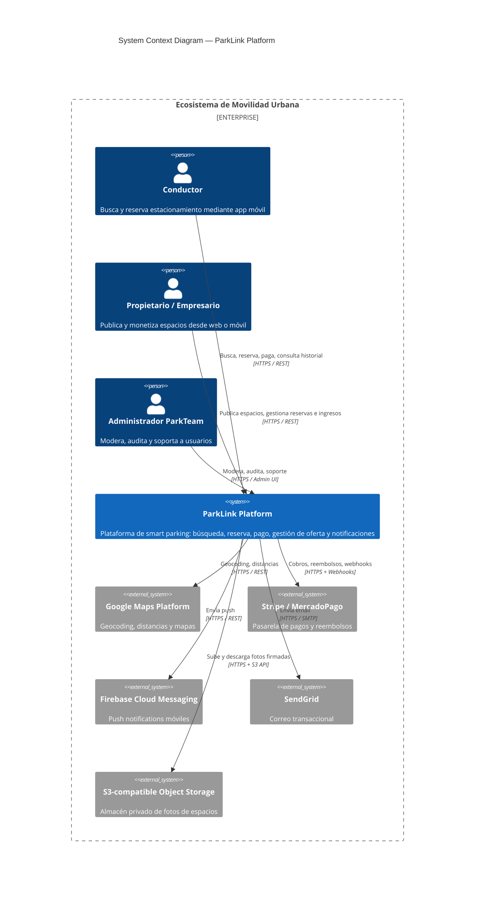
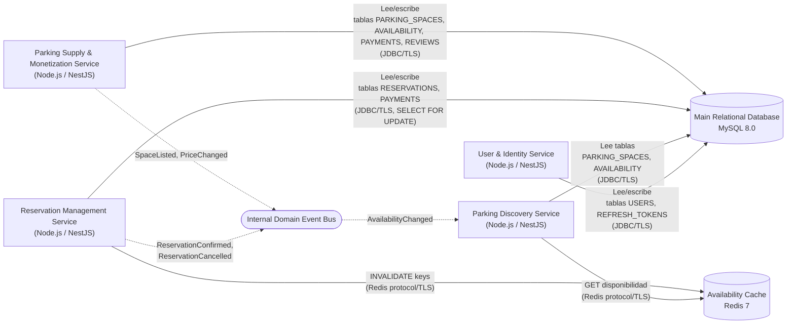
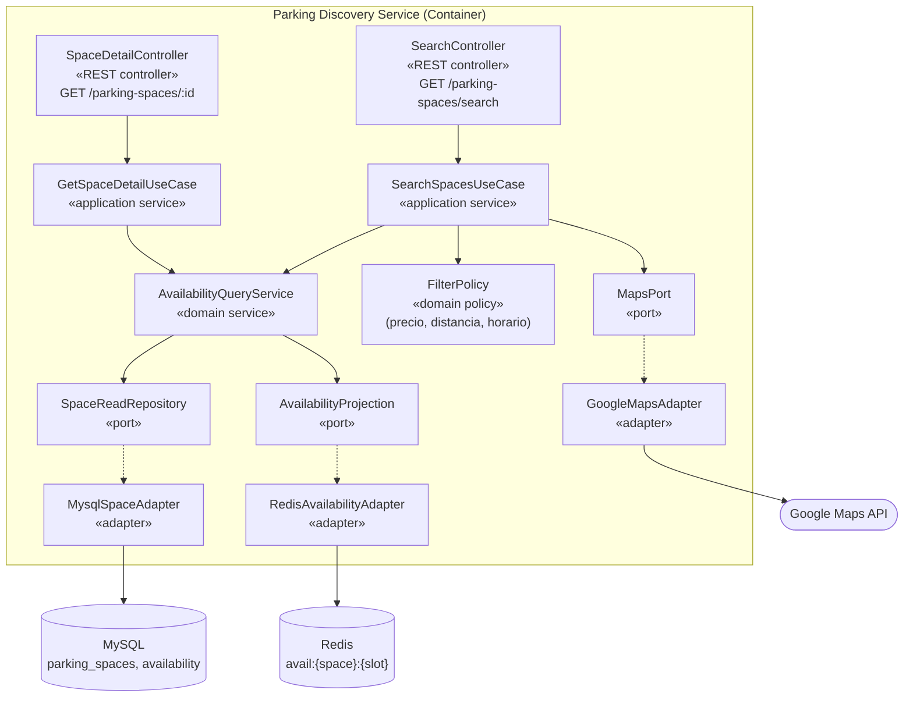
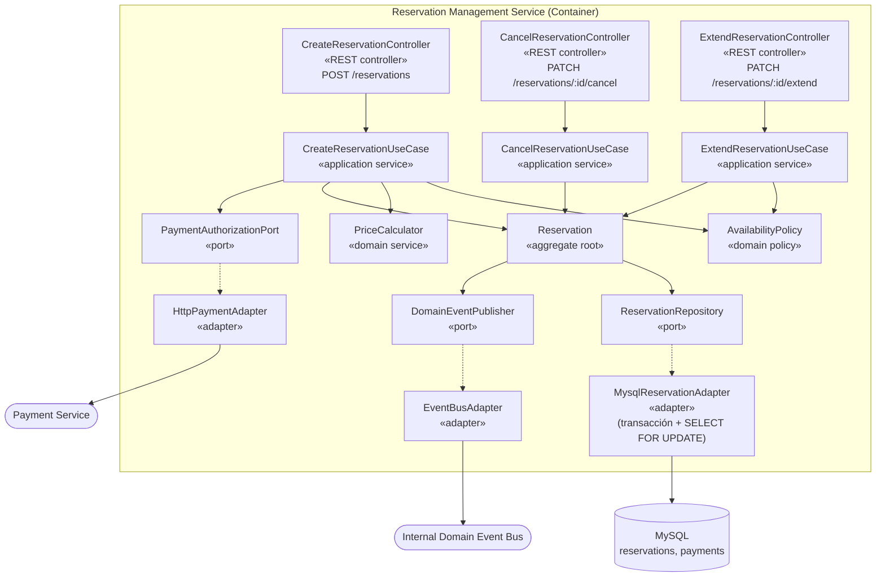
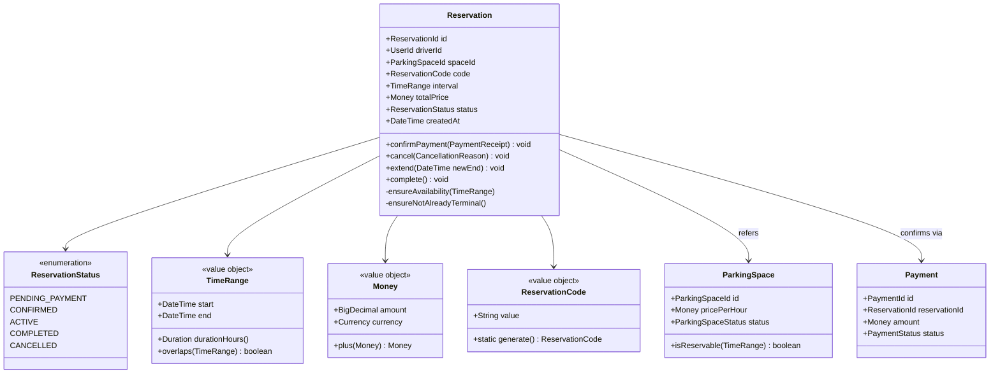
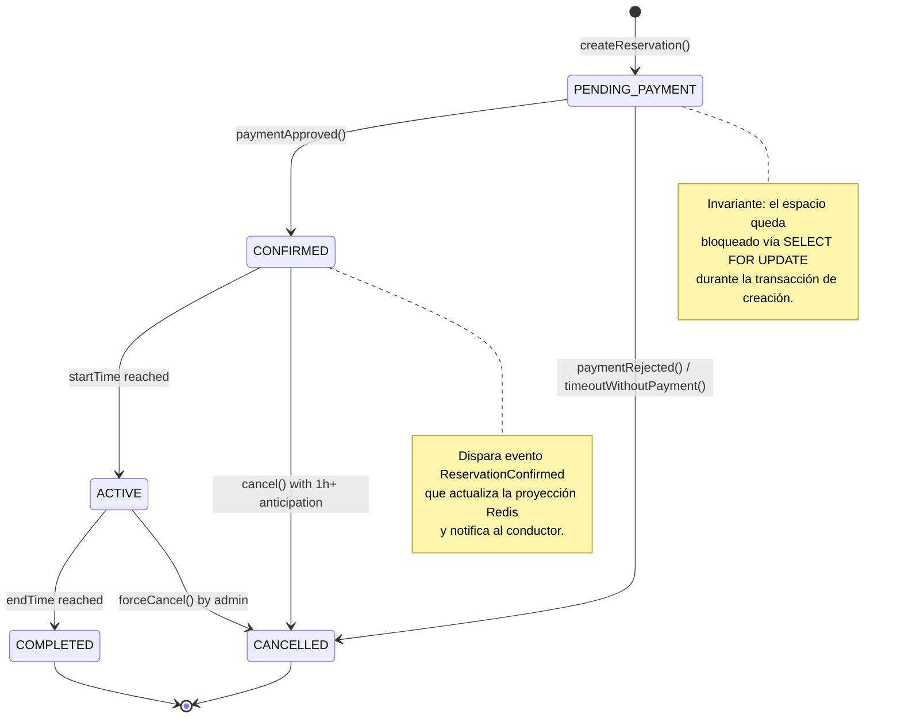
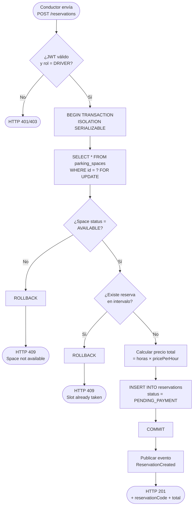
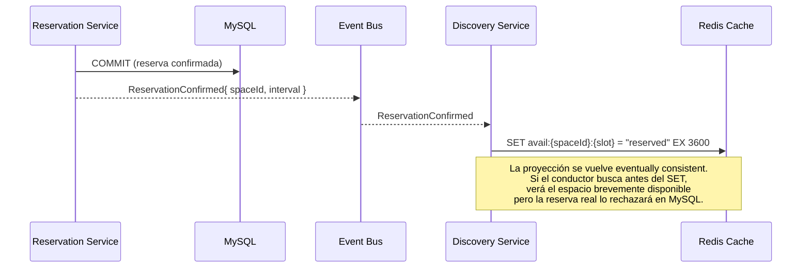
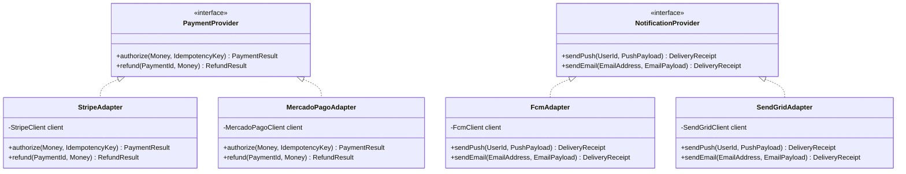
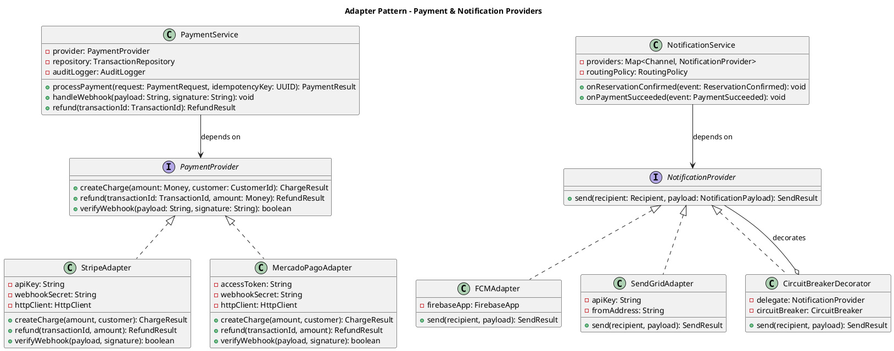

# ParkLink-Report

# Capítulo IV: Product Architecture Design

## 4.1. Strategic-Level Domain-Driven Design

### 4.1.1. Principles Statements

A continuación se presentan los principios arquitectónicos que guían el diseño de ParkLink. Estos principios reflejan las decisiones estratégicas del equipo para garantizar una solución confiable, escalable y centrada en el usuario.

| # | Principio | Descripción | Justificación |
|-----|-----------|-------------|---------------|
| P-01 | Separación de responsabilidades por dominio | El sistema se estructura mediante bounded contexts explícitos: User & Identity, Parking Discovery, Reservation Management y Parking Supply & Monetization. Cada contexto encapsula sus propias reglas de negocio y no comparte lógica con los demás. | ParkLink conecta conductores con propietarios mediante flujos distintos: búsqueda, reserva, publicación y pago. Mezclar estas responsabilidades en un único módulo generaría alto acoplamiento, dificultaría el mantenimiento y aumentaría el riesgo de errores transversales. |
| P-02 | Consistencia fuerte en operaciones críticas | Las operaciones de reserva, pago, cancelación y extensión se ejecutan dentro de transacciones ACID sobre la base de datos relacional. La base de datos es siempre la fuente de verdad para el estado de una reserva o pago. | Una reserva duplicada o un pago procesado dos veces rompen la confianza del usuario y generan pérdidas económicas. La consistencia fuerte en el Core Domain no puede sacrificarse por conveniencia de rendimiento. |
| P-03 | Disponibilidad visible separada de disponibilidad confirmable | La búsqueda de estacionamientos consulta una proyección de disponibilidad en cache (Redis). La confirmación real de disponibilidad sólo ocurre dentro del Reservation Management Service mediante bloqueo transaccional sobre la base de datos. | Mostrar disponibilidad al conductor no equivale a garantizarla. Si el cache fuera la fuente de verdad, dos conductores podrían reservar el mismo espacio simultáneamente. Esta separación previene el error más crítico del dominio. |
| P-04 | Seguridad por diseño | La autenticación con JWT, la autorización por roles y los checks de ownership son obligatorios en todas las operaciones críticas. Ningún recurso sensible es accesible sin validación explícita de identidad y permisos. | ParkLink maneja datos personales, pagos y acceso físico a espacios. La seguridad no puede ser una capa añadida a posteriori; debe estar integrada desde el diseño de cada endpoint y operación. |
| P-05 | Desacoplamiento de proveedores externos | El dominio depende de interfaces (ports), no de SDKs de proveedores concretos. Los adapters encapsulan la comunicación con Stripe, MercadoPago, Google Maps, Firebase Cloud Messaging y SendGrid. | Los proveedores externos cambian, tienen interrupciones o son reemplazados. Si el dominio dependiera directamente de un SDK, cualquier cambio de proveedor implicaría modificar lógica de negocio. El Adapter Pattern aísla ese riesgo. |
| P-06 | Resiliencia ante fallos de terceros | Toda llamada a un proveedor externo está envuelta en un Circuit Breaker con retry y backoff exponencial. El sistema degrada su servicio de forma controlada sin propagar el fallo hacia el usuario. | ParkLink depende de mapas, pagos y notificaciones para operar. Si cualquiera de estos servicios falla y no existe aislamiento, el fallo se propaga y la plataforma deja de funcionar completamente, afectando usuarios que no están relacionados con la operación fallida. |
| P-07 | Trazabilidad de operaciones financieras y críticas | Las reservas, cancelaciones, pagos y reembolsos quedan registrados en una tabla de auditoría append-only. Ningún registro de auditoría puede ser modificado ni eliminado. | La trazabilidad es un requisito regulatorio y de confianza. Los usuarios deben poder consultar el historial de sus transacciones y el equipo debe poder investigar incidentes sin depender de logs efímeros. |
| P-08 | Modularidad orientada al crecimiento | La arquitectura se diseña como backend modular con bounded contexts bien definidos, de modo que cada módulo pueda extraerse como microservicio independiente cuando el volumen de operaciones lo justifique. | ParkLink inicia como MVP con carga moderada. Sobrediseñar microservicios desde el inicio añade complejidad innecesaria. Sin embargo, definir límites claros desde el principio permite escalar sin reescribir la arquitectura. |

---

### 4.1.2. Approaches Statements – Architectural Styles & Patterns

#### Enfoque Metodológico: Domain-Driven Design (DDD)

Se adopta Domain-Driven Design (DDD) como metodología central para estructurar la lógica del negocio. DDD permite modelar el dominio de reserva y gestión de estacionamientos de forma explícita, separando responsabilidades en bounded contexts que reflejan los subdominios identificados en las Épicas del Product Backlog.

**Bounded Contexts identificados:**

| Bounded Context | Descripción | Épicas relacionadas |
|----------------|-------------|---------------------|
| User & Identity Context | Registro, autenticación JWT, gestión de roles y perfiles de conductor y propietario. | EP05 |
| Parking Discovery Context | Búsqueda de espacios, visualización en mapa, filtros, disponibilidad visible y detalle de espacio. | EP01 |
| Reservation Management Context | Ciclo de vida completo de reservas: creación, bloqueo, cancelación, extensión e historial. Core Domain del sistema. | EP02 |
| Parking Supply & Monetization Context | Publicación de espacios, configuración de horarios y precios, pagos, reembolsos, comprobantes e ingresos del propietario. | EP03, EP04 |

---

#### Estilos Arquitectónicos

**1. Arquitectura Modular por Bounded Contexts — Backend API**

El backend sigue una arquitectura modular alineada a DDD estratégico. Cada bounded context se implementa como un módulo independiente con sus propias capas internas, expuesto a través de un API Gateway centralizado:

| Capa | Responsabilidad |
|------|----------------|
| Capa de Presentación (Controllers) | Endpoints REST, validación de entrada, mapeo de DTOs |
| Capa de Aplicación (Services / Use Cases) | Orquestación de casos de uso, transacciones, eventos |
| Capa de Dominio (Domain Layer) | Entidades, aggregates, value objects, domain events |
| Capa de Infraestructura (Infra Layer) | Repositorios, adapters externos, cache, ORM |

**2. Arquitectura Hexagonal (Ports & Adapters)**

Aplicada en la capa de dominio para desacoplar la lógica de negocio de los detalles de implementación. El dominio define interfaces (puertos) que son implementadas por adaptadores de infraestructura como `StripeAdapter`, `MercadoPagoAdapter`, `S3StorageAdapter`, `FCMAdapter` y `MapsAdapter`. Esto garantiza que un cambio de proveedor no afecte las reglas de negocio.

**3. Arquitectura Event-Driven (EDA) — Comunicación entre Contextos**

Los efectos secundarios de operaciones críticas (notificaciones, actualización de disponibilidad visible, sincronización de vistas del propietario) se propagan mediante eventos de dominio internos. El componente productor publica un evento como `ReservationConfirmed` o `SpaceAvailabilityChanged` que es consumido de forma asíncrona por los suscriptores correspondientes. Esto desacopla las operaciones principales de sus consecuencias secundarias.

**4. CQRS Ligero — Separación de Lectura y Escritura**

Se aplica CQRS de forma liviana en el Parking Discovery Context. Las búsquedas y consultas de disponibilidad consultan una proyección de lectura en Redis, mientras que los comandos de reserva, cancelación y extensión operan exclusivamente sobre la base de datos relacional como fuente de verdad. Esta separación optimiza la lectura sin comprometer la consistencia transaccional de los comandos.

---

#### Patrones Arquitectónicos

| Patrón | Contexto de aplicación |
|--------|------------------------|
| Repository Pattern | Abstracción del acceso a MySQL para reservas, espacios, usuarios y pagos. Facilita testing y permite cambiar el motor de base de datos sin afectar el dominio. |
| Adapter Pattern | Encapsula la comunicación con proveedores externos: Stripe, MercadoPago, Google Maps, Firebase Cloud Messaging, SendGrid y S3-compatible storage. El dominio depende de interfaces, no de SDKs concretos. |
| Circuit Breaker | Envuelve todas las llamadas a proveedores externos. Abre el circuito ante fallos repetidos y ejecuta un fallback controlado, evitando la propagación del fallo hacia operaciones internas. |
| CQRS | Separación de comandos (crear, cancelar, extender reserva) y consultas (buscar espacios, ver disponibilidad) para optimizar rendimiento de lectura en búsquedas frecuentes. |
| Event Bus (Pub/Sub) | Publicación y suscripción de eventos de dominio para actualización de disponibilidad visible, notificaciones y sincronización de vistas de propietario, desacoplando contextos. |
| Command Pattern | Encapsula operaciones críticas de reserva como comandos explícitos validables y auditables: `CreateReservationCommand`, `CancelReservationCommand`, `ExtendReservationCommand`. |
| Idempotency Key Pattern | Cada solicitud de cobro incluye una clave de idempotencia (UUID v4) persistida junto a la transacción. Reintentos de red no generan dobles cobros. |
| State Pattern | Controla las transiciones de estado de una reserva: `Requested → PendingPayment → Confirmed → Completed / Cancelled / Extended`. Evita transiciones inválidas. |

---

### 4.1.3. Software Architecture

La arquitectura de software de ParkLink se define a partir de los principales procesos del dominio identificados en las épicas, user stories y technical stories del proyecto. ParkLink conecta a conductores que necesitan encontrar y reservar estacionamientos con propietarios o empresarios que desean publicar, administrar y monetizar sus cocheras. Por ello, la arquitectura se organiza mediante Domain-Driven Design estratégico, separando el sistema en bounded contexts con responsabilidades explícitas y vocabulario propio.

La separación por bounded contexts permite reducir acoplamiento entre capacidades que evolucionan por motivos distintos. La búsqueda de estacionamientos cambia por criterios de experiencia de usuario, mapas, filtros y disponibilidad visible; la reserva cambia por reglas transaccionales de bloqueo, cancelación y extensión; la publicación y monetización cambian por reglas de oferta, precios, pagos, reembolsos y comprobantes; y la identidad cambia por seguridad, autenticación y control de roles. Esta división evita concentrar todo el comportamiento en un único módulo ambiguo y permite que cada parte del sistema sea diseñada, probada y escalada según sus propios drivers arquitectónicos.

ParkLink utiliza el **C4 Model de Simon Brown** como herramienta oficial de representación arquitectónica, aplicando sus cuatro niveles de abstracción de forma estricta: (1) **System Context / Landscape Diagram**, (2) **Container Diagram**, (3) **Component Diagram** y (4) **Code / Class Diagram**. Cada nivel responde una pregunta distinta y se dirige a una audiencia distinta: el System Context responde "¿quién interactúa con ParkLink?", el Container responde "¿qué tecnologías y procesos componen el sistema?", el Component responde "¿qué piezas internas tiene cada contenedor de software?" y el Code responde "¿cómo está modelado el dominio a nivel de clases, estados y reglas?".

Los diagramas se modelan mediante **Structurizr DSL** como Architecture-as-Code, lo que permite versionar el modelo arquitectónico junto al código fuente, generar todas las vistas a partir de una sola fuente de verdad y exportar SVG para incrustar en este informe. Los archivos SVG generados se encuentran en la carpeta `assets/architecture/` del repositorio. Adicionalmente, los diagramas de Component y Code que requieren detalle de flujos internos se complementan con **PlantUML** y **Mermaid** (renderizado nativo en GitHub) para representar diagramas de clases, máquinas de estado, secuencia y actividad, todo coherente con la notación UML 2.5 cuando aplica.

**Leyenda de notación C4 utilizada en todos los diagramas:**

| Símbolo | Significado | Ejemplo en ParkLink |
|---------|-------------|----------------------|
| Persona (caja con cabeza) | Actor humano externo al sistema | Conductor, Propietario |
| Software System (caja azul oscura) | Sistema bajo análisis | ParkLink Platform |
| External System (caja gris) | Sistema externo del que dependemos | Google Maps Platform, Stripe, SendGrid |
| Container (caja azul clara) | Unidad ejecutable o de datos desplegable | Mobile App, Backend API, MySQL, Redis |
| Component (caja blanca dentro de container) | Pieza interna de código | ReservationController, AvailabilityService |
| Code Element | Clase, interfaz, value object | `Reservation`, `ReservationStatus` enum |
| Flecha sólida | Llamada síncrona (HTTPS, JDBC) | Mobile → API Gateway |
| Flecha discontinua | Comunicación asíncrona vía eventos | Reservation → Event Bus |

La comunicación entre contextos combina interacciones síncronas y eventos de dominio. Las consultas de búsqueda, autenticación y obtención de detalles se atienden mediante APIs REST/JSON sobre HTTPS. Las operaciones críticas, como crear una reserva, bloquear un espacio, confirmar un pago, cancelar una reserva o generar un reembolso, se tratan como comandos transaccionales donde el contexto propietario de la regla de negocio mantiene la consistencia. Para efectos secundarios como notificaciones, actualización de disponibilidad visible, emisión de comprobantes o sincronización de vistas de propietario, se utilizan eventos de dominio internos, de modo que la operación principal no dependa directamente de procesos secundarios.

Desde el punto de vista de clasificación estratégica, el Core Domain de ParkLink es el Reservation Management Context. Este contexto captura la propuesta de valor central del producto: asegurar que un conductor pueda reservar un espacio real, bloquearlo durante el intervalo correspondiente, extenderlo si existe disponibilidad, cancelarlo bajo reglas definidas y mantener trazabilidad del ciclo de vida de la reserva. Si este contexto falla, ParkLink pierde confianza operativa aunque la búsqueda, los pagos o la autenticación funcionen correctamente.

| Bounded Context | Clasificación estratégica | Sustento en el informe |
|---|---|---|
| Reservation Management Context | Core Domain | Soporta EP02, US05, US06, US07, US08, TS01 y TS04. Controla el ciclo de vida de reservas, bloqueo de espacios, cancelaciones, extensiones e historial. |
| Parking Discovery Context | Supporting Domain | Soporta EP01, US01, US02, US03, US04, TS02 y RNF02. Habilita búsqueda, mapa, filtros, detalle, disponibilidad visible y recomendación de opciones convenientes. |
| Parking Supply & Monetization Context | Supporting Domain | Soporta EP03, EP04, US09 a US16, TS05 y TS06. Gestiona publicación de espacios, horarios, precios, ingresos, pagos, reembolsos y comprobantes. |
| User & Identity Context | Generic Domain | Soporta EP05, US17, US18, US19 y TS03. Gestiona registro, autenticación JWT, roles y perfiles, capacidades comunes en sistemas digitales. |

La arquitectura también prepara la escalabilidad futura. Inicialmente, los bounded contexts pueden implementarse como módulos dentro de un backend modular expuesto por una API RESTful. Sin embargo, sus límites explícitos permiten evolucionar hacia microservicios independientes cuando el volumen de reservas, búsquedas o pagos lo justifique. Esta decisión evita sobrediseñar el sistema desde el inicio, pero conserva una frontera clara para separar despliegue, base de datos o colas de eventos más adelante.

La seguridad se aborda de forma transversal, pero la responsabilidad primaria recae en el User & Identity Context mediante registro, autenticación con JWT, control de roles y separación de permisos entre conductor y propietario. Las operaciones críticas se protegen con validaciones de autorización, idempotencia en pagos, consistencia ACID en reservas y pagos, y separación entre la base de datos como fuente de verdad y la cache de disponibilidad como mecanismo de consulta rápida. Así, ParkLink evita que una disponibilidad mostrada en el mapa sea tratada como confirmación definitiva hasta que Reservation Management bloquee formalmente el espacio.

#### 4.1.3.1. Software Architecture System Landscape Diagram

El System Landscape Diagram corresponde al **C4 Nivel 1** y muestra a ParkLink como sistema principal dentro del ecosistema de movilidad urbana. Los conductores interactúan con la plataforma para buscar, comparar, reservar, pagar y consultar sus reservas. Los propietarios o empresarios de estacionamientos interactúan con la plataforma para publicar espacios, configurar horarios y precios, gestionar reservas recibidas y consultar ingresos.


Como complemento al SVG generado desde Structurizr, el siguiente diagrama Mermaid `C4Context` declara el mismo modelo en notación textual versionable, evidenciando que se sigue estrictamente la sintaxis del C4 Model:



En el paisaje del sistema, ParkLink se ubica como el sistema que coordina la relación entre demanda y oferta de estacionamientos. La integración con el servicio de mapas y geolocalización sustenta las historias US01, US02, US03 y US04, donde el conductor necesita visualizar espacios cercanos, disponibilidad, precio, horario, distancia y valoración. La pasarela de pagos sustenta US14, US15 y US16, relacionadas con pago en línea, reembolsos y comprobantes. El servicio de notificaciones y correo sustenta EP06 y US20, además de flujos de verificación de cuenta. El object storage compatible con S3 se justifica por US04 y US09, donde los espacios requieren fotografías para ser publicados y evaluados por el conductor antes de reservar.

#### 4.1.3.2. Software Architecture Context Level Diagrams

Los diagramas de contexto muestran cada bounded context como una unidad funcional con propósito definido, actores, entradas, salidas, dependencias internas y sistemas externos relacionados. Esta separación permite defender la arquitectura desde DDD estratégico: cada contexto encapsula reglas propias y evita que conceptos como usuario, disponibilidad, reserva, espacio, pago o ingreso sean mezclados sin control.

##### User & Identity Context


| Aspecto | Descripción |
|---|---|
| Propósito | Gestionar registro, inicio de sesión, autenticación JWT, roles y perfiles de conductor y propietario. |
| Actores | Conductores y propietarios. |
| Contextos relacionados | Parking Discovery, Reservation Management y Parking Supply & Monetization consumen identidad, rol y permisos. |
| Sistemas externos | Servicio de correo/notificaciones para verificación de cuenta y mensajes transaccionales. |
| Entradas principales | Datos de registro, credenciales de inicio de sesión, selección de rol, datos de perfil de conductor o propietario. |
| Salidas principales | JWT, usuario autenticado, perfil autorizado, rol de conductor o propietario, eventos de verificación de cuenta. |
| Responsabilidad dentro del dominio | Proteger el acceso a funcionalidades y evitar que usuarios sin rol válido ejecuten acciones de reserva, publicación o monetización. |

Este contexto se separa porque la identidad es una capacidad transversal y genérica. No debe contener reglas de disponibilidad, reserva, precio o pago; su responsabilidad es autenticar, autorizar y proveer información confiable de usuario a los demás contextos.

##### Parking Discovery Context


| Aspecto | Descripción |
|---|---|
| Propósito | Permitir búsqueda de estacionamientos, visualización en mapa, disponibilidad visible, comparación por precio, distancia, horario y valoración, y recomendación de la opción más conveniente. |
| Actores | Conductores. |
| Contextos relacionados | Consulta espacios publicados en Parking Supply & Monetization y estados de reserva en Reservation Management. |
| Sistemas externos | Servicio de mapas/geolocalización y object storage para imágenes. |
| Entradas principales | Destino, ubicación del conductor, filtros de precio, horario, distancia, selección de espacio. |
| Salidas principales | Listado de espacios, marcadores de mapa, detalle del espacio, disponibilidad visible, recomendación de alternativa conveniente. |
| Responsabilidad dentro del dominio | Convertir la oferta publicada y la disponibilidad de reservas en información útil para que el conductor tome una decisión informada. |

Este contexto se separa porque sus reglas son principalmente de consulta, presentación y comparación. No debe confirmar reservas ni cobrar pagos. Esa separación evita que una búsqueda en mapa modifique accidentalmente el estado real de un espacio.

##### Reservation Management Context


| Aspecto | Descripción |
|---|---|
| Propósito | Controlar el ciclo de vida de la reserva: creación, bloqueo de espacio, cancelación, extensión, historial y estados. |
| Actores | Conductores; propietarios como receptores de reservas recibidas mediante el contexto de supply. |
| Contextos relacionados | User & Identity para validar usuarios, Parking Supply & Monetization para datos de espacio y reglas económicas, Parking Discovery para publicar cambios de disponibilidad. |
| Sistemas externos | Servicio de notificaciones/correo para confirmaciones y cambios de estado. |
| Entradas principales | Espacio seleccionado, fecha, hora de inicio, duración, solicitud de cancelación, solicitud de extensión. |
| Salidas principales | Reserva confirmada, código de confirmación, espacio bloqueado, reserva cancelada, reserva extendida, historial de reservas. |
| Responsabilidad dentro del dominio | Garantizar consistencia operacional y evitar sobre-reservas mediante reglas transaccionales sobre el estado de cada reserva. |

Este contexto se separa porque representa el Core Domain. La reserva tiene reglas de consistencia más estrictas que la búsqueda o la publicación: debe bloquear un espacio, controlar estados y coordinar cambios sin depender de vistas cacheadas. Mezclar esta lógica con búsqueda o pagos aumentaría el riesgo de sobreventa, cancelaciones incorrectas o extensiones inconsistentes.

##### Parking Supply & Monetization Context


| Aspecto | Descripción |
|---|---|
| Propósito | Gestionar publicación de espacios, horarios, precios, habilitación/deshabilitación, reservas recibidas por propietarios, ingresos, pagos, reembolsos y comprobantes. |
| Actores | Propietarios o empresarios de estacionamientos y conductores cuando realizan pagos o consultan comprobantes. |
| Contextos relacionados | User & Identity para roles, Parking Discovery para visibilidad de espacios, Reservation Management para precio, reserva activa, cancelaciones y extensión. |
| Sistemas externos | Pasarela de pagos, object storage compatible con S3 y servicio de notificaciones/correo. |
| Entradas principales | Datos del espacio, fotos, dirección, precio por hora, horario disponible, cambio de estado, solicitud de pago, cancelación con reembolso, consulta de ingresos. |
| Salidas principales | Espacio publicado, espacio oculto, precio vigente, comprobante, reembolso, historial de ingresos, notificación al propietario. |
| Responsabilidad dentro del dominio | Administrar la oferta monetizable de estacionamientos y las reglas económicas asociadas al cobro, reembolso e ingreso del propietario. |

Este contexto se separa porque combina reglas de oferta y monetización que pertenecen al propietario y al flujo financiero. Aunque se comunica con Reservation Management, no debe decidir el ciclo de vida completo de una reserva; su responsabilidad es proveer condiciones comerciales, procesar pagos y registrar ingresos.

#### 4.1.3.3. Software Architecture Container Level Diagrams

El Container Level Diagram muestra cómo los productos digitales y servicios técnicos soportan los bounded contexts. La arquitectura puede implementarse inicialmente como backend modular con módulos alineados a los contextos, manteniendo la posibilidad de extraerlos como microservicios si el crecimiento del producto lo requiere.


| Contenedor | Responsabilidad | Tecnología sugerida | Comunicación | Bounded context soportado |
|---|---|---|---|---|
| Mobile Application | Permitir a conductores buscar, comparar, reservar, pagar, cancelar, extender reservas y consultar historial; también permite a propietarios gestionar funciones principales desde móvil si el flujo lo requiere. | Aplicación móvil multiplataforma permitida por la guía del curso. | Consume API Gateway mediante HTTPS REST/JSON; usa GPS del dispositivo para búsquedas por ubicación. | User & Identity, Parking Discovery, Reservation Management, Parking Supply & Monetization. |
| Web Application | Permitir a propietarios o empresarios administrar espacios, horarios, precios, reservas recibidas e ingresos desde una interfaz más adecuada para gestión. | Aplicación web responsive con HTML, CSS, JavaScript o framework web compatible con el stack del equipo. | Consume API Gateway mediante HTTPS REST/JSON. | User & Identity, Parking Supply & Monetization, Reservation Management. |
| API Gateway / Backend API | Centralizar entrada al backend, validar tokens JWT, enrutar solicitudes a módulos por bounded context y exponer documentación OpenAPI. | RESTful API; Node.js/Express.js o framework REST equivalente permitido por la guía. | Recibe HTTPS desde aplicaciones cliente; enruta a servicios internos. | Transversal a los cuatro bounded contexts. |
| User & Identity Service | Gestionar registro, login, JWT, roles, perfiles de conductor y propietario. | Módulo backend REST con hashing seguro de contraseñas y JWT. | Lee/escribe en base de datos; envía correos de verificación; provee identidad a otros módulos. | User & Identity Context. |
| Parking Discovery Service | Resolver búsquedas, filtros, detalle, disponibilidad visible, mapa y recomendación de estacionamientos. | Módulo backend REST optimizado para consultas e integración con mapas. | Consulta base de datos, cache de disponibilidad, Maps API y object storage. | Parking Discovery Context. |
| Reservation Management Service | Crear reservas, bloquear espacios, cancelar, extender, consultar historial y controlar estados de reserva. | Módulo backend REST con reglas transaccionales y validaciones de concurrencia. | Lee/escribe en base de datos; actualiza cache; emite eventos; solicita notificaciones. | Reservation Management Context. |
| Parking Supply & Monetization Service | Publicar espacios, configurar horarios y precios, habilitar/deshabilitar disponibilidad, gestionar reservas recibidas, ingresos, pagos, reembolsos y comprobantes. | Módulo backend REST con integración a pasarela de pagos y object storage. | Lee/escribe en base de datos; se integra con Payment Gateway, object storage y notificaciones. | Parking Supply & Monetization Context. |
| Main Relational Database | Persistir usuarios, perfiles, espacios, disponibilidad base, reservas, pagos, comprobantes, reseñas y notificaciones. | MySQL, coherente con la justificación relacional del informe. | Accedida únicamente por servicios backend; cada contexto mantiene propiedad lógica de sus datos. | Soporte persistente para los cuatro bounded contexts. |
| Availability Cache | Acelerar consultas de disponibilidad visible y reducir carga sobre la base de datos en búsquedas frecuentes. | Redis. | Actualizada por Reservation Management y Supply; consultada por Parking Discovery. | Parking Discovery y Reservation Management. |
| Internal Domain Event Bus | Desacoplar efectos secundarios como notificaciones, actualización de disponibilidad visible y sincronización de vistas. | Bus de eventos interno o message broker según evolución del despliegue. | Recibe eventos desde servicios de dominio y los entrega a consumidores internos. | Principalmente Reservation Management, Parking Discovery y Parking Supply & Monetization. |
| Object Storage S3-compatible | Almacenar imágenes de espacios de estacionamiento publicadas por propietarios. | Servicio compatible con S3. | Supply sube imágenes; Discovery recupera imágenes para detalle de espacios. | Parking Supply & Monetization y Parking Discovery. |
| Payment Gateway | Procesar pagos en línea, reembolsos y confirmación de transacciones. | Stripe, MercadoPago o proveedor equivalente. | Integración HTTPS desde Parking Supply & Monetization. | Parking Supply & Monetization. |
| Maps & Geolocation API | Proveer mapas, geocodificación, distancias y visualización de marcadores. | Google Maps Platform o proveedor equivalente. | Consultado por Parking Discovery. | Parking Discovery Context. |
| Notification / Email Service | Enviar correos y notificaciones push sobre verificación de cuenta, confirmación de reserva, cancelación, reembolso y reserva recibida. | Firebase Cloud Messaging y servicio SMTP/SendGrid. | Recibe solicitudes o eventos desde Identity, Reservation y Supply. | User & Identity, Reservation Management, Parking Supply & Monetization. |

Esta estructura soporta las user stories principales del backlog. US01 a US04 se resuelven mediante Mobile Application, API Gateway, Parking Discovery Service, Maps API, cache de disponibilidad y object storage. US05 a US08 se resuelven mediante Reservation Management Service, base de datos relacional, cache y eventos de notificación. US09 a US13 se resuelven mediante Parking Supply & Monetization Service, Web/Mobile Application, object storage y base de datos. US14 a US16 se resuelven mediante la integración entre Parking Supply & Monetization Service y Payment Gateway. US17 a US19 se resuelven mediante User & Identity Service con JWT y roles. US20 se resuelve mediante eventos de reserva confirmada y el servicio de notificaciones/correo.

La base de datos relacional se mantiene como fuente de verdad para reservas y pagos porque estas operaciones requieren consistencia fuerte. La cache no reemplaza esa fuente de verdad; solo acelera la lectura de disponibilidad para el conductor. Esta decisión es clave: una disponibilidad mostrada en el mapa no equivale a una reserva confirmada hasta que el Reservation Management Context haya bloqueado el espacio y registrado el estado correspondiente.

**Conectividad explícita a la base de datos relacional (lectura clave del Container Diagram).** Conforme a la notación C4, la base de datos `Main Relational Database (MySQL)` no es un bounded context ni un servicio: es un **contenedor de datos** consultado y modificado **únicamente** por los servicios backend mediante JDBC/TCP cifrado. Cada microservicio mantiene la propiedad lógica de sus tablas pero comparte el motor por simplicidad operativa en la primera versión. El siguiente diagrama Mermaid complementa el SVG anterior para hacer explícita la conectividad servicio→base de datos exigida por el C4 Container Level:



El diagrama anterior es C4 Nivel 2 (Container) en su variante "data flow". Cumple con la regla del C4 Container Diagram según la cual la base de datos se representa como un contenedor de tipo `Database` (notación cilíndrica) y todas las conexiones de servicios→base de datos quedan explícitas con su protocolo y propósito.

#### 4.1.3.4. Software Architecture Component Level Diagrams

Los Component Diagrams corresponden al **C4 Nivel 3** y descomponen cada container de software en los componentes internos (controladores, servicios de aplicación, repositorios, ports, adapters) que implementan las reglas de cada bounded context. ParkLink documenta los componentes de los dos contenedores más críticos para los drivers arquitectónicos: **Parking Discovery Service** (atiende QAS-01 Performance y RNF02) y **Reservation Management Service** (atiende QAS-02 Performance/Consistency, TS01 control transaccional y TS02 proyección de disponibilidad). Adicionalmente se documenta el **Notification Service** porque participa en TS04 (auditoría) y QAS-04 (seguridad transversal vía notificación de eventos).

##### Componentes del Parking Discovery Service

El Parking Discovery Service expone búsqueda geoespacial, filtros por precio y horario, y detalle de espacios con disponibilidad proyectada. Internamente sigue un estilo **Hexagonal (Ports & Adapters)** que aísla el dominio (`SearchAvailability`) de los detalles de infraestructura (MySQL, Redis, Google Maps).



**Responsabilidad por componente — Parking Discovery:**

| Componente | Tipo | Responsabilidad |
|------------|------|------------------|
| `SearchController` / `SpaceDetailController` | REST Controller | Validar DTO, traducir HTTP a comando de aplicación, mapear excepciones a códigos HTTP |
| `SearchSpacesUseCase` / `GetSpaceDetailUseCase` | Application Service | Orquestar políticas de filtrado, llamada a mapas y consulta de disponibilidad |
| `AvailabilityQueryService` | Domain Service | Resolver disponibilidad visible combinando proyección Redis con metadatos del espacio |
| `FilterPolicy` | Domain Policy | Encapsular reglas de filtros (precio mínimo/máximo, radio, horario) |
| `SpaceReadRepository` / `AvailabilityProjection` / `MapsPort` | Port (interfaz) | Definir el contrato técnico que el dominio necesita sin acoplarse a tecnología |
| `MysqlSpaceAdapter` / `RedisAvailabilityAdapter` / `GoogleMapsAdapter` | Adapter | Implementar cada port contra la tecnología concreta |

##### Componentes del Reservation Management Service

El Reservation Management Service es el **Core Domain**. Implementa la transacción crítica `CreateReservation` con bloqueo pesimista (`SELECT FOR UPDATE`) sobre `RESERVATIONS` y proyecta los cambios de disponibilidad hacia Redis vía eventos de dominio.




**Responsabilidad por componente — Reservation Management:**

| Componente | Tipo | Responsabilidad |
|------------|------|------------------|
| `Create/Cancel/ExtendReservationController` | REST Controller | Recibir comando HTTP, validar JWT + rol DRIVER, delegar al use case correspondiente |
| `Create/Cancel/ExtendReservationUseCase` | Application Service | Coordinar políticas de disponibilidad, cálculo de precio, persistencia y publicación de eventos en una sola transacción |
| `AvailabilityPolicy` | Domain Policy | Reglas que determinan si un espacio puede reservarse en un intervalo concreto (incluye solapamientos y ventanas de cancelación) |
| `PriceCalculator` | Domain Service | Calcular precio total = duración × precio_hora del espacio |
| `Reservation` | Aggregate Root | Mantener invariantes del ciclo de vida (PendingPayment → Confirmed → Active → Completed/Cancelled) |
| `ReservationRepository` / `PaymentAuthorizationPort` / `DomainEventPublisher` | Port | Contratos de infraestructura |
| `MysqlReservationAdapter` | Adapter | Implementa repositorio con transacción ACID + `SELECT FOR UPDATE` sobre el espacio para impedir doble reserva |
| `HttpPaymentAdapter` / `EventBusAdapter` | Adapter | Implementan integración con Payment Service y publicación de eventos de dominio |

##### Componentes del Notification Service


El Notification Service consume eventos de dominio (`ReservationConfirmed`, `PaymentApproved`, `RefundProcessed`) y los traduce a canales externos (push FCM, email SendGrid) mediante el **Adapter Pattern**, permitiendo sustituir o agregar proveedores sin tocar el dominio.

#### 4.1.3.5. Software Architecture Code Level Diagrams

Los Code Level Diagrams corresponden al **C4 Nivel 4** y muestran el detalle de implementación de los componentes más relevantes mediante diagramas UML 2.5 estándar: **diagramas de clases** del modelo de dominio, **diagramas de estado** del agregado `Reservation`, **diagramas de actividad** de la transacción crítica y **diagramas de secuencia** del flujo concurrente. El diagrama Entidad-Relación de la base de datos se encuentra en la sección 4.1.5 y representa la persistencia subyacente del modelo de dominio aquí descrito.

##### Diagrama de clases — Modelo de dominio Reservation




##### Diagrama de estados — Ciclo de vida de Reservation




##### Diagrama de actividad — Reserva concurrente con bloqueo pesimista




##### Diagrama de secuencia — Proyección de disponibilidad




##### Diagrama de clases — Adapter Pattern para Payment y Notification




**Trazabilidad de los Code Diagrams con drivers arquitectónicos:**

| Diagrama | Drivers que sustenta | Decisión arquitectónica que evidencia |
|----------|------------------------|----------------------------------------|
| Clases — Reservation Domain | EP02, US05, US06, US07, US08, TS01 | Modelo rico DDD: `Reservation` como aggregate root con invariantes encapsuladas |
| Estados — Reservation Lifecycle | US05, US06, US08, QAS-02 | State Pattern: el aggregate controla las transiciones legales, rechaza saltos inválidos |
| Actividad — Reserva concurrente | TS01, QAS-02, US05 | Locking pesimista `SELECT FOR UPDATE` + serializable previene doble reserva |
| Secuencia — Proyección disponibilidad | TS02, RNF02, QAS-01 | CQRS ligero: comandos en MySQL, lecturas rápidas en Redis con eventual consistency |
| Clases — Adapter Pattern | C-INT, RNF04, ADR-307 | Inversión de dependencias: el dominio depende de la interfaz, no del SDK del proveedor |

Estos diagramas permiten que un desarrollador nuevo entienda no solo qué hace cada componente, sino también cómo está modelado el dominio a nivel de código y qué reglas protegen las transiciones críticas del sistema.

### 4.1.4. Approach Driven ViewPoints Diagrams

Los ViewPoints Diagrams complementan los diagramas C4 mostrando la arquitectura de ParkLink desde cuatro perspectivas distintas, cada una orientada a un stakeholder específico. Esta representación permite defender decisiones arquitectónicas frente a preocupaciones concretas como rendimiento, seguridad, escalabilidad y mantenibilidad.

---

#### ViewPoint 1: Functional Viewpoint — Flujo de Reserva End-to-End

**Stakeholder:** Conductor urbano
**Driver:** US05, US14, QAS-02, AC-02
**Preocupación:** ¿Cómo garantiza el sistema que mi reserva es confirmada sin duplicados y con pago procesado correctamente?

Este viewpoint muestra el flujo funcional completo desde que el conductor selecciona un espacio hasta que recibe confirmación de reserva y pago. La decisión arquitectónica central es la separación entre disponibilidad visible (Redis) y disponibilidad confirmable (MySQL con bloqueo transaccional), que previene la doble reserva bajo concurrencia.

<table>
  <thead>
    <tr>
      <th>Paso</th>
      <th>Actor / Componente</th>
      <th>Acción</th>
      <th>Decisión arquitectónica aplicada</th>
    </tr>
  </thead>
  <tbody>
    <tr>
      <td>1</td>
      <td>Conductor → Parking Discovery Service</td>
      <td>Busca espacios cercanos con precio, horario y distancia</td>
      <td>CQRS ligero: lectura desde Redis Cache sin tocar MySQL</td>
    </tr>
    <tr>
      <td>2</td>
      <td>Conductor → API Gateway</td>
      <td>Confirma reserva sobre un espacio seleccionado</td>
      <td>JWT validado en API Gateway; rol DRIVER verificado</td>
    </tr>
    <tr>
      <td>3</td>
      <td>API Gateway → Reservation Service</td>
      <td>Enruta solicitud al Core Domain</td>
      <td>Routing centralizado; sin lógica de negocio en el gateway</td>
    </tr>
    <tr>
      <td>4</td>
      <td>Reservation Service → MySQL</td>
      <td>Abre transacción ACID y bloquea disponibilidad con SELECT FOR UPDATE</td>
      <td>Locking pesimista; previene doble reserva bajo concurrencia</td>
    </tr>
    <tr>
      <td>5</td>
      <td>Reservation Service → Event Bus</td>
      <td>Persiste reserva en estado PendingPayment y emite ReservationPaymentRequested</td>
      <td>Estado intermedio desacopla reserva de confirmación de pago</td>
    </tr>
    <tr>
      <td>6</td>
      <td>Payment Service → Stripe Adapter → Stripe</td>
      <td>Procesa cobro con Idempotency-Key</td>
      <td>Idempotency Key Pattern; reintentos de red no generan doble cargo</td>
    </tr>
    <tr>
      <td>7</td>
      <td>Payment Service → Event Bus</td>
      <td>Emite PaymentSucceeded tras confirmación del proveedor</td>
      <td>Event-Driven; la operación principal no espera notificación</td>
    </tr>
    <tr>
      <td>8</td>
      <td>Event Bus → Availability Cache + Notification Worker</td>
      <td>Actualiza Redis e informa al conductor</td>
      <td>Cache-Aside Invalidation; consistencia eventual en la proyección de lectura</td>
    </tr>
  </tbody>
</table>

---

#### ViewPoint 2: Security Viewpoint — Autenticación, Autorización y Protección de Datos

**Stakeholder:** Equipo de desarrollo y usuarios de la plataforma
**Driver:** QAS-04, C-06, AC-05
**Preocupación:** ¿Cómo protege el sistema las credenciales, los pagos y el acceso a recursos propios de cada usuario?

Este viewpoint muestra las capas de seguridad aplicadas de forma transversal en ParkLink. La seguridad no es una capa añadida a posteriori sino un principio integrado desde el diseño de cada endpoint y operación crítica (P-04).

<table>
  <thead>
    <tr>
      <th>Capa</th>
      <th>Mecanismo</th>
      <th>Alcance</th>
      <th>ADR relacionado</th>
    </tr>
  </thead>
  <tbody>
    <tr>
      <td><b>Transporte</b></td>
      <td>HTTPS obligatorio en todo el tráfico externo</td>
      <td>Todas las comunicaciones cliente-servidor y con proveedores externos</td>
      <td>ADR-102</td>
    </tr>
    <tr>
      <td><b>Autenticación</b></td>
      <td>JWT stateless emitido por User & Identity Service con claim de rol (DRIVER / OWNER)</td>
      <td>Todos los endpoints protegidos; verificable por cualquier módulo sin consultar BD</td>
      <td>ADR-103</td>
    </tr>
    <tr>
      <td><b>Autorización</b></td>
      <td>Role-Based Access Control (RBAC) en API Gateway + Ownership checks en cada servicio</td>
      <td>Operaciones de reserva, gestión de espacios y pagos; un usuario no puede operar recursos ajenos</td>
      <td>ADR-206</td>
    </tr>
    <tr>
      <td><b>Contraseñas</b></td>
      <td>Hashing con bcrypt; nunca almacenadas en texto plano</td>
      <td>Registro y login de conductores y propietarios</td>
      <td>ADR-103</td>
    </tr>
    <tr>
      <td><b>Datos de pago</b></td>
      <td>Procesados exclusivamente por pasarela externa; ParkLink no almacena datos de tarjeta</td>
      <td>Flujo completo de cobro, reembolso y comprobante</td>
      <td>ADR-301, C-06</td>
    </tr>
    <tr>
      <td><b>Media (fotos)</b></td>
      <td>Bucket S3 privado; acceso solo mediante pre-signed URLs con TTL de 15 minutos emitidas por backend</td>
      <td>Subida y descarga de imágenes de espacios de estacionamiento</td>
      <td>ADR-303</td>
    </tr>
    <tr>
      <td><b>Webhooks</b></td>
      <td>Verificación de firma HMAC SHA-256 antes de procesar cualquier evento del proveedor de pagos</td>
      <td>Endpoint POST /payments/webhook; descarta eventos no firmados o duplicados</td>
      <td>ADR-302</td>
    </tr>
  </tbody>
</table>

---

#### ViewPoint 3: Performance & Scalability Viewpoint — Búsqueda Rápida y Crecimiento

**Stakeholder:** Equipo de producto y negocio
**Driver:** QAS-01, QAS-06, AC-03, AC-07
**Preocupación:** ¿Puede el sistema responder búsquedas en menos de 3 segundos y soportar el crecimiento de usuarios sin degradación?

Este viewpoint muestra las decisiones que optimizan el rendimiento actual y habilitan el crecimiento futuro sin reescribir la arquitectura base. El objetivo es que la escalabilidad sea una consecuencia del diseño modular, no un esfuerzo extraordinario posterior.

<table>
  <thead>
    <tr>
      <th>Decisión arquitectónica</th>
      <th>Impacto en rendimiento</th>
      <th>Impacto en escalabilidad</th>
      <th>ADR relacionado</th>
    </tr>
  </thead>
  <tbody>
    <tr>
      <td>Redis como proyección de disponibilidad visible</td>
      <td>Búsquedas responden sin consultar MySQL; latencia sub-milisegundo en lecturas de cache</td>
      <td>Cache puede replicarse horizontalmente sin afectar la fuente de verdad</td>
      <td>ADR-104, ADR-204</td>
    </tr>
    <tr>
      <td>Índices en space_id, start_datetime, end_datetime y status en RESERVATIONS</td>
      <td>Validación de solapamientos en milisegundos incluso con alto volumen de reservas</td>
      <td>Los índices mantienen su eficiencia al crecer el volumen de datos con una buena estrategia de partición</td>
      <td>ADR-207</td>
    </tr>
    <tr>
      <td>CQRS ligero: lecturas desde cache, escrituras en MySQL</td>
      <td>Desacopla la carga de lectura frecuente de la carga transaccional de comandos</td>
      <td>Read replicas pueden añadirse al modelo de lectura sin cambiar el dominio transaccional</td>
      <td>ADR-104</td>
    </tr>
    <tr>
      <td>Bounded contexts con módulos independientes</td>
      <td>Sin impacto directo en rendimiento actual del MVP</td>
      <td>Cada contexto puede extraerse como microservicio con escalado independiente cuando el volumen lo justifique</td>
      <td>ADR-101</td>
    </tr>
    <tr>
      <td>Circuit Breaker en proveedores externos</td>
      <td>Evita que una llamada lenta a Stripe o Google Maps bloquee hilos de operaciones no relacionadas</td>
      <td>Protege la plataforma ante degradación de terceros sin añadir capacidad de cómputo</td>
      <td>ADR-305</td>
    </tr>
    <tr>
      <td>Notificaciones asíncronas vía Event Bus</td>
      <td>La confirmación de reserva no espera el envío del correo o push; el usuario recibe respuesta inmediata</td>
      <td>El Notification Worker puede escalar de forma independiente al resto del sistema</td>
      <td>ADR-306</td>
    </tr>
  </tbody>
</table>

---

#### ViewPoint 4: Maintainability Viewpoint — Evolución y Mantenimiento del Sistema

**Stakeholder:** Equipo de desarrollo
**Driver:** QAS-07, AC-08, C-07
**Preocupación:** ¿Cómo puede el equipo añadir nuevas funcionalidades, cambiar proveedores o corregir errores sin afectar el resto del sistema?

Este viewpoint muestra cómo la arquitectura facilita el cambio controlado. El principio P-05 de desacoplamiento de proveedores y el P-08 de modularidad orientada al crecimiento son los que más directamente responden a esta preocupación.

<table>
  <thead>
    <tr>
      <th>Escenario de cambio</th>
      <th>Módulos afectados</th>
      <th>Mecanismo de aislamiento</th>
      <th>ADR relacionado</th>
    </tr>
  </thead>
  <tbody>
    <tr>
      <td>Cambiar de Stripe a MercadoPago como pasarela de pagos</td>
      <td>Solo StripeAdapter → nueva implementación MercadoPagoAdapter</td>
      <td>Adapter Pattern; el dominio depende de la interfaz PaymentProvider, no del SDK concreto</td>
      <td>ADR-307</td>
    </tr>
    <tr>
      <td>Añadir nuevo canal de notificación (ej. SMS)</td>
      <td>Nuevo SMSAdapter + registro en RoutingPolicy del Notification Worker</td>
      <td>Adapter Pattern + Open/Closed Principle; no se modifica lógica existente</td>
      <td>ADR-307</td>
    </tr>
    <tr>
      <td>Cambiar proveedor de mapas (ej. Google Maps → Mapbox)</td>
      <td>Solo MapsAdapter → nueva implementación</td>
      <td>Interfaz GeoLocationProvider desacopla al dominio del SDK de Google Maps</td>
      <td>ADR-107</td>
    </tr>
    <tr>
      <td>Añadir nueva regla de cancelación o extensión</td>
      <td>AvailabilityPolicy dentro de Reservation Management Context</td>
      <td>Política encapsulada en su bounded context; no afecta Discovery ni Supply & Monetization</td>
      <td>ADR-101, ADR-202</td>
    </tr>
    <tr>
      <td>Extraer Reservation Management como microservicio independiente</td>
      <td>Solo el módulo de reservas y su esquema de base de datos</td>
      <td>Bounded context ya tiene interfaces, repositorios y eventos de dominio bien definidos</td>
      <td>ADR-101</td>
    </tr>
    <tr>
      <td>Añadir nueva épica de funcionalidad (ej. suscripciones premium)</td>
      <td>Nuevo bounded context o extensión de Parking Supply & Monetization</td>
      <td>La separación de contextos evita modificar el Core Domain de reservas</td>
      <td>ADR-101</td>
    </tr>
    <tr>
      <td>Investigar un incidente en una transacción financiera</td>
      <td>Solo consulta a la tabla audit_events y correlación por X-Correlation-Id</td>
      <td>Audit log append-only + Correlation IDs propagados en todos los servicios</td>
      <td>ADR-304, ADR-308</td>
    </tr>
  </tbody>
</table>

---

### 4.1.5 Relational / Non-Relational Database Diagram

#### Justificación del modelo relacional

Los datos de ParkLink tienen una estructura bien definida y relaciones claras:

> reservas → espacios → usuarios → pagos

- ✅ MySQL es compatible con Node.js/Express.js y soporta claves foráneas.
- ✅ El negocio requiere consistencia **ACID** (reservas, pagos, cancelaciones).
- ✅ Las consultas (filtros por ubicación, precio, horario) se optimizan con **índices y JOINs**.

---

#### Diagrama Entidad-Relación

##### Descripción de Tablas

| Tabla | Propósito | Columnas clave |
|------|----------|---------------|
| **USERS** | Perfil de usuario | user_id (PK), name, email, password_hash, role, phone, created_at |
| **PARKING_SPACES** | Espacios registrados | space_id (PK), owner_id (FK), address, latitude, longitude, price_per_hour, status |
| **AVAILABILITY** | Horarios disponibles | availability_id (PK), space_id (FK), day_of_week, start_time, end_time |
| **RESERVATIONS** | Reservas realizadas | reservation_id (PK), driver_id (FK), space_id (FK), start_datetime, end_datetime, status, total_amount |
| **PAYMENTS** | Pagos | payment_id (PK), reservation_id (FK), amount, method, status, transaction_date |
| **REVIEWS** | Reseñas | review_id (PK), reservation_id (FK), driver_id (FK), rating, comment |
| **NOTIFICATIONS** | Notificaciones | notification_id (PK), user_id (FK), type, message, is_read, sent_at |

### 4.1.6 Design Patterns

ParkLink aplica patrones **arquitectónicos**, **GoF** y **tácticos de DDD** de forma deliberada en cada bounded context para sustentar los drivers de calidad declarados (consistencia transaccional, performance de búsqueda, mantenibilidad de integraciones, resiliencia frente a terceros). La siguiente tabla declara qué patrón se aplica, en qué contexto y qué driver sustenta, con el diagrama del informe que evidencia su uso.

| ID | Patrón | Categoría | Bounded context | Driver / Decisión sustentada | Evidencia en el informe |
|----|--------|-----------|------------------|-------------------------------|--------------------------|
| **DP-01** | Repository | DDD táctico / Acceso a datos | Todos | Aísla el dominio del motor MySQL, facilita tests con doubles y permite migrar a otro motor sin tocar dominio. Soporta C-06 (consistencia ACID) | 4.1.3.4 — `ReservationRepository`, `SpaceReadRepository` como ports |
| **DP-02** | Observer / Domain Event Bus | Arquitectónico | Reservation, Supply, Discovery, Notification | Desacopla efectos secundarios; notificaciones y proyección de disponibilidad no bloquean la transacción principal. Soporta US20, RNF04, ADR-306 | 4.1.3.5 — diagrama de secuencia `Availability Projection Flow` |
| **DP-03** | Strategy | GoF Comportamental | Payment, Notification | Permite intercambiar métodos de pago (tarjeta, billetera, transferencia) y canales de notificación (push, email) sin alterar el flujo de reserva | 4.1.3.5 — `PaymentProvider`, `NotificationProvider` |
| **DP-04** | Chain of Responsibility | GoF Comportamental | API Gateway / Backend | Pipeline de validación de requests: autenticación → autorización por rol → validación de DTO → rate limit, cada eslabón puede cortar la cadena. Soporta TS03, QAS-04 | Middleware en sección 5.2 y guards en componentes |
| **DP-05** | Singleton | GoF Creacional | Todos | Una sola instancia del pool de conexiones a MySQL y del cliente Redis por proceso; evita agotar conexiones del motor en VM | `prisma.service.ts` documentado en cap 5 |
| **DP-06** | Factory Method | GoF Creacional | Notification | Crea el objeto de notificación correcto según el tipo de evento (`ReservationConfirmed` → push + email; `RefundProcessed` → solo email) | 4.1.3.4 — Notification Service Components |
| **DP-07** | Command | GoF Comportamental | Reservation | Encapsula intenciones del conductor (`CreateReservationCommand`, `CancelReservationCommand`, `ExtendReservationCommand`) permitiendo logging, validación, retry y futura cola de comandos | 4.1.3.4 — diagrama de componentes Reservation |
| **DP-08** | Decorator | GoF Estructural | Cross-cutting | Añade logging, métricas y circuit breaker alrededor de los adapters de Stripe, MercadoPago, FCM, SendGrid y Google Maps sin modificarlos. Soporta RNF04 y ADR-305 | ADR-305 (Circuit Breaker) en sección 4.3.3 |
| **DP-09** | CQRS (ligero) | Arquitectónico | Parking Discovery + Reservation | Separa el modelo de lectura (proyección Redis para búsqueda rápida) del modelo de escritura (MySQL como fuente de verdad). Soporta QAS-01, RNF02, TS02 | 4.1.3.5 — secuencia `Availability Projection Flow` |
| **DP-10** | State | GoF Comportamental | Reservation | Las transiciones legales del agregado `Reservation` se encapsulan dentro del propio agregado; estados ilegales rechazan la operación con excepción de dominio | 4.1.3.5 — `stateDiagram-v2` Reservation Lifecycle |
| **DP-11** | Adapter | GoF Estructural | Payment, Notification, Maps | Convierte el SDK heterogéneo de cada proveedor a la interfaz uniforme que el dominio espera. Permite cambiar de Stripe a MercadoPago sin tocar reglas. Soporta C-INT, ADR-307 | 4.1.3.5 — `classDiagram` Adapter Pattern |
| **DP-12** | Aggregate | DDD táctico | Reservation, Supply | `Reservation` y `ParkingSpace` son aggregate roots que mantienen invariantes y son la única puerta de modificación de su árbol de objetos. Soporta consistencia transaccional | 4.1.3.5 — `Reservation` con métodos `confirmPayment`, `cancel`, `extend` |
| **DP-13** | Value Object | DDD táctico | Todos | `TimeRange`, `Money`, `ReservationCode`, `Email` son inmutables, comparables por valor y encapsulan validaciones. Reducen primitivos y bugs de tipo | 4.1.3.5 — `<<value object>>` en class diagram |
| **DP-14** | Idempotency Key | Integración | Payment | Cada llamada a Stripe lleva una clave única; reintentos por red no generan doble cobro. Soporta TS06, ADR-304 | 4.1.4 ViewPoint 1, paso 6 (Idempotency-Key Pattern) |
| **DP-15** | Circuit Breaker | Resiliencia | Adapters externos | Aísla fallos de Stripe, MercadoPago, FCM, SendGrid y Google Maps; fail-fast con fallback para evitar propagar latencia. Soporta RNF04, ADR-305 | 4.3.3 ADR-305 |

**Mapeo patrón → driver — matriz de cobertura:**

| Driver | Patrones que lo cubren |
|--------|--------------------------|
| TS01 (control transaccional reservas) | DP-01, DP-07, DP-10, DP-12 |
| TS02 (proyección disponibilidad) | DP-02, DP-09 |
| TS03 (auth y roles) | DP-04 |
| TS04 (auditoría) | DP-02 (eventos auditables) |
| TS06 (idempotencia pagos) | DP-14 |
| QAS-01 (performance búsqueda) | DP-09, DP-01 |
| QAS-02 (consistencia reserva) | DP-10, DP-12, DP-07 |
| QAS-04 (seguridad) | DP-04, DP-08 |
| RNF02 (lectura rápida) | DP-09 |
| RNF04 (resiliencia terceros) | DP-08, DP-11, DP-15 |
| C-INT (multi-proveedor) | DP-11, DP-03 |

### 4.1.7 Tactics

Las **Tactics** arquitectónicas (Bass, Clements & Kazman — *Software Architecture in Practice*, 4ª ed.) son técnicas de diseño concretas que materializan un atributo de calidad específico. A diferencia de los patrones (que combinan varias tactics y resuelven problemas recurrentes a nivel estructural), una tactic es una decisión puntual que afecta a un único atributo: por ejemplo, "introducir cache" es una tactic de Performance, mientras que "CQRS" es un patrón que la incluye.

ParkLink selecciona deliberadamente tactics para cada Quality Attribute Scenario (QAS) y Requisito No Funcional (RNF) declarado, junto con la decisión técnica concreta que evidencia su aplicación.

#### 4.1.7.1. Performance Tactics

| QAS sustentado | Tactic | Decisión concreta en ParkLink | Evidencia |
|----------------|--------|--------------------------------|-----------|
| QAS-01 (95% búsquedas ≤ 3s) | **Increase Computational Efficiency** — usar estructuras de datos óptimas | Índices geoespaciales en MySQL (`SPATIAL INDEX` sobre `latitude, longitude`) y B-Tree sobre `pricePerHour` y `status` | Schema 4.1.5 + ADR-201 |
| QAS-01 | **Reduce Computational Overhead** — evitar cálculos costosos en cada request | Cache de disponibilidad proyectada en Redis (TTL 1h) consultada por Discovery Service en vez de recalcular intersecciones de horarios sobre MySQL | 4.1.3.5 Availability Projection Flow |
| QAS-01 | **Introduce Concurrency** — paralelizar trabajo independiente | Connection pool MySQL (10 conexiones por servicio) + `Promise.all` para combinar resultados de Discovery + Maps en un solo response | Container Diagram 4.1.3.3 |
| QAS-02 (reserva ≤ 5s, 0 dobles) | **Reduce Computational Overhead** | Pre-cálculo de `pricePerHour × duration` en `PriceCalculator` evitando JOIN adicional | 4.1.3.5 Reservation Domain |
| RNF02 (lectura rápida) | **Maintain Multiple Copies of Data** | Proyección Redis = copia desnormalizada del estado de disponibilidad, asincrónicamente consistente con MySQL | DP-09 CQRS + ADR-202 |

#### 4.1.7.2. Availability Tactics

| QAS sustentado | Tactic | Decisión concreta | Evidencia |
|----------------|--------|--------------------|-----------|
| QAS-03 (99.5% mensual) | **Ping / Echo** — detección de fallos mediante health checks | Endpoint `/health` en cada microservicio; Render Health Check cada 30s; API Gateway agrega estado en `GET /health` | 5.4.1.5 Microservices Doc |
| QAS-03 | **Exception Detection / Exception Handling** | `http-exception.filter.ts` centraliza captura de excepciones, devuelve formato uniforme y registra en logs | DP-04 Chain of Responsibility |
| QAS-03 | **Heartbeat** — proceso monitorizado emite latido periódico | Render expone uptime; alertas configurables si `/health` cae > 1 min | Sección 5.4.1.6 Deployment |
| RNF04 (resiliencia terceros) | **Retry** | `axios-retry` con backoff exponencial (3 intentos, 200ms→1.6s) en adapters de Stripe, Maps, FCM, SendGrid | ADR-305 Circuit Breaker + Retry |
| RNF04 | **Circuit Breaker** | `opossum` envuelve cada adapter externo; abre tras 50% de fallos en 10 requests, half-open tras 30s | DP-15 Circuit Breaker + ADR-305 |
| RNF04 | **Rollback / Fallback** | Si pago falla tras retries, reserva queda en `CANCELLED` y se libera el lock; cache Redis sirve respuesta last-known-good si Discovery cae | 4.1.3.5 State Machine Reservation |

#### 4.1.7.3. Security Tactics

| QAS sustentado | Tactic | Decisión concreta | Evidencia |
|----------------|--------|--------------------|-----------|
| QAS-04 (100% HTTPS, contraseñas cifradas) | **Authenticate Actors** | JWT firmado con HS256 + secret rotable de 256 bits; validación en cada request por `authGuard` middleware | TS03 + ADR-302 |
| QAS-04 | **Authorize Actors** | RBAC con `requireRole(['DRIVER','OWNER','ADMIN'])`; rechazo 403 sin filtrar información de existencia del recurso | DP-04 + 5.4.1.5 |
| QAS-04 | **Limit Exposure** — minimizar superficie de ataque | API Gateway como único punto de entrada; servicios internos no expuestos públicamente; CORS restringido a `arqsoft.vercel.app` | Container Diagram 4.1.3.3 |
| QAS-04 | **Encrypt Data at Rest and in Transit** | TLS 1.3 en todas las conexiones (HTTPS Vercel + JDBC SSL Render); bcrypt factor 12 para `password_hash`; secretos en variables de entorno nunca en repo | ADR-301 bcrypt + 5.4.1.6 env vars |
| QAS-04 | **Validate Input** — sanitizar y validar todo input externo | `class-validator` sobre DTOs; parámetros de query tipados; SQL via ORM parametrizado para prevenir injection | DTOs en 5.4.1.5 |
| TS04 (auditoría) | **Maintain Audit Trail** | Tabla `audit_events` inmutable con `actor`, `action`, `entity`, `timestamp`; alimentada por listener de eventos de dominio | ADR-308 + 4.3.3 Iter 3 |

#### 4.1.7.4. Modifiability Tactics

| QAS sustentado | Tactic | Decisión concreta | Evidencia |
|----------------|--------|--------------------|-----------|
| QAS-07 (cambio impacta ≤ 2 módulos) | **Encapsulate** — ocultar detalles internos | Dominio expone solo aggregate roots (`Reservation`, `ParkingSpace`); estado interno modificable únicamente vía métodos del agregado | DP-12 Aggregate + 4.1.3.5 |
| QAS-07 | **Use an Intermediary** — desacoplar componentes con un mediador | API Gateway como mediador entre clientes y servicios; Event Bus como mediador entre productores y consumidores de eventos | Container Diagram + DP-02 |
| QAS-07 | **Restrict Dependencies** — limitar a qué puede acoplarse cada módulo | Hexagonal Ports & Adapters: dominio depende solo de interfaces, nunca de SDK concreto | 4.1.3.4 Component Diagrams |
| QAS-07 | **Abstract Common Services** | `libs/common` con filters, interceptors, decorators reutilizables entre microservicios | Sección 4.1.3 ADD Iter 1 |
| C-INT (multi-proveedor pagos) | **Hide Information** | Interfaz `PaymentProvider` oculta si el adapter usa Stripe o MercadoPago; el dominio solo conoce `authorize()` y `refund()` | DP-11 Adapter + 4.1.3.5 |

#### 4.1.7.5. Scalability Tactics

| QAS sustentado | Tactic | Decisión concreta | Evidencia |
|----------------|--------|--------------------|-----------|
| QAS-06 (crecimiento sin degradación) | **Maintain Multiple Copies of Computation** — replicar procesamiento | Servicios stateless: cada microservicio puede correr en N réplicas tras load balancer sin sticky session | Container Diagram 4.1.3.3 |
| QAS-06 | **Manage Resources** | Connection pool acotado por servicio + Render autoscaling vertical (free → standard cuando el tráfico lo justifique) | Sección 5.4.1.6 |
| QAS-06 | **Maintain Multiple Copies of Data** | Sharding futuro de `parking_spaces` por región geográfica cuando el volumen lo exija (documentado, no implementado) | ADR-203 Future Sharding |

#### 4.1.7.6. Interoperability Tactics

| QAS sustentado | Tactic | Decisión concreta | Evidencia |
|----------------|--------|--------------------|-----------|
| QAS-08 (REST APIs externas) | **Orchestrate** — coordinar interacción de servicios para cumplir un fin común | API Gateway orquesta llamadas a Discovery + Maps + Reservation en flujos compuestos sin que el cliente conozca la topología | Container Diagram 4.1.3.3 |
| QAS-08 | **Tailor Interface** — adaptar interfaz a cada consumidor | Backend For Frontend ligero: Gateway expone endpoints orientados al caso de uso (`GET /parking-spaces/search`) en vez de exponer servicios crudos | DP-11 Adapter aplicado a Gateway |
| QAS-08 | **Manage Interfaces** — versionado explícito de APIs | Prefijo `/api/v1` en todas las rutas; cambios breaking suben a `/api/v2` manteniendo v1 hasta deprecación | 5.4.1.5 Endpoints |

#### 4.1.7.7. Trazabilidad Tactic → Driver → Evidencia

La selección de tactics es resultado directo del análisis de drivers del capítulo. Esta matriz cruzada permite a un auditor verificar que cada driver crítico está cubierto por al menos una tactic concreta:

| Driver | Tactics aplicadas | Patrones que las consolidan |
|--------|--------------------|------------------------------|
| QAS-01 Performance búsqueda | Increase Comp. Efficiency, Reduce Overhead, Introduce Concurrency, Maintain Multiple Copies | DP-01, DP-09 |
| QAS-02 Consistency reserva | Reduce Overhead, Locking | DP-07, DP-10, DP-12 |
| QAS-03 Availability | Ping/Echo, Heartbeat, Exception Handling | DP-15 |
| QAS-04 Security | Authenticate, Authorize, Limit Exposure, Encrypt, Validate Input, Audit Trail | DP-04, DP-08 |
| QAS-06 Scalability | Multiple Copies of Computation, Manage Resources | — |
| QAS-07 Modifiability | Encapsulate, Use Intermediary, Restrict Dependencies, Abstract Common Services, Hide Information | DP-02, DP-11, DP-12 |
| QAS-08 Interoperability | Orchestrate, Tailor Interface, Manage Interfaces | DP-11 |
| RNF04 Resiliencia | Retry, Circuit Breaker, Fallback | DP-08, DP-15 |
| TS04 Auditoría | Maintain Audit Trail | DP-02 |
| C-INT Multi-proveedor | Hide Information, Use Intermediary | DP-11, DP-03 |

---

## 4.2. Architectural Drivers

Los **Architectural Drivers** de **ParkLink** representan los requerimientos funcionales clave, atributos de calidad, restricciones y preocupaciones arquitectónicas que influyen directamente en el diseño de la solución.

ParkLink busca resolver el problema de la dificultad para encontrar estacionamiento en entornos urbanos, conectando a **conductores** que necesitan reservar espacios con **propietarios** que desean monetizar sus cocheras. A nivel arquitectónico, esto exige una solución que soporte:

- búsqueda de espacios en tiempo real,
- gestión de disponibilidad,
- reservas confiables,
- pagos seguros,
- roles diferenciados,
- y notificaciones oportunas.
  
### 4.1.8. Design Purpose

El propósito de diseño de **ParkLink** es definir una arquitectura de software que soporte de manera eficiente, segura y escalable la **búsqueda, reserva, publicación, administración y monetización de espacios de estacionamiento**.

La solución debe permitir:

- a los **conductores**, buscar y reservar estacionamientos disponibles;
- a los **propietarios**, publicar, configurar y gestionar sus espacios;
- al sistema, procesar pagos, cancelaciones, reembolsos y notificaciones;
- y a la plataforma, crecer de forma modular y mantenible.

### Tabla: Design Purpose de ParkLink

| Elemento | Descripción |
|---|---|
| **Propósito del negocio** | Reducir el tiempo de búsqueda de estacionamiento y monetizar espacios subutilizados. |
| **Propósito del sistema** | Proveer una plataforma digital para búsqueda, reserva, publicación, administración y pago de estacionamientos. |
| **Stakeholders principales** | Conductores, propietarios de estacionamientos, administradores del sistema y servicios externos. |
| **Valor esperado** | Mejorar la movilidad urbana, reducir estrés y tiempo perdido, y generar ingresos para propietarios. |
| **Implicancia arquitectónica** | Se requiere modularidad, seguridad, integridad transaccional, buena experiencia de usuario y capacidad de escalamiento. |

---

### 4.1.9. Primary Functionality (Primary User Stories)


La funcionalidad primaria de ParkLink se deriva de las **user stories** más importantes del backlog, especialmente aquellas que soportan la propuesta de valor principal del sistema.

### Tabla: Primary User Stories de ParkLink

| Prioridad | User Story ID | Título | Actor | Relevancia arquitectónica |
|---|---|---|---|---|
| 1 | **US01** | Buscar estacionamientos por ubicación | Conductor | Requiere geolocalización, búsquedas rápidas y consulta de espacios disponibles. |
| 2 | **US02** | Ver disponibilidad en tiempo real | Conductor | Exige consistencia y actualización de estados de espacios. |
| 3 | **US05** | Reservar un espacio de estacionamiento | Conductor | Requiere validación, bloqueo de espacio y control de concurrencia. |
| 4 | **US14** | Pagar una reserva en línea | Conductor | Exige integración con pasarela de pago y trazabilidad. |
| 5 | **US09** | Registrar un espacio de estacionamiento | Propietario | Requiere gestión estructurada de espacios y datos del propietario. |
| 6 | **US10** | Configurar horarios y precio del espacio | Propietario | Obliga a definir disponibilidad configurable y reglas de monetización. |
| 7 | **US11** | Habilitar y deshabilitar un espacio | Propietario | Requiere actualización inmediata de estado y sincronización con las búsquedas. |
| 8 | **US12** | Ver reservas activas de mi espacio | Propietario | Necesita panel de gestión y visualización clara de reservas. |
| 9 | **US15** | Recibir reembolso por cancelación | Conductor | Requiere consistencia en la lógica de pagos y cancelaciones. |
| 10 | **US20** | Recibir notificación de reserva confirmada | Conductor | Exige un módulo desacoplado de notificaciones. |

### Funcionalidades primarias agrupadas

#### 1. Búsqueda y descubrimiento de estacionamientos

- Buscar estacionamientos por ubicación.
- Ver disponibilidad en tiempo real.
- Filtrar por precio y horario.
- Ver el detalle completo de un espacio.

#### 2. Reserva y gestión de reservas

- Reservar un espacio.
- Cancelar una reserva.
- Ver historial de reservas.
- Extender tiempo de reserva activa.

#### 3. Publicación y gestión de espacios

- Registrar un espacio.
- Configurar horarios y precio.
- Habilitar/deshabilitar disponibilidad.
- Ver reservas activas.
- Ver historial de ingresos.

#### 4. Pagos y monetización

- Pagar una reserva en línea.
- Recibir reembolso por cancelación.
- Ver comprobantes de pago.

#### 5. Gestión de usuarios y acceso

- Registrarse como conductor.
- Registrarse como propietario.
- Iniciar sesión.

#### 6. Notificaciones

- Recibir confirmación de reserva y eventos asociados.
---

### 4.1.10. Quality Attribute Scenarios

Los siguientes escenarios de atributos de calidad permiten definir el comportamiento esperado del sistema desde una perspectiva no funcional.

### Tabla: Quality Attribute Scenarios

| ID | Atributo | Fuente | Estímulo | Entorno | Artefacto | Respuesta esperada | Métrica |
|---|---|---|---|---|---|---|---|
| **QAS-01** | Performance | Conductor | Busca estacionamientos por ubicación | Operación normal | Servicio de búsqueda | El sistema muestra resultados cercanos con precio, horario y distancia. | 95% de búsquedas en **≤ 3 segundos**. |
| **QAS-02** | Performance / Consistency | Conductor | Intenta reservar un espacio disponible | Alta concurrencia | Servicio de reservas | El sistema valida disponibilidad y confirma la reserva sin duplicidad. | Confirmación en **≤ 5 segundos** y **0 dobles reservas**. |
| **QAS-03** | Availability | Usuario | Se presenta una falla parcial del sistema | Producción | Plataforma general | El sistema recupera servicios críticos y mantiene continuidad operativa. | Disponibilidad mensual de **99.5%**. |
| **QAS-04** | Security | Usuario / atacante | Intenta acceder a datos o transacciones sin autorización | Producción | Servicios de autenticación y pagos | El sistema protege credenciales, roles y transacciones. | 100% tráfico bajo **HTTPS**, contraseñas cifradas. |
| **QAS-05** | Usability | Propietario | Registra un nuevo espacio | Operación normal | Módulo de publicación | El sistema guía al usuario de forma sencilla y clara. | Registro exitoso en **≤ 10 minutos**. |
| **QAS-06** | Scalability | Negocio | Aumenta la cantidad de usuarios y reservas | Crecimiento de demanda | Arquitectura del sistema | El sistema mantiene un desempeño aceptable al escalar. | Soportar crecimiento sin degradación crítica. |
| **QAS-07** | Modifiability | Equipo de desarrollo | Se necesita integrar otra pasarela de pago o canal de notificación | Evolución del sistema | Módulos de integración | El cambio puede implementarse con bajo impacto en el resto del sistema. | Afectar como máximo **1 o 2 módulos principales**. |
| **QAS-08** | Interoperability | Servicio externo | Se conecta un servicio de mapas o pagos | Producción | Adaptadores e integraciones | El sistema intercambia información correctamente con APIs externas. | Integración exitosa mediante **REST APIs**. |

### Atributos de calidad prioritarios

Los atributos más importantes para ParkLink son:

- **Performance**, por la necesidad de búsquedas y reservas rápidas.
- **Consistency**, para evitar reservas duplicadas.
- **Security**, debido al manejo de credenciales y pagos.
- **Availability**, porque el usuario necesita la plataforma cuando se moviliza.
- **Usability**, tanto para conductores como propietarios.
- **Modifiability**, para facilitar futuras mejoras e integraciones.
---

### 4.1.11. Constraints

Las restricciones delimitan las decisiones arquitectónicas y el alcance técnico de la solución.

### Tabla: Constraints de ParkLink

| ID | Tipo | Restricción | Implicancia arquitectónica |
|---|---|---|---|
| **C-01** | Negocio | La solución se enfoca en dos segmentos principales: conductores y propietarios. | La arquitectura debe manejar roles y permisos diferenciados. |
| **C-02** | Alcance | El MVP se centra en búsqueda, reserva, publicación de espacios, pagos y notificaciones. | Se priorizan módulos esenciales del dominio. |
| **C-03** | Dominio | El sistema debe evitar dobles reservas para un mismo espacio y horario. | Se requiere control transaccional y validación concurrente. |
| **C-04** | Técnico | Debe integrarse con servicios de mapas/geolocalización y pasarelas de pago. | Se necesitan adaptadores o capas de integración desacopladas. |
| **C-05** | Plataforma | La solución debe ser accesible desde web y dispositivos móviles. | Debe contemplarse arquitectura responsive o mobile-friendly. |
| **C-06** | Seguridad | No se deben almacenar datos sensibles de pago de forma insegura. | Es obligatorio usar pasarelas externas y buenas prácticas de protección. |
| **C-07** | Proyecto | El sistema se desarrolla en un contexto académico con tiempo y recursos limitados. | Se debe priorizar claridad, modularidad y foco en el MVP. |
| **C-08** | Evolución | La solución debe permitir crecimiento futuro hacia más usuarios y ubicaciones. | La arquitectura debe ser escalable y mantenible. |
| **C-09** | Arquitectura | El sistema debe mantener separación de responsabilidades por dominio. | Justifica el uso de bounded contexts. |
| **C-10** | Trazabilidad | Las operaciones críticas deben quedar registradas. | Requiere persistencia confiable y seguimiento de eventos de negocio. |

---

### 4.1.12. Architectural Concerns

Las preocupaciones arquitectónicas representan los aspectos que más importan a los stakeholders y que deben influir directamente en el diseño.

### Tabla: Architectural Concerns de ParkLink

| ID | Stakeholder | Concern | Descripción | Impacto arquitectónico |
|---|---|---|---|---|
| **AC-01** | Conductores | Disponibilidad real de espacios | Los usuarios necesitan confiar en la disponibilidad que ven en la app. | Exige sincronización y actualización confiable de estados. |
| **AC-02** | Conductores / Propietarios | Conflictos de reserva | No deben ocurrir reservas simultáneas sobre el mismo espacio. | Requiere validación fuerte y control de concurrencia. |
| **AC-03** | Conductores | Rapidez de búsqueda y reserva | El valor principal del producto es ahorrar tiempo. | Obliga a optimizar consultas, filtros y respuestas. |
| **AC-04** | Propietarios | Facilidad para publicar y administrar espacios | Si el proceso es complejo, el propietario no adoptará la plataforma. | Se necesita una interfaz simple y flujos claros. |
| **AC-05** | Todos los usuarios | Seguridad y confianza | Los usuarios deben confiar en el sistema para registrarse, reservar y pagar. | Requiere autenticación robusta, autorización por roles y pagos seguros. |
| **AC-06** | Startup | Integración con servicios externos | El sistema depende de mapas, pagos y posiblemente notificaciones push o correo. | La arquitectura debe desacoplar integraciones externas. |
| **AC-07** | Startup | Escalabilidad del producto | La plataforma debe crecer en número de usuarios y zonas disponibles. | Se favorece diseño modular y separación por contextos. |
| **AC-08** | Equipo de desarrollo | Mantenibilidad | La solución evolucionará con nuevas funcionalidades. | Es clave mantener bajo acoplamiento y alta cohesión. |
| **AC-09** | Negocio | Trazabilidad de operaciones | Reservas, cancelaciones, pagos y reembolsos deben quedar registrados. | Obliga a contar con persistencia clara e historial de operaciones. |
| **AC-10** | Usuario final | Experiencia móvil | Muchos usuarios accederán desde el celular mientras se movilizan. | Debe priorizarse la experiencia móvil y tiempos de respuesta bajos. |

### Concerns más críticos

Los concerns más críticos para ParkLink son:

1. **Exactitud de la disponibilidad de espacios**
2. **Prevención de doble reserva**
3. **Seguridad en autenticación y pagos**
4. **Rendimiento de búsqueda y reserva**
5. **Facilidad de uso para conductores y propietarios**
6. **Capacidad de crecimiento e integración**
---

## 4.3. ADD Iterations

El diseño arquitectónico de ParkLink se desarrolla aplicando el método **Attribute-Driven Design (ADD 3.0)** del SEI (Cervantes & Kazman, 2016). Se ejecutan **3 iteraciones** sucesivas, cada una refinando la arquitectura mediante la selección de drivers (functional requirements, quality attributes, constraints y architectural concerns) y la toma documentada de decisiones de diseño.

| Iteración | Nombre | Foco principal |
|---|---|---|
| 1 | Establish Overall System Structure | Reference architecture, módulos top-level y primary functionality |
| 2 | Address Critical Quality Attributes | Disponibilidad en tiempo real, seguridad y consistencia transaccional |
| 3 | External Integrations & Cross-Cutting Concerns | Pagos idempotentes, media segura, auditoría, resiliencia ante terceros |

Cada iteración produce un Architectural Design Backlog actualizado, un Iteration Goal explícito, decisiones de diseño documentadas (ADRs), vistas C4/UML refinadas y un análisis Kanban de drivers atendidos.

---

### 4.3.1. Iteration 1: Establish Overall System Structure

Esta iteración establece la estructura general del sistema ParkLink definiendo los módulos top-level, la referencia arquitectónica base y la distribución de responsabilidades entre bounded contexts. El foco está en tomar las decisiones fundacionales que condicionarán todas las iteraciones siguientes: qué contextos existen, cómo se comunican, dónde reside cada responsabilidad y cómo se protege el acceso. Sin esta base, los atributos de calidad críticos como consistencia, seguridad y rendimiento no tendrían un lugar concreto donde implementarse.

#### 4.3.1.1. Architectural Design Backlog

Esta iteración toma como entrada los drivers fundamentales que definen la estructura base del sistema. Para mantener trazabilidad con el Capítulo III, el backlog se expresa sólo como User Stories y Technical Stories; los atributos de calidad, restricciones y concerns funcionan como criterios de decisión, pero no como filas separadas del backlog. ParkLink no solo debe conectar conductores con propietarios; debe hacerlo sobre una arquitectura que tenga responsabilidades claras por dominio, un punto de acceso seguro y módulos que puedan evolucionar de forma independiente.

### Drivers que entran a la iteración

| Tipo | ID | Descripción | Estado pre-iteración |
|------|----|------------|----------------------|
| User Story | US01 | Buscar estacionamientos por ubicación | Backlog |
| User Story | US02 | Ver disponibilidad en tiempo real | Backlog |
| User Story | US05 | Reservar un espacio de estacionamiento | Backlog |
| User Story | US09 | Registrar un espacio de estacionamiento | Backlog |
| User Story | US14 | Pagar una reserva en línea | Backlog |
| User Story | US17 | Registrarse como conductor | Backlog |
| User Story | US18 | Registrarse como propietario | Backlog |
| User Story | US19 | Iniciar sesión | Backlog |
| Technical Story | TS01 | Control transaccional de reservas concurrentes | Backlog estructural |
| Technical Story | TS02 | Proyección de disponibilidad para búsqueda rápida | Backlog estructural |
| Technical Story | TS03 | Autenticación y autorización por roles | Backlog estructural |

#### 4.3.1.2. Establish Iteration Goal by Selecting Drivers

**Iteration Goal:** Establecer la estructura general del sistema ParkLink definiendo los módulos top-level, la referencia arquitectónica base y la distribución de responsabilidades entre bounded contexts, de modo que:

- El sistema cuente con una arquitectura modular alineada a DDD estratégico con bounded contexts explícitos.
- Exista un punto de entrada único al backend (API Gateway) que centralice routing, autenticación JWT y control de acceso por roles.
- Cada bounded context tenga responsabilidades claras y no comparta lógica de negocio con otros.
- La arquitectura soporte las funcionalidades primarias: búsqueda, reserva, publicación, pagos y gestión de usuarios.
- Las Technical Stories TS01, TS02 y TS03 queden ubicadas en contextos responsables antes de refinar sus mecanismos internos.
- El diseño permita escalar módulos de forma independiente cuando el volumen lo justifique.

**Drivers primarios seleccionados:** US01, US05, US09, US17, US19, TS02, TS03.

**Drivers secundarios:** US02, US14, US18, TS01.

#### 4.3.1.3. Choose One or More Elements of the System to Refine

Elementos a refinar dentro de la arquitectura en esta primera iteración

- **Sistema completo ParkLink** — definición de bounded contexts y sus responsabilidades.
- **API Gateway** — punto de entrada único, validación JWT y routing para soportar TS03.
- **User & Identity Context** — registro, login, gestión de roles y generación de JWT para US17, US18, US19 y TS03.
- **Parking Discovery Context** — búsqueda, visualización en mapa, filtros y disponibilidad visible para US01, US02 y TS02.
- **Reservation Management Context** — gestión del ciclo de vida de reservas y base estructural de TS01.
- **Parking Supply & Monetization Context** — publicación de espacios, gestión de precios, pagos e ingresos; sus cambios alimentan TS02.
- **Main Relational Database** — fuente de verdad para reservas, disponibilidad confirmable y soporte transaccional de TS01.
- **Availability Cache** — mecanismo de lectura rápida para disponibilidad en búsquedas, alineado con TS02.

#### 4.3.1.4. Choose One or More Design Concepts That Satisfy the Selected Drivers

| Driver | Design Concept / Pattern | Justificación |
|--------|--------------------------|--------------|
| US01, US05, US09, US14, US17, US19 | Domain-Driven Design estratégico con 4 bounded contexts explícitos | Cada contexto encapsula sus reglas, evita mezclar disponibilidad, reserva, pago e identidad. |
| TS03, US17, US18, US19 | JWT + API Gateway como único punto de entrada con validación de token y rol | Centraliza autenticación y evita que cada servicio repita la lógica de seguridad. |
| TS02, US01, US02 | CQRS liviano + Redis cache para disponibilidad visible | Separa lecturas de escrituras; la cache acelera búsquedas sin cargar la BD transaccional. |
| TS01, US05 | Transacciones ACID en Reservation Management + bloqueo optimista | Previene dobles reservas bajo concurrencia sin sacrificar rendimiento general. |
| US09, US14, TS01, TS02, TS03 | Arquitectura modular con separación por bounded context | Permite extraer módulos como microservicios cuando el volumen lo justifique. |
| TS01, TS02, TS03 | Repository Pattern + Layered Architecture por contexto | Abstrae acceso a datos y facilita testing y evolución independiente. |
| TS03, US17, US18, US19 | Stateless authentication con JWT | Token portátil verificable por cualquier módulo sin consultar BD en cada request. |
| TS02, US01, US02 | Adapter Pattern para Maps & Geolocation API | Desacopla el proveedor de mapas del dominio de búsqueda. |

#### 4.3.1.5. Instantiate Architectural Elements, Allocate Responsibilities, and Define Interfaces

| Componente | Responsabilidad | Interfaz pública |
|------------|----------------|------------------|
| `API Gateway` | Centralizar entrada al backend, validar JWT, enrutar por bounded context, rate limiting y sostener TS03 | Recibe todas las solicitudes HTTPS; enruta a servicios internos |
| `UserIdentityService` | Registro, login, emisión de JWT, gestión de roles y perfiles para TS03 | `POST /auth/register`, `POST /auth/login`, `GET /users/{id}/profile` |
| `ParkingDiscoveryService` | Búsqueda de espacios, filtros, detalle, disponibilidad visible, mapa y base de TS02 | `GET /spaces?lat&lng&radius`, `GET /spaces/{id}`, `GET /spaces/{id}/availability` |
| `ReservationService` | Crear, cancelar, extender reservas; consultar historial; bloquear espacio y preparar TS01 | `POST /reservations`, `DELETE /reservations/{id}`, `PATCH /reservations/{id}/extend`, `GET /reservations` |
| `ParkingSupplyService` | Publicar espacios, configurar horarios y precios, habilitar/deshabilitar, ver ingresos y alimentar TS02 | `POST /spaces`, `PUT /spaces/{id}`, `PATCH /spaces/{id}/status`, `GET /spaces/{id}/earnings` |
| `PaymentService` | Procesar pagos, reembolsos y comprobantes | `POST /payments`, `POST /payments/{id}/refund`, `GET /payments/{id}/receipt` |
| `MainDatabase` | Persistir usuarios, espacios, reservas, pagos, reseñas y notificaciones; fuente de verdad para TS01 | Accedida únicamente por servicios backend vía ORM/JDBC |
| `AvailabilityCache` | Acelerar consultas de disponibilidad visible para búsquedas frecuentes según TS02 | Consultada por `ParkingDiscoveryService`; actualizada por `ReservationService` y `ParkingSupplyService` |
| `MapsAdapter` | Proveer geocodificación, distancias y marcadores de mapa | `resolveLocation(address)`, `getNearbySpaces(lat, lng, radius)` |

#### 4.3.1.6. Sketch Views (C4 & UML) and Record Design Decisions

Las vistas se modelan en Structurizr DSL, manteniendo coherencia con los diagramas C4. Cada bloque define un workspace independiente con su modelo y vistas asociadas.

##### 4.3.1.6.1. System Context View — ParkLink Overall Structure

Vista de contexto del sistema completo mostrando actores, sistemas externos y ParkLink como sistema central.


#### 4.3.1.6.2. Container View — Top-Level Modules

Vista de contenedores mostrando los módulos top-level de ParkLink y sus relaciones con sistemas externos.


#### 4.3.1.6.3. Dynamic View — Flujo de Registro e Inicio de Sesión

Modela el flujo end-to-end de registro de un conductor y su posterior inicio de sesión


#### 4.3.1.6.4. Dynamic View — Flujo de Búsqueda y Reserva

Modela el flujo completo desde que el conductor busca un espacio hasta que confirma la reserva, incluyendo el bloqueo del espacio y la actualización del cache.


#### 4.3.1.6.5. Class Diagram — Domain Model Core Bounded Contexts

Vista de clases del modelo de dominio de los bounded contexts principales.


## Design Decisions registradas (ADR-style)

| ADR | Decisión | Status | Driver | Razonamiento |
|-----|----------|--------|--------|--------------|
| `ADR-101` | Arquitectura modular con 4 bounded contexts: User & Identity, Parking Discovery, Reservation Management, Parking Supply & Monetization | Accepted | `US01`, `US05`, `US09`, `US14`, `TS01`, `TS02`, `TS03` | Cada contexto encapsula sus reglas; permite evolución y despliegue independiente |
| `ADR-102` | API Gateway como único punto de entrada al backend con validación JWT centralizada | Accepted | `TS03` | Evita duplicar lógica de autenticación; centraliza rate limiting y routing |
| `ADR-103` | Autenticación stateless con JWT incluyendo claim de rol (`DRIVER` / `OWNER`) | Accepted | `TS03`, `US17`, `US18`, `US19` | Token portable verificable por cualquier módulo sin consultar BD en cada request |
| `ADR-104` | Redis como cache de disponibilidad visible; MySQL como fuente de verdad para reservas y pagos | Accepted | `TS02`, `TS01` | Cache acelera búsquedas sin comprometer consistencia transaccional del Core Domain |
| `ADR-105` | Reservation Management como Core Domain con transacciones ACID y bloqueo optimista para prevenir dobles reservas | Accepted | `TS01`, `US05` | La reserva es la propuesta de valor central; su consistencia no puede sacrificarse |
| `ADR-106` | Repository Pattern por bounded context para abstraer el acceso a MySQL | Accepted | `TS01`, `TS02`, `TS03` | Facilita testing unitario y permite cambiar el motor de BD sin afectar el dominio |
| `ADR-107` | Adapter Pattern para Google Maps Platform; el dominio depende de interfaz `GeoLocationProvider`, no del SDK de Google | Accepted | `TS02`, `US01`, `US02` | Cambio de proveedor de mapas sin tocar lógica de búsqueda |

#### 4.3.1.7. Analysis of Current Design and Review Iteration Goal (Kanban Board)

| Driver | Status pre-iter | Status post-iter | Evidencia |
|--------|----------------|------------------|-----------|
| `US01` Búsqueda por ubicación | Backlog | Addressed | ParkingDiscoveryService + MapsAdapter + cache definidos |
| `US02` Disponibilidad en tiempo real | Backlog | Addressed | Redis cache actualizada por ReservationService y ParkingSupplyService |
| `US05` Reserva de espacio | Backlog | Addressed | ReservationService con ACID + bloqueo optimista (`ADR-105`) |
| `US09` Registro de espacio | Backlog | Addressed | ParkingSupplyService con ParkingSpace aggregate definido |
| `US17` Registro conductor | Backlog | Addressed | UserIdentityService + flujo completo en Dynamic View |
| `US18` Registro propietario | Backlog | Addressed | Mismo servicio con rol `OWNER` diferenciado |
| `US19` Inicio de sesión | Backlog | Addressed | JWT con claim de rol, `ADR-103` |
| `TS01` Control transaccional de reservas concurrentes | Backlog estructural | Partially addressed | Reservation Management queda como Core Domain; el bloqueo detallado se refina en Iteration 2 |
| `TS02` Proyección de disponibilidad para búsqueda rápida | Backlog estructural | Partially addressed | Availability Cache y Discovery Context quedan definidos; invalidación se refina en Iteration 2 |
| `TS03` Autenticación y autorización por roles | Backlog estructural | Addressed | API Gateway + JWT + claim de rol (`ADR-102`, `ADR-103`) |
| `US14` Pago en línea | Backlog | Partially addressed | PaymentService identificado en estructura; flujo completo en Iteration 2 |

**Iteration Goal:** Alcanzado todos los drivers primarios han sido atendidos. La estructura general del sistema queda definida con bounded contexts explícitos, API Gateway centralizado, autenticación JWT y separación entre cache y fuente de verdad.


---

### 4.3.2. Iteration 2: Address Critical Quality Attributes

Esta iteración refina la estructura general definida en Iteration 1 para atacar los riesgos arquitectónicos más sensibles del MVP: disponibilidad visible, prevención de doble reserva, seguridad de acceso y preparación del flujo de pago asociado a una reserva. El foco sigue estando dentro del núcleo transaccional de ParkLink; las integraciones externas completas se dejan para Iteration 3.

#### 4.3.2.1. Architectural Design Backlog

Esta iteración toma como entrada las User Stories y Technical Stories críticas que no pueden quedar como decisiones superficiales, porque afectan directamente la confianza operativa del producto. ParkLink no sólo debe mostrar estacionamientos; debe garantizar que la disponibilidad visible sea confiable, que una reserva no se duplique, que el acceso esté protegido por roles y que la búsqueda responda rápido mientras el usuario está en movimiento.

Drivers que entran a la iteración:

| Tipo | ID | Descripción | Estado pre-iteración |
|---|---|---|---|
| User Story | US01 | Buscar estacionamientos por ubicación | Backlog arquitectónico |
| User Story | US02 | Ver disponibilidad en tiempo real | Backlog arquitectónico |
| User Story | US05 | Reservar un espacio de estacionamiento | Backlog arquitectónico |
| User Story | US06 | Cancelar una reserva | Backlog arquitectónico |
| User Story | US08 | Extender tiempo de reserva activa | Backlog arquitectónico |
| User Story | US10 | Configurar horarios y precio del espacio | Backlog arquitectónico |
| User Story | US11 | Habilitar y deshabilitar un espacio | Backlog arquitectónico |
| User Story | US14 | Pagar una reserva en línea | Backlog arquitectónico parcial |
| Technical Story | TS01 | Control transaccional de reservas concurrentes | Backlog arquitectónico |
| Technical Story | TS02 | Proyección de disponibilidad para búsqueda rápida | Backlog arquitectónico |
| Technical Story | TS03 | Autenticación y autorización por roles | Backlog arquitectónico |

El backlog se prioriza con base en riesgo arquitectónico. La doble reserva y la disponibilidad incorrecta tienen prioridad máxima porque rompen la promesa central del producto. La seguridad base también se atiende en esta iteración porque todos los flujos críticos dependen de identidad, autorización y separación de permisos entre conductor y propietario. Los atributos de calidad y restricciones quedan trazados mediante TS01, TS02 y TS03.

#### 4.3.2.2. Establish Iteration Goal by Selecting Drivers

**Iteration Goal:** refinar los elementos internos de ParkLink que soportan disponibilidad, reserva, seguridad y rendimiento, de modo que:

1. La búsqueda consulte una proyección rápida de disponibilidad sin tratar la cache como fuente de verdad.
2. La reserva sea confirmada sólo después de validar disponibilidad dentro de una transacción ACID.
3. No existan dobles reservas para el mismo espacio y rango horario.
4. Los cambios de horario, cancelación, extensión o deshabilitación de un espacio actualicen la disponibilidad visible.
5. Las operaciones críticas estén protegidas por autenticación JWT, autorización por rol y validaciones de ownership.
6. El ciclo de reserva quede preparado para el pago mediante un estado `PendingPayment`, sin acoplar todavía el dominio al proveedor externo.
7. El diseño mantenga bajo acoplamiento entre búsqueda, reserva, publicación, identidad y monetización.

**Drivers primarios seleccionados:** US02, US05, TS01, TS02, TS03.

**Drivers secundarios:** US01, US06, US08, US10, US11, US14.

La iteración no intenta resolver todavía el detalle avanzado de proveedores externos, webhooks de pago, signed URLs de media o resiliencia contra terceros. Esos elementos quedan para Iteration 3. Acá se define el núcleo interno que hace posible confiar en el estado de una reserva.

#### 4.3.2.3. Choose One or More Elements of the System to Refine

Elementos seleccionados para refinamiento:

| Elemento | Motivo de refinamiento | Drivers relacionados |
|---|---|---|
| `Reservation Management Service` | Es el Core Domain y debe controlar creación, cancelación, extensión, estados y bloqueo de espacios. | US05, US06, US08, TS01 |
| `Parking Discovery Service` | Debe responder búsquedas rápidas usando disponibilidad visible y filtros sin modificar el estado real de reservas. | US01, US02, TS02 |
| `Parking Supply & Monetization Service` | Define horarios, precios, habilitación y deshabilitación de espacios que afectan la disponibilidad base. | US10, US11, TS02 |
| `Payment Authorization Boundary` | Representa el punto de integración interno entre una reserva retenida y el flujo de pago, sin definir todavía provider, webhook o reembolso. | US14 |
| `User & Identity Service` | Debe autenticar usuarios, emitir tokens y separar permisos de conductor y propietario. | TS03 |
| `Availability Cache` | Debe acelerar lecturas frecuentes de disponibilidad sin reemplazar a la base de datos relacional. | US02, TS02 |
| `Main Relational Database` | Debe garantizar consistencia fuerte en reservas mediante transacciones, locks e índices. | TS01 |
| `Internal Domain Event Bus` | Debe propagar cambios de disponibilidad y reserva sin acoplar directamente todos los servicios. | US06, US08, US11, TS02 |
| `API Gateway / Backend API` | Debe validar tokens, aplicar autorización básica y enrutar operaciones críticas al servicio correcto. | TS03 |

El refinamiento mantiene el enfoque de backend modular. No se separan microservicios independientes todavía porque el riesgo principal no es despliegue distribuido, sino consistencia de reglas de negocio. Separar demasiado pronto aumentaría complejidad transaccional sin aportar valor al MVP.

#### 4.3.2.4. Choose One or More Design Concepts That Satisfy the Selected Drivers

| Driver | Design Concept / Pattern | Justificación |
|---|---|---|
| TS01, US05 | **Transaction Script + ACID Transaction Boundary** en `ReservationService` | La creación, cancelación y extensión de reservas deben ejecutarse como unidad atómica. |
| TS01 | **Pessimistic Locking** con `SELECT ... FOR UPDATE` sobre disponibilidad o slot del espacio | Evita que dos solicitudes concurrentes confirmen el mismo espacio y horario. |
| TS02, US02 | **CQRS ligero** para separar lectura de disponibilidad visible y escritura transaccional de reservas | La búsqueda puede ser optimizada sin comprometer la consistencia del comando de reserva. |
| TS02, US02 | **Cache-Aside + Event-Driven Cache Invalidation** | Redis acelera consultas, pero se invalida mediante eventos de dominio después de cambios relevantes. |
| TS02, US06, US08, US11 | **Domain Events** (`ReservationConfirmed`, `ReservationCancelled`, `ReservationExtended`, `SpaceAvailabilityChanged`) | Propagan cambios de estado sin acoplar directamente Discovery, Reservation y Supply. |
| US14 | **Payment Authorization Boundary** + estado `PendingPayment` | La reserva puede retener disponibilidad mientras espera pago, sin implementar todavía webhooks ni adapters externos. |
| TS03 | **JWT Authentication + Role-Based Access Control** | Separa acciones de conductor, propietario y administrador. |
| TS03 | **Ownership Authorization Checks** | Un propietario sólo modifica sus espacios y un conductor sólo gestiona sus reservas. |
| TS02, US01, US02 | **Database Indexing Strategy** sobre ubicación, estado, precio, horario y fechas de reserva | Reduce tiempos de respuesta en búsquedas y validaciones de solapamiento. |
| TS01, US05, US08 | **Command Pattern** para operaciones de reserva | Cada operación crítica se encapsula como comando validable y auditable. |
| TS02 | **Graceful Degradation** de búsqueda | Si la cache falla, Discovery consulta la base de datos con menor rendimiento pero sin romper el flujo. |

La decisión clave es separar disponibilidad visible de disponibilidad confirmable. La primera sirve para orientar al conductor en la búsqueda; la segunda sólo se decide dentro del `Reservation Management Service` usando la base de datos relacional como fuente de verdad. Esta separación evita el error típico de arquitecturas flojas: creer que lo mostrado en cache ya es una reserva garantizada.

#### 4.3.2.5. Instantiate Architectural Elements, Allocate Responsibilities, and Define Interfaces

| Elemento instanciado | Responsabilidad asignada | Interfaz / contrato |
|---|---|---|
| `ReservationController` | Exponer comandos de reserva, cancelación, extensión e historial. | `POST /reservations`, `PATCH /reservations/{id}/cancel`, `PATCH /reservations/{id}/extend`, `GET /reservations/{id}` |
| `ReservationService` | Orquestar validaciones, abrir transacción, bloquear disponibilidad, persistir estado y emitir eventos para TS01. | `create(command)`, `cancel(reservationId, actor)`, `extend(command)` |
| `AvailabilityPolicy` | Validar solapamientos de horarios, duración permitida y reglas de cancelación/extensión para TS01. | `canReserve(spaceId, start, end)`, `canExtend(reservationId, newEnd)` |
| `ReservationRepository` | Acceder a reservas activas y aplicar locks transaccionales para TS01. | `findOverlappingForUpdate(spaceId, start, end)`, `save(reservation)` |
| `AvailabilityRepository` | Bloquear filas de disponibilidad base y actualizar estado transaccional para TS01. | `lockSlot(spaceId, start, end)`, `markReserved(...)`, `markReleased(...)` |
| `ParkingDiscoveryService` | Resolver búsquedas, filtros y detalle usando proyección de disponibilidad visible para TS02. | `GET /parking-spaces/search`, `GET /parking-spaces/{id}` |
| `AvailabilityProjectionUpdater` | Consumir eventos de dominio y actualizar Redis para TS02. | Subscriber de `ReservationConfirmed`, `ReservationCancelled`, `ReservationExtended`, `SpaceAvailabilityChanged` |
| `PaymentAuthorizationPort` | Exponer un contrato interno para solicitar autorización de pago antes de confirmar definitivamente una reserva. | `authorize(reservationId, amount, driverId)`, `markPaymentApproved(reservationId)`, `markPaymentRejected(reservationId)` |
| `AvailabilityCache` | Mantener claves de disponibilidad visible por espacio, zona y rango horario para TS02. | `availability:{spaceId}:{date}`, `search:{geoHash}:{date}:{hour}` |
| `IdentityService` | Emitir JWT y proveer datos de rol/perfil para TS03. | `POST /auth/login`, `POST /auth/register`, `GET /me` |
| `AuthorizationMiddleware` | Validar token, rol y ownership antes de ejecutar operaciones críticas para TS03. | Middleware en API Gateway / Backend API |

Modelo de datos refinado:

| Tabla / estructura | Campos relevantes | Decisión de diseño |
|---|---|---|
| `RESERVATIONS` | `reservation_id`, `driver_id`, `space_id`, `start_datetime`, `end_datetime`, `status`, `version`, `created_at` | Estados controlados por `ReservationService`; índice por `space_id`, `start_datetime`, `end_datetime`, `status` para TS01. |
| `AVAILABILITY` | `availability_id`, `space_id`, `day_of_week`, `start_time`, `end_time`, `status`, `version` | Fuente de disponibilidad base configurada por propietario y entrada para TS02. |
| `AVAILABILITY_LOCKS` | `lock_id`, `space_id`, `start_datetime`, `end_datetime`, `reservation_id`, `expires_at` | Soporte para bloqueo temporal o confirmación transaccional del espacio en TS01. |
| `PAYMENT_AUTHORIZATIONS` | `authorization_id`, `reservation_id`, `amount`, `status`, `requested_at`, `expires_at` | Registro mínimo para enlazar reserva y pago; provider, webhook e idempotencia se refinan en Iteration 3. |
| `USERS` | `user_id`, `email`, `password_hash`, `role`, `status` | Separación explícita de roles `DRIVER`, `OWNER` y `ADMIN` para TS03. |

Interfaces de eventos:

| Evento | Productor | Consumidores | Payload mínimo / trazabilidad |
|---|---|---|---|
| `ReservationConfirmed` | `ReservationService` | `AvailabilityProjectionUpdater`, `NotificationService` | `reservationId`, `spaceId`, `driverId`, `start`, `end`, `occurredAt`; traza TS01/TS02 |
| `ReservationPaymentRequested` | `ReservationService` | `PaymentAuthorizationPort`, `ParkingSupplyService` | `reservationId`, `driverId`, `amount`, `expiresAt`, `occurredAt` |
| `ReservationCancelled` | `ReservationService` | `AvailabilityProjectionUpdater`, `ParkingSupplyService` | `reservationId`, `spaceId`, `reason`, `occurredAt`; traza TS02 |
| `ReservationExtended` | `ReservationService` | `AvailabilityProjectionUpdater`, `ParkingSupplyService` | `reservationId`, `previousEnd`, `newEnd`, `occurredAt`; traza TS01/TS02 |
| `SpaceAvailabilityChanged` | `ParkingSupplyService` | `AvailabilityProjectionUpdater`, `ParkingDiscoveryService` | `spaceId`, `status`, `effectiveFrom`, `occurredAt`; traza TS02 |

#### 4.3.2.6. Sketch Views (C4 & UML) and Record Design Decisions

Las vistas de esta iteración mantienen el mismo nivel de detalle usado en Iteration 3: una vista C4 de containers, dos vistas dinámicas para flujos críticos, una vista de componentes y una vista UML de clases/estado. Las imágenes fueron generadas a partir de modelos C4/Structurizr y PlantUML para evitar que el informe muestre código de diagramas como artefacto final.

##### 4.3.2.6.1. Container View — Technical Stories Refinement

Esta vista muestra cómo `Reservation Management Service`, `Parking Discovery Service`, `Availability Cache`, `Main Relational Database` y `Internal Domain Event Bus` colaboran para cumplir TS01, TS02 y TS03.


##### 4.3.2.6.2. Dynamic View — Reserva con control de concurrencia y retención de pago

Modela el flujo principal de una reserva: validación de JWT, bloqueo transaccional de disponibilidad, creación del estado `PendingPayment`, registro de autorización de pago y publicación del evento interno. Este flujo atiende TS01 y usa TS03 para proteger la operación; la cache se actualiza después del commit, por lo tanto nunca decide por sí sola si una reserva queda confirmada.


##### 4.3.2.6.3. Dynamic View — Actualización de disponibilidad visible

Modela cómo los cambios de reserva o disponibilidad se propagan mediante eventos internos hacia la proyección de lectura usada por `Parking Discovery Service`. Esta vista atiende TS02 y justifica la separación entre disponibilidad visible y disponibilidad confirmable.


##### 4.3.2.6.4. Component View — Reservation Management Context

Vista de los componentes internos de `Reservation Management Service`, mostrando cómo se separan el controlador, la política de disponibilidad, los repositorios transaccionales, el puerto de autorización de pago y el publicador de eventos de dominio para soportar TS01 y TS02.


##### 4.3.2.6.5. Class Diagram — Reservation and Availability Rules

Vista de clases del modelo de reserva y disponibilidad. Explicita los estados `PendingPayment`, `Confirmed`, `Cancelled`, `Extended` y los objetos que participan en TS01 mediante validación de solapamientos y autorización de pago.


La máquina de estados complementa el diagrama de clases y evita transiciones ambiguas. Una reserva no puede pasar directamente de `Requested` a `Completed`; primero debe ser retenida para pago, confirmada, cancelada, extendida, expirada o rechazada según reglas explícitas.


**Design Decisions registradas (ADR-style):**

| ADR | Decisión | Status | Driver | Razonamiento |
|---|---|---|---|---|
| ADR-201 | La base de datos relacional es la fuente de verdad para disponibilidad confirmable y reservas. | Accepted | TS01, TS02 | La cache puede estar desactualizada; la confirmación exige consistencia fuerte. |
| ADR-202 | `ReservationService` ejecuta creación, cancelación y extensión dentro de transacciones ACID. | Accepted | TS01, US05, US06, US08 | Evita estados parciales y asegura atomicidad. |
| ADR-203 | Se usa locking pesimista (`SELECT ... FOR UPDATE`) durante la validación de solapamientos. | Accepted | TS01 | Reduce riesgo de doble reserva bajo concurrencia. |
| ADR-204 | `ParkingDiscoveryService` usa Redis como proyección de lectura, no como fuente de verdad. | Accepted | TS02, US02 | Mejora velocidad sin sacrificar consistencia de comandos. |
| ADR-205 | Cambios de reserva y disponibilidad publican eventos de dominio internos. | Accepted | TS02, US06, US08, US11 | Desacopla actualización de búsqueda, notificaciones y vistas de propietario. |
| ADR-206 | El API Gateway valida JWT y cada servicio aplica checks de ownership. | Accepted | TS03 | Evita que usuarios operen reservas o espacios ajenos. |
| ADR-207 | Las búsquedas se optimizan con índices por ubicación, estado, precio y rangos horarios. | Accepted | TS02, US01, US02 | Reduce latencia de búsqueda para usuarios móviles. |
| ADR-208 | La reserva incorpora estado `PendingPayment` y contrato `PaymentAuthorizationPort`, pero deja webhooks, idempotencia y providers para Iteration 3. | Accepted | US14 | Permite afirmar que pago queda parcialmente atendido sin sobrediseñar la integración externa. |

#### 4.3.2.7. Analysis of Current Design and Review Iteration Goal (Kanban Board)

| Driver | Status pre-iter | Status post-iter | Evidencia |
|---|---|---|---|
| US01 Buscar estacionamientos | Backlog | **Addressed** | `ParkingDiscoveryService` + cache de disponibilidad + estrategia de índices. |
| US02 Disponibilidad en tiempo real | Backlog | **Addressed** | `AvailabilityCache` actualizada por eventos de dominio. |
| US05 Reservar espacio | Backlog | **Addressed** | `ReservationService.create()` con transacción ACID y locking. |
| US06 Cancelar reserva | Backlog | **Addressed** | Comando de cancelación libera disponibilidad y publica evento. |
| US08 Extender reserva | Backlog | **Addressed** | Validación de disponibilidad futura y transición de estado `Extended`. |
| US10 Configurar horarios/precio | Backlog | **Partially addressed** | `ParkingSupplyService` actualiza disponibilidad base; monetización profunda queda en Iteration 3. |
| US11 Habilitar/deshabilitar espacio | Backlog | **Addressed** | Evento `SpaceAvailabilityChanged` actualiza proyección de búsqueda. |
| US14 Pago en línea | Backlog | **Partially addressed** | Estado `PendingPayment` + `PaymentAuthorizationPort`; webhooks e idempotencia quedan en Iteration 3. |
| TS01 Control transaccional de reservas concurrentes | Backlog arquitectónico | **Addressed** | ADR-201, ADR-202 y ADR-203; lock transaccional + validación de solapamientos. |
| TS02 Proyección de disponibilidad para búsqueda rápida | Backlog arquitectónico | **Addressed** | `AvailabilityCache`, CQRS ligero, eventos de dominio e índices de consulta. |
| TS03 Autenticación y autorización por roles | Backlog arquitectónico | **Addressed** | JWT, RBAC y ownership checks (`ADR-206`). |

**Kanban Board de la iteración:**

| To Do | In Progress | Done |
|---|---|---|
| Resiliencia avanzada ante proveedores externos | Observabilidad completa con métricas y dashboards | Diseño de transacción de reserva |
| Política detallada de reembolso, comprobantes y webhooks | Pruebas de carga reales con datos productivos | Diseño de disponibilidad visible con Redis |
| Tolerancia a fallos de pasarela de pagos | Ajuste fino de TTL e invalidación de cache | RBAC, JWT, ownership checks y `PendingPayment` |
| Disaster recovery y backup operativo | Evaluación futura de partición por zona geográfica | Eventos internos de disponibilidad y reserva |

**Iteration goal:** alcanzado para los drivers primarios. El diseño reduce los riesgos más graves del MVP: disponibilidad falsa, doble reserva y acceso no autorizado. Los pendientes no invalidan la iteración; quedan correctamente derivados hacia Iteration 3 o hacia validación empírica posterior mediante pruebas de carga y monitoreo operativo.

---

### 4.3.3. Iteration 3: External Integrations & Cross-Cutting Concerns

Esta iteración aborda los drivers vinculados a integraciones con proveedores externos (pasarela de pagos, almacenamiento de objetos, notificaciones, mapas) y capacidades transversales como auditoría y resiliencia. El objetivo es desacoplar el dominio de los proveedores, garantizar que las operaciones críticas sean idempotentes y trazables, y aislar al sistema de fallos en terceros.

#### 4.3.3.1. Architectural Design Backlog

Drivers que entran a la iteración:

| Tipo | ID | Descripción | Estado pre-iteración |
|---|---|---|---|
| Technical Story | TS04 | Auditoría de reservas, pagos, reembolsos y cambios de disponibilidad | Backlog |
| Technical Story | TS05 | Almacenamiento de fotos en Object Storage compatible con S3 | Backlog |
| Technical Story | TS06 | Manejo idempotente de pagos y webhooks | Backlog |
| Quality Attribute | RNF04 | Disponibilidad ante fallos de proveedores externos (mapas, pagos, notificaciones) | Backlog |
| User Story | US14 | Pagar una reserva en línea | Partially addressed (Iter 2) |
| User Story | US15 | Recibir reembolso por cancelación | Backlog |
| User Story | US16 | Ver comprobante de pago | Backlog |
| User Story | US20 | Recibir notificación de reserva confirmada | Backlog |
| Constraint | C-INT | Integración con Stripe/MercadoPago, SendGrid, Firebase Cloud Messaging y Google Maps | Vigente |
| Concern | CC-OBS | Trazabilidad de transacciones financieras pa cumplimiento regulatorio | Backlog |

#### 4.3.3.2. Establish Iteration Goal by Selecting Drivers

**Iteration Goal:** Diseñar los mecanismos de integración con sistemas externos y las capacidades transversales del sistema de modo que:

1. Los pagos se procesen sin duplicidad ante reintentos o webhooks repetidos.
2. Las fotos de estacionamientos se almacenen de forma privada y sólo accesibles mediante autorización explícita del backend.
3. Las transacciones críticas dejen un rastro auditable e inmutable.
4. El sistema continúe operando aceptablemente cuando un proveedor externo falle o degrade su servicio.
5. Las notificaciones al usuario se entreguen sin bloquear las operaciones principales.

**Drivers primarios seleccionados:** TS04, TS05, TS06, RNF04.
**Drivers secundarios:** US14, US15, US16, US20, CC-OBS.

#### 4.3.3.3. Choose One or More Elements of the System to Refine

Elementos a refinar dentro de la arquitectura previamente establecida:

- **Payment Processing Context** (Parking Supply & Monetization)
- **Media Management Context**
- **Notification Management Context**
- **Audit Logging** — capacidad transversal nueva
- **API Gateway** — extensión con rate limiting, retry y circuit breaker hacia proveedores
- **Domain Event Bus** — mecanismo de comunicación asíncrona entre contextos

#### 4.3.3.4. Choose One or More Design Concepts That Satisfy the Selected Drivers

| Driver | Design Concept / Pattern | Justificación |
|---|---|---|
| TS06 (idempotencia pagos) | **Idempotency Key Pattern** + tabla `processed_webhooks` con UNIQUE(provider, event_id) | Cobro repetido ante reintento de red o webhook duplicado se descarta |
| TS06 (webhooks seguros) | **HMAC Signature Verification** | Valida firma del proveedor, evita spoofing |
| TS05 (fotos) | **Object Storage S3-compatible + Pre-signed URLs** (TTL 15 min) | Bucket privado, acceso temporal autorizado por backend |
| TS04 (auditoría) | **Append-only Audit Log Table** + **Domain Events** | Registro inmutable indexado por entidad, actor y tiempo |
| RNF04 (resiliencia terceros) | **Circuit Breaker** + **Retry con backoff exponencial** + **Bulkhead** | Aísla fallos de proveedor, evita propagación |
| US20 (notificaciones) | **Event-Driven Architecture** con worker asíncrono | Desacopla operación principal de envío de notificación |
| C-INT (multi-proveedor) | **Adapter Pattern** por proveedor | Cambio Stripe ↔ MercadoPago sin tocar dominio |
| CC-OBS (observabilidad) | **Structured Logging** + **Correlation IDs** | Trazabilidad de request end-to-end |

#### 4.3.3.5. Instantiate Architectural Elements, Allocate Responsibilities, and Define Interfaces

| Componente | Responsabilidad | Interfaz pública |
|---|---|---|
| `PaymentService` | Orquestar cobro, gestionar idempotency key, exponer webhook | `POST /payments` (con header `Idempotency-Key`), `POST /payments/webhook`, `GET /payments/{id}` |
| `StripeAdapter` / `MercadoPagoAdapter` | Comunicar con API del proveedor, mapear errores y respuestas al modelo de dominio | `createCharge(amount, currency, customer)`, `refund(transactionId, amount)` |
| `WebhookVerifier` | Validar firma HMAC del webhook entrante | `verify(payload, signature, secret) → boolean` |
| `MediaService` | Emitir URLs firmadas de subida y descarga, persistir referencia en BD | `POST /media/upload-url`, `GET /media/{id}` |
| `S3StorageAdapter` | Generar pre-signed URLs, validar buckets | `getUploadUrl(key, ttl)`, `getDownloadUrl(key, ttl)` |
| `NotificationService` | Consumir eventos de dominio, decidir canal y enviar | Subscriber de eventos `ReservationConfirmed`, `PaymentSucceeded`, `RefundIssued` |
| `FCMAdapter` / `SendGridAdapter` | Enviar push/email mediante proveedor | `sendPush(token, payload)`, `sendEmail(to, template, data)` |
| `AuditLogger` | Registrar eventos auditables append-only | `log(actor, action, entityType, entityId, before, after, timestamp)` |
| `CircuitBreaker` | Envolver llamadas externas, abrir circuito ante fallos | `execute(callable) → result | fallback` |
| `EventBus` | Publicar y enrutar eventos de dominio asíncronos | `publish(event)`, `subscribe(eventType, handler)` |

#### 4.3.3.6. Sketch Views (C4 & UML) and Record Design Decisions

Las vistas se modelan en **Structurizr DSL**, manteniendo coherencia con los diagramas C4 ya producidos en la sección 4.1.3. Cada bloque define un workspace independiente con su modelo y vistas asociadas.

##### 4.3.3.6.1. Container View — Cross-Cutting Refinement

Refina el Container Diagram agregando los containers introducidos en esta iteración: `Payment Adapter`, `Notification Worker`, `Object Storage`, `Audit Log Store` y el `Event Bus`.

```structurizr
workspace "ParkLink - Iteration 3 Containers" "Container View refinada con cross-cutting concerns." {

    model {
        driver = person "Conductor urbano" "Reserva y paga estacionamientos."
        owner = person "Propietario" "Publica espacios y recibe ingresos."

        paymentGateway = softwareSystem "Pasarela de Pagos" "Stripe / MercadoPago." "External"
        emailProvider = softwareSystem "SendGrid" "Envío de correos transaccionales." "External"
        pushProvider = softwareSystem "Firebase Cloud Messaging" "Notificaciones push." "External"
        mapsProvider = softwareSystem "Google Maps Platform" "Geolocalización y mapas." "External"

        parkLink = softwareSystem "ParkLink" "Plataforma de reserva de estacionamientos." {
            mobileApp = container "Mobile Application" "Conductores y propietarios." "Flutter"
            apiGateway = container "API Gateway" "Routing, rate limiting, JWT." "Spring Cloud Gateway"

            paymentService = container "Payment Service" "Cobros, reembolsos, idempotencia." "Spring Boot"
            paymentAdapter = container "Payment Adapter" "Adapter por proveedor + Circuit Breaker." "Resilience4j"
            mediaService = container "Media Service" "Emite signed URLs, persiste referencias." "Spring Boot"
            notificationWorker = container "Notification Worker" "Consume eventos, despacha notif." "Spring Boot"
            reservationService = container "Reservation Service" "Core: crear, cancelar, extender reservas." "Spring Boot"

            eventBus = container "Event Bus" "Pub/Sub de eventos de dominio." "RabbitMQ / Kafka"
            db = container "Relational Database" "Reservas, pagos, usuarios, espacios." "PostgreSQL"
            auditStore = container "Audit Log Store" "Tabla append-only de eventos auditables." "PostgreSQL"
            objectStorage = container "Object Storage" "Bucket privado de fotos." "S3-compatible"
        }

        driver -> mobileApp "Reserva, paga, consulta"
        owner -> mobileApp "Publica, configura, ve ingresos"
        mobileApp -> apiGateway "HTTPS/REST"

        apiGateway -> paymentService "Routing"
        apiGateway -> mediaService "Routing"
        apiGateway -> reservationService "Routing"

        paymentService -> paymentAdapter "Solicita cobro/reembolso"
        paymentAdapter -> paymentGateway "HTTPS + HMAC verify" "External"
        paymentService -> db "Persiste idempotency keys, transacciones"
        paymentService -> auditStore "Registra evento auditable"
        paymentService -> eventBus "Publica PaymentSucceeded / RefundIssued"

        mediaService -> objectStorage "Genera signed URL (TTL 15 min)"
        mediaService -> db "Persiste referencia a foto"
        mobileApp -> objectStorage "Upload/download via signed URL" "HTTPS"

        reservationService -> db "Persiste reservas"
        reservationService -> auditStore "Registra cambios de estado"
        reservationService -> eventBus "Publica ReservationConfirmed / ReservationCancelled"

        eventBus -> notificationWorker "Entrega evento"
        notificationWorker -> emailProvider "sendEmail" "External"
        notificationWorker -> pushProvider "sendPush" "External"
        notificationWorker -> auditStore "Registra envío"
    }

    views {
        container parkLink "ContainersIter3" {
            include *
            autolayout lr
        }

        styles {
            element "External" {
                background #999999
                color #ffffff
            }
            element "Person" {
                shape Person
            }
        }
    }
}
```


##### 4.3.3.6.2. Dynamic View — Pago con Webhook Idempotente

Modela el flujo end-to-end de un cobro: solicitud del conductor, llamado al proveedor, webhook entrante de confirmación y deduplicación por `Idempotency-Key`.

```structurizr
workspace "ParkLink - Payment Webhook Flow" "Dynamic view: cobro idempotente con webhook." {

    model {
        driver = person "Conductor"
        stripe = softwareSystem "Stripe" "Pasarela de pagos externa." "External"

        parkLink = softwareSystem "ParkLink" {
            mobileApp = container "Mobile App" "" "Flutter"
            apiGateway = container "API Gateway" "" "Spring Cloud Gateway"
            paymentService = container "Payment Service" "" "Spring Boot"
            webhookVerifier = container "Webhook Verifier" "Valida firma HMAC SHA-256." "Spring Boot"
            paymentAdapter = container "Stripe Adapter" "Circuit Breaker." "Resilience4j"
            db = container "Database" "" "PostgreSQL" {
                tags "Database"
            }
        }

        driver -> mobileApp "Confirma pago de reserva"
        mobileApp -> apiGateway "POST /payments con header Idempotency-Key=UUID"
        apiGateway -> paymentService "Forward request"
        paymentService -> db "SELECT por idempotency_key"
        paymentService -> paymentAdapter "createCharge(amount, currency, customer)"
        paymentAdapter -> stripe "POST /v1/charges" "HTTPS"
        stripe -> paymentAdapter "201 Created + charge_id"
        paymentAdapter -> paymentService "Charge result"
        paymentService -> db "INSERT transaction + idempotency_key"
        paymentService -> mobileApp "200 OK"

        stripe -> webhookVerifier "POST /payments/webhook + Stripe-Signature"
        webhookVerifier -> webhookVerifier "verify(payload, signature, secret)"
        webhookVerifier -> paymentService "Forward verified event"
        paymentService -> db "SELECT processed_webhooks WHERE event_id"
        paymentService -> db "INSERT processed_webhooks (UNIQUE constraint)"
        paymentService -> db "UPDATE transaction SET status='confirmed'"
    }

    views {
        dynamic parkLink "PaymentWebhookFlow" "Cobro con webhook idempotente." {
            driver -> mobileApp "1. Confirma pago"
            mobileApp -> apiGateway "2. POST /payments + Idempotency-Key"
            apiGateway -> paymentService "3. Forward"
            paymentService -> db "4. Verifica idempotency_key"
            paymentService -> paymentAdapter "5. createCharge()"
            paymentAdapter -> stripe "6. POST /v1/charges"
            stripe -> paymentAdapter "7. 201 + charge_id"
            paymentAdapter -> paymentService "8. Resultado"
            paymentService -> db "9. INSERT transaction"
            paymentService -> mobileApp "10. 200 OK"
            stripe -> webhookVerifier "11. POST /webhook + signature"
            webhookVerifier -> paymentService "12. Evento verificado"
            paymentService -> db "13. INSERT processed_webhooks (UNIQUE)"
            paymentService -> db "14. UPDATE transaction status"
            autolayout lr
        }
    }
}
```


##### 4.3.3.6.3. Dynamic View — Subida de Foto via Pre-Signed URL

Modela el flujo en que el propietario sube una foto directamente al Object Storage sin pasar por el backend, mediante una URL firmada de corta duración.

```structurizr
workspace "ParkLink - Media Upload Flow" "Dynamic view: subida de foto via signed URL." {

    model {
        owner = person "Propietario"

        parkLink = softwareSystem "ParkLink" {
            mobileApp = container "Mobile App" "" "Flutter"
            apiGateway = container "API Gateway" "" "Spring Cloud Gateway"
            mediaService = container "Media Service" "" "Spring Boot"
            s3Adapter = container "S3 Storage Adapter" "" "AWS SDK"
            db = container "Database" "" "PostgreSQL"
            s3 = container "Object Storage" "Bucket privado." "S3-compatible"
        }

        owner -> mobileApp "Sube foto del espacio"
        mobileApp -> apiGateway "POST /media/upload-url"
        apiGateway -> mediaService "Forward solicitud de URL"
        mediaService -> s3Adapter "getUploadUrl(key, ttl=15m)"
        s3Adapter -> mediaService "Pre-signed URL"
        mediaService -> mobileApp "200 OK + signed URL"
        mobileApp -> s3 "PUT binary directo (HTTPS)"
        s3 -> mobileApp "200 OK"
        mobileApp -> apiGateway "POST /media (key, space_id)"
        apiGateway -> mediaService "Forward registro de referencia"
        mediaService -> db "INSERT media reference"
        mediaService -> mobileApp "201 Created"
    }

    views {
        dynamic parkLink "MediaUploadFlow" "Upload via signed URL." {
            owner -> mobileApp "1. Selecciona foto"
            mobileApp -> apiGateway "2. POST /media/upload-url"
            apiGateway -> mediaService "3. Forward solicitud de URL"
            mediaService -> s3Adapter "4. getUploadUrl(key, ttl=15m)"
            s3Adapter -> mediaService "5. Signed URL"
            mediaService -> mobileApp "6. 200 OK + signed URL"
            mobileApp -> s3 "7. PUT binary directo"
            s3 -> mobileApp "8. 200 OK"
            mobileApp -> apiGateway "9. POST /media (registrar)"
            apiGateway -> mediaService "10. Forward registro de referencia"
            mediaService -> db "11. INSERT reference"
            mediaService -> mobileApp "12. 201 Created"
            autolayout lr
        }
    }
}
```


##### 4.3.3.6.4. Component View — Notification Context Event-Driven

Vista de componentes internos del Notification Worker mostrando cómo consume eventos del bus y enruta a los adapters de proveedor.

```structurizr
workspace "ParkLink - Notification Components" "Component view: notification worker event-driven." {

    model {
        parkLink = softwareSystem "ParkLink" {
            eventBus = container "Event Bus" "Pub/Sub." "RabbitMQ"

            notificationWorker = container "Notification Worker" "Consume eventos y despacha notif." "Spring Boot" {
                eventConsumer = component "Event Consumer" "Subscribe a topics ReservationConfirmed, PaymentSucceeded." "Spring AMQP"
                routingPolicy = component "Routing Policy" "Decide canal (push/email) y plantilla por tipo de evento." "Spring Bean"
                templateRenderer = component "Template Renderer" "Renderiza payload con datos del evento." "Thymeleaf"
                pushAdapter = component "FCM Adapter" "Envía push via FCM." "Firebase Admin SDK"
                emailAdapter = component "SendGrid Adapter" "Envía email via SendGrid." "SendGrid SDK"
                circuitBreaker = component "Circuit Breaker" "Aísla fallos de proveedores externos." "Resilience4j"
                retryHandler = component "Retry Handler" "Reintento con backoff + dead-letter queue." "Spring Retry"
                auditClient = component "Audit Client" "Registra envío en audit_events." "JPA"
            }

            auditStore = container "Audit Log Store" "" "PostgreSQL"
        }

        fcm = softwareSystem "Firebase Cloud Messaging" "" "External"
        sendgrid = softwareSystem "SendGrid" "" "External"

        eventBus -> eventConsumer "Entrega evento"
        eventConsumer -> routingPolicy "Determina canal y plantilla"
        routingPolicy -> templateRenderer "Renderiza payload"
        templateRenderer -> pushAdapter "Push payload"
        templateRenderer -> emailAdapter "Email payload"
        pushAdapter -> circuitBreaker "Wrap call"
        emailAdapter -> circuitBreaker "Wrap call"
        circuitBreaker -> fcm "sendPush" "External"
        circuitBreaker -> sendgrid "sendEmail" "External"
        circuitBreaker -> retryHandler "On failure"
        retryHandler -> circuitBreaker "Retry con backoff"
        eventConsumer -> auditClient "Registra recepción y envío"
        auditClient -> auditStore "INSERT audit_event"
    }

    views {
        component notificationWorker "NotificationComponents" "Componentes del Notification Worker." {
            include *
            autolayout lr
        }

        styles {
            element "External" {
                background #999999
                color #ffffff
            }
        }
    }
}
```


##### 4.3.3.6.5. Class Diagram — Adapter Pattern de Proveedores

Vista de clases del Adapter Pattern aplicado a proveedores de pago y notificación. Como Structurizr DSL no modela diagramas de clases, se utiliza **PlantUML** embebido.




**Design Decisions registradas (ADR-style):**

| ADR | Decisión | Status | Driver | Razonamiento |
|---|---|---|---|---|
| ADR-301 | Cobros usan header `Idempotency-Key` (UUID v4 generado por cliente) persistido junto a la transacción | Accepted | TS06 | Reintento de red no genera doble cargo |
| ADR-302 | Webhooks verificados con HMAC SHA-256; tabla `processed_webhooks` con `UNIQUE(provider, event_id)` descarta duplicados | Accepted | TS06 | Garantiza procesamiento exactly-once |
| ADR-303 | Fotos en bucket S3-compatible privado; descarga sólo via pre-signed URL con TTL 15 min emitida por backend | Accepted | TS05, RNF03 | Privacidad de evidencias, no exposición pública |
| ADR-304 | Audit log en tabla append-only `audit_events(id, actor_id, action, entity_type, entity_id, before_json, after_json, occurred_at)` indexada por `entity` y `occurred_at` | Accepted | TS04, CC-OBS | Trazabilidad regulatoria, no `UPDATE`/`DELETE` |
| ADR-305 | Circuit Breaker (Resilience4j en Java o Polly en .NET) envuelve llamadas a Stripe, MercadoPago, FCM, SendGrid y Google Maps | Accepted | RNF04 | Aislamiento de fallos, fail-fast con fallback |
| ADR-306 | Notificaciones procesadas asíncronamente vía Event Bus; operación principal commit-ea sin esperar al envío | Accepted | US20, RNF04 | Reserva no falla si proveedor de notificación está caído |
| ADR-307 | Adapter Pattern por proveedor; el dominio depende de la interfaz `PaymentProvider`/`NotificationProvider`, no del SDK concreto | Accepted | C-INT, RNF04 | Cambio de proveedor sin tocar reglas de negocio |
| ADR-308 | Correlation ID propagado vía header `X-Correlation-Id` en toda llamada interna y log estructurado | Accepted | CC-OBS | Trazabilidad end-to-end de request |

#### 4.3.3.7. Analysis of Current Design and Review Iteration Goal (Kanban Board)

| Driver | Status pre-iter | Status post-iter | Evidencia |
|---|---|---|---|
| TS04 Auditoría | Backlog | **Addressed** | ADR-304 + tabla `audit_events` definida |
| TS05 Object Storage | Backlog | **Addressed** | ADR-303 + signed URLs en `MediaService` |
| TS06 Idempotencia pagos | Backlog | **Addressed** | ADR-301, ADR-302 + `processed_webhooks` |
| RNF04 Resiliencia terceros | Backlog | **Addressed** | ADR-305 circuit breaker en todos los adapters |
| US14 Pago | Partially addressed | **Fully addressed** | Idempotencia + webhook completan el flujo |
| US15 Reembolso | Backlog | **Addressed** | `PaymentService.refund` + audit log |
| US16 Comprobante | Backlog | **Addressed** | Generación a partir de `audit_events` y referencia en S3 |
| US20 Notificación | Backlog | **Addressed** | ADR-306 event-driven async |
| CC-OBS Observabilidad | Backlog | **Partially addressed** | ADR-308 correlation IDs; falta dashboard de métricas |

**Iteration goal:** ✅ alcanzado. Todos los drivers primarios atendidos.

**Refinamientos pendientes pa iteraciones futuras (post-TB2):** dashboard de métricas y SLOs, disaster recovery procedure, performance testing bajo carga real de producción, política de retención del audit log.

