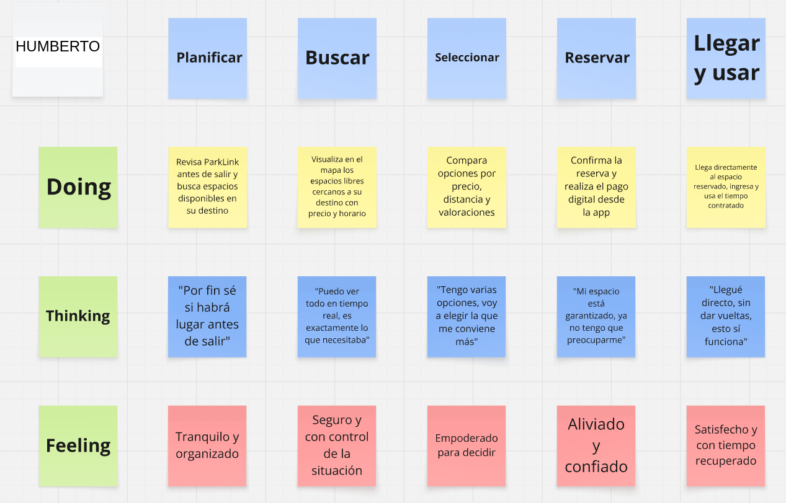
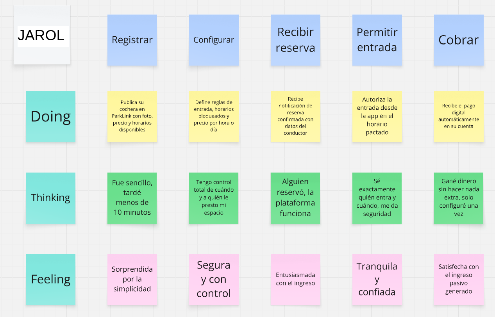
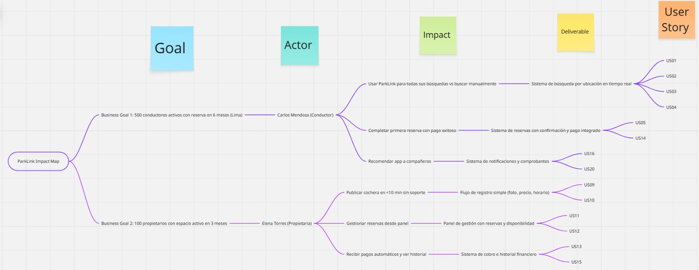
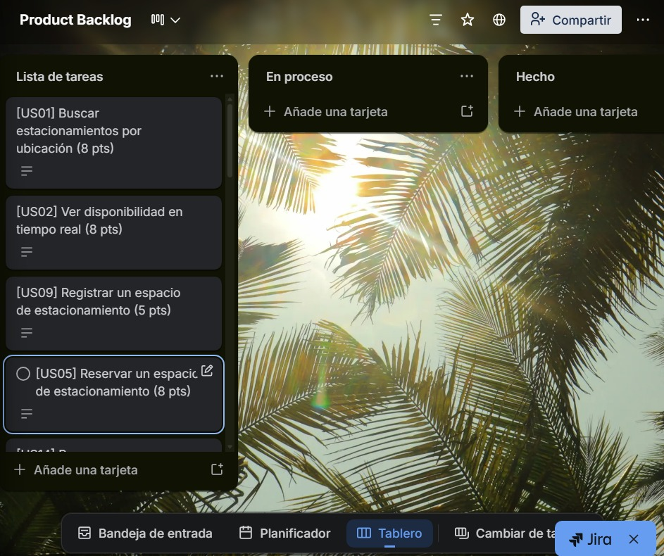

# Capítulo III: Requirements Specification

La especificación de requisitos formaliza la transición desde la investigación de campo y análisis del dominio (Capítulo II) hacia el diseño arquitectónico y táctico de la solución (Capítulos IV y V). En este capítulo se establecen las bases funcionales, comportamentales y de soporte arquitectónico de ParkLink a través de cuatro artefactos estructurados:

1. **To-Be Scenario Mapping:** Modela la experiencia objetivo de los usuarios representativos, resolviendo los dolores, incertidumbres e ineficiencias identificadas en el levantamiento de información.
2. **User Stories y Technical Stories:** Consolida en una **tabla única** la especificación de requerimientos de usuarios, del sitio web estático (Landing Page) y de soporte técnico/arquitectónico, acompañadas de múltiples criterios de aceptación comprobables bajo el estándar **Gherkin (Given-When-Then)**.
3. **Impact Mapping:** Alinea las metas de negocio estratégicas (Business Goals SMART) con las User Personas validadas, los impactos de comportamiento deseados y los entregables de software.
4. **Product Backlog:** Prioriza y estima el esfuerzo del equipo según el valor de negocio, asignando de manera mandatoria las historias del Landing Page al **Sprint 1** e integrando la totalidad de habilitadores técnicos (TS01 a TS10).

---

## 3.1. To-Be Scenario Mapping

El To-Be Scenario Mapping plasma la visión de servicio de ParkLink en el día a día de nuestros segmentos objetivo. El proceso de elaboración se desarrolló mediante las siguientes etapas metodológicas:
- **Preparación y análisis de necesidades:** Se tomó como base la información cuantitativa y cualitativa obtenida en las entrevistas del Capítulo II, donde se comprobó que el 100% de los conductores urbanos entrevistados pierde entre 15 y 20 minutos al día buscando estacionamiento, y que el 100% de los propietarios gestiona sus cocheras de manera informal y desordenada vía WhatsApp.
- **Contraste con el As-Is Scenario Mapping:** A partir del As-Is Scenario Mapping formalizado en la sección 2.3.4 del Capítulo II (donde se evidenciaron los recorridos inciertos, la desinformación de tarifas y el estrés de Humberto, así como los cobros desordenados y la desconfianza de Jarol), se estructuraron los mapas To-Be para evidenciar cómo ParkLink resuelve cada punto de fricción operativa.
- **Lluvia de ideas y diseño de la experiencia deseada:** Se propusieron flujos optimizados donde la automatización de reservas, la pasarela de pagos digitales y el Agente Autónomo de IA eliminan la fricción, la pérdida de tiempo y la conducción distraída.
- **Estandarización de fases:** Se articularon columnas cronológicas que abarcan todo el ciclo de interacción, desde la planificación inicial hasta la salida del estacionamiento o la liquidación de ingresos.
- **Mapeo de Doing, Thinking y Feeling:** Se determinaron de forma sistemática las acciones observables, los modelos mentales y los estados emocionales para reflejar el alivio, la seguridad y el empoderamiento que introduce la solución.

Los mapas fueron elaborados para las dos User Personas definidas en el Capítulo II: **Humberto García Calla** (Conductor Urbano / Practical Driver) y **Jarol Saquiray Vargas** (Propietario de Espacio / Microempresario).

---

### To-Be Scenario Map — Conductor Urbano (Humberto García Calla)

Humberto es un conductor de 50 años que transita a diario por distritos con alta congestión vehicular en Lima Metropolitana (San Isidro y Miraflores). Su mayor dolor en el As-Is era la incertidumbre de llegar y no hallar parqueo, provocando retrasos en su centro laboral y elevados niveles de estrés. En el escenario To-Be, Humberto se apoya en ParkLink para planificar, buscar y reservar su cochera de manera anticipada o sobre la marcha con asistencia en tiempo real.

> Tablero colaborativo elaborado en Miro: [Ver To-Be Scenario Map - Conductor](https://miro.com/app/board/uXjVGiIH610=/?share_link_id=240859047074)

| Dimensión | Planificar | Buscar | Seleccionar | Reservar | Llegar y usar |
|---|---|---|---|---|---|
| **Doing** | Revisa ParkLink antes de salir y busca espacios disponibles en su destino. | Visualiza en el mapa los espacios libres cercanos a su destino con precio y horario. | Compara opciones por precio, distancia y valoraciones. | Confirma la reserva y realiza el pago digital desde la app. | Llega directamente al espacio reservado, ingresa y usa el tiempo contratado. |
| **Thinking** | "Por fin sé si habrá lugar antes de salir" | "Puedo ver todo en tiempo real, es exactamente lo que necesitaba" | "Tengo varias opciones, voy a elegir la que me conviene más" | "Mi espacio está garantizado, ya no tengo que preocuparme" | "Llegué directo, sin dar vueltas, esto sí funciona" |
| **Feeling** | Tranquilo y organizado | Seguro y con control de la situación | Empoderado para decidir | Aliviado y confiado | Satisfecho y con tiempo recuperado |

---

### To-Be Scenario Map — Propietario de Espacio (Jarol Saquiray Vargas)

Jarol es un joven microempresario de 24 años que cuenta con cocheras desocupadas durante el horario laboral en San Isidro. Su frustración principal en el As-Is era la informalidad, la desconfianza de recibir desconocidos y la gestión manual mediante mensajes de WhatsApp. En el escenario To-Be, ParkLink le proporciona una plataforma formal que automatiza el registro, valida la identidad de los conductores y gestiona los cobros sin intervención manual.

> Tablero colaborativo elaborado en Miro: [Ver To-Be Scenario Map - Propietario](https://miro.com/app/board/uXjVGiIFZLU=/?share_link_id=511863885761)

| Dimensión | Registrar | Configurar | Recibir reserva | Permitir entrada | Cobrar |
|---|---|---|---|---|---|
| **Doing** | Publica su cochera en ParkLink con foto, precio y horarios disponibles. | Define reglas de entrada, horarios bloqueados y precio por hora o día. | Recibe notificación de reserva confirmada con datos del conductor. | Autoriza la entrada desde la app en el horario pactado. | Recibe el pago digital automáticamente en su cuenta. |
| **Thinking** | "Fue sencillo, tardé menos de 10 minutos" | "Tengo control total de cuándo y a quién le presto mi espacio" | "Alguien reservó, la plataforma funciona" | "Sé exactamente quién entra y cuándo, me da seguridad" | "Gané dinero sin hacer nada extra, solo configuré una vez" |
| **Feeling** | Sorprendido por la simplicidad | Seguro y con control | Entusiasmado con el ingreso | Tranquilo y confiado | Satisfecho con el ingreso pasivo generado |

---

## 3.2. User Stories

En cumplimiento riguroso de la plantilla y guía oficial del proyecto, las especificaciones de requerimientos funcionales, de presencia digital y de soporte arquitectónico se estructuran en **una sola tabla unificada**.

Cada User Story responde al estándar `Como [rol], deseo [acción], para [beneficio]` y cuenta con **múltiples criterios de aceptación** redactados bajo la sintaxis **Gherkin (Given-When-Then)** en tercera persona, tiempo presente y libres de detalles efímeros de implementación de interfaz gráfica. En particular:
- Se incorporan historias de usuario para el sitio web estático (**Landing Page, EP00**) bajo el rol `Como visitante...`, destinadas al **Sprint 1**.
- Las historias del **Agente IA y Copilot de Reserva (EP07)** se fundamentan directamente en los hallazgos de las entrevistas de campo (necesidad crítica de asistencia por voz para prevenir distracciones al volante en el tráfico de Lima, garantizando reservas anticipadas).
- Se formalizan las **Technical Stories (TS01 a TS10)** con el rol `Como Developer / Equipo de Arquitectura`, modelando contratos de petición/respuesta y salvaguardas arquitectónicas.

### Cuadro Unificado de Épicas, User Stories y Technical Stories

| Epic / User Story ID | Título | Descripción | Criterios de Aceptación (Gherkin) | Relacionado con (Epic ID) |
|---|---|---|---|---|
| **EP00** | Landing Page y Presencia Digital | Épica que agrupa los requisitos para el sitio web estático orientado a la captación, conversión y educación de visitantes hacia los roles de conductor y propietario. | N/A (Contenedor de Historias de Usuario de Adquisición y Landing Page). | N/A |
| **US-LP01** | Presentación de propuesta de valor, problemática y flujo operativo | Como visitante (conductor o propietario), deseo conocer la propuesta de valor, la problemática del tráfico urbano y el flujo operativo de tres pasos (Busca, Reserva, Estaciona) en la landing page, para comprender rápidamente cómo ParkLink soluciona la búsqueda de parqueo. | **Escenario 1: Navegación informativa y métricas de impacto** **Given** que un visitante accede a la página principal de ParkLink, **When** explora las secciones de problema, solución y cómo funciona, **Then** el sistema presenta el flujo en tres pasos estructurados y las métricas de ahorro de tiempo y reducción de congestión.  **Escenario 2: Adaptabilidad a dispositivos** **Given** que el visitante navega desde un smartphone o navegador de escritorio, **When** se renderiza la landing page, **Then** la estructura responsiva ajusta la navegación, tipografías e imágenes sin pérdida de legibilidad ni desbordamiento. | EP00 |
| **US-LP02** | Catálogo de características y matriz comparativa frente a apps tradicionales | Como visitante, deseo consultar el catálogo de funcionalidades clave y una tabla comparativa frente a soluciones tradicionales, para identificar con claridad las ventajas competitivas y la diferenciación tecnológica de ParkLink. | **Escenario 1: Interacción con la matriz comparativa** **Given** que el visitante se desplaza a la sección "¿Por qué elegir ParkLink?", **When** consulta la matriz comparativa, **Then** el sistema destaca visualmente los factores diferenciadores (disponibilidad en tiempo real, integración de cocheras privadas y pagos 100% digitales).  **Escenario 2: Exploración de tarjetas de características** **Given** que el visitante revisa la cuadrícula de funcionalidades, **When** inspecciona los módulos clave (mapa interactivo, filtros, pagos, notificaciones y asistencia inteligente), **Then** el sistema despliega descripciones claras acompañadas de su respectiva iconografía representativa. | EP00 |
| **US-LP03** | Segmentación de beneficios y llamados a la acción (CTA) diferenciados por rol | Como visitante (conductor urbano o propietario de cochera), deseo consultar los beneficios exclusivos de mi segmento y acceder a llamados a la acción (CTA) dedicados ("Buscar estacionamiento", "Publicar mi cochera", "Registrarme"), para canalizar mi interés directamente hacia el flujo de registro o adopción según mi perfil. | **Escenario 1: Enrutamiento segmentado para conductores** **Given** que un conductor explora la tarjeta de beneficios para conductores, **When** presiona el botón "Registrarme como conductor" o "Buscar estacionamiento", **Then** el sistema lo redirige de inmediato a la sección de conversión o descarga de la aplicación móvil.  **Escenario 2: Enrutamiento segmentado para propietarios** **Given** que un microempresario explora la tarjeta de beneficios para propietarios, **When** selecciona "Publicar mi cochera" o "Gana dinero con tu cochera", **Then** el sistema lo posiciona en la sección de captación de espacios con los requisitos de publicación. | EP00 |
| **US-LP04** | Transparencia institucional, autoría del equipo (ParkTeam) y soporte / FAQ | Como visitante, deseo consultar la sección de autores del proyecto con sus credenciales y acceder a un centro de soporte y preguntas frecuentes (FAQ), para resolver dudas operativas y verificar el respaldo técnico del equipo desarrollador antes de unirme. | **Escenario 1: Despliegue de credenciales del equipo desarrollador** **Given** que el visitante se desplaza a la sección "Autores del proyecto", **When** visualiza las tarjetas de ParkTeam, **Then** el sistema exhibe el nombre, fotografía, rol de ingeniería y aporte arquitectónico de cada miembro del equipo.  **Escenario 2: Consulta de preguntas frecuentes y políticas legales** **Given** que el visitante tiene dudas sobre seguridad o términos de servicio, **When** interactúa con los enlaces del pie de página o módulo FAQ, **Then** el sistema despliega las respuestas oficiales sobre métodos de pago, garantías y soporte técnico. | EP00 |
| **EP01** | Búsqueda y Descubrimiento de Estacionamientos | Épica que engloba las funcionalidades que permiten a los conductores localizar espacios disponibles en tiempo real según geolocalización, disponibilidad inmediata y filtros avanzados. | N/A (Contenedor de Historias de Usuario de Descubrimiento). | N/A |
| **US01** | Búsqueda de estacionamientos por geolocalización | Como conductor, deseo buscar estacionamientos disponibles cercanos a mi ubicación de destino, para planificar mi trayecto sin perder tiempo buscando en la vía pública. | **Escenario 1: Búsqueda con resultados disponibles** **Given** que el conductor ingresa una dirección de destino válida en el buscador, **When** solicita la localización de espacios, **Then** el sistema devuelve y posiciona en el mapa las plazas libres en un radio de 1 km con tarifa, distancia y disponibilidad horaria.  **Escenario 2: Búsqueda sin disponibilidad en el radio** **Given** que no existen plazas libres en el radio inicial de 1 km, **When** finaliza la consulta geoespacial, **Then** el sistema amplía automáticamente el rango de sugerencias a 2 km y notifica al usuario las alternativas más próximas. | EP01 |
| **US02** | Consulta de disponibilidad de plazas en tiempo real | Como conductor, deseo visualizar el estado de disponibilidad en tiempo real de cada estacionamiento, para evitar dirigirme a recintos saturados. | **Escenario 1: Consulta de plaza libre** **Given** que el conductor selecciona un estacionamiento específico en el mapa, **When** visualiza su estado operativo, **Then** el sistema informa que la plaza se encuentra disponible para reserva inmediata.  **Escenario 2: Cambio de estado concurrente** **Given** que un espacio es reservado por otro usuario mientras se visualiza en pantalla, **When** el conductor intenta seleccionarlo, **Then** el sistema refresca el estado a no disponible y ofrece plazas contiguas alternativas. | EP01 |
| **US03** | Filtrado avanzado por rango de tarifa y horarios | Como conductor, deseo filtrar los estacionamientos por tarifa horaria máxima y franja horaria de atención, para encontrar opciones que se ajusten a mi presupuesto y horario laboral. | **Escenario 1: Aplicación de filtros combinados** **Given** que el conductor define una tarifa máxima por hora y un horario requerido, **When** aplica los criterios de filtrado, **Then** el sistema actualiza el catálogo mostrando exclusivamente las opciones que cumplen ambas condiciones.  **Escenario 2: Sin coincidencias con los filtros** **Given** que ningún espacio cumple con el criterio de precio estricto ingresado, **When** se ejecuta el filtrado, **Then** el sistema muestra un mensaje indicando la ausencia de coincidencias y sugiere la tarifa mínima más cercana disponible. | EP01 |
| **US04** | Visualización de ficha técnica y detalles del estacionamiento | Como conductor, deseo consultar el detalle completo de un espacio (dimensiones, fotos, tipo de acceso y reseñas de seguridad), para validar si mi vehículo entra cómodamente y si el lugar es confiable. | **Escenario 1: Carga completa de detalles del espacio** **Given** que el conductor abre la ficha técnica de un estacionamiento, **When** se recuperan los datos del servidor, **Then** el sistema presenta fotos del lugar, dimensiones máximas (altura/ancho), calificación histórica y opiniones verificadas de otros conductores.  **Escenario 2: Visualización de restricciones de acceso** **Given** que el estacionamiento posee restricciones de gálibo o portón manual, **When** el conductor revisa las condiciones de uso, **Then** el sistema destaca de forma explícita dichas restricciones antes de proceder al flujo de reserva. | EP01 |
| **EP02** | Reserva y Gestión de Plazas | Épica que comprende la reserva programada o inmediata de espacios, modificaciones de horario, cancelaciones y control del ciclo de vida del estacionamiento. | N/A (Contenedor de Historias de Reserva). | N/A |
| **US05** | Creación y confirmación de reserva de estacionamiento | Como conductor, deseo reservar un espacio de estacionamiento para una fecha y franja horaria determinada, para garantizar mi lugar antes de emprender el viaje. | **Escenario 1: Confirmación de reserva dentro del horario** **Given** que el conductor selecciona una plaza disponible y una duración de 3 horas, **When** confirma la solicitud de reserva, **Then** el sistema bloquea temporalmente el espacio por 10 minutos, asigna un código de reserva y notifica la confirmación al propietario.  **Escenario 2: Solicitud de horario en conflicto** **Given** que la plaza seleccionada ya tiene una reserva confirmada en la franja solicitada, **When** el conductor intenta concretar la reserva, **Then** el sistema rechaza la solicitud señalando el solapamiento horario y ofrece el siguiente intervalo libre. | EP02 |
| **US06** | Cancelación anticipada de reserva activa | Como conductor, deseo cancelar una reserva realizada con al menos una hora de antelación, para liberar el espacio si surgen imprevistos en mi jornada laboral. | **Escenario 1: Cancelación dentro del plazo gratuito** **Given** que el conductor mantiene una reserva confirmada que inicia en más de 60 minutos, **When** ejecuta la cancelación del servicio, **Then** el sistema cancela la reserva, libera la plaza en el catálogo e instruye el reembolso total del importe abonado.  **Escenario 2: Cancelación tardía fuera de la ventana libre** **Given** que faltan menos de 60 minutos para el inicio de la reserva, **When** el conductor solicita la anulación, **Then** el sistema aplica la penalidad estipulada en las políticas de uso y libera el espacio para reasignación. | EP02 |
| **US07** | Consulta de historial de reservas realizadas | Como conductor, deseo visualizar el historial completo de mis reservas pasadas y en curso, para llevar un control financiero de mis gastos en estacionamiento. | **Escenario 1: Consulta de listado histórico** **Given** que un conductor accede a su registro de actividad, **When** consulta su historial de reservas, **Then** el sistema exhibe un listado cronológico con fecha, dirección del recinto, tiempo transcurrido, importe final facturado y estado operativo.  **Escenario 2: Filtrado por rango temporal** **Given** que el conductor selecciona una ventana de tiempo mensual, **When** solicita el resumen de movimientos, **Then** el sistema presenta las transacciones del período junto con la suma total de gastos acumulados. | EP02 |
| **US08** | Extensión de tiempo de estadía en reserva activa | Como conductor, deseo solicitar tiempo adicional en mi reserva en curso antes de su vencimiento, para no incurrir en sobretiempos ni tener que salir antes de terminar mis actividades. | **Escenario 1: Extensión exitosa por disponibilidad** **Given** que un conductor con reserva en curso solicita 1 hora adicional de estadía, **When** el sistema valida que no existen reservas posteriores para esa plaza, **Then** se autoriza la extensión, se recalcula el importe suplementario y se actualiza la hora de salida permitida.  **Escenario 2: Imposibilidad de extender por reserva consecutiva** **Given** que otro usuario ha reservado la plaza inmediatamente después del horario original, **When** el conductor intenta extender la estadía, **Then** el sistema le informa de la imposibilidad técnica y le sugiere una plaza libre cercana para reubicación. | EP02 |
| **EP03** | Publicación y Gestión de Espacios por Propietarios | Épica orientada a brindar herramientas de monetización, publicación y control a microempresarios y dueños de recintos privados. | N/A (Contenedor de Historias de Propietario). | N/A |
| **US09** | Publicación y alta de nuevo espacio de estacionamiento | Como propietario de estacionamiento, deseo dar de alta mi cochera ingresando su dirección, medidas, fotografías y tarifa base, para hacerla visible en el catálogo de búsqueda de conductores. | **Escenario 1: Alta exitosa de estacionamiento** **Given** que un propietario completa el formulario con datos de dirección válidos, al menos dos fotografías y tarifa horaria, **When** somete la publicación a revisión, **Then** el sistema valida la geocodificación del predio, publica la plaza en el mapa y emite una confirmación de alta.  **Escenario 2: Publicación con información requerida incompleta** **Given** que el propietario omite adjuntar fotografías del espacio, **When** intenta guardar la publicación, **Then** el sistema bloquea el alta y marca los campos obligatorios pendientes de completar. | EP03 |
| **US10** | Configuración de horarios de disponibilidad y tarifas dinámicas | Como propietario de estacionamiento, deseo definir los días y rangos horarios específicos en los que mi espacio está disponible, para alquilarlo solo cuando no lo utilizo personalmente. | **Escenario 1: Guardado de calendario de disponibilidad semanal** **Given** que el propietario ingresa a la configuración de disponibilidad, **When** define que la plaza se encuentra abierta de lunes a viernes de 08:00 a 18:00 horas, **Then** el sistema almacena la matriz horaria y ajusta el motor de búsqueda para aceptar reservas únicamente en ese intervalo.  **Escenario 2: Actualización de tarifa por hora** **Given** que el propietario ajusta el costo horario de su cochera, **When** guarda los cambios tarifarios, **Then** el nuevo valor rige de forma inmediata para reservas futuras sin alterar las reservas previamente confirmadas. | EP03 |
| **US11** | Habilitación y deshabilitación temporal de plazas | Como propietario de estacionamiento, deseo suspender temporalmente la disponibilidad de mi espacio por motivos personales o mantenimiento, para pausar reservas sin perder el registro de la cochera. | **Escenario 1: Suspensión temporal voluntaria** **Given** que el propietario necesita ocupar su cochera el fin de semana, **When** cambia el estado de la plaza a no disponible, **Then** el sistema retira la plaza del motor de búsqueda público manteniendo las reservas ya pactadas.  **Escenario 2: Reactivación inmediata del servicio** **Given** que la cochera suspendida vuelve a estar desocupada, **When** el propietario restablece su estado a disponible, **Then** el sistema la reincorpora en tiempo real al mapa interactivo de conductores. | EP03 |
| **US12** | Monitoreo de reservas activas y programación de accesos | Como propietario de estacionamiento, deseo visualizar el cronograma de reservas agendadas para mis espacios, para saber qué vehículos y conductores ingresarán a mi propiedad a lo largo del día. | **Escenario 1: Visualización del panel de ocupación diaria** **Given** que el propietario consulta su panel de control matutino, **When** accede a la vista de programación, **Then** el sistema despliega el cronograma de ingresos con nombre de conductor, placa vehicular, hora de inicio y hora de salida.  **Escenario 2: Verificación de acceso en tiempo real** **Given** que un conductor arriba a la cochera, **When** el propietario o su encargado introduce el código de reserva presentado, **Then** el sistema valida la vigencia del código y marca el ingreso como registrado. | EP03 |
| **US13** | Panel de reportes de ingresos financieros acumulados | Como propietario de estacionamiento, deseo consultar un consolidado financiero de los ingresos percibidos por el alquiler de mis espacios, para medir la rentabilidad de mi activo inmobiliario. | **Escenario 1: Generación de reporte de ganancias mensuales** **Given** que el propietario solicita el balance económico del mes en curso, **When** se computan las transacciones completadas, **Then** el sistema muestra el importe total bruto, las comisiones de servicio deducidas y el monto neto transferido.  **Escenario 2: Exportación de comprobantes para contabilidad** **Given** que el propietario requiere respaldo contable, **When** selecciona la opción de exportar reporte, **Then** el sistema genera un documento estructurado descargable con el detalle transaccional. | EP03 |
| **EP04** | Pagos, Facturación y Monederos Digitales | Épica responsable de la orquestación segura de pagos en línea, pasarelas de pago digitales, emisión de comprobantes y gestión de reembolsos. | N/A (Contenedor de Historias de Pagos). | N/A |
| **US14** | Pago electrónico seguro de reserva mediante pasarela digital | Como conductor, deseo abonar el costo de mi reserva mediante tarjeta de crédito, débito o billetera digital desde la plataforma, para evitar el uso de efectivo y asegurar mi plaza de forma inmediata. | **Escenario 1: Transacción de pago aprobada** **Given** que el conductor ingresa un método de pago válido en la pasarela segura, **When** procesa el pago de la reserva, **Then** el sistema debita el importe correspondiente, emite el comprobante digital y transiciona el estado de la reserva a confirmada.  **Escenario 2: Rechazo por fondos insuficientes** **Given** que la entidad bancaria del conductor deniega el cobro por saldo insuficiente, **When** la pasarela retorna el fallo, **Then** el sistema notifica el motivo del rechazo y mantiene la reserva retenida por 5 minutos para permitir el cambio de medio de pago. | EP04 |
| **US15** | Procesamiento automático de reembolsos por cancelación | Como conductor, deseo recibir la devolución íntegra de mi dinero en caso de cancelar mi reserva dentro del plazo permitido, para contar con respaldo financiero ante cancelaciones justificadas. | **Escenario 1: Reembolso automático a la cuenta de origen** **Given** que se formaliza la anulación de una reserva con más de una hora de anticipación, **When** el sistema procesa la cancelación en la pasarela de pagos, **Then** se emite la orden de reembolso directo al medio de pago original en un plazo máximo de 72 horas hábiles.  **Escenario 2: Generación de nota de crédito digital** **Given** que el conductor opta por saldo a favor en la plataforma, **When** confirma la devolución inmediata a monedero virtual, **Then** el sistema acredita el monto íntegro como crédito de uso inmediato en futuras reservas. | EP04 |
| **US16** | Visualización y descarga de comprobantes electrónicos | Como conductor, deseo descargar el comprobante de pago de mi reserva en formato digital (boleta o factura), para justificar mis gastos de movilidad corporativa. | **Escenario 1: Emisión y descarga de comprobante fiscal** **Given** que una reserva ha sido pagada y completada, **When** el conductor selecciona la opción de descargar comprobante con datos de RUC o DNI, **Then** el sistema genera un archivo PDF formal con los datos fiscales exigidos por la entidad tributaria.  **Escenario 2: Envío automático por correo electrónico** **Given** que culmina el cobro del servicio, **When** se emite el comprobante digital, **Then** el sistema envía automáticamente una copia legible al correo electrónico registrado por el usuario. | EP04 |
| **EP05** | Gestión de Identidad, Cuentas y Seguridad | Épica orientada al registro, autenticación federada, verificación de identidad y administración del perfil de conductores y propietarios. | N/A (Contenedor de Historias de Identidad). | N/A |
| **US17** | Registro de cuenta para conductor urbano | Como conductor, deseo crear una cuenta en ParkLink registrando mis datos personales, correo electrónico y placa de mi vehículo, para acceder al ecosistema de reservas. | **Escenario 1: Registro exitoso de conductor** **Given** que un nuevo usuario llena los campos de nombre, correo, contraseña segura y placa automotriz, **When** envía la solicitud de registro, **Then** el sistema registra el perfil de conductor, remite un enlace de validación al correo y habilita el inicio de sesión.  **Escenario 2: Placa vehicular ya asociada** **Given** que un usuario introduce una placa vehicular ya registrada activamente por otra cuenta, **When** somete el formulario, **Then** el sistema solicita la validación de propiedad del vehículo o el contacto con soporte técnico. | EP05 |
| **US18** | Registro y validación de perfil para propietario | Como propietario de estacionamiento, deseo registrar mi perfil acreditando mi identidad y datos de cobro bancario, para garantizar la formalidad y recepción periódica de mis ganancias. | **Escenario 1: Registro de propietario con datos de cuenta bancaria** **Given** que un microempresario se registra seleccionando el perfil de propietario, **When** introduce su documento de identidad y su Código de Cuenta Interbancario (CCI), **Then** el sistema valida el formato de la cuenta y activa el panel de administración de predios.  **Escenario 2: Inconsistencia en datos bancarios** **Given** que el propietario ingresa un número de cuenta inválido, **When** el sistema valida los dígitos de control, **Then** advierte el error de digitación y previene el registro de cuentas no autorizadas. | EP05 |
| **US19** | Autenticación y acceso seguro a la plataforma | Como usuario registrado (conductor o propietario), deseo iniciar sesión mediante mis credenciales o autenticación federada, para acceder a mis servicios de forma segura. | **Escenario 1: Autenticación exitosa** **Given** que el usuario introduce su correo y contraseña correctos, **When** ejecuta el inicio de sesión, **Then** el sistema emite un token de acceso criptográfico (JWT) y lo redirige a la vista principal de su rol.  **Escenario 2: Credenciales incorrectas** **Given** que el usuario ingresa una contraseña errónea, **When** solicita el acceso, **Then** el sistema rechaza la autenticación indicando credenciales inválidas sin revelar si el correo existe en la base de datos. | EP05 |
| **EP06** | Sistema de Notificaciones y Comunicación | Épica responsable de mantener informados en tiempo real a los usuarios respecto al estado de sus reservas, alertas de tiempo y novedades del servicio. | N/A (Contenedor de Notificaciones). | N/A |
| **US20** | Alertas en tiempo real sobre reservas y vencimientos | Como conductor, deseo recibir notificaciones push y alertas sonoras antes de que mi tiempo de reserva expire, para decidir si extender mi estancia o retirar mi vehículo a tiempo. | **Escenario 1: Alerta preventiva de vencimiento próximo** **Given** que a una reserva activa le restan 15 minutos de vigencia, **When** el temporizador del servicio detecta el umbral programado, **Then** el sistema envía una notificación push prioritaria al teléfono del conductor ofreciendo la extensión en un toque.  **Escenario 2: Confirmación inmediata de asignación de plaza** **Given** que un propietario aprueba o el sistema confirma automáticamente una reserva, **When** se perfecciona el registro transaccional, **Then** el conductor recibe de inmediato una notificación con la ruta de llegada y código de verificación. | EP06 |
| **EP07** | Asistencia Inteligente y Agente de Reserva Autónomo (ParkLink Copilot) | Épica que agrupa las capacidades de inteligencia artificial conversacional, procesamiento de lenguaje natural y toma autónoma de decisiones para permitir a los conductores encontrar, reservar y adaptar sus estacionamientos por voz sin distracciones al volante en el congestionado tránsito limeño. | N/A (Contenedor de Asistencia Inteligente IA). | N/A |
| **US21** | Búsqueda y reserva conversacional manos libres por voz | Como conductor en ruta (Humberto), deseo interactuar con el agente inteligente de ParkLink mediante comandos de voz en lenguaje natural, para solicitar y confirmar una reserva de estacionamiento sin quitar la vista de la pista ni manipular la pantalla táctil en el tráfico. | **Escenario 1: Búsqueda y reserva verbal exitosa** **Given** que el conductor activa el asistente por voz y menciona: "ParkLink, búscame un estacionamiento seguro cerca de mi destino por menos de 7 soles la hora", **When** el agente procesa la intención y los parámetros semánticos, **Then** el agente consulta la disponibilidad en tiempo real, responde verbalmente con la mejor opción disponible y concreta la reserva al recibir la confirmación verbal del usuario.  **Escenario 2: Ambigüedad o destino no reconocido** **Given** que el comando de voz del conductor es ruidoso o poco claro, **When** el agente analiza el audio recibido, **Then** solicita educadamente la clarificación del destino manteniendo el flujo conversacional sin interrumpir la navegación. | EP07 |
| **US22** | Sugerencia predictiva proactiva basada en hábitos y eventos | Como conductor con traslados regulares de oficina (Humberto), deseo que el agente anticipe mis necesidades de parqueo según mi calendario y hábitos de llegada, para sugerirme apartar un espacio antes de que las cocheras de la zona se saturen. | **Escenario 1: Sugerencia proactiva antes de la hora punta** **Given** que el agente detecta un patrón de traslado habitual hacia San Isidro entre las 08:30 y las 09:00 horas, **When** el inventario de plazas en el destino proyecta una ocupación superior al 85%, **Then** el agente notifica preventivamente al conductor recomendando asegurar una plaza antes de iniciar el trayecto.  **Escenario 2: Rechazo o descarte de sugerencia predictiva** **Given** que el conductor no tiene previsto desplazarse en vehículo ese día, **When** desestima la recomendación predictiva, **Then** el agente silencia las alertas para esa franja horaria y recalibra los pesos del modelo de hábitos. | EP07 |
| **US23** | Reasignación autónoma y extensión inteligente ante congestión vehicular | Como conductor atrapado en una congestión imprevista, deseo que el agente inteligente monitoree el tráfico en tiempo real y extienda o reasigne automáticamente mi reserva si detecta que llegaré tarde, para no perder mi cochera ni ser penalizado. | **Escenario 1: Detección de retraso por tráfico severo y extensión** **Given** que el conductor mantiene una reserva que inicia en 20 minutos pero el GPS indica un tiempo estimado de llegada de 35 minutos por embotellamiento, **When** el agente autónomo identifica la discrepancia temporal, **Then** notifica al conductor por voz y gestiona una tolerancia de 15 minutos adicionales con la cochera sin recargo.  **Escenario 2: Reasignación de plaza alternativa por expiración inevitable** **Given** que la plaza original no admite extensión y el conductor llegará con 30 minutos de desfase, **When** el agente evalúa la situación, **Then** localiza una plaza vacía en una cochera adyacente, traslada la reserva y actualiza la ruta del navegador informando al usuario verbalmente. | EP07 |
| **TS01** | Control de concurrencia y bloqueo transaccional de reservas | Como Developer, deseo implementar mecanismos de bloqueo optimista y transacciones distribuidas en el servicio de reservas, para asegurar que dos conductores concurrentes no reserven la misma plaza en idéntico intervalo de tiempo. | **Escenario 1: Petición concurrente con reserva única exitosa** **Given** que dos solicitudes de reserva concurrentes intentan bloquear el mismo espacio e intervalo horario, **When** el motor de persistencia procesa ambas peticiones con control de concurrencia, **Then** la primera solicitud adquiere el bloqueo transaccional y devuelve un código HTTP 201 Created, mientras que la segunda recibe un HTTP 409 Conflict.  **Escenario 2: Liberación automática tras expiración de retención** **Given** que una plaza fue retenida temporalmente por una pasarela de pago pero el pago no se completa en 10 minutos, **When** expira el Time-To-Live (TTL) de la retención, **Then** el servicio ejecuta el desbloqueo y emite el evento de disponibilidad restaurada en el bus de datos. | EP02, TS07 |
| **TS02** | Proyección y caché geoespacial de disponibilidad para búsquedas de baja latencia | Como Developer, deseo mantener una proyección en memoria caché con índices geoespaciales de las plazas activas, para que las consultas de mapa respondan en menos de 200 ms sin sobrecargar la base de datos transaccional. | **Escenario 1: Respuesta rápida de búsqueda en caché** **Given** una solicitud GET a `/api/v1/parkings/nearby` con coordenadas y radio de búsqueda, **When** la capa de caché espacial atiende la petición, **Then** retorna el conjunto de plazas en formato GeoJSON con latencia menor a 200 ms.  **Escenario 2: Invalidación y refresco por cambio de estado** **Given** que una plaza transiciona a estado reservada u ocupada, **When** se publica el evento de cambio de estado en el broker, **Then** el servicio consumidor invalida la clave de caché correspondiente y actualiza la coordenada en tiempo real. | EP01, TS07 |
| **TS03** | Autenticación, validación de tokens JWT y control de acceso basado en roles (RBAC) | Como Developer, deseo estructurar la autenticación federada y el control de acceso en el API Gateway mediante tokens JWT firmados, para segregar permisos estrictamente entre conductores, propietarios y procesos internos. | **Escenario 1: Petición con token válido y rol autorizado** **Given** una petición a un endpoint administrativo de propietario con un token JWT firmado y claim de rol `Owner`, **When** el API Gateway valida la firma criptográfica y los alcances del token, **Then** autoriza el reenvío de la petición al microservicio interno correspondiente.  **Escenario 2: Petición sin permisos o con token caducado** **Given** una petición enviada con un token expirado o con rol de conductor a un recurso exclusivo de propietario, **When** el componente de seguridad inspecciona las cabeceras de autorización, **Then** interrumpe la ejecución y retorna un código HTTP 401 Unauthorized o 403 Forbidden según corresponda. | EP05, TS07 |
| **TS04** | Registro inmutable de pistas de auditoría para operaciones críticas | Como Developer, deseo registrar eventos de auditoría inmutables en un almacenamiento append-only para cada cobro, reserva y cancelación, para garantizar la trazabilidad contable y el cumplimiento de estándares regulatorios. | **Escenario 1: Registro estructurado tras evento financiero** **Given** la culminación exitosa o fallida de una transacción de cobro o reembolso, **When** el servicio de pagos emite el registro transaccional, **Then** se genera una traza de auditoría con identificador único de correlación, actor, timestamp UTC y payload canónico inalterable.  **Escenario 2: Consulta forense de transacciones** **Given** un requerimiento de conciliación bancaria, **When** se consulta el repositorio de auditoría por identificador de reserva, **Then** se retorna la secuencia cronológica exacta de todos los estados por los que atravesó el pago. | EP04, TS07 |
| **TS05** | Almacenamiento seguro de imágenes en Object Storage compatible con S3 | Como Developer, deseo persistir las fotografías de fachadas y recintos en un almacenamiento de objetos con URLs presignadas, para optimizar el peso de la base de datos relacional y proteger las evidencias gráficas. | **Escenario 1: Carga de imagen con URL presignada** **Given** que un propietario solicita subir una fotografía para su cochera, **When** el microservicio de catálogo genera una URL presignada con expiración corta, **Then** el cliente sube directamente el binario al bucket privado de objetos recibiendo un código HTTP 200 OK.  **Escenario 2: Rechazo de archivos con formato o tamaño no permitido** **Given** que un usuario intenta subir un archivo que supera los 5 MB o cuyo tipo MIME no es de imagen, **When** se valida la cabecera en el endpoint de preparación, **Then** el sistema rechaza la solicitud retornando un error HTTP 400 Bad Request. | EP03, TS07 |
| **TS06** | Procesamiento idempotente de transacciones y webhooks de pago | Como Developer, deseo aplicar claves de idempotencia en el procesamiento de transacciones y eventos de webhooks bancarios, para asegurar que reintentos de red no originen cobros duplicados ni inconsistencias contables. | **Escenario 1: Reintento de petición con idempotency key repetida** **Given** que un cliente o pasarela remite una petición de cobro con una clave de idempotencia previamente procesada, **When** el servicio de pagos recibe la solicitud, **Then** no vuelve a procesar el débito financiero y retorna la misma respuesta almacenada en la transacción original.  **Escenario 2: Nueva transacción con clave única** **Given** una solicitud de cobro con una clave de idempotencia no registrada, **When** el sistema la procesa exitosamente, **Then** almacena la clave con estado completado y devuelve el identificador de transacción generado. | EP04, TS07 |
| **TS07** | Aislamiento y barrera de seguridad del Agente IA | Como Developer, deseo aislar el modelo de lenguaje del acceso directo a bases de datos y pasarelas de pago mediante un Tool Registry seguro, para evitar ejecuciones destructivas, alucinaciones o cobros no autorizados. | **Escenario 1: Invocación autorizada por Tool Registry** **Given** que el Agente IA recibe una orden de reserva por lenguaje natural, **When** interpreta los parámetros requeridos, **Then** el Tool Registry valida los argumentos contra el contrato OpenAPI y exige confirmación del usuario antes de invocar la reserva.  **Escenario 2: Bloqueo de acceso no autorizado** **Given** que el modelo intenta ejecutar una herramienta no registrada o acceder a persistencia interna, **When** el componente de seguridad intercepta la petición, **Then** interrumpe la operación y registra la alerta de seguridad en la pista de auditoría. | EP01, EP02, EP04 |
| **TS08** | Versionado estricto de contratos para comandos y eventos | Como Developer, deseo incorporar versionado semántico en los contratos de API y esquemas de eventos del broker, para permitir la evolución de microservicios sin romper consumidores activos ni despliegues en curso. | **Escenario 1: Compatibilidad de versiones activas** **Given** un microservicio que publica eventos bajo un esquema versión v2, **When** un consumidor suscrito procesa el mensaje con contrato v1, **Then** el sistema procesa los campos compatibles sin interrupciones transaccionales.  **Escenario 2: Control de contratos deprecados** **Given** una llamada a un endpoint en proceso de desuso, **When** el API Gateway valida la versión, **Then** atiende la petición e incluye la cabecera `Deprecation` indicando el ciclo de retiro previsto. | EP01, EP02, EP04, EP06 |
| **TS09** | Mecanismo de degradación elegante y fallback visual ante fallas de IA | Como Developer, deseo implementar un circuit breaker y fallback visual en la app ante indisponibilidad o latencia excesiva del servicio de IA, para garantizar que el conductor pueda seguir reservando plazas manualmente sin interrupción. | **Escenario 1: Conmutación a flujo visual por lentitud** **Given** que la respuesta del asistente por voz supera los 5 segundos o retorna un código HTTP 503, **When** el cliente detecta la degradación operativa del agente, **Then** conmuta al mapa interactivo tradicional en menos de 5 segundos con un aviso amigable.  **Escenario 2: Restauración automática del servicio inteligente** **Given** que el microservicio de IA normaliza su latencia y supera los health checks del clúster, **When** el circuit breaker restablece la conexión, **Then** la interfaz reactiva los controles de voz de forma transparente. | EP01, EP02, EP04 |
| **TS10** | Broker de mensajería sin autoridad de dominio | Como Equipo de Arquitectura, necesitamos que el broker de eventos (RabbitMQ/Kafka) ordene y transporte mensajes sin contener lógica de negocio, para que el servicio de Reservation mantenga la autoridad exclusiva sobre bloqueos y estados. | **Escenario 1: Transporte y entrega ordenada sin mutación** **Given** un flujo masivo de eventos concurrentes de reservas y cancelaciones, **When** el broker enruta los mensajes a los tópicos correspondientes, **Then** garantiza el orden y entrega sin manipular el contenido del payload de dominio.  **Escenario 2: Soberanía transaccional del servicio** **Given** un comando de reserva recibido por la cola de mensajería, **When** se procesa la transacción, **Then** únicamente el microservicio de Reservation ejecuta los locks de concurrencia y validaciones de disponibilidad. | EP02 |

---

## 3.3. Impact Mapping

El Impact Mapping vincula los objetivos de negocio estratégicos (Business Goals formulados bajo el estándar SMART) con los actores clave que influyen en su cumplimiento, los cambios de comportamiento que se busca incentivar en ellos (Impacts) y los entregables funcionales y técnicos (Deliverables) que la solución provee para materializar dichos impactos.

Para este informe se definieron tres Business Goals estratégicos. Los actores corresponden exclusivamente a las User Personas validadas en el Capítulo II: **Humberto García Calla** (Conductor Urbano) y **Jarol Saquiray Vargas** (Microempresario / Propietario de Estacionamiento).

> Artefacto colaborativo elaborado en Miro: [Ver tablero de Impact Mapping](https://miro.com/app/board/uXjVGiIFZLU=/?share_link_id=410165343938)

### Business Goal 1 (Adquisición y Activación de Conductores)
**"Alcanzar 500 conductores urbanos activos con al menos una reserva completada en Lima Metropolitana durante los primeros 6 meses de operación comercial."**

| Actor | Impact (Comportamiento Deseado) | Deliverable (Solución Entregada) | User Stories Asociadas |
|---|---|---|---|
| **Humberto García Calla** (Conductor Urbano) | Adoptar ParkLink como canal primario de localización de plazas en lugar de buscar manualmente en la calle o recurrir a cuidadores informales. | Motor de búsqueda geoespacial de plazas en tiempo real con filtrado tarifario y visualización en mapa móvil. | US01, US02, US03, US04 |
| **Humberto García Calla** (Conductor Urbano) | Completar su primera reserva formal anticipada con confirmación y cobro electrónico garantizado. | Módulo de reservas con bloqueo concurrente, pasarela de pagos integrada y emisión de boleta digital. | US05, US14, US16 |
| **Humberto García Calla** (Conductor Urbano) | Reservar y reasignar estacionamientos en pleno trayecto sin apartar las manos del volante ni distraerse en el tráfico denso. | Agente conversacional inteligente de voz y lenguaje natural (ParkLink Copilot) con asistencia predictiva. | US21, US22, US23 |
| **Humberto García Calla** (Conductor Urbano) | Recomendar la aplicación a colegas y compañeros de trabajo tras experimentar puntualidad y cero estrés de llegada. | Sistema automatizado de notificaciones preventivas de expiración y comprobantes descargables. | US07, US20 |

---

### Business Goal 2 (Captación y Oferta de Propietarios de Estacionamientos)
**"Lograr que 100 propietarios y microempresarios publiquen y mantengan activos al menos 150 espacios de estacionamiento en la plataforma durante los primeros 3 meses de lanzamiento."**

| Actor | Impact (Comportamiento Deseado) | Deliverable (Solución Entregada) | User Stories Asociadas |
|---|---|---|---|
| **Jarol Saquiray Vargas** (Propietario / Microempresario) | Registrar y publicar sus cocheras desocupadas en menos de 10 minutos sin requerir asistencia técnica presencial. | Flujo de publicación digital simplificado con carga de fotografías presignadas y geolocalización asistida. | US09, US-LP03, TS05 |
| **Jarol Saquiray Vargas** (Propietario / Microempresario) | Abandonar la coordinación informal por chats de WhatsApp y gestionar integralmente sus horarios y tarifas en la plataforma. | Panel de autogestión de calendario, reglas de disponibilidad horaria y parametrización de precios por hora. | US10, US11 |
| **Jarol Saquiray Vargas** (Propietario / Microempresario) | Validar el acceso vehicular en puerta con total certeza y seguridad patrimonial. | Panel de monitoreo de reservas agendadas con identificación de placa y verificación de código de reserva. | US12 |
| **Jarol Saquiray Vargas** (Propietario / Microempresario) | Confiar en la regularidad y transparencia de sus cobros quincenales para percibir ingresos pasivos recurrentes. | Módulo financiero de balance consolidado con transferencias bancarias automatizadas y reportes de rentabilidad. | US13, US15 |

---

### Business Goal 3 (Retención y Fidelización Comercial mediante Confianza Operativa)
**"Alcanzar una tasa de conversión y recurrencia de reservas del 40% en usuarios registrados durante los primeros 6 meses de operación en distritos de alta congestión (San Isidro y Miraflores)."**

*Nota metodológica:* Este objetivo de negocio se enfoca en la retención y la confianza transaccional de los usuarios. Para lograr que 4 de cada 10 usuarios reserven de manera recurrente, la plataforma debe erradicar absolutamente las caídas de servicio en hora punta y la sobreventa de espacios, convirtiendo a la arquitectura de microservicios y a los habilitadores técnicos en inductores directos del resultado comercial.

| Actor | Impact (Comportamiento Deseado) | Deliverable (Habilitador Técnico / Arquitectónico) | Technical Stories Asociadas |
|---|---|---|---|
| **Humberto García Calla** (Conductor) | Reincidir semanalmente en el uso de la aplicación con la certeza de que nunca experimentará rechazos por sobreventa y dispondrá de fallback visual inmediato si la red o IA se degrada. | Proyección geoespacial en memoria caché, control estricto de bloqueos concurrentes y conmutación a flujo visual manual en menos de 5 segundos. | TS01, TS02, TS09 |
| **Jarol Saquiray Vargas** (Propietario) | Mantener sus cocheras afiliadas de forma ininterrumpida al comprobar que las reservas y abonos se liquidan con cero errores contables, transacciones idempotentes y sin alteraciones del broker. | Orquestación transaccional con pistas de auditoría inmutables, procesamiento idempotente de cobros y broker asíncrono sin autoridad de dominio. | TS04, TS06, TS10 |
| **Humberto García Calla** (Conductor) | Delegar la gestión de reservas por voz al agente inteligente con total tranquilidad patrimonial, interactuando con contratos versionados y barreras de seguridad estrictas. | Pipeline seguro de Tool Registry con confirmación explícita de acciones y contratos de mensajes versionados semánticamente. | TS07, TS08, US21, US23 |

---

## 3.4. Product Backlog

El Product Backlog formaliza la priorización y estimación de los requerimientos funcionales y habilitadores técnicos del producto. En estricto cumplimiento de los lineamientos del curso:
1. **Priorización por valor de negocio y ciclo de vida de producto:** Se ordenan en primer lugar los ítems que entregan valor directo al modelo de adquisición y uso central de la plataforma. Antipatrones de priorización técnica (como situar requisitos de autenticación o seguridad genérica al inicio del backlog) han sido corregidos, relegando el registro e identidad a capas de soporte.
2. **Prioridad absoluta al sitio web estático (Landing Page) en el Sprint 1:** La guía oficial del trabajo establece expresamente que *"los User Stories relacionados con el sitio web estático (Landing Page) requieren considerarse desde el primer sprint"*. Por ende, las historias `US-LP01` a `US-LP04` encabezan el Product Backlog y están expresamente asignadas al **Sprint 1** para garantizar la captación inicial y validación de mercado.
3. **Inclusión exhaustiva de habilitadores técnicos (TS01 a TS10):** Se integran en el tablero la totalidad de las historias técnicas que sostienen la arquitectura distribuida, asignándoles puntos de historia bajo la serie Fibonacci y situándolas de acuerdo con la necesidad de soporte de las historias funcionales dependientes.
4. **Estimación:** Utiliza rigurosamente la secuencia de Fibonacci permitida: **1, 2, 3, 5 y 8** Story Points.

### Enlace al Tablero de Gestión (Trello)

El Product Backlog se gestiona dinámicamente en Trello. El tablero incluye la lista de historias priorizadas, la segmentación de ítems asignados al **Sprint 1** y el flujo de desarrollo Kanban.

> Acceso público al tablero en Trello: [Ver Product Backlog en Trello](https://trello.com/b/69df03bb/product-backlog) *(Para acceso público anónimo, la visibilidad del tablero se encuentra configurada en modo Público)*.

---

### Tabla del Product Backlog Priorizado

| # Orden | User Story ID | Título | Tipo | Descripción | Story Points (1 / 2 / 3 / 5 / 8) | Sprint Asignado |
|---|---|---|---|---|---|---|
| 1 | **US-LP01** | Presentación de propuesta de valor y flujo operativo | Landing Page | Como visitante, deseo visualizar la propuesta de valor, problemática y el flujo en 3 pasos (Busca, Reserva, Estaciona), para entender cómo ParkLink soluciona la búsqueda de parqueo. | 3 | **Sprint 1** |
| 2 | **US-LP02** | Catálogo de características y matriz comparativa | Landing Page | Como visitante, deseo consultar las funcionalidades clave y la matriz comparativa frente a apps tradicionales, para identificar las ventajas competitivas. | 3 | **Sprint 1** |
| 3 | **US-LP03** | Segmentación de beneficios y llamados a la acción por rol | Landing Page | Como visitante (conductor o propietario), deseo revisar los beneficios específicos de mi segmento y botones de llamada a la acción, para registrarme o descargar la app. | 3 | **Sprint 1** |
| 4 | **US-LP04** | Credenciales de autoría (ParkTeam) y soporte / FAQ | Landing Page | Como visitante, deseo consultar las fichas de los autores del proyecto y un centro de preguntas frecuentes (FAQ), para resolver dudas y validar la confianza del servicio. | 2 | **Sprint 1** |
| 5 | **US01** | Búsqueda de estacionamientos por ubicación | User Story | Como conductor, deseo buscar estacionamientos disponibles cerca de mi destino, para planificar mi llegada sin perder tiempo buscando en la calle. | 8 | **Sprint 1** |
| 6 | **US02** | Ver disponibilidad de plazas en tiempo real | User Story | Como conductor, deseo ver en tiempo real si un espacio está libre, para no dirigirme a un estacionamiento que ya está saturado. | 8 | **Sprint 1** |
| 7 | **US09** | Publicación y alta de espacio de estacionamiento | User Story | Como propietario, deseo dar de alta mi cochera ingresando fotos, dirección y tarifa, para empezar a recibir reservas y generar ingresos. | 5 | **Sprint 1** |
| 8 | **TS02** | Proyección y caché de inventario geoespacial | Tech Enabler | Como Developer, deseo indexar geoespacialmente las plazas activas en memoria caché, para que el mapa responda en menos de 200 ms. | 5 | **Sprint 1** |
| 9 | **TS05** | Almacenamiento seguro de imágenes en Object Storage | Tech Enabler | Como Developer, deseo almacenar las fotos de cocheras en buckets compatibles con S3 mediante URLs presignadas, para aligerar la base de datos. | 3 | **Sprint 1** |
| 10 | **US05** | Reservar un espacio de estacionamiento | User Story | Como conductor, deseo reservar un espacio con anticipación, para asegurar mi plaza antes de iniciar el trayecto a mi destino laboral. | 8 | **Sprint 2** |
| 11 | **US14** | Pago electrónico seguro de reserva | User Story | Como conductor, deseo pagar mi reserva mediante tarjeta o billetera digital, para no usar efectivo y contar con confirmación inmediata. | 8 | **Sprint 2** |
| 12 | **TS01** | Control de concurrencia y bloqueo transaccional | Tech Enabler | Como Developer, deseo implementar bloqueos transaccionales y de concurrencia en reservas, para evitar dobles asignaciones en idéntica franja. | 5 | **Sprint 2** |
| 13 | **TS06** | Manejo idempotente de cobros y webhooks | Tech Enabler | Como Developer, deseo aplicar claves de idempotencia en pagos y webhooks, para prevenir cobros duplicados por reintentos de red. | 5 | **Sprint 2** |
| 14 | **US10** | Configuración de horarios y tarifas de cochera | User Story | Como propietario, deseo parametrizar los horarios disponibles y el costo por hora, para gobernar cuándo y cuánto cobro por mi cochera. | 5 | **Sprint 2** |
| 15 | **US12** | Visualización de reservas agendadas en cochera | User Story | Como propietario, deseo revisar las reservas programadas para mis espacios, para saber qué vehículos y conductores ingresarán a mi propiedad. | 5 | **Sprint 2** |
| 16 | **US21** | Búsqueda y reserva por comandos de voz (Agente IA) | User Story | Como conductor en ruta (Humberto), deseo buscar y reservar plazas por voz mediante el Agente IA, para no distraerme en el tráfico de Lima. | 8 | **Sprint 2** |
| 17 | **TS07** | Aislamiento y barrera de seguridad de IA | Tech Enabler | Como Developer, deseo aislar el LLM mediante un Tool Registry seguro, para evitar ejecuciones o cobros no autorizados. | 5 | **Sprint 2** |
| 18 | **TS10** | Broker sin autoridad de dominio | Tech Enabler | Como Equipo de Arquitectura, necesitamos que el broker transporte eventos sin lógica de dominio, para preservar la autoridad de reservas. | 5 | **Sprint 2** |
| 19 | **US03** | Filtrado avanzado por precio y horario | User Story | Como conductor, deseo filtrar los estacionamientos por tarifa máxima y horario, para encontrar la opción óptima para mi presupuesto. | 3 | **Sprint 3** |
| 20 | **US04** | Ficha técnica y detalles del estacionamiento | User Story | Como conductor, deseo ver fotos, gálibo y valoraciones de un espacio, para cerciorarme de que mi vehículo cabe y que el lugar es seguro. | 3 | **Sprint 3** |
| 21 | **US08** | Extensión de tiempo en reserva activa | User Story | Como conductor, deseo solicitar tiempo extra en mi reserva en curso, para evitar cargos imprevistos si mi reunión de trabajo se prolonga. | 5 | **Sprint 3** |
| 22 | **US11** | Habilitación y deshabilitación temporal de plazas | User Story | Como propietario, deseo pausar la disponibilidad de mi cochera temporalmente, para no recibir reservas en fechas que requiera usarla. | 3 | **Sprint 3** |
| 23 | **US22** | Sugerencia predictiva proactiva de estacionamiento | User Story | Como conductor habitual, deseo que el agente anticipe mis traslados según mis horarios diarios, para reservar plaza antes de la hora punta. | 5 | **Sprint 3** |
| 24 | **TS08** | Versionado estricto de contratos | Tech Enabler | Como Developer, deseo versionar los contratos de API y esquemas de eventos, para evolucionar servicios sin romper clientes ni consumidores. | 3 | **Sprint 3** |
| 25 | **TS09** | Mecanismo de fallback visual | Tech Enabler | Como Developer, deseo implementar fallback visual automático ante lentitud o caída de la IA, para que el usuario pueda reservar manualmente. | 5 | **Sprint 3** |
| 26 | **US06** | Cancelación anticipada de reserva activa | User Story | Como conductor, deseo cancelar una reserva realizada con antelación, para liberar el espacio si cambian mis planes de viaje. | 5 | **Sprint 4** |
| 27 | **US15** | Procesamiento automático de reembolsos | User Story | Como conductor, deseo recibir la restitución automática de mi pago al cancelar a tiempo, para no perder dinero ante contingencias. | 5 | **Sprint 4** |
| 28 | **US16** | Descarga de comprobante electrónico de pago | User Story | Como conductor, deseo descargar la boleta o factura de mi reserva en PDF, para respaldar mis gastos de movilidad corporativa. | 2 | **Sprint 4** |
| 29 | **US20** | Notificaciones en tiempo real y alertas de expiración | User Story | Como conductor, deseo recibir alertas preventivas antes de que expire mi tiempo de reserva, para gestionar mi retiro o extensión a tiempo. | 3 | **Sprint 4** |
| 30 | **US23** | Reasignación autónoma de reserva ante congestión | User Story | Como conductor demorado en el tráfico, deseo que el agente extienda o reasigne mi reserva, para no perder mi cochera por retrasos de ruta. | 5 | **Sprint 4** |
| 31 | **US13** | Reportes de ingresos y rentabilidad para propietario | User Story | Como propietario, deseo revisar un balance financiero de ganancias y deducciones, para llevar el control contable de mi emprendimiento. | 3 | **Sprint 4** |
| 32 | **US07** | Consulta de historial de reservas realizadas | User Story | Como conductor, deseo consultar el registro histórico de todas mis reservas, para tener trazabilidad de mis gastos de parqueo. | 2 | **Sprint 4** |
| 33 | **TS04** | Registro inmutable de pistas de auditoría | Tech Enabler | Como Developer, deseo registrar eventos inmutables para cobros y cancelaciones, para sustentar revisiones contables y auditorías forenses. | 3 | **Sprint 4** |
| 34 | **US17** | Registro de cuenta para conductor urbano | User Story | Como conductor nuevo, deseo registrarme con correo y placa vehicular, para poder buscar y reservar plazas en ParkLink. | 3 | **Sprint 4** |
| 35 | **US18** | Registro y validación de perfil de propietario | User Story | Como microempresario, deseo registrar mi cuenta acreditando identidad y CCI bancario, para publicar espacios y cobrar mis ganancias. | 3 | **Sprint 4** |
| 36 | **US19** | Autenticación e inicio de sesión seguro | User Story | Como usuario registrado, deseo iniciar sesión con mis credenciales seguras, para acceder a las funcionalidades de mi cuenta. | 2 | **Sprint 4** |
| 37 | **TS03** | Autenticación y control de acceso basado en roles | Tech Enabler | Como Developer, deseo proteger los endpoints mediante JWT y validación RBAC, para restringir los recursos según los permisos del usuario. | 3 | **Sprint 4** |
